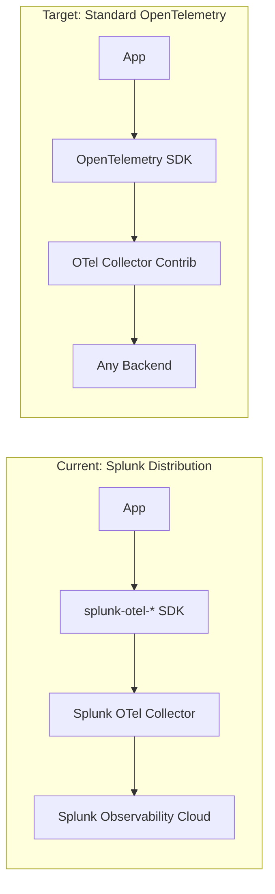
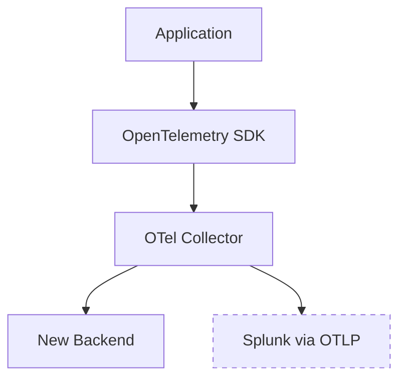

# How to Migrate from Splunk APM to OpenTelemetry Without Losing Data

Author: [nawazdhandala](https://www.github.com/nawazdhandala)

Tags: OpenTelemetry, Splunk, APM, Migration, Observability, Tracing

Description: A detailed guide to migrating from Splunk APM agents to native OpenTelemetry instrumentation while preserving data continuity.

---

Splunk APM has actually been built on top of OpenTelemetry for a while now. Splunk's tracing libraries are forks of the upstream OpenTelemetry SDKs with Splunk-specific defaults and exporters baked in. This is good news for migration because it means you are already halfway there. The work involved is mostly about removing the Splunk-specific layer and switching to the vanilla OpenTelemetry SDK with standard exporters.

The tricky part is doing this without creating gaps in your observability data. You need traces flowing into your new backend before you turn off the old pipeline. This guide shows you how to handle that transition cleanly.

## Understanding the Splunk-OpenTelemetry Relationship

Splunk distributes its own versions of the OpenTelemetry SDKs:

- `splunk-otel-java` wraps the OpenTelemetry Java agent
- `splunk-otel-js` wraps the OpenTelemetry Node.js SDK
- `splunk-otel-python` wraps the OpenTelemetry Python SDK
- The Splunk OpenTelemetry Collector is a customized build of the OTel Collector

Because these are wrappers, the migration is less about rewriting instrumentation and more about unwrapping it. You are peeling off the Splunk layer to get to standard OpenTelemetry underneath.



## Step 1: Audit Your Current Splunk Instrumentation

Before changing anything, document what the Splunk agents are capturing. Run this audit so you know exactly what to replicate.

The following script helps you identify which Splunk OpenTelemetry packages are installed across your services. Run it in each service directory.

```bash
# Check for Splunk OTel packages in a Node.js project
# This lists all Splunk-specific OpenTelemetry dependencies
npm list 2>/dev/null | grep -i splunk

# Check for Splunk OTel packages in a Python project
# The splunk-opentelemetry package wraps the standard OTel SDK
pip list 2>/dev/null | grep -i splunk

# Check for Splunk OTel Java agent in deployment configs
# Look for the -javaagent flag pointing to splunk-otel-javaagent.jar
grep -r "splunk-otel" /path/to/deployment/configs/
```

Also check for environment variables that start with `SPLUNK_`. These control the Splunk-specific behavior and need to be replaced with standard `OTEL_` variables.

## Step 2: Replace the Splunk Java Agent

The Splunk Java agent (`splunk-otel-javaagent.jar`) is a superset of the standard OpenTelemetry Java agent. Replacing it is straightforward because the auto-instrumentation coverage is identical.

Here is the environment variable mapping. The Splunk agent reads both `SPLUNK_` and `OTEL_` variables, but the standard agent only reads `OTEL_` ones.

```bash
# Before: Splunk OpenTelemetry Java agent configuration
# These SPLUNK_ variables are Splunk-specific extensions
# export SPLUNK_ACCESS_TOKEN=your-splunk-token
# export SPLUNK_REALM=us1
# export SPLUNK_TRACE_RESPONSE_HEADER_ENABLED=true
# export OTEL_SERVICE_NAME=my-java-service
# export OTEL_RESOURCE_ATTRIBUTES=deployment.environment=production
# java -javaagent:/path/to/splunk-otel-javaagent.jar -jar myapp.jar

# After: Standard OpenTelemetry Java agent configuration
# Replace SPLUNK_ variables with standard OTEL_ equivalents
export OTEL_SERVICE_NAME=my-java-service
export OTEL_RESOURCE_ATTRIBUTES=deployment.environment=production
# Point to the OTel Collector instead of Splunk's ingest endpoint
export OTEL_EXPORTER_OTLP_ENDPOINT=http://localhost:4317
export OTEL_EXPORTER_OTLP_PROTOCOL=grpc
# Metrics export interval in milliseconds
export OTEL_METRIC_EXPORT_INTERVAL=60000

java -javaagent:/path/to/opentelemetry-javaagent.jar -jar myapp.jar
```

One thing to watch out for: the Splunk agent enables some non-default instrumentations and metrics. Check your Splunk dashboards to see if you rely on any Splunk-specific metrics like `jvm.memory.pool` breakdowns. The standard agent covers most of these, but the metric names might differ slightly.

## Step 3: Replace the Splunk Node.js SDK

The Splunk Node.js distribution adds profiling and automatic log injection on top of the standard OpenTelemetry Node.js SDK. If you use those features, you will need to handle them separately.

This code shows the before and after for a typical Express application.

```javascript
// Before: Splunk OpenTelemetry for Node.js
// The start() function initializes tracing, metrics, and profiling
// const { start } = require('@splunk/otel');
// start({
//   serviceName: 'my-node-service',
//   accessToken: process.env.SPLUNK_ACCESS_TOKEN,
//   realm: 'us1',
//   environment: 'production',
// });

// After: Standard OpenTelemetry SDK for Node.js
// Install: npm install @opentelemetry/sdk-node
//          @opentelemetry/auto-instrumentations-node
//          @opentelemetry/exporter-trace-otlp-grpc
const { NodeSDK } = require('@opentelemetry/sdk-node');
const { getNodeAutoInstrumentations } = require('@opentelemetry/auto-instrumentations-node');
const { OTLPTraceExporter } = require('@opentelemetry/exporter-trace-otlp-grpc');
const { Resource } = require('@opentelemetry/resources');
const { ATTR_SERVICE_NAME } = require('@opentelemetry/semantic-conventions');

const sdk = new NodeSDK({
  // Resource attributes identify your service in traces
  resource: new Resource({
    [ATTR_SERVICE_NAME]: 'my-node-service',
    'deployment.environment': 'production',
  }),
  traceExporter: new OTLPTraceExporter({
    // Send to the local OTel Collector
    url: 'http://localhost:4317',
  }),
  // Auto-instrumentation covers the same libraries as Splunk's distribution
  instrumentations: [
    getNodeAutoInstrumentations({
      // Enable all default instrumentations
      // Disable specific ones if they cause noise
      '@opentelemetry/instrumentation-fs': {
        enabled: false, // filesystem instrumentation is usually too noisy
      },
    }),
  ],
});

sdk.start();

// Graceful shutdown to flush pending spans
process.on('SIGTERM', () => {
  sdk.shutdown().then(() => process.exit(0));
});
```

Then remove the Splunk packages:

```bash
# Remove Splunk-specific packages
npm uninstall @splunk/otel

# Install standard OpenTelemetry packages
npm install @opentelemetry/sdk-node \
  @opentelemetry/auto-instrumentations-node \
  @opentelemetry/exporter-trace-otlp-grpc \
  @opentelemetry/resources \
  @opentelemetry/semantic-conventions
```

## Step 4: Replace the Splunk OTel Collector

The Splunk OpenTelemetry Collector includes Splunk-specific receivers like the SignalFx Smart Agent receiver. Replace it with the standard OpenTelemetry Collector Contrib distribution.

This configuration provides equivalent functionality using standard components.

```yaml
# Standard OpenTelemetry Collector configuration
# Replaces the Splunk OTel Collector with identical pipeline behavior
receivers:
  otlp:
    protocols:
      grpc:
        endpoint: 0.0.0.0:4317
      http:
        endpoint: 0.0.0.0:4318
  # Replace Splunk's Smart Agent receiver with hostmetrics
  # This covers CPU, memory, disk, and network metrics
  hostmetrics:
    collection_interval: 10s
    scrapers:
      cpu: {}
      memory: {}
      disk: {}
      filesystem: {}
      network: {}
      process:
        # Track per-process metrics like the Smart Agent did
        include:
          match_type: regexp
          names: [".*"]

processors:
  batch:
    send_batch_size: 1024
    timeout: 5s
  memory_limiter:
    check_interval: 5s
    limit_mib: 512
  # Add resource attributes for service identification
  resource:
    attributes:
      - key: deployment.environment
        value: production
        action: upsert

exporters:
  # Send to your chosen backend
  otlphttp:
    endpoint: "https://otlp.oneuptime.com"
    headers:
      x-oneuptime-token: "${ONEUPTIME_TOKEN}"

service:
  pipelines:
    traces:
      receivers: [otlp]
      processors: [memory_limiter, resource, batch]
      exporters: [otlphttp]
    metrics:
      receivers: [otlp, hostmetrics]
      processors: [memory_limiter, resource, batch]
      exporters: [otlphttp]
```

## Step 5: Preserve Data Continuity During Migration

The key to migrating without losing data is running both pipelines in parallel. Here is the strategy:



Configure the Collector to export to both backends simultaneously. Splunk Observability Cloud accepts OTLP, so you can send standard OpenTelemetry data directly.

```yaml
# Dual-export configuration for zero-gap migration
# Both backends receive identical data during the transition window
exporters:
  # Continue sending to Splunk during migration
  # Splunk's OTLP ingest endpoint accepts standard traces and metrics
  otlp/splunk:
    endpoint: "https://ingest.${SPLUNK_REALM}.signalfx.com:443/v2/trace/otlp"
    headers:
      X-SF-TOKEN: "${SPLUNK_ACCESS_TOKEN}"
  # Your new backend
  otlphttp/new:
    endpoint: "https://otlp.oneuptime.com"
    headers:
      x-oneuptime-token: "${ONEUPTIME_TOKEN}"

service:
  pipelines:
    traces:
      receivers: [otlp]
      processors: [memory_limiter, batch]
      # Both exporters receive the same trace data
      exporters: [otlp/splunk, otlphttp/new]
```

Run this dual-export setup for at least one to two weeks. During this time:

1. Verify trace counts match between both backends
2. Confirm that latency percentiles align
3. Check that all services appear with correct names and attributes
4. Validate that custom span attributes carry over correctly

## Step 6: Handle Splunk-Specific Features

A few Splunk features do not have direct OpenTelemetry equivalents:

**AlwaysOn Profiling**: Splunk's continuous profiling is not part of OpenTelemetry. If you rely on CPU and memory profiling, consider a dedicated profiling tool like Pyroscope or Parca that integrates with OpenTelemetry via span links.

**Log Observer Connect**: If you use Splunk's log correlation, set up the OpenTelemetry log SDK to inject trace context into your logs. This gives you the same trace-to-log correlation.

**Tag Spotlight**: This is a Splunk UI feature. Your new backend should provide similar attribute-based filtering. The data is the same; it is just presented differently.

## Conclusion

Migrating from Splunk APM to standard OpenTelemetry is one of the smoother vendor migrations because Splunk already builds on OpenTelemetry. The work is mostly about removing Splunk-specific wrappers, replacing `SPLUNK_` environment variables with `OTEL_` ones, and swapping the Splunk Collector distribution for the standard contrib build. Run both pipelines in parallel during the transition, validate your data in the new backend, and then turn off the Splunk export. Your instrumentation code stays almost identical, and you gain the freedom to send your telemetry anywhere.
