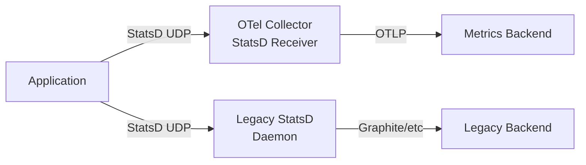

# How to Migrate from StatsD to OpenTelemetry Metrics

Author: [nawazdhandala](https://www.github.com/nawazdhandala)

Tags: OpenTelemetry, StatsD, Metrics, Migration, Observability, Monitoring

Description: A hands-on guide to migrating your application metrics pipeline from StatsD to OpenTelemetry, covering instrumentation changes, collector setup, and backend integration.

---

StatsD has been a popular choice for application metrics since Etsy open-sourced it in 2011. Its simplicity made it easy to adopt: fire UDP packets at a daemon, and metrics just work. But OpenTelemetry provides a more structured approach with better semantics, built-in correlation with traces and logs, and a thriving ecosystem of exporters. This guide covers how to move from StatsD to OpenTelemetry metrics without losing visibility.

## Why Move Away from StatsD?

StatsD works fine for basic counters, gauges, and timers. However, it has some real limitations that become painful at scale.

First, StatsD uses UDP by default, which means you can silently lose metrics under load. There is no backpressure mechanism. If the StatsD daemon cannot keep up, packets get dropped and you never know about it.

Second, StatsD metrics lack rich metadata. You get a metric name and a value, maybe with simple tags depending on your StatsD implementation. OpenTelemetry metrics carry attributes (key-value pairs), resource information (which service, host, and version emitted the metric), and standardized semantic conventions that make metrics interoperable across different tools and backends.

Third, and perhaps most importantly, StatsD only handles metrics. If you want traces and logs too, you need separate systems. OpenTelemetry gives you a single framework for all three signals, with correlation built in from the start.

## Step 1: Set Up the OpenTelemetry Collector with a StatsD Receiver

The smoothest migration path starts by pointing your existing StatsD clients at the OpenTelemetry Collector. The Collector has a StatsD receiver that understands StatsD protocol and converts the data into OpenTelemetry metrics. This lets you keep your existing instrumentation running while you build out the new pipeline.

```yaml
# otel-collector-config.yaml
# This configuration accepts StatsD metrics and exports them as OTLP
receivers:
  # StatsD receiver listens on the same port as a traditional StatsD daemon
  statsd:
    endpoint: 0.0.0.0:8125
    # Aggregation interval controls how often metrics are flushed
    aggregation_interval: 60s
    # Timer histogram mapping converts StatsD timers to histograms
    timer_histogram_mapping:
      - statsd_type: "timing"
        observer_type: "histogram"
        histogram:
          # Define bucket boundaries for timer histograms
          explicit:
            - 10
            - 25
            - 50
            - 100
            - 250
            - 500
            - 1000
            - 5000

exporters:
  # Send metrics to your backend using OTLP
  otlp:
    endpoint: "http://your-backend:4317"
    tls:
      insecure: false

processors:
  # Batch processor groups metrics together for efficient export
  batch:
    timeout: 10s
    send_batch_size: 1000

service:
  pipelines:
    metrics:
      receivers: [statsd]
      processors: [batch]
      exporters: [otlp]
```

Deploy this collector alongside your existing StatsD daemon. Update your application configuration to send StatsD metrics to the collector instead of the old daemon. Since the protocol is the same, no code changes are needed for this step.



During this phase, send metrics to both the old StatsD daemon and the new collector so you can compare outputs and verify data accuracy.

## Step 2: Map StatsD Metric Types to OpenTelemetry

Before rewriting your instrumentation, understand how StatsD metric types translate to OpenTelemetry instruments.

| StatsD Type | OpenTelemetry Instrument | Notes |
|-------------|--------------------------|-------|
| Counter (`c`) | Counter | Both are monotonically increasing. OpenTelemetry counters support floating point values. |
| Gauge (`g`) | Gauge (UpDownCounter or Gauge callback) | StatsD gauges support increment/decrement. Use UpDownCounter if you need the same behavior. |
| Timer (`ms`) | Histogram | OpenTelemetry histograms capture value distributions with configurable bucket boundaries. |
| Set (`s`) | No direct equivalent | Track unique values using custom logic or an attribute on a counter. |
| Histogram (`h`) | Histogram | Direct mapping in implementations that support StatsD histograms. |

This mapping matters because it guides how you rewrite each metric in your application code.

## Step 3: Rewrite Application Instrumentation

Now comes the core of the migration: replacing StatsD client calls with OpenTelemetry API calls. Let's walk through examples in Python and Node.js.

### Python Migration

Before (StatsD):

```python
# Old StatsD instrumentation using the datadog statsd client
from datadog import statsd

# Increment a counter when an order is placed
statsd.increment("orders.placed", tags=["region:us-east", "tier:premium"])

# Record a timing value for request duration
statsd.timing("request.duration", elapsed_ms, tags=["endpoint:/api/orders"])

# Set a gauge for current queue depth
statsd.gauge("queue.depth", current_depth, tags=["queue:orders"])
```

After (OpenTelemetry):

```python
# New OpenTelemetry metrics instrumentation
from opentelemetry import metrics
from opentelemetry.sdk.metrics import MeterProvider
from opentelemetry.sdk.metrics.export import PeriodicExportingMetricReader
from opentelemetry.exporter.otlp.proto.grpc.metric_exporter import OTLPMetricExporter

# Configure the metrics SDK with OTLP export
exporter = OTLPMetricExporter(endpoint="http://localhost:4317")
# PeriodicExportingMetricReader flushes metrics at a fixed interval
reader = PeriodicExportingMetricReader(exporter, export_interval_millis=60000)
provider = MeterProvider(metric_readers=[reader])
metrics.set_meter_provider(provider)

# Create a meter (analogous to a StatsD client instance)
meter = metrics.get_meter("order-service", "1.0.0")

# Create typed instruments
# Counter replaces statsd.increment()
orders_counter = meter.create_counter(
    name="orders.placed",
    description="Total number of orders placed",
    unit="1"
)

# Histogram replaces statsd.timing()
request_duration = meter.create_histogram(
    name="request.duration",
    description="Request processing time",
    unit="ms"
)

# UpDownCounter replaces statsd.gauge() when you need increment/decrement
queue_depth = meter.create_up_down_counter(
    name="queue.depth",
    description="Current depth of the order processing queue",
    unit="1"
)

# Usage in application code
# Attributes replace StatsD tags with the same key-value semantics
orders_counter.add(1, {"region": "us-east", "tier": "premium"})
request_duration.record(elapsed_ms, {"endpoint": "/api/orders"})
queue_depth.add(delta, {"queue": "orders"})
```

### Node.js Migration

Before (StatsD):

```javascript
// Old StatsD client usage in Node.js
const StatsD = require("hot-shots");
const client = new StatsD({ host: "statsd-host", port: 8125 });

// Track API requests
client.increment("api.requests", 1, ["method:GET", "path:/users"]);

// Record response time
client.timing("api.response_time", responseMs, ["method:GET"]);

// Report active connections
client.gauge("connections.active", connectionCount);
```

After (OpenTelemetry):

```javascript
// New OpenTelemetry metrics in Node.js
const { metrics } = require("@opentelemetry/api");
const { MeterProvider, PeriodicExportingMetricReader } = require("@opentelemetry/sdk-metrics");
const { OTLPMetricExporter } = require("@opentelemetry/exporter-metrics-otlp-grpc");

// Set up the metrics pipeline
const exporter = new OTLPMetricExporter({
  url: "http://localhost:4317",
});
const reader = new PeriodicExportingMetricReader({
  exporter: exporter,
  // Export interval in milliseconds
  exportIntervalMillis: 60000,
});
const meterProvider = new MeterProvider({
  readers: [reader],
});
metrics.setGlobalMeterProvider(meterProvider);

// Create a meter for your service
const meter = metrics.getMeter("api-service", "1.0.0");

// Define instruments that match your old StatsD metrics
const requestCounter = meter.createCounter("api.requests", {
  description: "Total number of API requests",
  unit: "1",
});

const responseHistogram = meter.createHistogram("api.response_time", {
  description: "API response time distribution",
  unit: "ms",
});

const activeConnections = meter.createUpDownCounter("connections.active", {
  description: "Number of active connections",
  unit: "1",
});

// Usage with structured attributes instead of tag strings
requestCounter.add(1, { method: "GET", path: "/users" });
responseHistogram.record(responseMs, { method: "GET" });
activeConnections.add(1);  // connection opened
activeConnections.add(-1); // connection closed
```

Notice how OpenTelemetry attributes use proper key-value objects instead of the `key:value` string format that StatsD tags use. This gives you type safety and avoids parsing issues.

## Step 4: Handle Aggregation Differences

A key difference between StatsD and OpenTelemetry is where aggregation happens. StatsD clients send raw data points and the daemon aggregates them. In OpenTelemetry, the SDK aggregates on the client side before export. You need to consider aggregation temporality:

```python
# Configure aggregation temporality based on your backend's preference
from opentelemetry.sdk.metrics.export import AggregationTemporality

# Delta temporality: each export contains only the change since the last export
# This is similar to how StatsD flushes work
exporter = OTLPMetricExporter(
    endpoint="http://localhost:4317",
    preferred_temporality={
        # Use delta temporality for counters to match StatsD flush behavior
        metrics.Counter: AggregationTemporality.DELTA,
        metrics.Histogram: AggregationTemporality.DELTA,
    }
)
```

Delta temporality is closer to how StatsD works. Cumulative temporality (the OpenTelemetry default) sends the running total since the process started. Choose based on what your metrics backend expects. Prometheus-compatible backends prefer cumulative, while many commercial APM tools work better with delta.

## Step 5: Remove the StatsD Receiver and Clean Up

Once all application instrumentation uses native OpenTelemetry, remove the StatsD receiver from your collector config and switch to OTLP-only receivers. Also remove the old StatsD client libraries from each service.

## Things to Watch Out For

**Metric naming conventions.** StatsD has no enforced naming convention. OpenTelemetry has semantic conventions that recommend using dot-separated lowercase names with a unit suffix where appropriate. Take the opportunity to clean up metric names during migration.

**High cardinality attributes.** StatsD tags and OpenTelemetry attributes both let you add dimensions to metrics, but OpenTelemetry makes it easier to accidentally create high-cardinality metric series. Avoid putting user IDs, request IDs, or other unbounded values in metric attributes.

**Flush interval alignment.** If your dashboards and alerts are tuned to StatsD's 10-second default flush interval, make sure your OpenTelemetry export interval matches. Otherwise, rates and aggregations will look different even when the underlying data is the same.

## Summary

Migrating from StatsD to OpenTelemetry metrics is a three-phase process. Route existing StatsD traffic through the Collector for zero-code-change compatibility. Rewrite your instrumentation to use native OpenTelemetry APIs. Then clean up by removing the StatsD receiver and old client libraries. The result is a metrics pipeline that integrates naturally with your traces and logs.
