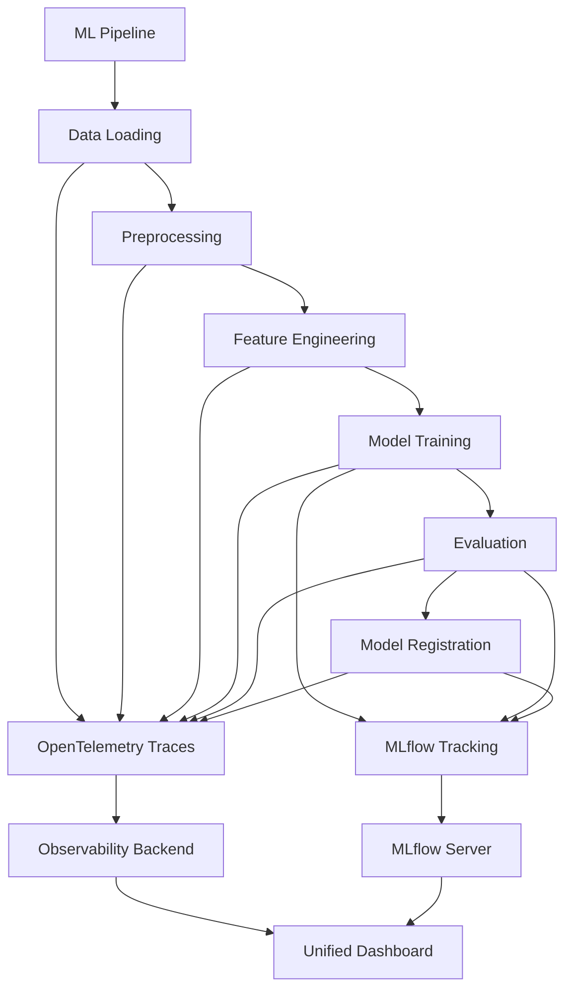
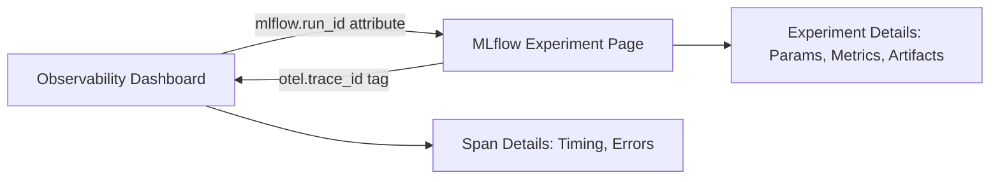

# How to Set Up ML Pipeline Observability with OpenTelemetry and MLflow

Author: [nawazdhandala](https://www.github.com/nawazdhandala)

Tags: OpenTelemetry, MLflow, ML Pipeline, Observability, Machine Learning, Python, Tracing, Metrics

Description: A practical guide to setting up ML pipeline observability by integrating OpenTelemetry tracing with MLflow experiment tracking for end-to-end visibility into training, evaluation, and deployment.

---

ML pipelines are notoriously hard to debug. A model training run can take hours, involve dozens of steps (data loading, preprocessing, feature engineering, training, evaluation, registration), and fail silently at any point. When something goes wrong, you're left combing through logs trying to figure out which step failed and why.

MLflow handles experiment tracking well - it records parameters, metrics, and artifacts for each run. But it doesn't give you the runtime observability you need for production pipelines: execution timing per step, error propagation, resource utilization, and distributed traces across services. That's where OpenTelemetry comes in.

By combining OpenTelemetry's tracing with MLflow's experiment tracking, you get the best of both worlds: structured experiment data for data scientists and operational telemetry for the engineers keeping the pipelines running.

---

## How the Integration Works



OpenTelemetry captures the execution flow: how long each step takes, which steps fail, and the relationships between them. MLflow captures the ML-specific data: hyperparameters, training metrics, model artifacts, and version information. The trace ID links them together.

---

## Setting Up the Foundation

First, install all the packages you'll need.

```bash
# OpenTelemetry core packages
pip install opentelemetry-api opentelemetry-sdk opentelemetry-exporter-otlp

# MLflow for experiment tracking
pip install mlflow

# ML libraries for the example pipeline
pip install scikit-learn pandas numpy
```

Now configure both OpenTelemetry and MLflow.

```python
import mlflow
from opentelemetry import trace, metrics
from opentelemetry.sdk.trace import TracerProvider
from opentelemetry.sdk.trace.export import BatchSpanProcessor
from opentelemetry.sdk.metrics import MeterProvider
from opentelemetry.sdk.metrics.export import PeriodicExportingMetricReader
from opentelemetry.exporter.otlp.proto.grpc.trace_exporter import OTLPSpanExporter
from opentelemetry.exporter.otlp.proto.grpc.metric_exporter import OTLPMetricExporter
from opentelemetry.sdk.resources import Resource

# Shared resource identifies this pipeline
resource = Resource.create({
    "service.name": "ml-training-pipeline",
    "service.version": "1.0.0",
    "ml.pipeline.name": "customer-churn-model",
})

# Configure OpenTelemetry tracing
trace_provider = TracerProvider(resource=resource)
trace_exporter = OTLPSpanExporter(endpoint="https://oneuptime.com/otlp")
trace_provider.add_span_processor(BatchSpanProcessor(trace_exporter))
trace.set_tracer_provider(trace_provider)

# Configure OpenTelemetry metrics
metric_exporter = OTLPMetricExporter(endpoint="https://oneuptime.com/otlp")
metric_reader = PeriodicExportingMetricReader(metric_exporter, export_interval_millis=15000)
meter_provider = MeterProvider(resource=resource, metric_readers=[metric_reader])
metrics.set_meter_provider(meter_provider)

# Configure MLflow
mlflow.set_tracking_uri("http://localhost:5000")
mlflow.set_experiment("customer-churn-prediction")

tracer = trace.get_tracer("ml-training-pipeline")
meter = metrics.get_meter("ml-training-pipeline")
```

---

## Defining Pipeline Metrics

Create metrics that track pipeline health and performance over time.

```python
# Track duration of each pipeline step
step_duration = meter.create_histogram(
    name="ml.pipeline.step.duration",
    description="Duration of each pipeline step in seconds",
    unit="s",
)

# Track data quality metrics during preprocessing
data_rows_processed = meter.create_counter(
    name="ml.pipeline.data.rows_processed",
    description="Number of rows processed by the pipeline",
)

data_rows_dropped = meter.create_counter(
    name="ml.pipeline.data.rows_dropped",
    description="Number of rows dropped during preprocessing",
)

# Track model training metrics
training_runs = meter.create_counter(
    name="ml.pipeline.training.runs",
    description="Total number of training runs executed",
)
```

---

## Instrumenting the Data Loading Step

Every pipeline starts with loading data. This step can be slow and is a common failure point (missing files, schema changes, connection timeouts).

```python
import pandas as pd
import time

def load_data(source_path: str) -> pd.DataFrame:
    """Load training data with OpenTelemetry instrumentation."""

    with tracer.start_as_current_span("ml.pipeline.load_data") as span:
        span.set_attribute("ml.data.source", source_path)
        start = time.perf_counter()

        try:
            # Load the data from the source
            df = pd.read_csv(source_path)

            duration = time.perf_counter() - start

            # Record data characteristics on the span
            span.set_attribute("ml.data.row_count", len(df))
            span.set_attribute("ml.data.column_count", len(df.columns))
            span.set_attribute("ml.data.columns", list(df.columns))
            span.set_attribute("ml.data.memory_mb", round(df.memory_usage(deep=True).sum() / 1e6, 2))

            # Record step duration as a metric
            step_duration.record(duration, {"step": "load_data"})
            data_rows_processed.add(len(df), {"step": "load_data"})

            return df

        except FileNotFoundError as e:
            span.set_status(trace.StatusCode.ERROR, f"Data file not found: {source_path}")
            span.record_exception(e)
            raise

        except Exception as e:
            span.set_status(trace.StatusCode.ERROR, str(e))
            span.record_exception(e)
            raise
```

---

## Instrumenting Preprocessing

The preprocessing step often involves dropping rows, handling missing values, and encoding features. Tracking what gets dropped is important for debugging data quality issues.

```python
from sklearn.preprocessing import LabelEncoder, StandardScaler

def preprocess_data(df: pd.DataFrame) -> tuple:
    """Preprocess training data with detailed tracing."""

    with tracer.start_as_current_span("ml.pipeline.preprocess") as span:
        initial_rows = len(df)
        span.set_attribute("ml.preprocess.initial_rows", initial_rows)
        start = time.perf_counter()

        # Step 1: Handle missing values
        with tracer.start_as_current_span("ml.pipeline.preprocess.missing_values") as mv_span:
            missing_counts = df.isnull().sum().to_dict()
            # Only record columns that actually have missing values
            cols_with_missing = {k: v for k, v in missing_counts.items() if v > 0}
            mv_span.set_attribute("ml.preprocess.missing_columns", list(cols_with_missing.keys()))

            df = df.dropna(subset=["target_column"])
            df = df.fillna(df.median(numeric_only=True))
            mv_span.set_attribute("ml.preprocess.rows_after_drop", len(df))

        # Step 2: Encode categorical features
        with tracer.start_as_current_span("ml.pipeline.preprocess.encoding") as enc_span:
            categorical_cols = df.select_dtypes(include=["object"]).columns.tolist()
            enc_span.set_attribute("ml.preprocess.categorical_columns", categorical_cols)

            encoders = {}
            for col in categorical_cols:
                if col != "target_column":
                    le = LabelEncoder()
                    df[col] = le.fit_transform(df[col].astype(str))
                    encoders[col] = le

        # Step 3: Scale numerical features
        with tracer.start_as_current_span("ml.pipeline.preprocess.scaling") as scale_span:
            numerical_cols = df.select_dtypes(include=["float64", "int64"]).columns.tolist()
            scale_span.set_attribute("ml.preprocess.numerical_columns", numerical_cols)

            scaler = StandardScaler()
            feature_cols = [c for c in numerical_cols if c != "target_column"]
            df[feature_cols] = scaler.fit_transform(df[feature_cols])

        # Record final stats
        final_rows = len(df)
        rows_dropped = initial_rows - final_rows
        duration = time.perf_counter() - start

        span.set_attribute("ml.preprocess.final_rows", final_rows)
        span.set_attribute("ml.preprocess.rows_dropped", rows_dropped)
        span.set_attribute("ml.preprocess.drop_rate", round(rows_dropped / initial_rows, 4))

        step_duration.record(duration, {"step": "preprocess"})
        data_rows_dropped.add(rows_dropped, {"step": "preprocess"})

        return df, scaler, encoders
```

---

## Instrumenting Model Training with MLflow Integration

This is where OpenTelemetry and MLflow come together. The training step creates both an OpenTelemetry span (for timing and tracing) and an MLflow run (for experiment tracking). The OpenTelemetry trace ID is logged as an MLflow tag, linking the two systems.

```python
from sklearn.ensemble import GradientBoostingClassifier
from sklearn.model_selection import train_test_split

def train_model(df: pd.DataFrame, hyperparams: dict) -> tuple:
    """Train a model with both OpenTelemetry tracing and MLflow tracking."""

    with tracer.start_as_current_span("ml.pipeline.train") as span:
        # Get the current trace ID to link OTel and MLflow
        trace_id = format(span.get_span_context().trace_id, '032x')
        span.set_attribute("ml.training.algorithm", "GradientBoostingClassifier")
        span.set_attribute("ml.training.hyperparams", str(hyperparams))

        start = time.perf_counter()

        # Start an MLflow run alongside the OTel span
        with mlflow.start_run(run_name=f"train-{trace_id[:8]}") as run:
            # Link MLflow to the OpenTelemetry trace
            mlflow.set_tag("otel.trace_id", trace_id)
            mlflow.set_tag("otel.span_id", format(span.get_span_context().span_id, '016x'))

            # Log hyperparameters to both systems
            mlflow.log_params(hyperparams)
            for key, value in hyperparams.items():
                span.set_attribute(f"ml.training.param.{key}", value)

            # Split the data
            feature_cols = [c for c in df.columns if c != "target_column"]
            X = df[feature_cols]
            y = df["target_column"]
            X_train, X_test, y_train, y_test = train_test_split(
                X, y, test_size=0.2, random_state=42
            )

            span.set_attribute("ml.training.train_size", len(X_train))
            span.set_attribute("ml.training.test_size", len(X_test))

            # Train the model
            model = GradientBoostingClassifier(**hyperparams)
            model.fit(X_train, y_train)

            duration = time.perf_counter() - start

            # Log training duration to both systems
            mlflow.log_metric("training_duration_seconds", duration)
            span.set_attribute("ml.training.duration_seconds", round(duration, 2))
            step_duration.record(duration, {"step": "train"})
            training_runs.add(1, {"algorithm": "GradientBoostingClassifier"})

            # Record the MLflow run ID on the span for cross-referencing
            span.set_attribute("mlflow.run_id", run.info.run_id)
            span.set_attribute("mlflow.experiment_id", run.info.experiment_id)

            return model, X_test, y_test, run.info.run_id
```

---

## Instrumenting Model Evaluation

After training, evaluate the model and log the metrics to both systems.

```python
from sklearn.metrics import accuracy_score, precision_score, recall_score, f1_score, roc_auc_score

def evaluate_model(model, X_test, y_test, mlflow_run_id: str) -> dict:
    """Evaluate the model and log metrics to both OTel and MLflow."""

    with tracer.start_as_current_span("ml.pipeline.evaluate") as span:
        start = time.perf_counter()

        # Generate predictions
        y_pred = model.predict(X_test)
        y_proba = model.predict_proba(X_test)[:, 1]

        # Calculate evaluation metrics
        eval_metrics = {
            "accuracy": accuracy_score(y_test, y_pred),
            "precision": precision_score(y_test, y_pred, zero_division=0),
            "recall": recall_score(y_test, y_pred, zero_division=0),
            "f1": f1_score(y_test, y_pred, zero_division=0),
            "roc_auc": roc_auc_score(y_test, y_proba),
        }

        duration = time.perf_counter() - start

        # Log metrics to OpenTelemetry span
        for metric_name, metric_value in eval_metrics.items():
            span.set_attribute(f"ml.eval.{metric_name}", round(metric_value, 4))

        span.set_attribute("ml.eval.test_samples", len(y_test))
        step_duration.record(duration, {"step": "evaluate"})

        # Log metrics to MLflow (in the same run as training)
        with mlflow.start_run(run_id=mlflow_run_id):
            mlflow.log_metrics({f"eval_{k}": v for k, v in eval_metrics.items()})

        return eval_metrics
```

---

## Instrumenting Model Registration

When the model passes evaluation, register it in MLflow's model registry and trace the registration step.

```python
def register_model(model, mlflow_run_id: str, model_name: str, eval_metrics: dict) -> str:
    """Register the model in MLflow with OpenTelemetry tracing."""

    with tracer.start_as_current_span("ml.pipeline.register") as span:
        span.set_attribute("ml.model.name", model_name)
        span.set_attribute("mlflow.run_id", mlflow_run_id)

        # Only register if the model meets quality thresholds
        min_accuracy = 0.8
        if eval_metrics["accuracy"] < min_accuracy:
            span.set_attribute("ml.registration.status", "skipped")
            span.set_attribute("ml.registration.reason", f"accuracy {eval_metrics['accuracy']} below threshold {min_accuracy}")
            span.add_event("model.registration.skipped", attributes={
                "accuracy": eval_metrics["accuracy"],
                "threshold": min_accuracy,
            })
            return ""

        with mlflow.start_run(run_id=mlflow_run_id):
            # Log the model artifact to MLflow
            model_info = mlflow.sklearn.log_model(
                model,
                artifact_path="model",
                registered_model_name=model_name,
            )

            span.set_attribute("ml.registration.status", "registered")
            span.set_attribute("ml.model.uri", model_info.model_uri)

            # Add a span event for the registration
            span.add_event("model.registered", attributes={
                "model_name": model_name,
                "model_uri": model_info.model_uri,
                "accuracy": eval_metrics["accuracy"],
            })

            return model_info.model_uri
```

---

## The Complete Pipeline

Now tie all the steps together into a single traced pipeline run.

```python
def run_pipeline(data_source: str, hyperparams: dict):
    """Execute the full ML pipeline with end-to-end tracing."""

    # The root span covers the entire pipeline execution
    with tracer.start_as_current_span("ml.pipeline.run") as root_span:
        pipeline_start = time.perf_counter()
        trace_id = format(root_span.get_span_context().trace_id, '032x')

        root_span.set_attribute("ml.pipeline.name", "customer-churn-prediction")
        root_span.set_attribute("ml.pipeline.data_source", data_source)
        root_span.set_attribute("ml.pipeline.trace_id", trace_id)

        try:
            # Step 1: Load data
            df = load_data(data_source)

            # Step 2: Preprocess
            df_processed, scaler, encoders = preprocess_data(df)

            # Step 3: Train model
            model, X_test, y_test, run_id = train_model(df_processed, hyperparams)

            # Step 4: Evaluate model
            eval_metrics = evaluate_model(model, X_test, y_test, run_id)

            # Step 5: Register model (if it meets quality thresholds)
            model_uri = register_model(model, run_id, "churn-predictor", eval_metrics)

            total_duration = time.perf_counter() - pipeline_start
            root_span.set_attribute("ml.pipeline.duration_seconds", round(total_duration, 2))
            root_span.set_attribute("ml.pipeline.status", "success")
            root_span.set_attribute("ml.pipeline.model_registered", bool(model_uri))

            return {
                "trace_id": trace_id,
                "mlflow_run_id": run_id,
                "eval_metrics": eval_metrics,
                "model_uri": model_uri,
                "duration_seconds": round(total_duration, 2),
            }

        except Exception as e:
            total_duration = time.perf_counter() - pipeline_start
            root_span.set_status(trace.StatusCode.ERROR, str(e))
            root_span.record_exception(e)
            root_span.set_attribute("ml.pipeline.status", "failed")
            root_span.set_attribute("ml.pipeline.duration_seconds", round(total_duration, 2))
            raise


# Run the pipeline
if __name__ == "__main__":
    result = run_pipeline(
        data_source="data/customer_churn.csv",
        hyperparams={
            "n_estimators": 200,
            "max_depth": 5,
            "learning_rate": 0.1,
            "min_samples_split": 10,
        },
    )
    print(f"Pipeline completed. Trace ID: {result['trace_id']}")
    print(f"MLflow Run ID: {result['mlflow_run_id']}")
    print(f"Metrics: {result['eval_metrics']}")
```

---

## Connecting the Dots: Linking OTel Traces to MLflow Runs

The key to making this integration useful is the bidirectional linking. The OpenTelemetry trace ID is stored as an MLflow tag, and the MLflow run ID is stored as a span attribute. This means you can jump from a slow trace in your observability dashboard directly to the corresponding MLflow experiment page, or vice versa.



When investigating a pipeline failure, start in your observability backend. The trace shows you which step failed, how long it took, and the error details. Then follow the MLflow run ID to see the hyperparameters, partial metrics, and any artifacts that were logged before the failure.

---

## Wrapping Up

ML pipelines need two types of observability: experiment tracking for the data science workflow and operational telemetry for the engineering workflow. MLflow handles the first. OpenTelemetry handles the second. Together, they give you complete visibility.

The patterns shown here work for any ML framework. Whether you're using scikit-learn, PyTorch, TensorFlow, or XGBoost, the instrumentation approach is the same: wrap each pipeline step in a span, record the relevant attributes, and link to your MLflow run.

Start by instrumenting the pipeline steps you care most about, usually training and data loading since those are the slowest and most failure-prone. Add preprocessing and evaluation tracing as you need more detail. The trace ID linking between systems is what makes this integration truly powerful, so make sure to set that up from day one.
