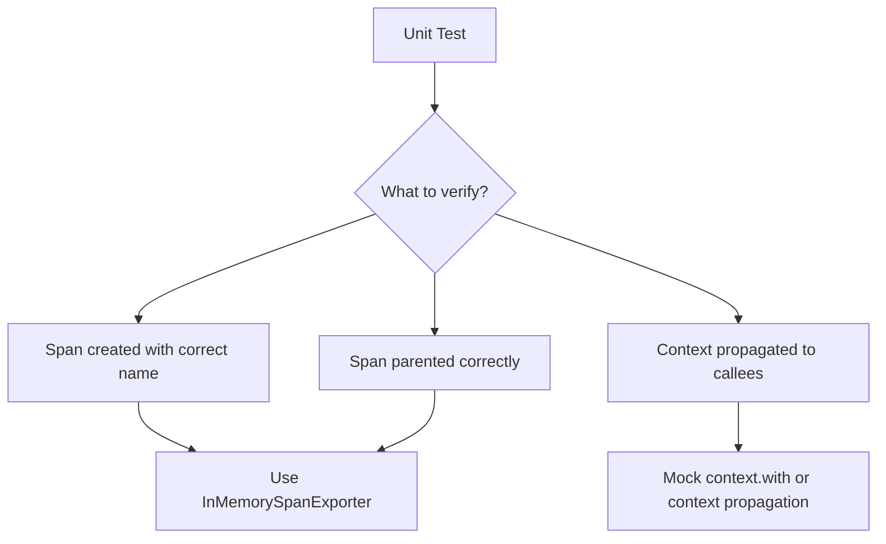

# How to Mock OpenTelemetry Trace Context in Unit Tests

Author: [nawazdhandala](https://www.github.com/nawazdhandala)

Tags: OpenTelemetry, Testing, Mocking, Unit Tests, Trace Context, JavaScript, Python

Description: Learn how to mock and control OpenTelemetry trace context in unit tests to verify context propagation and span relationships.

---

Unit testing code that uses OpenTelemetry often requires you to control or mock the trace context. You might need to verify that your code creates child spans under the right parent, propagates context correctly across async boundaries, or reads trace IDs for correlation. Setting up real tracer providers in every unit test is heavyweight and slow. Mocking the trace context gives you fast, isolated tests that still verify the observability behavior of your code.

This guide covers practical techniques for mocking trace context in both JavaScript/TypeScript and Python, the two most common languages in the OpenTelemetry ecosystem.

## Why Mock Trace Context?

When you unit test a function that creates spans, you typically care about three things: that the span was created with the right name and attributes, that it is correctly parented under an existing context, and that context flows through your function to downstream calls.

You do not care about exporting spans to a backend. You do not care about sampling decisions. You do not care about the full lifecycle of the tracer provider. Mocking lets you test only what matters and skip the rest.



## JavaScript: Setting Up a Test Tracer Provider

The cleanest approach in JavaScript is to use a real `TracerProvider` with an `InMemorySpanExporter`. This is not exactly mocking in the traditional sense, but it gives you full control over the trace context without any network calls:

```typescript
// test/setup.ts
// Shared test setup for OpenTelemetry context testing
import { NodeTracerProvider } from '@opentelemetry/sdk-trace-node';
import {
  InMemorySpanExporter,
  SimpleSpanProcessor,
} from '@opentelemetry/sdk-trace-base';
import { context, trace, propagation } from '@opentelemetry/api';

// Create a provider and exporter scoped to your tests
const exporter = new InMemorySpanExporter();
const provider = new NodeTracerProvider();
provider.addSpanProcessor(new SimpleSpanProcessor(exporter));

// Register as the global provider
provider.register();

// Export these for use in test files
export { exporter, provider };

// Helper to reset state between tests
export function resetTracing() {
  exporter.reset();
  // Clear any active context to prevent test pollution
  context.disable();
}
```

This setup runs spans through a real pipeline but captures them in memory instead of sending them anywhere. It is fast and deterministic.

## JavaScript: Testing Span Creation and Parenting

Here is how to test that your code creates spans with the correct parent-child relationships:

```typescript
// test/order-service.test.ts
import { trace, context, SpanKind } from '@opentelemetry/api';
import { exporter, resetTracing } from './setup';
import { OrderService } from '../src/order-service';

describe('OrderService', () => {
  beforeEach(() => {
    resetTracing();
  });

  it('should create a child span under the active context', () => {
    const tracer = trace.getTracer('test');
    const service = new OrderService();

    // Create a parent span and run our code within its context
    const parentSpan = tracer.startSpan('parent-operation');
    const parentContext = trace.setSpan(context.active(), parentSpan);

    // Execute the method under test within the parent context
    context.with(parentContext, () => {
      service.processOrder({ id: 'order-123', total: 50.0 });
    });

    parentSpan.end();

    // Retrieve all finished spans
    const spans = exporter.getFinishedSpans();

    // Find the child span created by processOrder
    const childSpan = spans.find((s) => s.name === 'process-order');
    expect(childSpan).toBeDefined();

    // Verify the parent-child relationship
    expect(childSpan!.parentSpanId).toBe(
      parentSpan.spanContext().spanId
    );
    expect(childSpan!.spanContext().traceId).toBe(
      parentSpan.spanContext().traceId
    );
  });
});
```

The key technique here is using `context.with()` to establish a parent span context before calling the code under test. This simulates what would happen in a real application where middleware or a framework creates the root span.

## JavaScript: Mocking the Tracer Directly

Sometimes you want a lighter approach where you mock the tracer itself to verify that specific methods were called. This is useful when you do not need to inspect the actual span content:

```typescript
// test/notification-service.test.ts
import { trace, Span, Tracer, SpanOptions } from '@opentelemetry/api';

describe('NotificationService', () => {
  it('should start a span with the correct name and attributes', () => {
    // Create a mock span that tracks method calls
    const mockSpan: Partial<Span> = {
      setAttribute: jest.fn().mockReturnThis(),
      setStatus: jest.fn().mockReturnThis(),
      addEvent: jest.fn().mockReturnThis(),
      end: jest.fn(),
      recordException: jest.fn(),
      spanContext: jest.fn().mockReturnValue({
        traceId: 'abc123',
        spanId: 'def456',
        traceFlags: 1,
      }),
      isRecording: jest.fn().mockReturnValue(true),
    };

    // Create a mock tracer that returns our mock span
    const mockTracer: Partial<Tracer> = {
      startSpan: jest.fn().mockReturnValue(mockSpan),
      startActiveSpan: jest.fn((name, fn) => {
        // Call the function with our mock span
        return fn(mockSpan as Span);
      }),
    };

    // Override the global tracer getter
    jest.spyOn(trace, 'getTracer').mockReturnValue(mockTracer as Tracer);

    const service = new NotificationService();
    service.sendEmail('user@example.com', 'Hello');

    // Verify startActiveSpan was called with the expected name
    expect(mockTracer.startActiveSpan).toHaveBeenCalledWith(
      'send-email',
      expect.any(Function)
    );

    // Verify attributes were set
    expect(mockSpan.setAttribute).toHaveBeenCalledWith(
      'email.recipient',
      'user@example.com'
    );

    // Verify the span was ended
    expect(mockSpan.end).toHaveBeenCalled();
  });
});
```

This approach is faster than running a full tracer provider, but it is more brittle because it depends on the exact sequence of API calls your code makes. Use it when you need speed and precision about how the OpenTelemetry API is used.

## Python: Testing with InMemorySpanExporter

Python's OpenTelemetry SDK provides a similar in-memory exporter pattern:

```python
# test_trace_context.py
import unittest
from opentelemetry import trace, context
from opentelemetry.sdk.trace import TracerProvider
from opentelemetry.sdk.trace.export import SimpleSpanProcessor
from opentelemetry.sdk.trace.export.in_memory import InMemorySpanExporter


class TestTraceContext(unittest.TestCase):
    def setUp(self):
        """Set up a fresh tracer provider for each test."""
        self.exporter = InMemorySpanExporter()
        self.provider = TracerProvider()
        self.provider.add_span_processor(
            SimpleSpanProcessor(self.exporter)
        )
        # Set as global provider
        trace.set_tracer_provider(self.provider)

    def tearDown(self):
        """Clean up after each test."""
        self.exporter.shutdown()

    def test_child_span_inherits_trace_context(self):
        """Verify child spans share the parent trace ID."""
        tracer = trace.get_tracer("test-tracer")

        # Create a parent span
        with tracer.start_as_current_span("parent") as parent_span:
            # Call the function under test
            # It should create a child span in the current context
            process_payment(amount=100.0)

        spans = self.exporter.get_finished_spans()

        # Find spans by name
        parent = next(s for s in spans if s.name == "parent")
        child = next(s for s in spans if s.name == "process-payment")

        # Verify trace context inheritance
        self.assertEqual(
            child.context.trace_id,
            parent.context.trace_id,
        )
        self.assertEqual(
            child.parent.span_id,
            parent.context.span_id,
        )
```

The `start_as_current_span` context manager automatically sets the span as the active span in the current context. Any spans created inside that block will be children of the parent span.

## Python: Mocking Context Propagation Across Boundaries

When your code passes context across thread boundaries, message queues, or HTTP calls, you need to verify that the trace context is injected and extracted correctly:

```python
# test_context_propagation.py
from unittest.mock import patch, MagicMock
from opentelemetry import trace, context
from opentelemetry.propagate import inject, extract
from opentelemetry.sdk.trace import TracerProvider
from opentelemetry.sdk.trace.export import SimpleSpanProcessor
from opentelemetry.sdk.trace.export.in_memory import InMemorySpanExporter


class TestContextPropagation(unittest.TestCase):
    def setUp(self):
        self.exporter = InMemorySpanExporter()
        provider = TracerProvider()
        provider.add_span_processor(SimpleSpanProcessor(self.exporter))
        trace.set_tracer_provider(provider)

    def test_context_injected_into_outgoing_headers(self):
        """Verify trace context is injected into HTTP headers."""
        tracer = trace.get_tracer("test")

        with tracer.start_as_current_span("outgoing-call") as span:
            headers = {}
            # Inject the current context into the headers dict
            inject(headers)

            # Verify the traceparent header was set
            self.assertIn("traceparent", headers)

            # Parse the traceparent to verify it matches our span
            traceparent = headers["traceparent"]
            parts = traceparent.split("-")
            trace_id_hex = parts[1]
            span_id_hex = parts[2]

            # Compare with the actual span context
            expected_trace_id = format(span.get_span_context().trace_id, '032x')
            expected_span_id = format(span.get_span_context().span_id, '016x')

            self.assertEqual(trace_id_hex, expected_trace_id)
            self.assertEqual(span_id_hex, expected_span_id)

    def test_context_extracted_from_incoming_headers(self):
        """Verify trace context is correctly extracted from incoming headers."""
        tracer = trace.get_tracer("test")

        # Simulate incoming headers with a known trace context
        incoming_headers = {
            "traceparent": "00-4bf92f3577b34da6a3ce929d0e0e4736-00f067aa0ba902b7-01"
        }

        # Extract the context from the headers
        extracted_context = extract(incoming_headers)

        # Create a span within the extracted context
        with tracer.start_as_current_span(
            "handle-request",
            context=extracted_context,
        ) as span:
            pass

        spans = self.exporter.get_finished_spans()
        request_span = spans[0]

        # The span should belong to the trace from the incoming headers
        expected_trace_id = int("4bf92f3577b34da6a3ce929d0e0e4736", 16)
        self.assertEqual(request_span.context.trace_id, expected_trace_id)

        # The parent span ID should match the incoming span ID
        expected_parent_id = int("00f067aa0ba902b7", 16)
        self.assertEqual(request_span.parent.span_id, expected_parent_id)
```

This test verifies both sides of context propagation: injecting context into outgoing requests and extracting context from incoming requests. These are the two operations where context propagation bugs most commonly appear.

## Testing Async Context Propagation

Async code is notoriously tricky for context propagation. Here is how to test that trace context survives async boundaries:

```typescript
// test/async-context.test.ts
import { trace, context } from '@opentelemetry/api';
import { exporter, resetTracing } from './setup';

describe('Async context propagation', () => {
  beforeEach(resetTracing);

  it('should maintain trace context across async/await', async () => {
    const tracer = trace.getTracer('test');

    await tracer.startActiveSpan('root', async (rootSpan) => {
      // Simulate an async operation that should create a child span
      await asyncDatabaseQuery('SELECT * FROM users');
      rootSpan.end();
    });

    const spans = exporter.getFinishedSpans();
    const root = spans.find((s) => s.name === 'root');
    const dbSpan = spans.find((s) => s.name === 'db-query');

    // Both spans should exist
    expect(root).toBeDefined();
    expect(dbSpan).toBeDefined();

    // The db span should be a child of root
    // even though it crossed an async boundary
    expect(dbSpan!.parentSpanId).toBe(root!.spanContext().spanId);
  });
});
```

If this test fails, it usually means the async context propagation mechanism (like `AsyncLocalStorage` in Node.js) is not properly configured in your test environment.

## Best Practices for Context Mocking

Keep your mock setup minimal. Only mock what you need for the specific test. A test verifying attribute values does not need to mock context propagation.

Use the `InMemorySpanExporter` approach as your default. It is the closest to real behavior while still being fast and deterministic. Reserve full mocking for cases where you need to verify exact API call sequences.

Always clean up between tests. Leaked context from one test can cause mysterious failures in the next. Reset both the exporter and the active context in your `beforeEach` or `setUp` methods.

Test context propagation at integration boundaries. The most valuable context tests verify that your code correctly passes trace context across HTTP calls, message queues, and thread boundaries. These are the points where context is most likely to be lost.

## Wrapping Up

Mocking OpenTelemetry trace context in unit tests lets you verify the observability behavior of your code without the overhead of running full tracing infrastructure. Whether you use in-memory exporters for high-fidelity testing or mock objects for speed, the goal is the same: confirm that your code creates the right spans, maintains parent-child relationships, and propagates context across boundaries. These tests catch instrumentation bugs early, before they become invisible gaps in your production traces.
