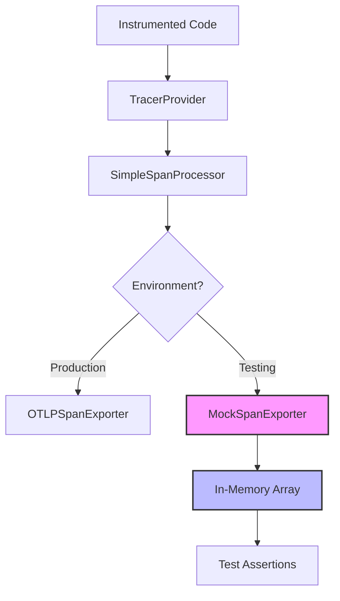

# How to Use Mock Span Exporters for Unit Testing OpenTelemetry in Node.js

Author: [nawazdhandala](https://www.github.com/nawazdhandala)

Tags: OpenTelemetry, Node.js, Unit Testing, Mock Exporter, JavaScript, Tracing

Description: Learn how to build and use mock span exporters to unit test OpenTelemetry instrumentation in Node.js applications with practical examples.

---

Testing OpenTelemetry instrumentation in Node.js requires a different approach than testing in Python or Go. The Node.js SDK does not ship with a built-in in-memory exporter in the same convenient way that the Python SDK does. Instead, you build lightweight mock exporters that capture spans during test runs. This approach gives you full control over what gets captured and how you assert against it.

This guide covers how to create mock span exporters, wire them into your test setup, and write meaningful assertions against the telemetry your Node.js code produces.

## The Problem with Testing Telemetry in Node.js

When you instrument a Node.js service with OpenTelemetry, spans are created through a global TracerProvider and exported through SpanProcessors. In production, those processors send data to a collector or backend over OTLP. During testing, you need to intercept that data before it leaves the process.

You could use a real collector running locally, but that introduces network dependencies and makes tests slow. You could also disable telemetry entirely during tests, but then you are not testing whether your instrumentation actually works. The middle ground is a mock exporter that implements the SpanExporter interface and stores spans in an array.



## Building a Mock Span Exporter

The OpenTelemetry Node.js SDK defines the `SpanExporter` interface with three methods: `export`, `shutdown`, and `forceFlush`. Your mock exporter needs to implement all three.

```typescript
// mock-exporter.ts
import { SpanExporter, ReadableSpan } from "@opentelemetry/sdk-trace-base";
import { ExportResult, ExportResultCode } from "@opentelemetry/core";

/**
 * A mock span exporter that stores finished spans in memory
 * for test assertions. Not intended for production use.
 */
export class MockSpanExporter implements SpanExporter {
    // Array that collects all exported spans
    private _spans: ReadableSpan[] = [];

    // Called by the SpanProcessor when spans are ready to export
    export(
        spans: ReadableSpan[],
        resultCallback: (result: ExportResult) => void
    ): void {
        // Push each span into our in-memory collection
        this._spans.push(...spans);

        // Signal success back to the processor
        resultCallback({ code: ExportResultCode.SUCCESS });
    }

    // Called during provider shutdown
    async shutdown(): Promise<void> {
        this._spans = [];
    }

    // Called when the processor wants to force a flush
    async forceFlush(): Promise<void> {
        // Nothing to flush since we export synchronously
    }

    // Helper method for tests to retrieve captured spans
    getFinishedSpans(): ReadableSpan[] {
        return [...this._spans];
    }

    // Helper method to reset state between tests
    reset(): void {
        this._spans = [];
    }
}
```

The `export` method is where the real work happens. When the SpanProcessor calls it, we simply append the spans to our internal array. The `resultCallback` tells the processor whether the export succeeded or failed. For testing purposes, we always report success.

The `getFinishedSpans` method returns a shallow copy of the array so that test code cannot accidentally mutate the internal state.

## Wiring the Mock Exporter into Tests

With the mock exporter in hand, you need to set up a TracerProvider that uses it. Here is a reusable test helper that works well with Jest or Mocha.

```typescript
// test-helpers.ts
import { NodeTracerProvider } from "@opentelemetry/sdk-trace-node";
import { SimpleSpanProcessor } from "@opentelemetry/sdk-trace-base";
import { trace } from "@opentelemetry/api";
import { MockSpanExporter } from "./mock-exporter";

/**
 * Creates a test TracerProvider wired to a MockSpanExporter.
 * Returns the exporter so tests can inspect captured spans.
 */
export function setupTestTracing(): {
    exporter: MockSpanExporter;
    provider: NodeTracerProvider;
} {
    const exporter = new MockSpanExporter();

    const provider = new NodeTracerProvider();

    // Use SimpleSpanProcessor to avoid batching delays in tests
    provider.addSpanProcessor(new SimpleSpanProcessor(exporter));

    // Register as the global tracer provider
    provider.register();

    return { exporter, provider };
}

/**
 * Tears down the test TracerProvider and clears captured spans.
 */
export async function teardownTestTracing(
    exporter: MockSpanExporter,
    provider: NodeTracerProvider
): Promise<void> {
    exporter.reset();
    await provider.shutdown();

    // Disable the global tracer provider to prevent leakage between tests
    trace.disable();
}
```

We use `SimpleSpanProcessor` here instead of `BatchSpanProcessor`. The batch processor collects spans and exports them on a timer (default 5 seconds), which means spans might not be available when your assertions run. The simple processor exports each span the moment it ends, which is exactly what you want in a test.

## Writing Tests with the Mock Exporter

Let's say you have an Express route handler that processes user registrations. The handler creates spans with business-relevant attributes.

```typescript
// user-service.ts
import { trace, SpanStatusCode } from "@opentelemetry/api";

const tracer = trace.getTracer("user-service");

export async function registerUser(
    email: string,
    plan: string
): Promise<{ userId: string }> {
    // Start a span for the registration operation
    return tracer.startActiveSpan("user.register", async (span) => {
        try {
            // Record business attributes on the span
            span.setAttribute("user.email_domain", email.split("@")[1]);
            span.setAttribute("user.plan", plan);

            // Simulate creating the user
            const userId = `usr_${Date.now()}`;

            // Add an event marking successful registration
            span.addEvent("user.created", { "user.id": userId });

            span.setStatus({ code: SpanStatusCode.OK });
            return { userId };
        } catch (error) {
            // Record the error on the span
            span.setStatus({
                code: SpanStatusCode.ERROR,
                message: (error as Error).message,
            });
            span.recordException(error as Error);
            throw error;
        } finally {
            span.end();
        }
    });
}
```

Now the tests:

```typescript
// user-service.test.ts
import { SpanStatusCode } from "@opentelemetry/api";
import { MockSpanExporter } from "./mock-exporter";
import { NodeTracerProvider } from "@opentelemetry/sdk-trace-node";
import { setupTestTracing, teardownTestTracing } from "./test-helpers";
import { registerUser } from "./user-service";

describe("registerUser", () => {
    let exporter: MockSpanExporter;
    let provider: NodeTracerProvider;

    beforeEach(() => {
        // Fresh tracing setup before each test
        const setup = setupTestTracing();
        exporter = setup.exporter;
        provider = setup.provider;
    });

    afterEach(async () => {
        // Clean up to prevent state leakage
        await teardownTestTracing(exporter, provider);
    });

    it("should create a span with correct name and attributes", async () => {
        await registerUser("alice@example.com", "pro");

        const spans = exporter.getFinishedSpans();

        // Verify exactly one span was created
        expect(spans).toHaveLength(1);

        const span = spans[0];

        // Check the span name
        expect(span.name).toBe("user.register");

        // Verify business attributes are set correctly
        expect(span.attributes["user.email_domain"]).toBe("example.com");
        expect(span.attributes["user.plan"]).toBe("pro");
    });

    it("should record a user.created event", async () => {
        await registerUser("bob@test.org", "free");

        const spans = exporter.getFinishedSpans();
        const span = spans[0];

        // Find the user.created event
        const createdEvent = span.events.find(
            (e) => e.name === "user.created"
        );

        expect(createdEvent).toBeDefined();

        // The user ID should be present in the event attributes
        expect(createdEvent!.attributes!["user.id"]).toBeDefined();
    });

    it("should set OK status on success", async () => {
        await registerUser("carol@demo.io", "enterprise");

        const spans = exporter.getFinishedSpans();
        const span = spans[0];

        // Verify the span status indicates success
        expect(span.status.code).toBe(SpanStatusCode.OK);
    });
});
```

Each test starts with a clean exporter and a fresh TracerProvider. This isolation prevents spans from one test leaking into another, which is the most common source of flaky telemetry tests.

## Testing Async Operations and Nested Spans

Node.js applications are heavily asynchronous, and context propagation across async boundaries is where bugs love to hide. Here is how to test that child spans correctly attach to their parents.

```typescript
// async-operations.test.ts
it("should maintain parent-child relationship across async calls", async () => {
    const tracer = trace.getTracer("test");

    // Create a parent span that contains an async child operation
    await tracer.startActiveSpan("parent.operation", async (parentSpan) => {
        // The child span should automatically pick up the parent context
        await tracer.startActiveSpan("child.operation", async (childSpan) => {
            // Simulate async work
            await new Promise((resolve) => setTimeout(resolve, 10));
            childSpan.end();
        });
        parentSpan.end();
    });

    const spans = exporter.getFinishedSpans();

    // Child span finishes first, then parent
    expect(spans).toHaveLength(2);

    const childSpan = spans.find((s) => s.name === "child.operation")!;
    const parentSpan = spans.find((s) => s.name === "parent.operation")!;

    // Verify the child references the parent
    expect(childSpan.parentSpanId).toBe(parentSpan.spanContext().spanId);

    // Verify both spans share the same trace
    expect(childSpan.spanContext().traceId).toBe(
        parentSpan.spanContext().traceId
    );
});
```

This test validates that the OpenTelemetry context manager is working correctly in your Node.js environment. If context propagation breaks (which can happen with certain async patterns or libraries that do not support async_hooks), this test will catch it.

## Testing with Express or Fastify Middleware

If you use HTTP instrumentation, you can test that middleware-generated spans have the right attributes by making requests against a test server.

```typescript
// http-test-example.test.ts
import { setupTestTracing, teardownTestTracing } from "./test-helpers";
import express from "express";
import request from "supertest";

it("should capture HTTP span attributes", async () => {
    const { exporter, provider } = setupTestTracing();

    const app = express();

    // A simple route that does nothing fancy
    app.get("/api/health", (req, res) => {
        res.json({ status: "ok" });
    });

    // Make a request using supertest (no real server needed)
    await request(app).get("/api/health").expect(200);

    const spans = exporter.getFinishedSpans();

    // Find the HTTP server span
    const httpSpan = spans.find((s) =>
        s.name.includes("GET")
    );

    // Verify HTTP-specific attributes
    expect(httpSpan).toBeDefined();
    expect(httpSpan!.attributes["http.method"]).toBe("GET");
    expect(httpSpan!.attributes["http.status_code"]).toBe(200);

    await teardownTestTracing(exporter, provider);
});
```

## Tips for Reliable Mock Exporter Tests

Always call `trace.disable()` in your teardown. Without this, the global TracerProvider persists between test files, causing cross-contamination when running your full test suite.

Keep your mock exporter simple. It should only store spans and provide accessors. Do not add filtering or transformation logic to it. The exporter should be a dumb container, and your test assertions should handle all the logic.

When testing timing-sensitive operations, be aware that `SimpleSpanProcessor` calls `export` synchronously in the span's `end()` method. If your code ends spans inside callbacks or promises, make sure you await all pending work before asserting.

Consider creating custom matchers (like Jest `expect.extend`) for common span assertions. Checking span names, attribute values, and event counts are repetitive operations that become much more readable with purpose-built matchers.

## Wrapping Up

Mock span exporters are a simple but powerful tool for verifying OpenTelemetry instrumentation in Node.js. By implementing the SpanExporter interface with an in-memory array, you get fast, isolated, and deterministic tests that prove your telemetry works. Combined with proper setup and teardown, these tests become a safety net that catches instrumentation regressions before they reach production and leave you flying blind during an incident.
