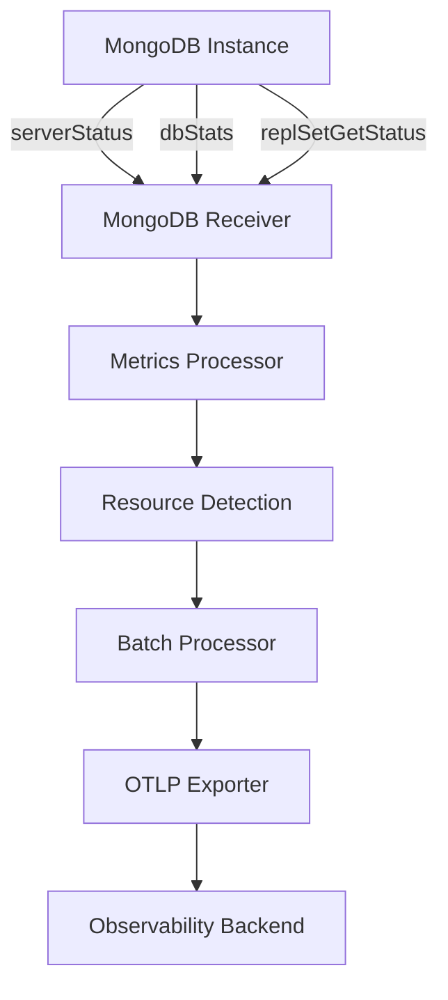

# How to Configure the MongoDB Receiver in the OpenTelemetry Collector

Author: [nawazdhandala](https://www.github.com/nawazdhandala)

Tags: OpenTelemetry, Collector, MongoDB, NoSQL, Database Monitoring, Metrics, Performance

Description: Learn how to configure the MongoDB receiver in OpenTelemetry Collector to monitor NoSQL database performance with practical YAML examples, replication tracking, and sharding metrics.

The MongoDB receiver enables the OpenTelemetry Collector to collect performance metrics directly from MongoDB instances. This receiver provides insights into database operations, collection statistics, replication lag, and resource utilization, making it essential for maintaining healthy MongoDB deployments at scale.

## Why Monitor MongoDB

MongoDB monitoring helps you understand database performance, identify bottlenecks, and optimize resource allocation. Unlike relational databases, MongoDB's document-based architecture and distributed nature require monitoring specific metrics like oplog size, replication lag, chunk distribution, and write concern performance.

The MongoDB receiver collects metrics by connecting to MongoDB instances and querying administrative commands and server status. This approach provides real-time metrics without requiring log parsing or external agents.



## Basic Configuration

The minimal configuration requires connection details and credentials:

```yaml
receivers:
  # MongoDB receiver with basic connection
  mongodb:
    # Connection endpoint
    # For standalone: hostname:port
    # For replica set: mongodb://host1:27017,host2:27017/?replicaSet=rs0
    endpoint: localhost:27017

    # Authentication credentials
    username: monitoring_user
    password: ${env:MONGODB_PASSWORD}

    # Collection interval (default: 1m)
    collection_interval: 1m

    # TLS configuration
    tls:
      insecure: false
      insecure_skip_verify: false

processors:
  # Batch metrics for efficiency
  batch:
    timeout: 30s
    send_batch_size: 100

exporters:
  # Export to stdout for testing
  logging:
    loglevel: info

service:
  pipelines:
    metrics:
      receivers: [mongodb]
      processors: [batch]
      exporters: [logging]
```

This configuration connects to a local MongoDB instance and collects metrics every minute. The password is securely read from an environment variable.

## Understanding MongoDB Metrics

The receiver collects comprehensive metrics across multiple categories:

### Connection Metrics

- `mongodb.connection.count`: Current number of connections
- `mongodb.connection.active`: Active connections
- `mongodb.connection.available`: Available connections in pool

### Operation Metrics

- `mongodb.operation.count`: Operations by type (query, insert, update, delete)
- `mongodb.operation.time`: Operation execution time
- `mongodb.operation.latency`: Operation latency by percentile

### Database Metrics

- `mongodb.database.count`: Number of databases
- `mongodb.collection.count`: Number of collections per database
- `mongodb.data.size`: Total data size
- `mongodb.storage.size`: Total storage size including indexes
- `mongodb.index.count`: Number of indexes
- `mongodb.index.size`: Total index size

### Replication Metrics

- `mongodb.replication.lag`: Replication lag in seconds
- `mongodb.replication.oplog.size`: Oplog size in bytes
- `mongodb.replication.oplog.window`: Oplog time window
- `mongodb.replication.state`: Replica set member state

### Memory and Resource Metrics

- `mongodb.memory.usage`: Memory usage breakdown
- `mongodb.network.io.receive`: Bytes received
- `mongodb.network.io.transmit`: Bytes transmitted
- `mongodb.cursor.count`: Open cursors
- `mongodb.cursor.timeout.count`: Cursors that timed out

### Lock Metrics

- `mongodb.lock.acquire.count`: Lock acquisitions by type
- `mongodb.lock.acquire.wait_count`: Locks that had to wait
- `mongodb.lock.acquire.time`: Time spent acquiring locks

## Advanced Configuration

For production environments, configure comprehensive monitoring with authentication and security:

```yaml
receivers:
  mongodb:
    # Connection string with replica set
    endpoint: mongodb://mongo1.example.com:27017,mongo2.example.com:27017,mongo3.example.com:27017/?replicaSet=prod-rs

    # Authentication
    username: otel_monitor
    password: ${env:MONGODB_MONITORING_PASSWORD}

    # Collection interval
    collection_interval: 30s

    # Timeout for MongoDB commands
    timeout: 10s

    # TLS configuration
    tls:
      insecure: false
      insecure_skip_verify: false
      ca_file: /etc/otel/certs/mongodb-ca.pem
      cert_file: /etc/otel/certs/client-cert.pem
      key_file: /etc/otel/certs/client-key.pem

    # Metric configuration
    metrics:
      # Connection metrics
      mongodb.connection.count:
        enabled: true
      mongodb.connection.active:
        enabled: true

      # Operation metrics
      mongodb.operation.count:
        enabled: true
      mongodb.operation.time:
        enabled: true
      mongodb.operation.latency:
        enabled: true

      # Database metrics
      mongodb.database.count:
        enabled: true
      mongodb.collection.count:
        enabled: true
      mongodb.data.size:
        enabled: true
      mongodb.index.size:
        enabled: true

      # Replication metrics
      mongodb.replication.lag:
        enabled: true
      mongodb.replication.oplog.size:
        enabled: true

      # Resource metrics
      mongodb.memory.usage:
        enabled: true
      mongodb.cursor.count:
        enabled: true

      # Lock metrics
      mongodb.lock.acquire.count:
        enabled: true
      mongodb.lock.acquire.wait_count:
        enabled: true
```

## Creating a Monitoring User

Create a dedicated monitoring user with read-only access:

```javascript
// Connect to admin database
use admin

// Create monitoring user with required roles
db.createUser({
  user: "otel_monitor",
  pwd: "secure_password_here",
  roles: [
    // Read-only role for accessing metrics
    { role: "clusterMonitor", db: "admin" },
    { role: "read", db: "local" }
  ]
})

// Verify user creation
db.getUser("otel_monitor")
```

For more granular control, create a custom role:

```javascript
use admin

// Create custom monitoring role
db.createRole({
  role: "customMonitoring",
  privileges: [
    {
      resource: { cluster: true },
      actions: [
        "serverStatus",
        "replSetGetStatus",
        "top",
        "inprog",
        "shardingState"
      ]
    },
    {
      resource: { db: "", collection: "" },
      actions: [
        "dbStats",
        "collStats",
        "indexStats"
      ]
    }
  ],
  roles: []
})

// Create user with custom role
db.createUser({
  user: "otel_monitor",
  pwd: "secure_password_here",
  roles: [
    { role: "customMonitoring", db: "admin" }
  ]
})
```

## Monitoring Replica Sets

Configure monitoring for MongoDB replica sets to track replication health:

```yaml
receivers:
  # Primary node monitoring
  mongodb/primary:
    endpoint: mongodb://mongo-primary.example.com:27017/?replicaSet=prod-rs
    username: otel_monitor
    password: ${env:MONGODB_PASSWORD}
    collection_interval: 30s

    # Enable replication metrics
    metrics:
      mongodb.operation.count:
        enabled: true
      mongodb.replication.lag:
        enabled: true
      mongodb.replication.oplog.size:
        enabled: true
      mongodb.replication.oplog.window:
        enabled: true

    # Add resource attributes
    resource_attributes:
      mongodb.node.type:
        enabled: true
        value: primary

  # Secondary node monitoring
  mongodb/secondary:
    endpoint: mongodb://mongo-secondary.example.com:27017/?replicaSet=prod-rs
    username: otel_monitor
    password: ${env:MONGODB_PASSWORD}
    collection_interval: 30s

    metrics:
      mongodb.replication.lag:
        enabled: true
      mongodb.operation.count:
        enabled: true

    resource_attributes:
      mongodb.node.type:
        enabled: true
        value: secondary

processors:
  # Add cluster information
  resource:
    attributes:
      - key: mongodb.cluster
        value: production-cluster
        action: insert
      - key: mongodb.replica_set
        value: prod-rs
        action: insert

  batch:
    timeout: 30s

exporters:
  otlp:
    endpoint: https://observability.example.com:4317

service:
  pipelines:
    metrics:
      receivers: [mongodb/primary, mongodb/secondary]
      processors: [resource, batch]
      exporters: [otlp]
```

## Monitoring Sharded Clusters

For sharded MongoDB deployments, monitor mongos routers, config servers, and shards:

```yaml
receivers:
  # Monitor mongos router
  mongodb/mongos:
    endpoint: mongodb://mongos.example.com:27017
    username: otel_monitor
    password: ${env:MONGODB_PASSWORD}
    collection_interval: 30s

    resource_attributes:
      mongodb.component:
        enabled: true
        value: mongos

  # Monitor config server
  mongodb/config:
    endpoint: mongodb://config-server.example.com:27017
    username: otel_monitor
    password: ${env:MONGODB_PASSWORD}
    collection_interval: 60s

    resource_attributes:
      mongodb.component:
        enabled: true
        value: config-server

  # Monitor shard 1
  mongodb/shard1:
    endpoint: mongodb://shard1.example.com:27017/?replicaSet=shard1-rs
    username: otel_monitor
    password: ${env:MONGODB_PASSWORD}
    collection_interval: 30s

    resource_attributes:
      mongodb.component:
        enabled: true
        value: shard
      mongodb.shard.name:
        enabled: true
        value: shard1

  # Monitor shard 2
  mongodb/shard2:
    endpoint: mongodb://shard2.example.com:27017/?replicaSet=shard2-rs
    username: otel_monitor
    password: ${env:MONGODB_PASSWORD}
    collection_interval: 30s

    resource_attributes:
      mongodb.component:
        enabled: true
        value: shard
      mongodb.shard.name:
        enabled: true
        value: shard2

processors:
  resource:
    attributes:
      - key: mongodb.cluster
        value: sharded-prod-cluster
        action: insert

  batch:
    timeout: 30s

service:
  pipelines:
    metrics:
      receivers: [mongodb/mongos, mongodb/config, mongodb/shard1, mongodb/shard2]
      processors: [resource, batch]
      exporters: [otlp]
```

## Production Configuration

Here's a complete production-ready configuration with all best practices:

```yaml
receivers:
  mongodb:
    # Connection with all replica set members
    endpoint: mongodb://mongo1.prod.example.com:27017,mongo2.prod.example.com:27017,mongo3.prod.example.com:27017/?replicaSet=prod-rs&readPreference=secondaryPreferred

    # Authentication
    username: otel_monitoring
    password: ${env:MONGODB_MONITORING_PASSWORD}

    # Collection interval
    collection_interval: 30s

    # Command timeout
    timeout: 15s

    # TLS configuration
    tls:
      insecure: false
      insecure_skip_verify: false
      ca_file: /etc/otel/certs/mongodb-ca.crt
      cert_file: /etc/otel/certs/client.crt
      key_file: /etc/otel/certs/client.key
      min_version: "1.2"

    # Enable comprehensive metrics
    metrics:
      mongodb.connection.count:
        enabled: true
      mongodb.connection.active:
        enabled: true
      mongodb.operation.count:
        enabled: true
      mongodb.operation.time:
        enabled: true
      mongodb.operation.latency:
        enabled: true
      mongodb.database.count:
        enabled: true
      mongodb.collection.count:
        enabled: true
      mongodb.data.size:
        enabled: true
      mongodb.storage.size:
        enabled: true
      mongodb.index.count:
        enabled: true
      mongodb.index.size:
        enabled: true
      mongodb.replication.lag:
        enabled: true
      mongodb.replication.oplog.size:
        enabled: true
      mongodb.replication.oplog.window:
        enabled: true
      mongodb.memory.usage:
        enabled: true
      mongodb.network.io.receive:
        enabled: true
      mongodb.network.io.transmit:
        enabled: true
      mongodb.cursor.count:
        enabled: true
      mongodb.cursor.timeout.count:
        enabled: true
      mongodb.lock.acquire.count:
        enabled: true
      mongodb.lock.acquire.wait_count:
        enabled: true

processors:
  # Memory limiter
  memory_limiter:
    check_interval: 1s
    limit_mib: 512
    spike_limit_mib: 128

  # Resource detection
  resourcedetection:
    detectors: [env, system]
    timeout: 5s

  # Add custom attributes
  resource:
    attributes:
      - key: deployment.environment
        value: production
        action: insert
      - key: mongodb.cluster.name
        value: prod-mongodb-cluster
        action: insert
      - key: mongodb.cluster.region
        value: us-east-1
        action: insert

  # Filter system databases
  filter/exclude_system:
    metrics:
      exclude:
        match_type: strict
        resource_attributes:
          - key: mongodb.database.name
            value: admin
          - key: mongodb.database.name
            value: config
          - key: mongodb.database.name
            value: local

  # Transform metric names
  metricstransform:
    transforms:
      - include: mongodb.connection.count
        action: update
        new_name: mongodb.connections.total

  # Batch processing
  batch:
    timeout: 30s
    send_batch_size: 500

exporters:
  # Primary export
  otlp:
    endpoint: https://observability.example.com:4317
    headers:
      api-key: ${env:OBSERVABILITY_API_KEY}
    compression: gzip
    sending_queue:
      enabled: true
      num_consumers: 10
      queue_size: 1000
    retry_on_failure:
      enabled: true
      initial_interval: 5s
      max_interval: 30s

  # Prometheus endpoint
  prometheus:
    endpoint: "0.0.0.0:8889"
    namespace: mongodb
    const_labels:
      cluster: production
      region: us-east-1

service:
  pipelines:
    metrics:
      receivers: [mongodb]
      processors:
        - memory_limiter
        - resourcedetection
        - resource
        - filter/exclude_system
        - metricstransform
        - batch
      exporters: [otlp, prometheus]

  # Collector telemetry
  telemetry:
    logs:
      level: info
    metrics:
      address: :8888
```

## Monitoring MongoDB Atlas

For MongoDB Atlas (managed service), use a similar configuration with Atlas connection strings:

```yaml
receivers:
  mongodb:
    # Atlas connection string
    endpoint: mongodb+srv://cluster0.example.mongodb.net/?retryWrites=true&w=majority

    # Atlas credentials
    username: otel_monitor
    password: ${env:ATLAS_PASSWORD}

    # Collection interval
    collection_interval: 60s

    # TLS is required for Atlas
    tls:
      insecure: false

    metrics:
      mongodb.operation.count:
        enabled: true
      mongodb.operation.latency:
        enabled: true
      mongodb.data.size:
        enabled: true
      mongodb.index.size:
        enabled: true

processors:
  resource:
    attributes:
      - key: cloud.provider
        value: mongodb_atlas
        action: insert

service:
  pipelines:
    metrics:
      receivers: [mongodb]
      processors: [resource, batch]
      exporters: [otlp]
```

## Alerting Strategies

Configure alerts for common MongoDB issues:

### High Replication Lag

Alert on excessive replication delay:

```yaml
# Prometheus alert rule
- alert: MongoDBHighReplicationLag
  expr: mongodb.replication.lag > 10
  for: 5m
  labels:
    severity: critical
  annotations:
    summary: "MongoDB replication lag on {{ $labels.instance }}"
    description: "Replication lag is {{ $value }} seconds"
```

### Connection Pool Exhaustion

Alert when connections are near limit:

```yaml
- alert: MongoDBHighConnectionUsage
  expr: |
    (mongodb.connection.active / mongodb.connection.count) > 0.8
  for: 5m
  labels:
    severity: warning
  annotations:
    summary: "MongoDB connection pool usage high"
    description: "Connection usage: {{ $value | humanizePercentage }}"
```

### Oplog Window Too Small

Alert when oplog window is insufficient:

```yaml
- alert: MongoDBOplogWindowTooSmall
  expr: mongodb.replication.oplog.window < 3600
  for: 15m
  labels:
    severity: warning
  annotations:
    summary: "MongoDB oplog window too small"
    description: "Oplog window: {{ $value | humanizeDuration }}"
```

### High Lock Wait Time

Alert on lock contention:

```yaml
- alert: MongoDBHighLockWaitTime
  expr: |
    rate(mongodb.lock.acquire.wait_count[5m]) /
    rate(mongodb.lock.acquire.count[5m]) > 0.1
  for: 10m
  labels:
    severity: warning
  annotations:
    summary: "High lock contention detected"
```

### Cursor Timeout Rate

Alert on high cursor timeout rate:

```yaml
- alert: MongoDBHighCursorTimeoutRate
  expr: rate(mongodb.cursor.timeout.count[5m]) > 10
  for: 10m
  labels:
    severity: warning
  annotations:
    summary: "High cursor timeout rate"
    description: "Cursor timeouts: {{ $value }} per second"
```

## Monitoring in Kubernetes

Deploy the collector to monitor MongoDB in Kubernetes:

```yaml
apiVersion: v1
kind: ConfigMap
metadata:
  name: otel-mongodb-config
  namespace: databases
data:
  config.yaml: |
    receivers:
      mongodb:
        endpoint: mongodb://mongodb-service:27017
        username: otel_monitor
        password: ${env:MONGODB_PASSWORD}
        collection_interval: 30s

    processors:
      resource:
        attributes:
          - key: k8s.cluster.name
            value: prod-k8s
            action: insert
          - key: k8s.namespace.name
            value: databases
            action: insert

      batch:
        timeout: 30s

    exporters:
      otlp:
        endpoint: otel-gateway.monitoring.svc.cluster.local:4317

    service:
      pipelines:
        metrics:
          receivers: [mongodb]
          processors: [resource, batch]
          exporters: [otlp]

---
apiVersion: apps/v1
kind: Deployment
metadata:
  name: otel-mongodb-collector
  namespace: databases
spec:
  replicas: 1
  selector:
    matchLabels:
      app: otel-mongodb-collector
  template:
    metadata:
      labels:
        app: otel-mongodb-collector
    spec:
      containers:
        - name: otel-collector
          image: otel/opentelemetry-collector-contrib:latest
          command: ["--config=/conf/config.yaml"]
          env:
            - name: MONGODB_PASSWORD
              valueFrom:
                secretKeyRef:
                  name: mongodb-secret
                  key: monitoring-password
          volumeMounts:
            - name: config
              mountPath: /conf

      volumes:
        - name: config
          configMap:
            name: otel-mongodb-config
```

## Troubleshooting

### Authentication Failures

If the receiver cannot authenticate:

1. Verify username and password are correct
2. Check user has required roles (clusterMonitor)
3. Ensure authentication database is correct (usually admin)
4. Review MongoDB logs for authentication attempts

### Missing Metrics

If expected metrics are missing:

1. Verify MongoDB version supports the metrics (some require 4.0+)
2. Check user permissions allow running admin commands
3. Review metric enable/disable configuration
4. Check collector logs for errors

### High MongoDB Load

If monitoring impacts performance:

1. Increase collection_interval to reduce frequency
2. Use readPreference=secondaryPreferred to query secondaries
3. Reduce number of enabled metrics
4. Ensure proper indexes on system collections

## Integration with OneUptime

Configure the collector to send MongoDB metrics to OneUptime:

```yaml
exporters:
  otlp:
    endpoint: https://opentelemetry-collector.oneuptime.com:4317
    headers:
      x-oneuptime-token: ${env:ONEUPTIME_API_KEY}
    compression: gzip

service:
  pipelines:
    metrics:
      receivers: [mongodb]
      processors: [batch]
      exporters: [otlp]
```

OneUptime provides MongoDB-specific dashboards with replication topology visualization, shard distribution metrics, and intelligent alerting for NoSQL workloads. For monitoring other databases, see our guides on [PostgreSQL receiver](https://oneuptime.com/blog/post/postgresql-receiver-opentelemetry-collector/view) and [MySQL receiver](https://oneuptime.com/blog/post/mysql-receiver-opentelemetry-collector/view).

## Conclusion

The MongoDB receiver provides comprehensive monitoring for MongoDB deployments through the OpenTelemetry Collector. By collecting metrics on operations, replication, sharding, and resource usage, you gain complete visibility into MongoDB performance and health.

Start with basic configuration for standalone instances, then expand to monitor replica sets and sharded clusters as your architecture grows. Use the collected metrics to optimize queries, tune resource allocation, and maintain healthy MongoDB operations at scale.

For monitoring MongoDB in containerized environments, combine this receiver with the [Docker Stats receiver](https://oneuptime.com/blog/post/docker-stats-receiver-opentelemetry-collector/view). To monitor cache layers alongside MongoDB, explore our guide on the [Redis receiver](https://oneuptime.com/blog/post/redis-receiver-opentelemetry-collector/view).
