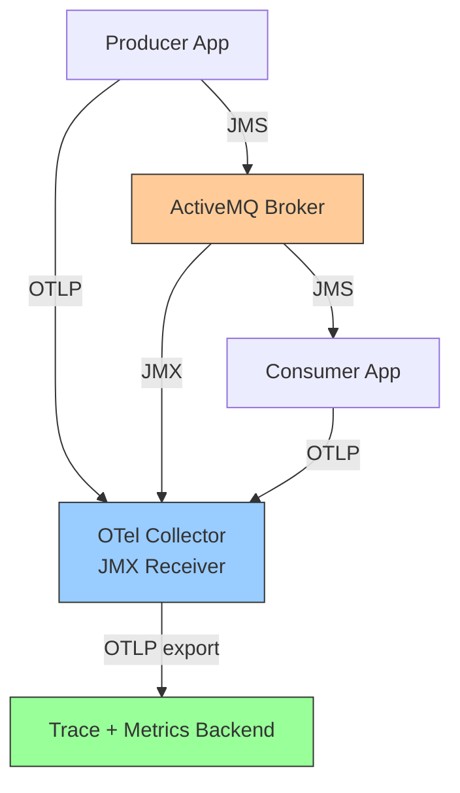

# How to Monitor ActiveMQ with OpenTelemetry

Author: [nawazdhandala](https://www.github.com/nawazdhandala)

Tags: OpenTelemetry, ActiveMQ, Monitoring, JMX, Messaging, Observability, Java

Description: Learn how to monitor Apache ActiveMQ with OpenTelemetry using the JMX receiver, JMS instrumentation, and custom metrics for broker health and queue performance.

---

Apache ActiveMQ is one of the most widely deployed open-source message brokers, handling millions of messages daily in enterprise environments. Monitoring ActiveMQ effectively requires visibility into both the broker itself (queue depths, memory usage, connection counts) and the applications that interact with it (message production rates, consumption latency, processing errors). OpenTelemetry provides a unified approach to collecting both types of telemetry, letting you correlate broker-level metrics with application-level traces in a single observability platform.

This guide covers three complementary approaches: using the OpenTelemetry Collector's JMX receiver to scrape broker metrics, instrumenting JMS client code for distributed tracing, and combining both for full-stack ActiveMQ observability.

## ActiveMQ Monitoring Architecture

ActiveMQ exposes its internal metrics through JMX (Java Management Extensions). The OpenTelemetry Collector can scrape these metrics using the JMX receiver, which connects to ActiveMQ's JMX endpoint and translates MBean attributes into OpenTelemetry metrics. On the application side, OpenTelemetry's JMS instrumentation library creates spans for message send and receive operations.



## Collecting Broker Metrics with the JMX Receiver

The JMX receiver in the OpenTelemetry Collector connects to ActiveMQ's JMX port and collects broker-level metrics. First, make sure JMX is enabled on your ActiveMQ broker:

```bash
# In activemq.env or activemq startup script
# Enable JMX remote access for the collector
ACTIVEMQ_SUNJMX_START="-Dcom.sun.management.jmxremote \
  -Dcom.sun.management.jmxremote.port=1099 \
  -Dcom.sun.management.jmxremote.rmi.port=1099 \
  -Dcom.sun.management.jmxremote.ssl=false \
  -Dcom.sun.management.jmxremote.authenticate=true \
  -Dcom.sun.management.jmxremote.password.file=${ACTIVEMQ_CONF}/jmxremote.password \
  -Dcom.sun.management.jmxremote.access.file=${ACTIVEMQ_CONF}/jmxremote.access"
```

In production, always enable JMX authentication. The password and access files control who can connect and what operations they can perform.

Now configure the OpenTelemetry Collector with the JMX receiver and a Groovy script that defines which metrics to collect:

```yaml
# otel-collector-config.yaml
receivers:
  # JMX receiver scrapes ActiveMQ MBeans
  jmx:
    jar_path: /opt/opentelemetry-jmx-metrics.jar
    endpoint: activemq-broker:1099
    target_system: activemq
    collection_interval: 30s
    username: monitor
    password: ${env:JMX_PASSWORD}

  # OTLP receiver for application telemetry
  otlp:
    protocols:
      grpc:
        endpoint: 0.0.0.0:4317

processors:
  batch:
    timeout: 10s
    send_batch_size: 200

  # Add broker identification attributes
  resource:
    attributes:
      - key: messaging.system
        value: activemq
        action: upsert
      - key: broker.name
        value: ${env:BROKER_NAME}
        action: upsert

exporters:
  otlp:
    endpoint: https://oneuptime-ingest.example.com:4317
    tls:
      insecure: false

service:
  pipelines:
    metrics:
      receivers: [jmx]
      processors: [resource, batch]
      exporters: [otlp]
    traces:
      receivers: [otlp]
      processors: [batch]
      exporters: [otlp]
```

The `target_system: activemq` setting tells the JMX receiver to use the built-in ActiveMQ metric definitions. This automatically collects key metrics like queue size, enqueue/dequeue counts, producer and consumer counts, and memory usage.

## Key Metrics from the JMX Receiver

The ActiveMQ target system in the JMX receiver collects these essential metrics:

```yaml
# Metrics automatically collected with target_system: activemq
# These map to ActiveMQ JMX MBeans

# Queue depth - messages waiting for consumption
# MBean: org.apache.activemq:type=Broker,brokerName=*,destinationType=Queue,destinationName=*
# Attribute: QueueSize
activemq.queue.size:
  description: "Number of messages in the queue"
  unit: "messages"

# Message rates
activemq.queue.enqueue_count:
  description: "Total messages enqueued"
activemq.queue.dequeue_count:
  description: "Total messages dequeued"

# Consumer and producer counts
activemq.queue.consumer_count:
  description: "Number of active consumers"
activemq.queue.producer_count:
  description: "Number of active producers"

# Memory usage
activemq.broker.memory_percent_usage:
  description: "Percentage of broker memory used"
activemq.broker.store_percent_usage:
  description: "Percentage of store (disk) used"
activemq.broker.temp_percent_usage:
  description: "Percentage of temp storage used"
```

Queue size is the single most important metric. A steadily growing queue size indicates that consumers cannot keep up with producers. Memory and store usage percentages tell you how close the broker is to running out of resources, which triggers flow control and slows down producers.

## Instrumenting JMS Producers with OpenTelemetry

On the application side, the OpenTelemetry Java agent provides automatic instrumentation for JMS clients. Add the agent to your application startup:

```bash
# Start the producer application with the OpenTelemetry Java agent
java -javaagent:/opt/opentelemetry-javaagent.jar \
  -Dotel.service.name=order-producer \
  -Dotel.exporter.otlp.endpoint=http://otel-collector:4317 \
  -Dotel.instrumentation.messaging.experimental.receive-telemetry.enabled=true \
  -jar order-producer.jar
```

The Java agent automatically instruments JMS `MessageProducer.send()` calls and creates producer spans with messaging semantic conventions. Here is how a typical producer looks:

```java
// OrderProducer.java - Send messages to ActiveMQ with tracing
import javax.jms.*;
import org.apache.activemq.ActiveMQConnectionFactory;
import io.opentelemetry.api.trace.Span;
import io.opentelemetry.api.trace.Tracer;
import io.opentelemetry.api.GlobalOpenTelemetry;

public class OrderProducer {

    private final Connection connection;
    private final Session session;
    private final MessageProducer producer;

    // Get a tracer for custom spans
    private static final Tracer tracer =
        GlobalOpenTelemetry.getTracer("order-producer");

    public OrderProducer(String brokerUrl) throws JMSException {
        // Create connection to ActiveMQ
        ActiveMQConnectionFactory factory =
            new ActiveMQConnectionFactory(brokerUrl);
        connection = factory.createConnection();
        connection.start();

        session = connection.createSession(false,
            Session.AUTO_ACKNOWLEDGE);
        Queue queue = session.createQueue("orders");
        producer = session.createProducer(queue);

        // Set persistent delivery for reliable messaging
        producer.setDeliveryMode(DeliveryMode.PERSISTENT);
    }

    public void sendOrder(String orderId, String orderJson)
            throws JMSException {
        // The OTel agent automatically creates a span for this send
        // and injects trace context into JMS message properties
        TextMessage message = session.createTextMessage(orderJson);

        // Set JMS properties for routing and filtering
        message.setStringProperty("orderId", orderId);
        message.setStringProperty("eventType", "OrderCreated");
        message.setIntProperty("priority", 5);

        // The agent wraps this call with a PRODUCER span
        producer.send(message);
    }
}
```

The OpenTelemetry Java agent intercepts the `producer.send(message)` call and does two things: it creates a span with `SpanKind.PRODUCER` and messaging attributes, and it injects the trace context into the JMS message properties. You do not need to write any instrumentation code for this to work.

## Instrumenting JMS Consumers

Consumer instrumentation works the same way. The Java agent intercepts `MessageConsumer.receive()` and `MessageListener.onMessage()` calls:

```java
// OrderConsumer.java - Consume messages with automatic tracing
import javax.jms.*;
import org.apache.activemq.ActiveMQConnectionFactory;
import io.opentelemetry.api.trace.Span;
import io.opentelemetry.api.trace.Tracer;
import io.opentelemetry.api.GlobalOpenTelemetry;

public class OrderConsumer implements MessageListener {

    private static final Tracer tracer =
        GlobalOpenTelemetry.getTracer("order-consumer");

    public OrderConsumer(String brokerUrl) throws JMSException {
        ActiveMQConnectionFactory factory =
            new ActiveMQConnectionFactory(brokerUrl);
        Connection connection = factory.createConnection();

        Session session = connection.createSession(false,
            Session.CLIENT_ACKNOWLEDGE);
        Queue queue = session.createQueue("orders");
        MessageConsumer consumer = session.createConsumer(queue);

        // Register this as the message listener
        consumer.setMessageListener(this);
        connection.start();
    }

    @Override
    public void onMessage(Message message) {
        // The OTel agent automatically creates a CONSUMER span
        // linked to the producer's trace context
        try {
            TextMessage textMessage = (TextMessage) message;
            String orderId = message.getStringProperty("orderId");

            // Add business context to the current span
            Span currentSpan = Span.current();
            currentSpan.setAttribute("order.id", orderId);

            // Process the order
            processOrder(orderId, textMessage.getText());

            // Acknowledge the message
            message.acknowledge();

        } catch (Exception e) {
            Span.current().recordException(e);
            // Handle the error - maybe send to DLQ
            handleProcessingError(message, e);
        }
    }

    private void processOrder(String orderId, String orderJson) {
        // Create a child span for the business logic
        var span = tracer.spanBuilder("process_order")
            .setAttribute("order.id", orderId)
            .startSpan();
        try {
            // Your order processing logic here
            validateOrder(orderJson);
            saveToDatabase(orderJson);
            notifyFulfillment(orderId);
        } finally {
            span.end();
        }
    }
}
```

The `onMessage` callback is automatically wrapped in a consumer span by the Java agent. That span extracts the trace context from the JMS message properties, so it becomes a child of the producer span. The custom `process_order` span adds more detail about what happens during message processing.

Using `CLIENT_ACKNOWLEDGE` mode and calling `message.acknowledge()` after successful processing ensures that messages are not lost if the consumer crashes during processing. The tracing captures whether the acknowledge happened, giving you visibility into message acknowledgment patterns.

## Custom Metrics for Queue Health Alerts

Beyond the JMX metrics from the broker, you can publish custom application-level metrics that capture business-specific health indicators:

```java
// QueueHealthMetrics.java - Custom metrics for alerting
import io.opentelemetry.api.metrics.Meter;
import io.opentelemetry.api.metrics.LongCounter;
import io.opentelemetry.api.metrics.LongHistogram;
import io.opentelemetry.api.GlobalOpenTelemetry;

public class QueueHealthMetrics {

    private static final Meter meter =
        GlobalOpenTelemetry.getMeter("activemq-health");

    // Track message processing outcomes
    private static final LongCounter messagesProcessed =
        meter.counterBuilder("activemq.messages.processed")
            .setDescription("Messages processed by outcome")
            .setUnit("messages")
            .build();

    // Track processing duration
    private static final LongHistogram processingDuration =
        meter.histogramBuilder("activemq.processing.duration")
            .setDescription("Time to process a message")
            .setUnit("ms")
            .ofLongs()
            .build();

    public static void recordSuccess(String queue, long durationMs) {
        // Record successful processing with queue name attribute
        messagesProcessed.add(1,
            io.opentelemetry.api.common.Attributes.of(
                io.opentelemetry.api.common.AttributeKey.stringKey("queue"), queue,
                io.opentelemetry.api.common.AttributeKey.stringKey("outcome"), "success"
            ));
        processingDuration.record(durationMs,
            io.opentelemetry.api.common.Attributes.of(
                io.opentelemetry.api.common.AttributeKey.stringKey("queue"), queue
            ));
    }

    public static void recordFailure(String queue, String errorType) {
        messagesProcessed.add(1,
            io.opentelemetry.api.common.Attributes.of(
                io.opentelemetry.api.common.AttributeKey.stringKey("queue"), queue,
                io.opentelemetry.api.common.AttributeKey.stringKey("outcome"), "failure"),
                io.opentelemetry.api.common.AttributeKey.stringKey("error.type"), errorType
            ));
    }
}
```

These application-level metrics complement the broker-level JMX metrics. While JMX tells you the queue has 5000 messages waiting, application metrics tell you that 10% of messages are failing with a specific error type and that processing latency has increased over the last hour.

## Monitoring Dead Letter Queues

ActiveMQ routes messages that fail repeatedly to a dead letter queue (DLQ), which is `ActiveMQ.DLQ` by default. Monitoring DLQ growth is critical because it indicates persistent processing failures:

```yaml
# Add DLQ-specific monitoring to your collector config
receivers:
  jmx:
    jar_path: /opt/opentelemetry-jmx-metrics.jar
    endpoint: activemq-broker:1099
    target_system: activemq
    collection_interval: 30s
    # Additional MBean queries for DLQ monitoring
    additional_jars: []

processors:
  # Filter to create alerts on DLQ growth
  filter/dlq_alert:
    metrics:
      include:
        match_type: strict
        metric_names:
          - activemq.queue.size
      resource_attributes:
        - key: destination
          value: "ActiveMQ.DLQ"

exporters:
  otlp:
    endpoint: https://oneuptime-ingest.example.com:4317

service:
  pipelines:
    metrics:
      receivers: [jmx]
      processors: [batch]
      exporters: [otlp]
```

Set up alerts on the `activemq.queue.size` metric for the DLQ destination. Any messages appearing in the DLQ warrant investigation, since they represent messages that could not be processed after all retry attempts.

## Putting It All Together

With both broker metrics and application traces flowing into your observability backend, you can correlate the two to diagnose issues quickly. For example, if you see queue depth growing in the broker metrics, you can look at the consumer traces to find which messages are taking longest to process or which are failing.

A healthy ActiveMQ deployment shows these characteristics in the telemetry:
- Queue sizes remain stable or oscillate within a predictable range
- Enqueue and dequeue rates are roughly equal over time
- Memory usage stays below 70% consistently
- Consumer spans show low and consistent processing latency
- Dead letter queue size remains at zero or near zero

When any of these indicators drift outside their normal range, the combination of broker metrics and application traces gives you the context to identify the root cause quickly, whether it is a slow downstream dependency, a message format issue, or a broker resource constraint.

## Conclusion

Monitoring ActiveMQ with OpenTelemetry combines broker-level JMX metrics with application-level distributed tracing to give you complete visibility into your messaging infrastructure. The JMX receiver handles broker metrics without modifying the broker itself, while the Java agent provides automatic JMS instrumentation with zero code changes. Together, they create an observability foundation that supports both real-time troubleshooting and long-term capacity planning for your ActiveMQ deployment.
