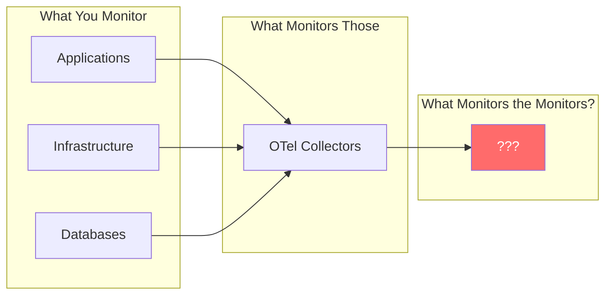
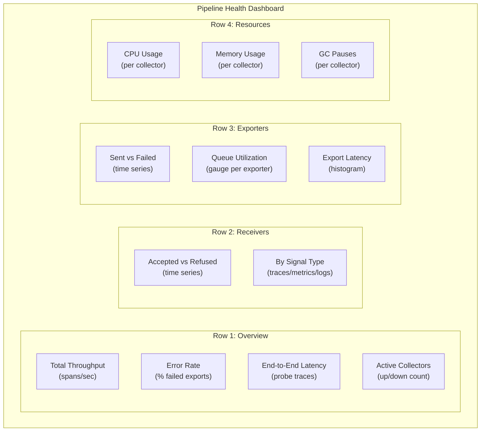
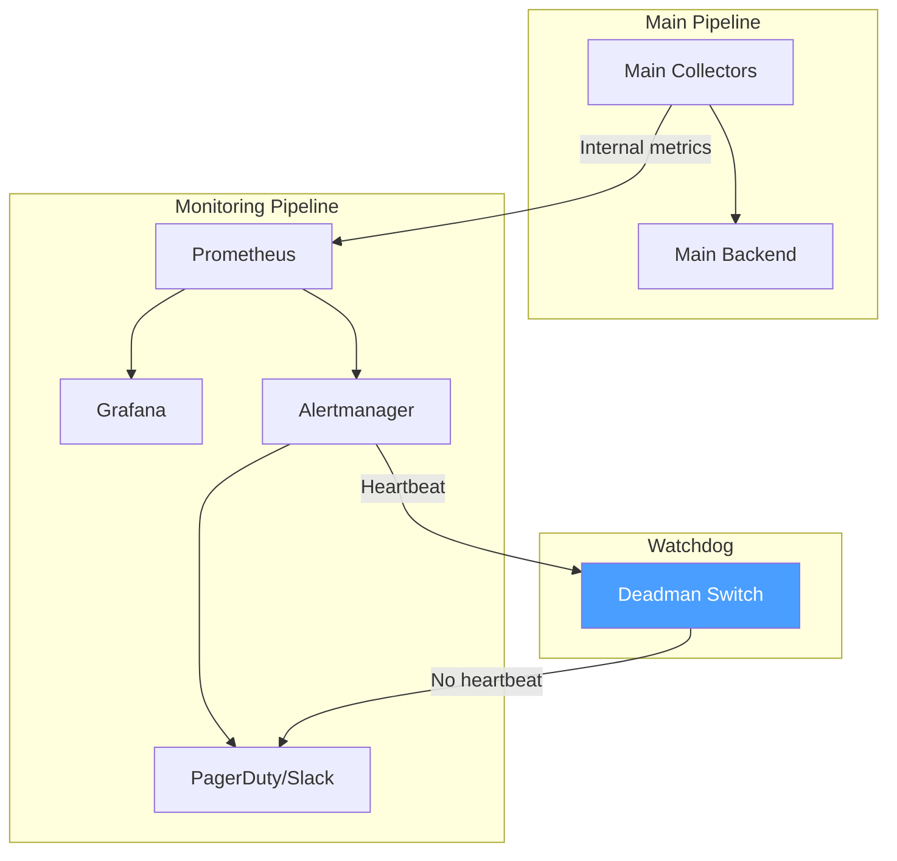

# How to Monitor and Alert on OpenTelemetry Pipeline Health

Author: [nawazdhandala](https://www.github.com/nawazdhandala)

Tags: OpenTelemetry, Monitoring, Alerting, Pipeline Health, Prometheus

Description: Set up comprehensive monitoring and alerting for your OpenTelemetry pipelines using internal collector metrics, Prometheus, and Grafana dashboards.

---

Your observability pipeline is itself a system that needs observability. If your OpenTelemetry Collectors are silently dropping data, misconfigured, or running out of resources, you will not know until you need telemetry that is not there. By then it is too late.

This guide covers how to monitor your OpenTelemetry pipeline end-to-end, what metrics to track, how to set up meaningful alerts, and how to build dashboards that show you pipeline health at a glance.

## The Pipeline Health Problem

Here is the thing about observability pipelines: they are the last thing you think to monitor, and the first thing that matters during an incident. If your collectors are unhealthy, every dashboard, alert, and trace query built on top of them is unreliable.



The answer to "what monitors the monitors" is a dedicated monitoring stack for your pipeline itself.

## Collector Internal Metrics

The OpenTelemetry Collector exposes a rich set of internal metrics via its telemetry configuration. These metrics tell you everything about the health of each component in the pipeline.

Enable detailed internal metrics in your collector configuration:

```yaml
# collector-config.yaml
service:
  telemetry:
    metrics:
      # Expose internal metrics on this address
      address: 0.0.0.0:8888
      # Use "detailed" level to get per-component metrics
      # "normal" gives you basics, "detailed" gives you everything
      level: detailed
    logs:
      # Set log level to warn in production to avoid noise
      # Switch to debug temporarily when troubleshooting
      level: warn
      # Structured logging makes it easier to parse
      encoding: json
```

## Key Metrics to Track

Not all collector metrics are equally useful. Here are the ones that actually matter for pipeline health, organized by component.

### Receiver Metrics

These tell you if data is getting into the pipeline:

```promql
# Total spans received, broken down by receiver
# If this drops to zero, your applications are not sending telemetry
rate(otelcol_receiver_accepted_spans[5m])

# Spans refused by the receiver (usually due to memory limiter)
# Any non-zero value means you are losing data at intake
rate(otelcol_receiver_refused_spans[5m])
```

### Processor Metrics

These tell you if data is being processed correctly:

```promql
# Spans dropped by processors (memory limiter, filter, etc.)
# This is a direct measure of data loss within the pipeline
rate(otelcol_processor_dropped_spans[5m])

# Batch processor metrics -- how many spans are in each batch
# Small batch sizes mean you are not batching efficiently
otelcol_processor_batch_batch_size_trigger_send{trigger="size"}
```

### Exporter Metrics

These are the most important metrics because they tell you if data is reaching your backends:

```promql
# Successfully exported spans per second
rate(otelcol_exporter_sent_spans[5m])

# Failed exports per second -- the most critical metric
# Any sustained non-zero value needs investigation
rate(otelcol_exporter_send_failed_spans[5m])

# Queue utilization as a percentage
# Above 80% means you are close to dropping data
otelcol_exporter_queue_size / otelcol_exporter_queue_capacity * 100

# Number of in-flight exports
# High values indicate the backend is slow
otelcol_exporter_queue_size
```

### Resource Metrics

These tell you if the collector itself is healthy:

```promql
# Collector CPU usage
rate(otelcol_process_cpu_seconds[5m])

# Collector memory usage in bytes
otelcol_process_memory_rss

# Go runtime metrics that indicate GC pressure
go_gc_duration_seconds{quantile="0.99"}
```

## Setting Up Prometheus Scraping

Configure Prometheus to scrape your collector's internal metrics endpoint:

```yaml
# prometheus-scrape-config.yaml
# Add this to your Prometheus configuration
scrape_configs:
  # Scrape agent collectors running as DaemonSet
  - job_name: 'otel-agent'
    kubernetes_sd_configs:
      - role: pod
    relabel_configs:
      # Only scrape pods with the otel-agent label
      - source_labels: [__meta_kubernetes_pod_label_app]
        regex: otel-agent
        action: keep
      # Use the metrics port
      - source_labels: [__meta_kubernetes_pod_ip]
        target_label: __address__
        replacement: ${1}:8888

  # Scrape gateway collectors running as StatefulSet/Deployment
  - job_name: 'otel-gateway'
    kubernetes_sd_configs:
      - role: pod
    relabel_configs:
      - source_labels: [__meta_kubernetes_pod_label_app]
        regex: otel-gateway
        action: keep
      - source_labels: [__meta_kubernetes_pod_ip]
        target_label: __address__
        replacement: ${1}:8888
```

## Alert Rules

Here are the alert rules you should have from day one. These are organized by severity and cover the failure modes that actually happen in production.

### Critical Alerts

These need immediate attention:

```yaml
# critical-alerts.yaml
groups:
  - name: otel-pipeline-critical
    rules:
      # Alert when exports are completely failing
      # This means no data is reaching the backend
      - alert: CollectorExportCompleteFailure
        expr: >
          rate(otelcol_exporter_sent_spans[5m]) == 0
          and
          rate(otelcol_receiver_accepted_spans[5m]) > 0
        for: 3m
        labels:
          severity: critical
        annotations:
          summary: "Collector {{ $labels.instance }} is receiving but not exporting spans"
          description: "The collector is accepting spans from applications but none are reaching the backend. Check exporter configuration and backend health."

      # Alert when collectors are crash-looping
      - alert: CollectorCrashLooping
        expr: >
          increase(kube_pod_container_status_restarts_total{
            container="collector"
          }[30m]) > 3
        labels:
          severity: critical
        annotations:
          summary: "Collector pod {{ $labels.pod }} is crash-looping"
          description: "The collector has restarted {{ $value }} times in 30 minutes. Check logs for OOM kills or configuration errors."

      # Alert when the collector is not running at all
      - alert: CollectorDown
        expr: up{job=~"otel-.*"} == 0
        for: 2m
        labels:
          severity: critical
        annotations:
          summary: "Collector {{ $labels.instance }} is down"
```

### Warning Alerts

These need attention soon but are not emergencies:

```yaml
# warning-alerts.yaml
groups:
  - name: otel-pipeline-warnings
    rules:
      # Alert when the export queue is getting full
      - alert: CollectorQueueFillingUp
        expr: >
          otelcol_exporter_queue_size / otelcol_exporter_queue_capacity > 0.7
        for: 10m
        labels:
          severity: warning
        annotations:
          summary: "Export queue at {{ $value | humanizePercentage }} capacity"
          description: "The export queue for {{ $labels.exporter }} on {{ $labels.instance }} is filling up. The backend may be slow or the queue may need resizing."

      # Alert when data is being dropped by processors
      - alert: CollectorDroppingData
        expr: >
          rate(otelcol_processor_dropped_spans[5m]) > 0
        for: 5m
        labels:
          severity: warning
        annotations:
          summary: "Collector {{ $labels.instance }} is dropping spans"
          description: "{{ $value }} spans/sec are being dropped. Check memory limiter settings and collector resource usage."

      # Alert on high export failure rate (but not complete failure)
      - alert: CollectorExportPartialFailure
        expr: >
          rate(otelcol_exporter_send_failed_spans[5m]) /
          (rate(otelcol_exporter_send_failed_spans[5m]) + rate(otelcol_exporter_sent_spans[5m]))
          > 0.05
        for: 10m
        labels:
          severity: warning
        annotations:
          summary: "{{ $value | humanizePercentage }} of exports failing for {{ $labels.exporter }}"

      # Alert when collector memory is approaching the limit
      - alert: CollectorHighMemory
        expr: >
          otelcol_process_memory_rss /
          on(pod) kube_pod_container_resource_limits{resource="memory"}
          > 0.85
        for: 10m
        labels:
          severity: warning
        annotations:
          summary: "Collector {{ $labels.instance }} memory at {{ $value | humanizePercentage }}"
```

### Informational Alerts

These help you stay informed about pipeline behavior:

```yaml
# info-alerts.yaml
groups:
  - name: otel-pipeline-info
    rules:
      # Alert when receiver refusals spike (backpressure)
      - alert: CollectorReceiverBackpressure
        expr: >
          rate(otelcol_receiver_refused_spans[5m]) > 100
        for: 15m
        labels:
          severity: info
        annotations:
          summary: "Collector {{ $labels.instance }} is refusing {{ $value }} spans/sec"
          description: "The memory limiter is actively refusing incoming data. This may be normal during traffic spikes."

      # Alert when a collector has been running for a long time
      # without a restart (useful for tracking deployment cadence)
      - alert: CollectorLongUptime
        expr: >
          (time() - otelcol_process_uptime) > 30 * 24 * 3600
        labels:
          severity: info
        annotations:
          summary: "Collector {{ $labels.instance }} has been running for over 30 days"
```

## Data Flow Validation

Beyond component-level metrics, you should validate that data is flowing through the entire pipeline. A simple way to do this is with synthetic traces:

```yaml
# synthetic-trace-generator.yaml
# Deploy a small pod that generates known test traces every minute
# You can then verify these traces arrive at your backend
apiVersion: batch/v1
kind: CronJob
metadata:
  name: otel-pipeline-probe
  namespace: observability
spec:
  schedule: "* * * * *"
  jobTemplate:
    spec:
      template:
        spec:
          containers:
            - name: probe
              image: ghcr.io/open-telemetry/opentelemetry-collector-contrib/telemetrygen:latest
              args:
                - traces
                - --otlp-endpoint=otel-agent:4317
                - --otlp-insecure
                - --traces=1
                - --service=pipeline-health-probe
                - --span-duration=100ms
          restartPolicy: OnFailure
```

Then set up a query that checks if the synthetic traces are arriving at your backend:

```promql
# Track the arrival of synthetic probe traces
# If this goes to zero, the pipeline is broken end-to-end
count_over_time(
  {service_name="pipeline-health-probe"}[5m]
)
```

## Grafana Dashboard

Here is a dashboard layout that gives you a complete view of pipeline health:



Here is a Grafana dashboard JSON snippet for the most important panels:

```json
{
  "panels": [
    {
      "title": "Pipeline Throughput (Spans/sec)",
      "type": "timeseries",
      "targets": [
        {
          "expr": "sum(rate(otelcol_exporter_sent_spans[5m]))",
          "legendFormat": "Sent"
        },
        {
          "expr": "sum(rate(otelcol_exporter_send_failed_spans[5m]))",
          "legendFormat": "Failed"
        },
        {
          "expr": "sum(rate(otelcol_processor_dropped_spans[5m]))",
          "legendFormat": "Dropped"
        }
      ]
    },
    {
      "title": "Export Queue Utilization",
      "type": "gauge",
      "targets": [
        {
          "expr": "otelcol_exporter_queue_size / otelcol_exporter_queue_capacity * 100",
          "legendFormat": "{{ exporter }}"
        }
      ],
      "fieldConfig": {
        "defaults": {
          "thresholds": {
            "steps": [
              { "color": "green", "value": 0 },
              { "color": "yellow", "value": 50 },
              { "color": "red", "value": 80 }
            ]
          }
        }
      }
    },
    {
      "title": "Collector Memory Usage",
      "type": "timeseries",
      "targets": [
        {
          "expr": "otelcol_process_memory_rss",
          "legendFormat": "{{ instance }}"
        }
      ]
    }
  ]
}
```

## Pipeline Health Scoring

For executive dashboards or SLO tracking, you can compute a composite pipeline health score:

```promql
# Pipeline health score (0-100)
# Factors in export success rate, queue health, and collector availability
(
  # Export success rate (weighted 50%)
  (1 - clamp_max(
    sum(rate(otelcol_exporter_send_failed_spans[5m])) /
    sum(rate(otelcol_exporter_sent_spans[5m])),
    1
  )) * 50

  +

  # Queue health (weighted 30%)
  # Inverse of average queue utilization
  (1 - avg(
    otelcol_exporter_queue_size / otelcol_exporter_queue_capacity
  )) * 30

  +

  # Collector availability (weighted 20%)
  (count(up{job=~"otel-.*"} == 1) /
   count(up{job=~"otel-.*"})) * 20
)
```

## Self-Monitoring Pipeline Topology

To avoid a chicken-and-egg problem (the monitoring pipeline cannot monitor itself if it goes down), use a separate lightweight monitoring path:



The watchdog (deadman switch) is the final safety net. If Alertmanager stops sending its regular heartbeat, an external service (like a hosted uptime monitor) will alert you. This catches the case where your entire monitoring stack is down.

## Wrapping Up

Monitoring your OpenTelemetry pipeline is not optional in production. The internal metrics exposed by the collector give you deep visibility into every component. Set up Prometheus scraping from day one, create alerts for the failure modes that actually happen (complete export failure, queue overflow, memory pressure), and use synthetic probes to validate end-to-end data flow. The pipeline health dashboard should be the first thing you check when an incident starts, because if the pipeline is unhealthy, nothing else you see in your observability tools can be trusted.
