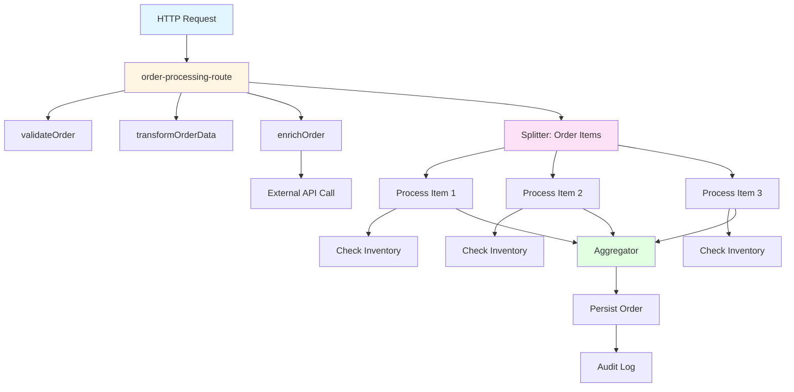

# How to Monitor Apache Camel Routes with OpenTelemetry

Author: [nawazdhandala](https://www.github.com/nawazdhandala)

Tags: OpenTelemetry, Apache Camel, Integration, Routes, Java, EIP

Description: Implement comprehensive OpenTelemetry monitoring for Apache Camel routes, tracking message flows through Enterprise Integration Patterns, processors, and endpoints with distributed tracing.

Apache Camel excels at implementing Enterprise Integration Patterns (EIP), but complex routes with multiple transformations, content-based routing, and external system interactions can become difficult to debug. Messages flow through chains of processors, each modifying content or routing decisions. Without proper instrumentation, tracking a message through a Camel route and identifying bottlenecks becomes challenging.

OpenTelemetry integration with Apache Camel provides end-to-end visibility into message processing, capturing timing data for each step and maintaining trace context across asynchronous boundaries.

## Understanding Camel's Message Processing

Apache Camel routes define message flows using a fluent DSL. A route reads from an endpoint, processes the message through various steps, and writes to destination endpoints. Processing can be synchronous or asynchronous, with messages potentially splitting into multiple sub-messages or aggregating from multiple sources.

Each processing step (processor, transformer, router) should appear as a span in the trace. This creates a detailed picture of message flow, showing exactly where time is spent and which steps fail.

## Maven Dependencies

Add Apache Camel and OpenTelemetry dependencies:

```xml
<!-- Camel core -->
<dependency>
    <groupId>org.apache.camel</groupId>
    <artifactId>camel-core</artifactId>
    <version>4.3.0</version>
</dependency>

<!-- Camel Spring Boot -->
<dependency>
    <groupId>org.apache.camel.springboot</groupId>
    <artifactId>camel-spring-boot-starter</artifactId>
    <version>4.3.0</version>
</dependency>

<!-- Camel OpenTelemetry -->
<dependency>
    <groupId>org.apache.camel</groupId>
    <artifactId>camel-opentelemetry</artifactId>
    <version>4.3.0</version>
</dependency>

<!-- OpenTelemetry SDK -->
<dependency>
    <groupId>io.opentelemetry</groupId>
    <artifactId>opentelemetry-sdk</artifactId>
    <version>1.34.1</version>
</dependency>

<dependency>
    <groupId>io.opentelemetry</groupId>
    <artifactId>opentelemetry-exporter-otlp</artifactId>
    <version>1.34.1</version>
</dependency>

<!-- Camel components for examples -->
<dependency>
    <groupId>org.apache.camel</groupId>
    <artifactId>camel-http</artifactId>
    <version>4.3.0</version>
</dependency>

<dependency>
    <groupId>org.apache.camel</groupId>
    <artifactId>camel-jackson</artifactId>
    <version>4.3.0</version>
</dependency>
```

The camel-opentelemetry component provides automatic instrumentation for routes.

## Configuring OpenTelemetry for Camel

Create a configuration class to set up OpenTelemetry:

```java
import io.opentelemetry.api.OpenTelemetry;
import io.opentelemetry.api.trace.Tracer;
import io.opentelemetry.api.trace.propagation.W3CTraceContextPropagator;
import io.opentelemetry.context.propagation.ContextPropagators;
import io.opentelemetry.exporter.otlp.trace.OtlpGrpcSpanExporter;
import io.opentelemetry.sdk.OpenTelemetrySdk;
import io.opentelemetry.sdk.resources.Resource;
import io.opentelemetry.sdk.trace.SdkTracerProvider;
import io.opentelemetry.sdk.trace.export.BatchSpanProcessor;
import io.opentelemetry.semconv.ResourceAttributes;
import org.apache.camel.opentelemetry.OpenTelemetryTracer;
import org.springframework.context.annotation.Bean;
import org.springframework.context.annotation.Configuration;

@Configuration
public class CamelOpenTelemetryConfig {

    @Bean
    public OpenTelemetry openTelemetry() {
        Resource resource = Resource.getDefault()
            .merge(Resource.builder()
                .put(ResourceAttributes.SERVICE_NAME, "camel-integration-service")
                .put(ResourceAttributes.SERVICE_VERSION, "1.0.0")
                .build());

        OtlpGrpcSpanExporter spanExporter = OtlpGrpcSpanExporter.builder()
            .setEndpoint("http://localhost:4317")
            .build();

        SdkTracerProvider tracerProvider = SdkTracerProvider.builder()
            .setResource(resource)
            .addSpanProcessor(BatchSpanProcessor.builder(spanExporter).build())
            .build();

        return OpenTelemetrySdk.builder()
            .setTracerProvider(tracerProvider)
            .setPropagators(ContextPropagators.create(
                W3CTraceContextPropagator.getInstance()))
            .buildAndRegisterGlobal();
    }

    @Bean
    public Tracer tracer(OpenTelemetry openTelemetry) {
        return openTelemetry.getTracer("camel-integration-service", "1.0.0");
    }

    @Bean
    public OpenTelemetryTracer camelTracer(OpenTelemetry openTelemetry) {
        OpenTelemetryTracer tracer = new OpenTelemetryTracer();
        tracer.setOpenTelemetry(openTelemetry);
        tracer.setTraceProcessors(true);
        tracer.setTraceSteps(true);
        tracer.setTraceTemplates(true);
        return tracer;
    }
}
```

The OpenTelemetryTracer automatically instruments Camel routes, creating spans for each route step.

## Building a Simple Instrumented Route

Create a basic route with automatic tracing:

```java
import org.apache.camel.builder.RouteBuilder;
import org.springframework.stereotype.Component;

@Component
public class OrderProcessingRoute extends RouteBuilder {

    @Override
    public void configure() {
        // Simple route from HTTP to processing
        from("direct:processOrder")
            .routeId("order-processing-route")
            .log("Received order: ${body}")
            .to("bean:orderValidator?method=validate")
            .to("bean:orderEnricher?method=enrich")
            .to("bean:orderPersistence?method=save")
            .log("Order processed successfully: ${body}");
    }
}
```

Each step in this route automatically generates a span, showing the progression through validators, enrichers, and persistence.

## Instrumenting Content-Based Routing

Implement content-based routing with conditional flows:

```java
import org.apache.camel.builder.RouteBuilder;
import org.springframework.stereotype.Component;

@Component
public class MessageRoutingRoute extends RouteBuilder {

    @Override
    public void configure() {
        from("direct:routeMessage")
            .routeId("content-based-router")
            .log("Routing message: ${body}")
            .choice()
                .when(header("messageType").isEqualTo("ORDER"))
                    .log("Processing as ORDER")
                    .to("direct:handleOrder")
                .when(header("messageType").isEqualTo("PAYMENT"))
                    .log("Processing as PAYMENT")
                    .to("direct:handlePayment")
                .when(header("messageType").isEqualTo("NOTIFICATION"))
                    .log("Processing as NOTIFICATION")
                    .to("direct:handleNotification")
                .otherwise()
                    .log("Unknown message type")
                    .to("direct:handleUnknown")
            .end()
            .log("Message routing complete");

        // Sub-routes for each message type
        from("direct:handleOrder")
            .routeId("handle-order")
            .to("bean:orderService?method=process")
            .to("direct:auditLog");

        from("direct:handlePayment")
            .routeId("handle-payment")
            .to("bean:paymentService?method=process")
            .to("direct:auditLog");

        from("direct:handleNotification")
            .routeId("handle-notification")
            .to("bean:notificationService?method=send")
            .to("direct:auditLog");

        from("direct:handleUnknown")
            .routeId("handle-unknown")
            .to("bean:errorHandler?method=handleUnknown");

        from("direct:auditLog")
            .routeId("audit-log")
            .to("bean:auditService?method=log");
    }
}
```

Traces show which branch was taken and the full path through sub-routes.

## Implementing Message Splitting and Aggregation

Create routes that split messages and aggregate results:

```java
import org.apache.camel.builder.RouteBuilder;
import org.apache.camel.processor.aggregate.GroupedBodyAggregationStrategy;
import org.springframework.stereotype.Component;

@Component
public class SplitterAggregatorRoute extends RouteBuilder {

    @Override
    public void configure() {
        // Split a batch order into individual items
        from("direct:processBatchOrder")
            .routeId("batch-order-splitter")
            .log("Processing batch order with ${body.size} items")
            .split(simple("${body.items}"))
                .parallelProcessing()
                .to("direct:processOrderItem")
            .end()
            .log("All items processed");

        from("direct:processOrderItem")
            .routeId("process-order-item")
            .log("Processing item: ${body.itemId}")
            .to("bean:itemValidator?method=validate")
            .to("bean:inventoryService?method=checkStock")
            .to("bean:pricingService?method=calculatePrice")
            .to("direct:persistItem");

        // Aggregate results from multiple sources
        from("direct:aggregateCustomerData")
            .routeId("customer-data-aggregator")
            .multicast(new GroupedBodyAggregationStrategy())
                .parallelProcessing()
                .to("direct:fetchProfile")
                .to("direct:fetchOrders")
                .to("direct:fetchPreferences")
            .end()
            .to("bean:customerDataProcessor?method=merge")
            .log("Customer data aggregated");

        from("direct:fetchProfile")
            .routeId("fetch-profile")
            .to("bean:profileService?method=getProfile");

        from("direct:fetchOrders")
            .routeId("fetch-orders")
            .to("bean:orderService?method=getOrders");

        from("direct:fetchPreferences")
            .routeId("fetch-preferences")
            .to("bean:preferenceService?method=getPreferences");
    }
}
```

Traces show parallel processing of split messages and the aggregation of results.

## Custom Processor with Manual Instrumentation

Add custom spans within processors for fine-grained control:

```java
import io.opentelemetry.api.trace.Span;
import io.opentelemetry.api.trace.StatusCode;
import io.opentelemetry.api.trace.Tracer;
import io.opentelemetry.context.Context;
import io.opentelemetry.context.Scope;
import org.apache.camel.Exchange;
import org.apache.camel.Processor;
import org.springframework.stereotype.Component;

@Component("customProcessor")
public class CustomOrderProcessor implements Processor {

    private final Tracer tracer;

    public CustomOrderProcessor(Tracer tracer) {
        this.tracer = tracer;
    }

    @Override
    public void process(Exchange exchange) throws Exception {
        Span span = tracer.spanBuilder("CustomOrderProcessor.process")
            .setParent(Context.current())
            .startSpan();

        try (Scope scope = span.makeCurrent()) {
            String orderId = exchange.getIn().getHeader("orderId", String.class);
            span.setAttribute("order.id", orderId);

            // Validate order
            validateOrder(exchange);

            // Transform data
            transformOrderData(exchange);

            // Enrich with external data
            enrichOrder(exchange, span);

            span.setStatus(StatusCode.OK);
        } catch (Exception e) {
            span.setStatus(StatusCode.ERROR, e.getMessage());
            span.recordException(e);
            throw e;
        } finally {
            span.end();
        }
    }

    private void validateOrder(Exchange exchange) {
        Span span = tracer.spanBuilder("validateOrder")
            .setParent(Context.current())
            .startSpan();

        try (Scope scope = span.makeCurrent()) {
            // Validation logic
            String body = exchange.getIn().getBody(String.class);
            span.setAttribute("order.body.length", body.length());

            if (body == null || body.isEmpty()) {
                throw new IllegalArgumentException("Order body is empty");
            }

            span.setStatus(StatusCode.OK);
        } catch (Exception e) {
            span.setStatus(StatusCode.ERROR);
            span.recordException(e);
            throw e;
        } finally {
            span.end();
        }
    }

    private void transformOrderData(Exchange exchange) {
        Span span = tracer.spanBuilder("transformOrderData")
            .setParent(Context.current())
            .startSpan();

        try (Scope scope = span.makeCurrent()) {
            // Transform the order data
            String transformed = exchange.getIn().getBody(String.class).toUpperCase();
            exchange.getIn().setBody(transformed);

            span.setAttribute("transformation.applied", "uppercase");
            span.setStatus(StatusCode.OK);
        } finally {
            span.end();
        }
    }

    private void enrichOrder(Exchange exchange, Span parentSpan) {
        Span span = tracer.spanBuilder("enrichOrder")
            .setParent(Context.current())
            .startSpan();

        try (Scope scope = span.makeCurrent()) {
            // Simulate external API call
            Thread.sleep(100);

            exchange.getIn().setHeader("enriched", true);
            exchange.getIn().setHeader("enrichmentTimestamp", System.currentTimeMillis());

            span.setAttribute("enrichment.source", "external-api");
            span.setStatus(StatusCode.OK);
        } catch (Exception e) {
            span.setStatus(StatusCode.ERROR);
            span.recordException(e);
            throw new RuntimeException(e);
        } finally {
            span.end();
        }
    }
}
```

This processor creates child spans for each internal operation, providing detailed timing breakdown.

## Error Handling with Tracing

Implement error handling that properly traces failures:

```java
import org.apache.camel.builder.RouteBuilder;
import org.springframework.stereotype.Component;

@Component
public class ErrorHandlingRoute extends RouteBuilder {

    @Override
    public void configure() {
        // Global error handler
        errorHandler(deadLetterChannel("direct:errorQueue")
            .maximumRedeliveries(3)
            .redeliveryDelay(1000)
            .retryAttemptedLogLevel(org.apache.camel.LoggingLevel.WARN)
            .useExponentialBackOff());

        // Main processing route
        from("direct:processWithErrorHandling")
            .routeId("error-handling-route")
            .onException(IllegalArgumentException.class)
                .handled(true)
                .log("Validation error: ${exception.message}")
                .setHeader("errorType", constant("VALIDATION_ERROR"))
                .to("direct:validationErrorQueue")
            .end()
            .onException(Exception.class)
                .handled(true)
                .log("Processing error: ${exception.message}")
                .setHeader("errorType", constant("PROCESSING_ERROR"))
                .to("direct:processingErrorQueue")
            .end()
            .log("Processing message: ${body}")
            .to("bean:riskyProcessor?method=process")
            .log("Message processed successfully");

        from("direct:errorQueue")
            .routeId("dead-letter-queue")
            .log("Message sent to DLQ: ${body}")
            .to("bean:errorLogger?method=logError");

        from("direct:validationErrorQueue")
            .routeId("validation-error-handler")
            .log("Handling validation error")
            .to("bean:validationErrorHandler?method=handle");

        from("direct:processingErrorQueue")
            .routeId("processing-error-handler")
            .log("Handling processing error")
            .to("bean:processingErrorHandler?method=handle");
    }
}
```

Error spans capture exception details and retry attempts.

## Monitoring External HTTP Endpoints

Create routes that call external HTTP services with tracing:

```java
import org.apache.camel.builder.RouteBuilder;
import org.springframework.stereotype.Component;

@Component
public class ExternalApiRoute extends RouteBuilder {

    @Override
    public void configure() {
        from("direct:callExternalApi")
            .routeId("external-api-caller")
            .log("Calling external API for customer: ${header.customerId}")
            .setHeader("Content-Type", constant("application/json"))
            .setHeader("Authorization", simple("Bearer ${properties:api.token}"))
            .to("http://api.example.com/customers/${header.customerId}?bridgeEndpoint=true")
            .unmarshal().json()
            .log("Received response: ${body}");

        from("direct:orchestrateApiCalls")
            .routeId("api-orchestrator")
            .log("Orchestrating multiple API calls")
            .multicast()
                .parallelProcessing()
                .to("direct:callUserService")
                .to("direct:callOrderService")
                .to("direct:callInventoryService")
            .end()
            .to("bean:responseAggregator?method=aggregate")
            .log("All API calls completed");

        from("direct:callUserService")
            .routeId("call-user-service")
            .to("http://user-service:8080/users/${header.userId}?bridgeEndpoint=true")
            .unmarshal().json();

        from("direct:callOrderService")
            .routeId("call-order-service")
            .to("http://order-service:8080/orders?userId=${header.userId}&bridgeEndpoint=true")
            .unmarshal().json();

        from("direct:callInventoryService")
            .routeId("call-inventory-service")
            .to("http://inventory-service:8080/inventory/check?bridgeEndpoint=true")
            .unmarshal().json();
    }
}
```

HTTP client spans automatically include request and response details.

## Trace Visualization for Complex Routes

Here's how a complex route appears in traces:



Each box represents a span, showing the complete message flow through the route.

## Performance Monitoring

Create a custom event notifier to track route performance:

```java
import io.opentelemetry.api.metrics.LongCounter;
import io.opentelemetry.api.metrics.Meter;
import org.apache.camel.spi.CamelEvent;
import org.apache.camel.support.EventNotifierSupport;
import org.springframework.stereotype.Component;

@Component
public class RoutePerformanceMonitor extends EventNotifierSupport {

    private final Meter meter;
    private final LongCounter routeSuccessCounter;
    private final LongCounter routeFailureCounter;

    public RoutePerformanceMonitor(io.opentelemetry.api.OpenTelemetry openTelemetry) {
        this.meter = openTelemetry.getMeter("camel-routes");
        this.routeSuccessCounter = meter.counterBuilder("camel.route.success")
            .setDescription("Number of successful route executions")
            .build();
        this.routeFailureCounter = meter.counterBuilder("camel.route.failure")
            .setDescription("Number of failed route executions")
            .build();
    }

    @Override
    public void notify(CamelEvent event) {
        if (event instanceof CamelEvent.ExchangeCompletedEvent completedEvent) {
            String routeId = completedEvent.getExchange().getFromRouteId();

            if (completedEvent.getExchange().isFailed()) {
                routeFailureCounter.add(1,
                    io.opentelemetry.api.common.Attributes.builder()
                        .put("route.id", routeId)
                        .build());
            } else {
                routeSuccessCounter.add(1,
                    io.opentelemetry.api.common.Attributes.builder()
                        .put("route.id", routeId)
                        .build());
            }
        }
    }
}
```

This notifier tracks success and failure counts for each route.

## Testing Routes with Tracing

Write tests that verify trace creation:

```java
import io.opentelemetry.sdk.testing.junit5.OpenTelemetryExtension;
import org.apache.camel.CamelContext;
import org.apache.camel.ProducerTemplate;
import org.apache.camel.test.spring.junit5.CamelSpringBootTest;
import org.junit.jupiter.api.Test;
import org.junit.jupiter.api.extension.RegisterExtension;
import org.springframework.beans.factory.annotation.Autowired;
import org.springframework.boot.test.context.SpringBootTest;

import static org.junit.jupiter.api.Assertions.*;

@CamelSpringBootTest
@SpringBootTest
class OrderProcessingRouteTest {

    @RegisterExtension
    static final OpenTelemetryExtension otelTesting = OpenTelemetryExtension.create();

    @Autowired
    private ProducerTemplate producerTemplate;

    @Test
    void shouldTraceOrderProcessing() {
        String orderId = "ORDER-123";
        String orderBody = "{\"id\":\"" + orderId + "\",\"amount\":99.99}";

        producerTemplate.sendBodyAndHeader("direct:processOrder",
            orderBody, "orderId", orderId);

        var spans = otelTesting.getSpans();

        assertTrue(spans.stream()
            .anyMatch(span -> span.getName().equals("order-processing-route")));

        assertTrue(spans.stream()
            .anyMatch(span -> span.getName().contains("validateOrder")));

        assertTrue(spans.stream()
            .anyMatch(span -> span.getName().contains("enrichOrder")));
    }
}
```

## Best Practices

**Route Naming**: Use meaningful routeId values that appear clearly in traces.

**Header Propagation**: Store important business identifiers in message headers and add them as span attributes.

**Async Processing**: Use Camel's built-in async processing, which maintains trace context automatically.

**Error Handling**: Configure onException handlers to capture error details in spans.

**Performance**: The overhead of automatic instrumentation is minimal, but for high-throughput routes, consider sampling.

## Conclusion

OpenTelemetry integration with Apache Camel transforms complex integration flows into observable, debuggable pipelines. Automatic instrumentation captures every step of message processing, from initial ingestion through transformations, routing decisions, and external service calls. Custom processors can add detailed spans for business logic, while error handling ensures failures are properly traced. The result is complete visibility into integration flows, making it easy to identify bottlenecks, debug issues, and optimize performance across your entire message processing infrastructure.
