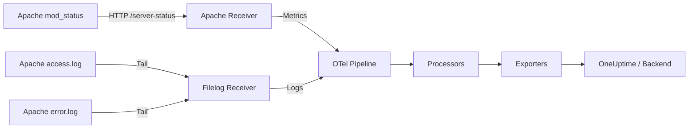

# How to Monitor Apache HTTP Server with the OpenTelemetry Collector

Author: [nawazdhandala](https://www.github.com/nawazdhandala)

Tags: OpenTelemetry, Collector, Apache, HTTP Server, Metrics, Logs, Web Server, Observability

Description: Learn how to monitor Apache HTTP Server with the OpenTelemetry Collector to collect server metrics, parse access and error logs, and track performance.

---

Apache HTTP Server has been powering websites since 1995 and still runs a significant portion of the web. Whether you are running it as a standalone web server, a reverse proxy, or part of a traditional LAMP stack, monitoring its health is fundamental to keeping your services available. The OpenTelemetry Collector offers two complementary approaches: the Apache receiver for scraping server status metrics, and the filelog receiver for collecting access and error logs. Together, they give you a complete picture of how Apache is performing.

## Enabling Apache mod_status

The Apache receiver relies on the `mod_status` module, which exposes server runtime information through a special URL. Most Apache installations include this module but may not have it enabled.

First, check if mod_status is loaded.

```bash
# Check loaded modules
apachectl -M | grep status

# You should see: status_module (shared)
```

If it is not loaded, enable it.

```bash
# On Debian/Ubuntu
sudo a2enmod status

# On RHEL/CentOS, ensure this line is in httpd.conf
# LoadModule status_module modules/mod_status.so

# Restart Apache
sudo systemctl restart apache2    # Debian/Ubuntu
sudo systemctl restart httpd      # RHEL/CentOS
```

Next, configure a status endpoint. Add this to your Apache configuration.

```apache
# In /etc/apache2/mods-enabled/status.conf or httpd.conf
<Location "/server-status">
    SetHandler server-status
    # Restrict access to localhost only
    Require ip 127.0.0.1 ::1
</Location>

# Enable extended status for detailed metrics
ExtendedStatus On
```

Verify the status page works.

```bash
# Test locally
curl -s http://localhost/server-status?auto
```

The `?auto` parameter returns machine-readable output that the receiver parses. You should see output with lines like `Total Accesses`, `Total kBytes`, `BusyWorkers`, and `IdleWorkers`.



## Basic Metrics Configuration

Here is a minimal setup to start collecting Apache server metrics.

```yaml
# Receivers section
receivers:
  # Apache receiver scrapes mod_status
  apache:
    # The server-status endpoint with auto format
    endpoint: http://localhost:80/server-status?auto
    # How often to collect metrics
    collection_interval: 15s

# Processors
processors:
  batch:
    timeout: 10s
    send_batch_size: 200

# Exporters
exporters:
  otlphttp:
    endpoint: https://oneuptime.com/otlp
    headers:
      x-oneuptime-token: ${ONEUPTIME_TOKEN}

# Wire it together
service:
  pipelines:
    metrics:
      receivers: [apache]
      processors: [batch]
      exporters: [otlphttp]
```

The Apache receiver connects to the mod_status endpoint on each collection interval and scrapes the machine-readable output. It converts the raw counters into OpenTelemetry metrics with proper types, so cumulative counters like total requests are marked as monotonic sums and point-in-time values like busy workers are gauges.

## What Metrics Are Collected

The Apache receiver produces the following metrics from mod_status.

**apache.uptime** tracks how long the server has been running in seconds. This is a gauge that resets to zero on restart, making it useful for detecting unexpected restarts.

**apache.current_connections** shows the number of active connections at the time of scraping. This helps you understand concurrent load.

**apache.workers** reports the count of busy and idle worker processes or threads. Workers are the heart of Apache's request handling. When busy workers approach your MaxRequestWorkers limit, new requests start queuing.

**apache.requests** is a cumulative counter of total requests served since the last restart. The rate of change over time gives you your requests-per-second throughput.

**apache.traffic** tracks total bytes served. Like requests, the rate of change gives you throughput in bytes per second.

**apache.scoreboard** provides a detailed breakdown of what each worker slot is doing: waiting, reading request, sending reply, keepalive, DNS lookup, closing, logging, gracefully finishing, or idle cleanup.

## Production Configuration with Resource Attributes

For production, add resource detection, environment tags, and retry logic.

```yaml
receivers:
  apache:
    endpoint: http://localhost:80/server-status?auto
    collection_interval: 15s
    # Timeout for scraping the status page
    timeout: 10s

    # Enable all available metrics
    metrics:
      apache.uptime:
        enabled: true
      apache.current_connections:
        enabled: true
      apache.workers:
        enabled: true
      apache.requests:
        enabled: true
      apache.traffic:
        enabled: true
      apache.scoreboard:
        enabled: true

processors:
  # Detect host information automatically
  resourcedetection:
    detectors: [system, env]
    timeout: 5s

  # Add context about this Apache instance
  attributes/apache:
    actions:
      - key: service.name
        value: "apache"
        action: insert
      - key: deployment.environment
        value: "production"
        action: insert
      - key: apache.server_name
        value: "web-01"
        action: insert

  batch:
    timeout: 10s
    send_batch_size: 500

exporters:
  otlphttp:
    endpoint: https://oneuptime.com/otlp
    headers:
      x-oneuptime-token: ${ONEUPTIME_TOKEN}
    compression: gzip
    retry_on_failure:
      enabled: true
      initial_interval: 5s
      max_interval: 30s
    sending_queue:
      enabled: true
      num_consumers: 5
      queue_size: 1000

service:
  pipelines:
    metrics:
      receivers: [apache]
      processors: [resourcedetection, attributes/apache, batch]
      exporters: [otlphttp]
```

The sending queue buffers metrics if the backend is temporarily unavailable, and the retry configuration handles transient network failures. This prevents data loss during short outages.

## Collecting Apache Access Logs

Metrics tell you the overall health. Logs tell you what is actually happening request by request. The filelog receiver can tail Apache access logs and parse them into structured attributes.

Apache's default access log format (the "combined" format) looks like this:

```
192.168.1.50 - john [10/Feb/2026:14:22:10 +0000] "GET /index.html HTTP/1.1" 200 5324 "https://example.com/" "Mozilla/5.0"
```

Here is how to collect and parse it.

```yaml
receivers:
  # Tail the Apache access log
  filelog/apache_access:
    include:
      - /var/log/apache2/access.log     # Debian/Ubuntu
      # - /var/log/httpd/access_log      # RHEL/CentOS
    start_at: end
    storage: file_storage

    operators:
      # Parse the combined log format
      - type: regex_parser
        regex: '^(?P<remote_addr>\S+) - (?P<remote_user>\S+) \[(?P<time_local>[^\]]+)\] "(?P<method>\S+) (?P<path>\S+) (?P<protocol>\S+)" (?P<status>\d+) (?P<bytes>\d+) "(?P<referer>[^"]*)" "(?P<user_agent>[^"]*)"'
        timestamp:
          parse_from: attributes.time_local
          layout: "%d/%b/%Y:%H:%M:%S %z"

      # Set severity based on HTTP status code
      - type: severity_parser
        parse_from: attributes.status
        mapping:
          info: "2\\d{2}"
          info2: "3\\d{2}"
          warn: "4\\d{2}"
          error: "5\\d{2}"

processors:
  resource/apache:
    attributes:
      - key: service.name
        value: "apache"
        action: upsert
      - key: log.type
        value: "access"
        action: upsert

  batch:
    timeout: 10s

exporters:
  otlphttp:
    endpoint: https://oneuptime.com/otlp
    headers:
      x-oneuptime-token: ${ONEUPTIME_TOKEN}

extensions:
  file_storage:
    directory: /var/lib/otel/storage

service:
  extensions: [file_storage]
  pipelines:
    logs/access:
      receivers: [filelog/apache_access]
      processors: [resource/apache, batch]
      exporters: [otlphttp]
```

The regex parser extracts each field from the combined log format into named attributes. Once parsed, you can query your logs by status code, request path, client IP, or user agent in your backend.

## Collecting Apache Error Logs

Apache error logs capture server-side problems: configuration errors, module failures, permission issues, and application crashes.

```yaml
receivers:
  filelog/apache_error:
    include:
      - /var/log/apache2/error.log       # Debian/Ubuntu
      # - /var/log/httpd/error_log        # RHEL/CentOS
    start_at: end
    storage: file_storage

    operators:
      # Parse Apache error log format
      # Format: [Day Mon DD HH:MM:SS.usec YYYY] [module:level] [pid N:tid N] [client IP:port] message
      - type: regex_parser
        regex: '^\[(?P<timestamp>[^\]]+)\] \[(?P<module>[^:]*):(?P<level>\w+)\] \[pid (?P<pid>\d+)(?::tid (?P<tid>\d+))?\](?: \[client (?P<client>[^\]]+)\])? (?P<message>.*)'
        timestamp:
          parse_from: attributes.timestamp
          layout: "%a %b %d %H:%M:%S.%f %Y"

      # Map Apache log levels to OTel severity
      - type: severity_parser
        parse_from: attributes.level
        mapping:
          trace: "trace1"
          debug: "debug"
          info: "info"
          warn: "warn"
          error: "error"
          error2: "crit"
          fatal: "alert"
          fatal2: "emerg"

processors:
  resource/apache:
    attributes:
      - key: service.name
        value: "apache"
        action: upsert
      - key: log.type
        value: "error"
        action: upsert

  batch:
    timeout: 10s

exporters:
  otlphttp:
    endpoint: https://oneuptime.com/otlp
    headers:
      x-oneuptime-token: ${ONEUPTIME_TOKEN}

extensions:
  file_storage:
    directory: /var/lib/otel/storage

service:
  extensions: [file_storage]
  pipelines:
    logs/error:
      receivers: [filelog/apache_error]
      processors: [resource/apache, batch]
      exporters: [otlphttp]
```

The error log parser extracts the module name (like `mpm_prefork`, `core`, `proxy`), the severity level, the process and thread IDs, the client IP when available, and the error message itself.

## Troubleshooting

If the Apache receiver is not collecting metrics, check these items.

First, verify mod_status is enabled and accessible.

```bash
# Test the status endpoint
curl -s http://localhost/server-status?auto

# If you get a 403, check the Require directive in your config
# If you get a 404, mod_status is not enabled
```

Second, make sure `ExtendedStatus On` is set. Without it, you get a reduced set of metrics.

Third, check that the Collector can reach the Apache status endpoint. If Apache listens on a non-standard port, update the endpoint URL accordingly.

For log collection issues, verify file permissions and paths. The Collector user needs read access to the log files.

```bash
# Check log paths and permissions
ls -la /var/log/apache2/
```

## Summary

Apache HTTP Server monitoring with the OpenTelemetry Collector combines two powerful approaches: the Apache receiver for real-time server metrics from mod_status, and the filelog receiver for structured access and error log collection. Together, they give you worker utilization, request throughput, error rates, and individual request details flowing through a single telemetry pipeline.

Enable mod_status with ExtendedStatus for full metrics. Parse access logs to get structured request data. Parse error logs to catch server-side problems early. Filter out noise, tag everything with environment context, and use file storage to handle Collector restarts gracefully.

OneUptime provides native OpenTelemetry support with dashboards, log search, and alerting that make it straightforward to build a complete Apache monitoring solution without bolting together multiple tools.
