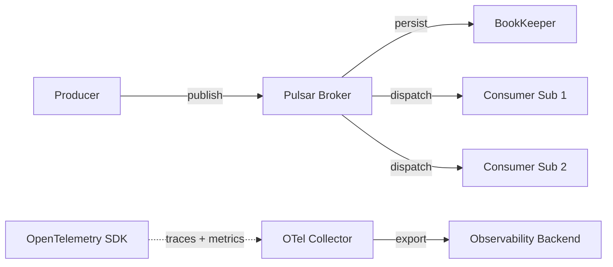

# How to Monitor Apache Pulsar with OpenTelemetry

Author: [nawazdhandala](https://www.github.com/nawazdhandala)

Tags: OpenTelemetry, Apache Pulsar, Distributed Tracing, Messaging, Observability, Java, Metrics

Description: Learn how to instrument Apache Pulsar producers and consumers with OpenTelemetry for distributed tracing and metrics collection across your messaging infrastructure.

---

Apache Pulsar is a multi-tenant, high-performance messaging platform that combines the best ideas from traditional message queues and pub/sub systems. It supports topics, subscriptions, multi-tenancy, geo-replication, and tiered storage. With all that complexity, understanding what is happening inside your Pulsar-based system requires proper instrumentation.

OpenTelemetry provides the tools to trace messages through Pulsar topics, collect performance metrics from producers and consumers, and connect Pulsar message flows to the rest of your distributed traces. This guide walks through the practical steps to get full observability into your Pulsar deployment.

## Pulsar Architecture and Observability Challenges

Pulsar separates the serving layer (brokers) from the storage layer (BookKeeper). Messages published to a topic are handled by a broker, written to BookKeeper for persistence, and then delivered to consumers. This separation creates multiple points where latency can appear and messages can get stuck.



The key observability challenges with Pulsar include:

- Tracing messages across tenants and namespaces
- Measuring publish-to-consume latency
- Tracking subscription backlog growth
- Connecting Pulsar spans to upstream and downstream service spans

## Enabling Built-in OpenTelemetry Support

Starting with version 2.11, the Pulsar Java client includes built-in OpenTelemetry instrumentation. This is the easiest path to getting traces and metrics from your Pulsar applications.

Configure the Pulsar client with an OpenTelemetry instance:

```java
import io.opentelemetry.api.OpenTelemetry;
import io.opentelemetry.sdk.OpenTelemetrySdk;
import io.opentelemetry.sdk.trace.SdkTracerProvider;
import io.opentelemetry.sdk.trace.export.BatchSpanProcessor;
import io.opentelemetry.exporter.otlp.trace.OtlpGrpcSpanExporter;
import io.opentelemetry.sdk.resources.Resource;
import io.opentelemetry.semconv.ResourceAttributes;
import org.apache.pulsar.client.api.*;

// Build the OpenTelemetry SDK
Resource resource = Resource.getDefault().merge(
    Resource.create(io.opentelemetry.api.common.Attributes.of(
        ResourceAttributes.SERVICE_NAME, "order-service"
    ))
);

SdkTracerProvider tracerProvider = SdkTracerProvider.builder()
    .addSpanProcessor(BatchSpanProcessor.builder(
        OtlpGrpcSpanExporter.builder()
            .setEndpoint("http://localhost:4317")
            .build()
    ).build())
    .setResource(resource)
    .build();

OpenTelemetry openTelemetry = OpenTelemetrySdk.builder()
    .setTracerProvider(tracerProvider)
    .buildAndFinishConfiguration();

// Create the Pulsar client with OpenTelemetry integration
PulsarClient client = PulsarClient.builder()
    .serviceUrl("pulsar://localhost:6650")
    // Pass the OpenTelemetry instance to the Pulsar client
    .openTelemetry(openTelemetry)
    .build();
```

The `openTelemetry()` method on the client builder tells the Pulsar client to use your configured OpenTelemetry SDK for all tracing and metrics. This single line enables instrumentation across every producer and consumer created from this client.

## Tracing Producers

Once the client is configured, every message sent through a producer will automatically generate a PRODUCER span:

```java
// Create a producer for the order-events topic
Producer<String> producer = client.newProducer(Schema.STRING)
    .topic("persistent://public/default/order-events")
    .producerName("order-producer")
    .create();

// Send a message
// The Pulsar client automatically creates a PRODUCER span with:
// - messaging.system = pulsar
// - messaging.destination.name = order-events
// - messaging.destination.tenant = public
// - messaging.destination.namespace = public/default
MessageId messageId = producer.newMessage()
    .key("order-123")
    .value("{\"action\": \"created\", \"amount\": 149.99}")
    .send();

System.out.println("Published message: " + messageId);
```

The auto-generated span includes Pulsar-specific attributes like the topic name, tenant, namespace, and the message ID assigned by the broker. If you need to add custom attributes, you can access the current span from the OpenTelemetry context:

```java
import io.opentelemetry.api.trace.Span;

// Access the current span to add custom attributes
Span currentSpan = Span.current();
currentSpan.setAttribute("order.id", "order-123");
currentSpan.setAttribute("order.priority", "high");

// Then send the message as usual
producer.newMessage()
    .key("order-123")
    .value(orderJson)
    .send();
```

## Tracing Consumers

The consumer side automatically extracts trace context from incoming messages. Each consumed message creates a CONSUMER span linked to the original producer span:

```java
// Create a consumer with a subscription
Consumer<String> consumer = client.newConsumer(Schema.STRING)
    .topic("persistent://public/default/order-events")
    .subscriptionName("order-processing")
    .subscriptionType(SubscriptionType.Shared)
    .subscribe();

// Receive and process messages
while (true) {
    // receive() returns a message with trace context already extracted
    Message<String> msg = consumer.receive();

    try {
        // The current span context is set to the consumer span
        // Any operations you perform here are traced under the consumer span
        processOrder(msg.getValue());

        // Acknowledge the message
        consumer.acknowledge(msg);
    } catch (Exception e) {
        // Negative acknowledgment triggers redelivery
        consumer.negativeAcknowledge(msg);
    }
}
```

For async consumption patterns, the trace context is also propagated through message listeners:

```java
// Async consumer with message listener
Consumer<String> consumer = client.newConsumer(Schema.STRING)
    .topic("persistent://public/default/order-events")
    .subscriptionName("order-analytics")
    .subscriptionType(SubscriptionType.Shared)
    .messageListener((messageConsumer, msg) -> {
        // Trace context is available here too
        // The listener runs within the context of the consumer span
        try {
            analyzeOrder(msg.getValue());
            messageConsumer.acknowledge(msg);
        } catch (Exception e) {
            messageConsumer.negativeAcknowledge(msg);
        }
    })
    .subscribe();
```

## Collecting Pulsar Metrics

Beyond tracing, the Pulsar client with OpenTelemetry also exposes metrics. These include producer and consumer level metrics that give you a quantitative view of your messaging performance.

Key metrics exposed by the Pulsar client:

```yaml
# Producer metrics captured by OpenTelemetry
# pulsar.client.producer.message.send.duration - Histogram of send latencies
# pulsar.client.producer.message.send.size - Size of published messages
# pulsar.client.producer.message.pending.count - Messages waiting to be sent

# Consumer metrics captured by OpenTelemetry
# pulsar.client.consumer.message.receive.count - Total messages received
# pulsar.client.consumer.message.ack.count - Total messages acknowledged
# pulsar.client.consumer.message.nack.count - Total negative acknowledgments
# pulsar.client.consumer.receive.queue.size - Consumer receive queue depth
```

To collect these metrics, add a metrics exporter to your OpenTelemetry SDK configuration:

```java
import io.opentelemetry.sdk.metrics.SdkMeterProvider;
import io.opentelemetry.sdk.metrics.export.PeriodicMetricReader;
import io.opentelemetry.exporter.otlp.metrics.OtlpGrpcMetricExporter;

// Configure metrics export alongside tracing
SdkMeterProvider meterProvider = SdkMeterProvider.builder()
    .setResource(resource)
    .registerMetricReader(
        PeriodicMetricReader.builder(
            OtlpGrpcMetricExporter.builder()
                .setEndpoint("http://localhost:4317")
                .build()
        )
        // Export metrics every 30 seconds
        .setInterval(Duration.ofSeconds(30))
        .build()
    )
    .build();

// Include the meter provider in the OpenTelemetry SDK
OpenTelemetry openTelemetry = OpenTelemetrySdk.builder()
    .setTracerProvider(tracerProvider)
    .setMeterProvider(meterProvider)
    .buildAndFinishConfiguration();

// Pass to the Pulsar client as before
PulsarClient client = PulsarClient.builder()
    .serviceUrl("pulsar://localhost:6650")
    .openTelemetry(openTelemetry)
    .build();
```

## Monitoring Pulsar Brokers

The Pulsar client instrumentation covers the application side. For broker-level metrics, Pulsar exposes Prometheus metrics that you can scrape with the OpenTelemetry Collector:

```yaml
# Collector configuration for scraping Pulsar broker metrics
receivers:
  otlp:
    protocols:
      grpc:
        endpoint: 0.0.0.0:4317
  prometheus:
    config:
      scrape_configs:
        - job_name: "pulsar-brokers"
          # Scrape metrics from Pulsar broker endpoints
          scrape_interval: 15s
          static_configs:
            - targets:
              - "pulsar-broker-1:8080"
              - "pulsar-broker-2:8080"
          metrics_path: "/metrics"

processors:
  batch:
    timeout: 10s

exporters:
  otlp:
    endpoint: https://oneuptime.example.com:4317

service:
  pipelines:
    traces:
      receivers: [otlp]
      processors: [batch]
      exporters: [otlp]
    metrics:
      receivers: [otlp, prometheus]
      processors: [batch]
      exporters: [otlp]
```

This gives you broker-level metrics like topic throughput, subscription backlog, storage usage, and broker CPU and memory utilization. Combined with client-side traces and metrics, you get a complete picture of your Pulsar deployment.

## Multi-Topic Tracing

Pulsar applications often involve message chains where one consumer publishes to another topic. To maintain trace continuity across these chains, make sure the consuming context is propagated when producing the next message:

```java
// Consumer that processes a message and publishes to another topic
Consumer<String> orderConsumer = client.newConsumer(Schema.STRING)
    .topic("persistent://public/default/order-events")
    .subscriptionName("shipping-enrichment")
    .subscribe();

Producer<String> shippingProducer = client.newProducer(Schema.STRING)
    .topic("persistent://public/default/shipping-events")
    .create();

while (true) {
    Message<String> orderMsg = orderConsumer.receive();
    try {
        // Process the order and create a shipping event
        String shippingEvent = createShippingEvent(orderMsg.getValue());

        // The Pulsar client propagates the trace context from the consumed
        // message to the produced message automatically, since the current
        // span context is set by the consumer
        shippingProducer.newMessage()
            .key(orderMsg.getKey())
            .value(shippingEvent)
            .send();

        orderConsumer.acknowledge(orderMsg);
    } catch (Exception e) {
        orderConsumer.negativeAcknowledge(orderMsg);
    }
}
```

Because the Pulsar client sets the span context when you receive a message, any subsequent publish operation within that processing context automatically becomes a child of the consumer span. This creates a chain: original producer to order consumer to shipping producer, all connected in one trace.

## Handling High-Throughput Scenarios

Pulsar can handle millions of messages per second. At that scale, tracing every single message generates an enormous amount of data. Use sampling to control the volume:

```java
import io.opentelemetry.sdk.trace.samplers.Sampler;

// Sample 10% of traces for high-throughput topics
SdkTracerProvider tracerProvider = SdkTracerProvider.builder()
    .setSampler(Sampler.traceIdRatioBased(0.1))
    .addSpanProcessor(BatchSpanProcessor.builder(exporter).build())
    .setResource(resource)
    .build();
```

For topics with lower throughput but higher business importance, you might want 100% sampling. You can configure different sampling rates per topic by using a custom sampler that inspects the span attributes.

Apache Pulsar with OpenTelemetry gives you the tracing and metrics foundation you need to operate a complex messaging platform with confidence. From individual message traces to aggregate broker metrics, the combination provides visibility at every level of your Pulsar deployment.
