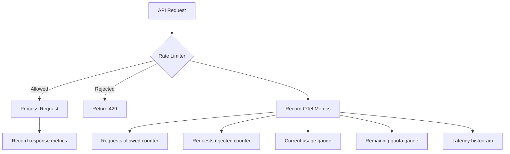
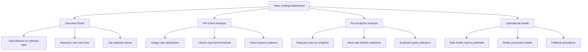

# How to Monitor API Rate Limiting with OpenTelemetry Custom Metrics

Author: [nawazdhandala](https://www.github.com/nawazdhandala)

Tags: OpenTelemetry, API, Rate Limiting, Custom Metrics, Observability, Monitoring

Description: A hands-on guide to monitoring API rate limiting effectiveness using OpenTelemetry custom metrics, counters, and histograms.

---

Rate limiting is one of those things that's easy to implement but hard to monitor well. You set up a limiter, configure your thresholds, and move on. But without proper observability, you won't know if your limits are too aggressive (blocking legitimate users), too lenient (not actually protecting your service), or just right. You need metrics to answer these questions.

In this guide, we'll build comprehensive rate limiting monitoring using OpenTelemetry custom metrics. You'll learn how to track request counts against limits, measure rejection rates, monitor per-client usage, and alert on anomalies. All with real code examples you can adapt to your own services.

## Why Custom Metrics for Rate Limiting?

Standard HTTP metrics like request count and status codes give you a partial picture. You can count 429 responses and call it a day. But that doesn't tell you how close clients are to their limits, which rate limit policies are triggering most often, or whether your limits are correctly sized for your traffic patterns.

OpenTelemetry custom metrics let you capture exactly what you need.



## Setting Up OpenTelemetry Metrics

Let's start with the foundational setup. We'll create a metrics provider and define the instruments we need for rate limit monitoring.

This setup configures the OpenTelemetry SDK with periodic metric export to a collector.

```python
# otel_metrics_setup.py
# Configure OpenTelemetry metrics for rate limiting monitoring
from opentelemetry import metrics
from opentelemetry.sdk.metrics import MeterProvider
from opentelemetry.sdk.metrics.export import PeriodicExportingMetricReader
from opentelemetry.exporter.otlp.proto.grpc.metric_exporter import OTLPMetricExporter
from opentelemetry.sdk.resources import Resource

# Identify this service in your observability backend
resource = Resource.create({
    "service.name": "api-gateway",
    "service.version": "3.2.0",
    "deployment.environment": "production",
})

# Set up OTLP export to the collector every 30 seconds
exporter = OTLPMetricExporter(
    endpoint="otel-collector:4317",
    insecure=True
)
reader = PeriodicExportingMetricReader(
    exporter,
    # Export metrics every 30 seconds
    export_interval_millis=30000
)

# Initialize the meter provider
provider = MeterProvider(resource=resource, metric_readers=[reader])
metrics.set_meter_provider(provider)

# Create a meter for rate limiting metrics
meter = metrics.get_meter("api.rate_limiting", version="1.0.0")
```

## Defining Rate Limit Metrics

Now let's define the specific metric instruments. We need counters for tracking allowed and rejected requests, gauges for current state, and histograms for latency impact.

These instruments capture different dimensions of rate limiting behavior.

```python
# rate_limit_metrics.py
# Define all the metric instruments for rate limiting monitoring
from opentelemetry import metrics

meter = metrics.get_meter("api.rate_limiting")

# Counter: Total requests that were allowed through the rate limiter
requests_allowed = meter.create_counter(
    name="rate_limit.requests.allowed",
    description="Number of requests that passed the rate limiter",
    unit="requests"
)

# Counter: Total requests rejected by the rate limiter
requests_rejected = meter.create_counter(
    name="rate_limit.requests.rejected",
    description="Number of requests blocked by the rate limiter",
    unit="requests"
)

# Histogram: How close clients are to their rate limit (0.0 to 1.0)
# This is the most useful metric for capacity planning
usage_ratio = meter.create_histogram(
    name="rate_limit.usage_ratio",
    description="Ratio of used quota to total quota (0.0 = no usage, 1.0 = at limit)",
    unit="ratio"
)

# Gauge: Current number of requests in the rate limit window per client
# Uses an observable gauge with a callback for real-time values
current_window_usage = meter.create_gauge(
    name="rate_limit.window.current_usage",
    description="Current request count within the rate limit window",
    unit="requests"
)

# Histogram: Additional latency introduced by the rate limiter itself
# Helps detect when the rate limiter becomes a bottleneck
limiter_latency = meter.create_histogram(
    name="rate_limit.check_latency",
    description="Time taken to evaluate rate limit decision",
    unit="ms"
)

# Counter: Track rate limit policy changes (for audit/correlation)
policy_changes = meter.create_counter(
    name="rate_limit.policy.changes",
    description="Number of times rate limit policies were updated",
    unit="changes"
)
```

## Instrumenting the Rate Limiter

Here's where it all comes together. We'll wrap a token bucket rate limiter with OpenTelemetry instrumentation. This example uses a Redis-backed limiter, which is common in production API gateways.

This class wraps rate limiting logic with comprehensive metric recording.

```python
# instrumented_rate_limiter.py
# Rate limiter with built-in OpenTelemetry metrics
import time
import redis
from opentelemetry import metrics

meter = metrics.get_meter("api.rate_limiting")

# Define metric instruments
requests_allowed = meter.create_counter("rate_limit.requests.allowed", unit="requests")
requests_rejected = meter.create_counter("rate_limit.requests.rejected", unit="requests")
usage_ratio_histogram = meter.create_histogram("rate_limit.usage_ratio", unit="ratio")
limiter_latency = meter.create_histogram("rate_limit.check_latency", unit="ms")
current_usage_gauge = meter.create_gauge("rate_limit.window.current_usage", unit="requests")


class InstrumentedRateLimiter:
    """Token bucket rate limiter with OpenTelemetry metrics."""

    def __init__(self, redis_client, default_limit=100, window_seconds=60):
        self.redis = redis_client
        self.default_limit = default_limit
        self.window_seconds = window_seconds

    def check_rate_limit(self, client_id, endpoint, limit=None):
        """Check if a request should be allowed and record metrics.

        Args:
            client_id: Unique identifier for the client (API key, IP, etc.)
            endpoint: The API endpoint being accessed
            limit: Optional custom limit for this client/endpoint pair
        Returns:
            Tuple of (allowed: bool, remaining: int, reset_time: int)
        """
        effective_limit = limit or self.default_limit
        start_time = time.monotonic()

        # Common attributes for all metrics from this check
        metric_attrs = {
            "client.id": client_id,
            "api.endpoint": endpoint,
            "rate_limit.policy": f"{effective_limit}_per_{self.window_seconds}s",
        }

        try:
            # Use Redis to track the sliding window counter
            key = f"ratelimit:{client_id}:{endpoint}"
            now = time.time()
            window_start = now - self.window_seconds

            # Redis pipeline for atomic operations
            pipe = self.redis.pipeline()
            # Remove expired entries outside the current window
            pipe.zremrangebyscore(key, 0, window_start)
            # Count current requests in the window
            pipe.zcard(key)
            # Add this request with the current timestamp as score
            pipe.zadd(key, {str(now): now})
            # Set expiry on the key so it auto-cleans
            pipe.expire(key, self.window_seconds)
            results = pipe.execute()

            current_count = results[1]  # zcard result
            remaining = max(0, effective_limit - current_count - 1)
            reset_time = int(now + self.window_seconds)

            # Calculate and record the usage ratio
            ratio = current_count / effective_limit
            usage_ratio_histogram.record(ratio, metric_attrs)

            # Record current window usage as a gauge
            current_usage_gauge.set(current_count, metric_attrs)

            if current_count >= effective_limit:
                # Request is rejected
                requests_rejected.add(1, {
                    **metric_attrs,
                    "rejection.reason": "quota_exceeded",
                })
                # Remove the request we just added since it's rejected
                self.redis.zrem(key, str(now))
                return False, 0, reset_time
            else:
                # Request is allowed
                requests_allowed.add(1, metric_attrs)
                return True, remaining, reset_time

        except redis.RedisError as e:
            # If Redis is down, fail open but record it
            requests_allowed.add(1, {
                **metric_attrs,
                "rate_limit.fallback": "redis_unavailable",
            })
            return True, -1, 0

        finally:
            # Always record the latency of the rate limit check itself
            elapsed_ms = (time.monotonic() - start_time) * 1000
            limiter_latency.record(elapsed_ms, metric_attrs)
```

## Integrating with a Web Framework

Here's how to plug the instrumented rate limiter into a FastAPI application as middleware.

This middleware runs on every request and records rate limit metrics before the handler executes.

```python
# middleware.py
# FastAPI middleware that applies instrumented rate limiting
from fastapi import FastAPI, Request, Response
from starlette.middleware.base import BaseHTTPMiddleware
import redis

from instrumented_rate_limiter import InstrumentedRateLimiter

app = FastAPI()

# Initialize the rate limiter with Redis
redis_client = redis.Redis(host="localhost", port=6379, db=0)
rate_limiter = InstrumentedRateLimiter(
    redis_client=redis_client,
    default_limit=100,
    window_seconds=60
)

# Per-endpoint rate limit overrides
ENDPOINT_LIMITS = {
    "/v1/search": 20,        # Search is expensive, lower limit
    "/v1/users": 100,        # Standard CRUD
    "/v1/health": 1000,      # Health checks need a high limit
    "/v1/upload": 10,         # File uploads are very expensive
}


class RateLimitMiddleware(BaseHTTPMiddleware):
    async def dispatch(self, request: Request, call_next):
        # Extract client identifier from API key header or fall back to IP
        client_id = request.headers.get("X-API-Key", request.client.host)
        endpoint = request.url.path

        # Look up endpoint-specific limit or use default
        limit = ENDPOINT_LIMITS.get(endpoint)

        # Check the rate limit (this records all the OTel metrics)
        allowed, remaining, reset_time = rate_limiter.check_rate_limit(
            client_id=client_id,
            endpoint=endpoint,
            limit=limit
        )

        if not allowed:
            # Return 429 with standard rate limit headers
            return Response(
                content='{"error": "Rate limit exceeded"}',
                status_code=429,
                headers={
                    "Retry-After": str(reset_time),
                    "X-RateLimit-Limit": str(limit or rate_limiter.default_limit),
                    "X-RateLimit-Remaining": "0",
                    "X-RateLimit-Reset": str(reset_time),
                    "Content-Type": "application/json",
                }
            )

        # Request is allowed, proceed to the handler
        response = await call_next(request)

        # Add rate limit headers to successful responses too
        response.headers["X-RateLimit-Limit"] = str(limit or rate_limiter.default_limit)
        response.headers["X-RateLimit-Remaining"] = str(remaining)
        response.headers["X-RateLimit-Reset"] = str(reset_time)

        return response

# Register the middleware
app.add_middleware(RateLimitMiddleware)


@app.get("/v1/users/{user_id}")
async def get_user(user_id: str):
    return {"user_id": user_id, "name": "Example User"}

@app.get("/v1/search")
async def search(q: str):
    return {"query": q, "results": []}
```

## OpenTelemetry Collector Configuration

Configure the collector to receive these metrics and prepare them for your backend. The collector can also derive additional metrics using its built-in processors.

```yaml
# otel-collector-config.yaml
# Collector config for rate limiting metrics pipeline
receivers:
  otlp:
    protocols:
      grpc:
        endpoint: 0.0.0.0:4317
      http:
        endpoint: 0.0.0.0:4318

processors:
  # Batch metrics for efficient export
  batch:
    timeout: 30s
    send_batch_size: 256

  # Add deployment metadata
  resource:
    attributes:
      - key: deployment.environment
        value: production
        action: upsert

  # Filter out health check endpoint metrics to reduce cardinality
  filter:
    metrics:
      datapoint:
        - 'attributes["api.endpoint"] == "/v1/health"'

  # Group metrics by client to make per-client dashboards efficient
  groupbyattrs:
    keys:
      - client.id
      - api.endpoint

exporters:
  otlp:
    endpoint: "your-backend:4317"
    tls:
      insecure: false

service:
  pipelines:
    metrics:
      receivers: [otlp]
      processors: [filter, resource, groupbyattrs, batch]
      exporters: [otlp]
```

## Building a Rate Limiting Dashboard

With metrics flowing, here's what your monitoring dashboard should look like. These panels help you answer the key questions about rate limiting effectiveness.



The most actionable panel is the **usage ratio distribution**. If you plot a histogram of `rate_limit.usage_ratio` values, you'll see a clear picture of your capacity. A healthy distribution has most clients in the 0.0-0.3 range, a few in the 0.5-0.8 range, and very few at 0.9+. If the distribution shifts to the right over time, you might need to increase your limits or add more capacity.

## Setting Up Alerts

Here are the alerts that catch real problems without generating too much noise.

```yaml
# alert-rules.yaml
# Rate limiting alerts based on OpenTelemetry custom metrics
groups:
  - name: rate_limiting_alerts
    rules:
      # High rejection rate suggests limits may be too aggressive
      - alert: HighRateLimitRejectionRate
        expr: |
          sum(rate(rate_limit_requests_rejected_total[5m]))
          / (sum(rate(rate_limit_requests_allowed_total[5m]))
          + sum(rate(rate_limit_requests_rejected_total[5m]))) > 0.1
        for: 5m
        labels:
          severity: warning
        annotations:
          summary: "Rate limit rejection rate exceeds 10%"
          description: "More than 10% of requests are being rejected. Review if limits are appropriate."

      # Single client hitting limits repeatedly might indicate a bug or abuse
      - alert: ClientConsistentlyRateLimited
        expr: |
          sum by (client_id) (rate(rate_limit_requests_rejected_total[15m])) > 50
        for: 15m
        labels:
          severity: info
        annotations:
          summary: "Client {{ $labels.client_id }} is consistently being rate limited"

      # Rate limiter latency spike could mean Redis issues
      - alert: RateLimiterLatencyHigh
        expr: |
          histogram_quantile(0.99, rate(rate_limit_check_latency_bucket[5m])) > 50
        for: 2m
        labels:
          severity: critical
        annotations:
          summary: "Rate limiter check latency p99 exceeds 50ms"
          description: "The rate limiter is adding significant latency. Check Redis health."

      # Fallback activations mean Redis is unavailable
      - alert: RateLimiterFallbackActive
        expr: |
          sum(rate(rate_limit_requests_allowed_total{rate_limit_fallback="redis_unavailable"}[5m])) > 0
        for: 1m
        labels:
          severity: critical
        annotations:
          summary: "Rate limiter is operating in fallback mode"
          description: "Redis is unavailable. Rate limiting is not being enforced."
```

## Advanced: Tracking Rate Limit Headroom

One useful metric that many teams overlook is headroom tracking. This tells you how much spare capacity each client has relative to their limit. It helps with capacity planning and identifying clients that might need higher limits.

This function periodically scans all active rate limit keys and reports their headroom.

```python
# headroom_monitor.py
# Periodically report rate limit headroom for capacity planning
import time
import redis
from opentelemetry import metrics

meter = metrics.get_meter("api.rate_limiting")

# Histogram showing the distribution of remaining quota across all clients
headroom_histogram = meter.create_histogram(
    name="rate_limit.headroom",
    description="Remaining requests in quota window per client",
    unit="requests"
)

# Gauge for the total number of active rate limit windows
active_windows = meter.create_gauge(
    name="rate_limit.active_windows",
    description="Number of clients with active rate limit windows",
    unit="windows"
)


def report_headroom(redis_client, default_limit=100, window_seconds=60):
    """Scan all active rate limit keys and report headroom metrics."""
    now = time.time()
    window_start = now - window_seconds
    active_count = 0

    # Scan for all rate limit keys in Redis
    for key in redis_client.scan_iter(match="ratelimit:*"):
        # Count requests in the current window
        current = redis_client.zcount(key, window_start, now)
        remaining = max(0, default_limit - current)

        # Parse the client ID and endpoint from the key
        parts = key.decode().split(":")
        if len(parts) >= 3:
            client_id = parts[1]
            endpoint = parts[2]

            headroom_histogram.record(remaining, {
                "client.id": client_id,
                "api.endpoint": endpoint,
            })
            active_count += 1

    # Report total number of active windows
    active_windows.set(active_count)


if __name__ == "__main__":
    r = redis.Redis(host="localhost", port=6379, db=0)
    # Run headroom report every 60 seconds
    while True:
        report_headroom(r)
        time.sleep(60)
```

## Wrapping Up

Monitoring rate limiting with OpenTelemetry custom metrics gives you answers that HTTP status codes alone never will. You can see which clients are approaching their limits, which endpoints are under the most pressure, and whether your rate limiter itself is adding latency.

The key metrics to focus on are the usage ratio (how close clients are to their limits), the rejection rate (how often limits are actually enforced), and the limiter latency (whether the rate limiting mechanism is a bottleneck). Together, these tell you if your rate limits are correctly calibrated and working as intended.

Start with the basic counters for allowed and rejected requests, then add the usage ratio histogram and headroom monitor as your needs grow. The setup we've covered here works with any rate limiting implementation, whether it's Redis-based, in-memory, or backed by a dedicated rate limiting service. The OpenTelemetry instrumentation layer stays the same regardless of the underlying implementation.
