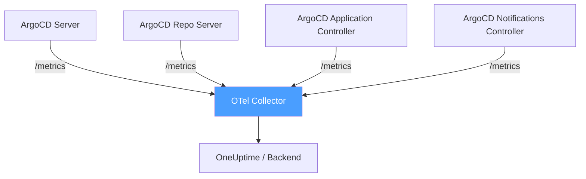
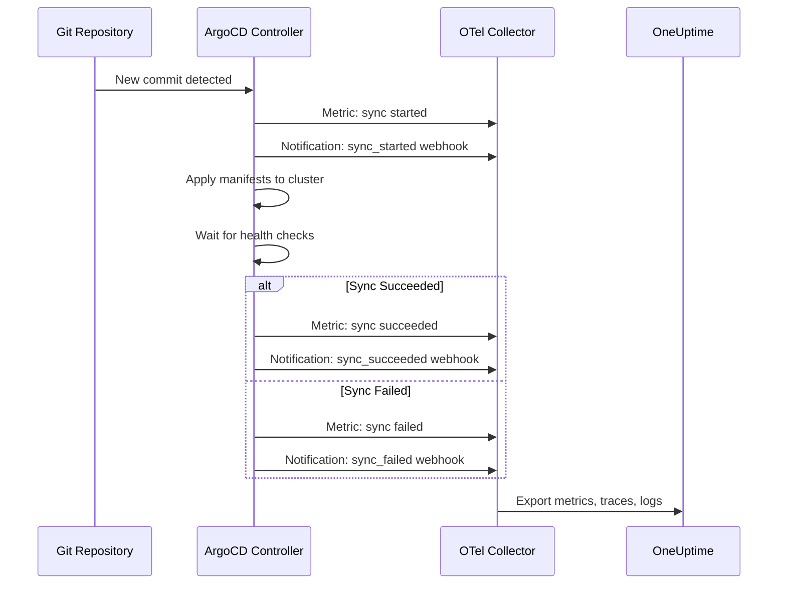

# How to Monitor ArgoCD Deployments with OpenTelemetry

Author: [nawazdhandala](https://www.github.com/nawazdhandala)

Tags: OpenTelemetry, ArgoCD, Kubernetes, GitOps, Deployments, Observability

Description: Learn how to monitor ArgoCD deployment pipelines, sync operations, and application health using OpenTelemetry for complete GitOps observability.

---

ArgoCD is the most popular GitOps tool for Kubernetes. It watches your Git repositories and ensures your cluster state matches your desired configuration. But when a deployment fails or takes too long, you need visibility into what went wrong and where.

OpenTelemetry gives you that visibility. By collecting metrics, traces, and logs from ArgoCD, you can monitor sync operations, track deployment durations, detect drift, and correlate deployment events with application performance changes.

This guide shows you how to set up comprehensive ArgoCD monitoring using OpenTelemetry.

## What ArgoCD Exposes

ArgoCD ships with a built-in metrics endpoint that exposes Prometheus-format metrics. These cover application sync status, health checks, repository operations, and controller performance.

The key metrics you want to capture include:

- `argocd_app_info` - application metadata including sync status and health
- `argocd_app_sync_total` - count of sync operations with success/failure status
- `argocd_app_reconcile_duration` - how long reconciliation takes
- `argocd_repo_pending_request_total` - Git repository request queue depth
- `argocd_cluster_api_resource_objects` - number of resources managed per cluster



## Configuring the OpenTelemetry Collector

The OpenTelemetry Collector's Prometheus receiver can scrape ArgoCD's metrics endpoints directly. Here is a collector configuration that captures all ArgoCD components.

```yaml
# OpenTelemetry Collector config for ArgoCD monitoring
apiVersion: opentelemetry.io/v1beta1
kind: OpenTelemetryCollector
metadata:
  name: argocd-monitor
  namespace: argocd
spec:
  mode: deployment
  config:
    receivers:
      # Scrape Prometheus metrics from all ArgoCD components
      prometheus:
        config:
          scrape_configs:
            # ArgoCD Server - handles the UI and API
            - job_name: 'argocd-server'
              scrape_interval: 30s
              kubernetes_sd_configs:
                - role: pod
                  namespaces:
                    names: ['argocd']
              relabel_configs:
                - source_labels: [__meta_kubernetes_pod_label_app_kubernetes_io_name]
                  action: keep
                  regex: argocd-server
                - source_labels: [__meta_kubernetes_pod_name]
                  target_label: pod
                - source_labels: [__address__]
                  action: replace
                  regex: (.+):.*
                  replacement: $1:8083
                  target_label: __address__

            # Application Controller - reconciles desired vs actual state
            - job_name: 'argocd-application-controller'
              scrape_interval: 30s
              kubernetes_sd_configs:
                - role: pod
                  namespaces:
                    names: ['argocd']
              relabel_configs:
                - source_labels: [__meta_kubernetes_pod_label_app_kubernetes_io_name]
                  action: keep
                  regex: argocd-application-controller
                - source_labels: [__meta_kubernetes_pod_name]
                  target_label: pod
                - source_labels: [__address__]
                  action: replace
                  regex: (.+):.*
                  replacement: $1:8082
                  target_label: __address__

            # Repo Server - handles Git operations
            - job_name: 'argocd-repo-server'
              scrape_interval: 30s
              kubernetes_sd_configs:
                - role: pod
                  namespaces:
                    names: ['argocd']
              relabel_configs:
                - source_labels: [__meta_kubernetes_pod_label_app_kubernetes_io_name]
                  action: keep
                  regex: argocd-repo-server
                - source_labels: [__meta_kubernetes_pod_name]
                  target_label: pod
                - source_labels: [__address__]
                  action: replace
                  regex: (.+):.*
                  replacement: $1:8084
                  target_label: __address__

    processors:
      batch:
        send_batch_size: 1024
        timeout: 10s

      # Add cluster identification
      resource:
        attributes:
          - key: k8s.cluster.name
            value: "production"
            action: upsert

    exporters:
      otlp:
        endpoint: "https://oneuptime-ingest.example.com:4317"
        headers:
          Authorization: "Bearer ${ONEUPTIME_API_KEY}"

    service:
      pipelines:
        metrics:
          receivers: [prometheus]
          processors: [batch, resource]
          exporters: [otlp]
```

## Tracking Deployment Events as Traces

Metrics tell you that something happened. Traces tell you the story of how it happened. ArgoCD does not natively emit OpenTelemetry traces, but you can generate trace data from ArgoCD events using notifications and a custom webhook receiver.

ArgoCD has a notifications system that can trigger on sync events. We can send these to a small service that converts them into OpenTelemetry spans.

First, configure ArgoCD notifications to send webhook events.

```yaml
# ArgoCD notification trigger configuration
# Add this to the argocd-notifications-cm ConfigMap
apiVersion: v1
kind: ConfigMap
metadata:
  name: argocd-notifications-cm
  namespace: argocd
data:
  # Define the webhook service that receives deployment events
  service.webhook.otel-bridge: |
    url: http://argocd-otel-bridge.argocd.svc.cluster.local:8080/deployment
    headers:
      - name: Content-Type
        value: application/json

  # Trigger on sync status changes
  trigger.on-sync-running: |
    - when: app.status.operationState.phase in ['Running']
      send: [deployment-started]

  trigger.on-sync-succeeded: |
    - when: app.status.operationState.phase in ['Succeeded']
      send: [deployment-completed]

  trigger.on-sync-failed: |
    - when: app.status.operationState.phase in ['Error', 'Failed']
      send: [deployment-failed]

  # Templates define the payload sent to the webhook
  template.deployment-started: |
    webhook:
      otel-bridge:
        method: POST
        body: |
          {
            "event": "sync_started",
            "app": "{{.app.metadata.name}}",
            "namespace": "{{.app.spec.destination.namespace}}",
            "revision": "{{.app.status.operationState.syncResult.revision}}",
            "timestamp": "{{.app.status.operationState.startedAt}}"
          }

  template.deployment-completed: |
    webhook:
      otel-bridge:
        method: POST
        body: |
          {
            "event": "sync_succeeded",
            "app": "{{.app.metadata.name}}",
            "namespace": "{{.app.spec.destination.namespace}}",
            "revision": "{{.app.status.operationState.syncResult.revision}}",
            "timestamp": "{{.app.status.operationState.finishedAt}}"
          }

  template.deployment-failed: |
    webhook:
      otel-bridge:
        method: POST
        body: |
          {
            "event": "sync_failed",
            "app": "{{.app.metadata.name}}",
            "namespace": "{{.app.spec.destination.namespace}}",
            "revision": "{{.app.status.operationState.syncResult.revision}}",
            "message": "{{.app.status.operationState.message}}",
            "timestamp": "{{.app.status.operationState.finishedAt}}"
          }
```

Now annotate your ArgoCD applications to subscribe to these triggers.

```yaml
# Annotate ArgoCD Application to enable notifications
apiVersion: argoproj.io/v1alpha1
kind: Application
metadata:
  name: my-service
  namespace: argocd
  annotations:
    # Subscribe to deployment event triggers
    notifications.argoproj.io/subscribe.on-sync-running.otel-bridge: ""
    notifications.argoproj.io/subscribe.on-sync-succeeded.otel-bridge: ""
    notifications.argoproj.io/subscribe.on-sync-failed.otel-bridge: ""
spec:
  project: default
  source:
    repoURL: https://github.com/myorg/my-service
    targetRevision: HEAD
    path: k8s/overlays/production
  destination:
    server: https://kubernetes.default.svc
    namespace: production
```

## Building the OTel Bridge Service

The bridge service receives webhook calls from ArgoCD and converts them into OpenTelemetry spans. Here is a minimal implementation in Python.

```python
# argocd-otel-bridge: converts ArgoCD webhook events to OTel spans
from flask import Flask, request, jsonify
from opentelemetry import trace
from opentelemetry.sdk.trace import TracerProvider
from opentelemetry.sdk.trace.export import BatchSpanExporter
from opentelemetry.exporter.otlp.proto.grpc.trace_exporter import OTLPSpanExporter
from opentelemetry.sdk.resources import Resource
from opentelemetry.trace import StatusCode
import time

app = Flask(__name__)

# Set up the OpenTelemetry tracer
resource = Resource.create({
    "service.name": "argocd-deployments",
    "service.namespace": "argocd",
})
provider = TracerProvider(resource=resource)
provider.add_span_processor(
    BatchSpanExporter(OTLPSpanExporter(
        endpoint="otel-gateway.observability:4317",
        insecure=True,
    ))
)
trace.set_tracer_provider(provider)
tracer = trace.get_tracer("argocd.deployments")

# Track active deployments by app name
active_spans = {}

@app.route("/deployment", methods=["POST"])
def handle_deployment():
    data = request.json
    event = data.get("event")
    app_name = data.get("app")
    namespace = data.get("namespace")
    revision = data.get("revision", "unknown")

    if event == "sync_started":
        # Start a new span for this deployment
        span = tracer.start_span(
            name=f"deploy {app_name}",
            attributes={
                "argocd.app.name": app_name,
                "argocd.app.namespace": namespace,
                "argocd.sync.revision": revision,
                "deployment.type": "gitops",
            },
        )
        active_spans[app_name] = span

    elif event == "sync_succeeded":
        span = active_spans.pop(app_name, None)
        if span:
            span.set_status(StatusCode.OK)
            span.set_attribute("argocd.sync.result", "succeeded")
            span.end()

    elif event == "sync_failed":
        span = active_spans.pop(app_name, None)
        if span:
            span.set_status(StatusCode.ERROR, data.get("message", "Sync failed"))
            span.set_attribute("argocd.sync.result", "failed")
            span.set_attribute("argocd.sync.error", data.get("message", ""))
            span.end()

    return jsonify({"status": "ok"})

if __name__ == "__main__":
    app.run(host="0.0.0.0", port=8080)
```

## Collecting ArgoCD Logs

ArgoCD components produce structured logs that contain valuable information about sync operations, health checks, and errors. The OpenTelemetry Collector can collect these using the filelog receiver.

```yaml
# Add log collection for ArgoCD pods
receivers:
  filelog:
    include:
      # Collect logs from ArgoCD containers
      - /var/log/pods/argocd_*/argocd-*/*.log
    operators:
      # Parse container log format
      - type: container
        id: container-parser

      # Parse ArgoCD JSON log fields
      - type: json_parser
        id: json-parser
        if: 'body matches "^\\{"'
        timestamp:
          parse_from: attributes.time
          layout: '%Y-%m-%dT%H:%M:%S.%LZ'

      # Extract the ArgoCD application name from log fields
      - type: move
        from: attributes.application
        to: attributes["argocd.app.name"]
        if: 'attributes.application != nil'
```

## Deployment Flow Visualization

With metrics, traces, and logs flowing into your observability backend, you can now visualize the entire deployment pipeline.



## Key Alerts to Set Up

Once your data is flowing, configure alerts for these critical scenarios:

1. **Sync failures** - trigger when `argocd_app_sync_total` with `phase=Error` increments.
2. **Degraded health** - alert when `argocd_app_info` shows `health_status=Degraded` for more than 5 minutes.
3. **Reconciliation latency** - fire when `argocd_app_reconcile_duration` exceeds your threshold (e.g., 300 seconds).
4. **Repository connection issues** - watch `argocd_repo_pending_request_total` for sustained high values.
5. **Out-of-sync applications** - alert when `argocd_app_info` shows `sync_status=OutOfSync` for extended periods.

## Summary

Monitoring ArgoCD with OpenTelemetry brings GitOps and observability together. The Prometheus receiver handles the metrics ArgoCD already exposes. For deployment traces, the notification webhook approach bridges the gap between ArgoCD events and OpenTelemetry spans. And log collection rounds out the picture with detailed operational data.

The result is end-to-end visibility from Git commit to running workload. When a deployment fails at 2am, you will know exactly which application, which revision, and what went wrong without digging through multiple systems.
