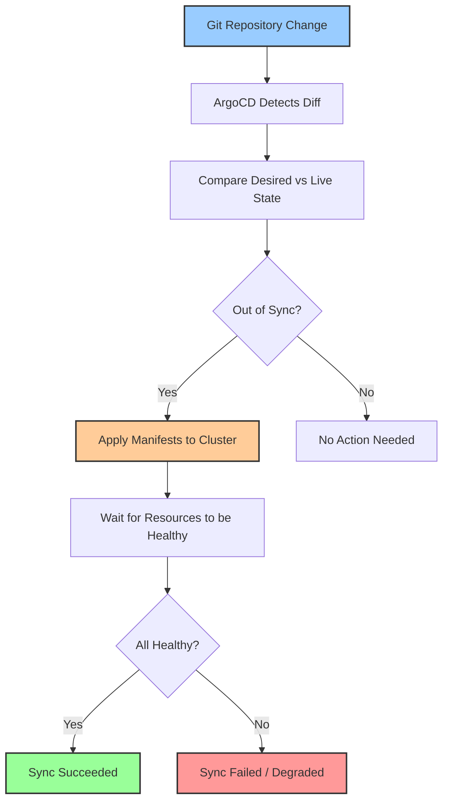
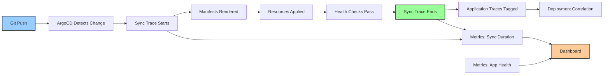

# How to Monitor ArgoCD GitOps Deployments with OpenTelemetry

Author: [nawazdhandala](https://www.github.com/nawazdhandala)

Tags: OpenTelemetry, ArgoCD, GitOps, Kubernetes, Monitoring, Deployments

Description: Learn how to monitor ArgoCD GitOps deployments with OpenTelemetry for full visibility into sync operations, health status, and deployment performance.

---

ArgoCD is the most popular GitOps tool for Kubernetes, but monitoring what it does under the hood takes some effort. When ArgoCD syncs your application from Git to your cluster, a lot happens: it pulls manifests, compares desired state with live state, applies changes, and waits for resources to become healthy. If any of those steps slow down or fail, you need to know why.

OpenTelemetry gives you a way to capture detailed trace and metric data from ArgoCD, turning every sync operation into an observable event that you can analyze, alert on, and correlate with the rest of your infrastructure monitoring.

## How ArgoCD Deployments Work

Before diving into instrumentation, it helps to understand the ArgoCD sync process. When ArgoCD detects a change in your Git repository, it starts a sync operation.



Each of these phases can fail or slow down for different reasons. Git fetch might be slow. Manifest rendering (Helm, Kustomize) might error out. Kubernetes API calls might be throttled. Resource health checks might time out. You need visibility into all of these.

## Exposing ArgoCD Metrics for OpenTelemetry

ArgoCD exposes Prometheus metrics out of the box. The most practical approach is to scrape these metrics using the OpenTelemetry Collector's Prometheus receiver and forward them to your observability backend.

First, ensure ArgoCD's metrics endpoints are accessible. ArgoCD components expose metrics on these default ports:

- argocd-server: port 8083
- argocd-repo-server: port 8084
- argocd-application-controller: port 8082

Here is the collector configuration that scrapes all three ArgoCD components.

```yaml
# otel-collector-config.yaml
# Scrapes Prometheus metrics from all ArgoCD components
# and exports them via OTLP for unified observability.
receivers:
  # Scrape ArgoCD Prometheus metrics
  prometheus:
    config:
      scrape_configs:
        # Application controller metrics (sync operations, app health)
        - job_name: 'argocd-application-controller'
          scrape_interval: 15s
          kubernetes_sd_configs:
            - role: pod
              namespaces:
                names: [argocd]
          relabel_configs:
            - source_labels: [__meta_kubernetes_pod_label_app_kubernetes_io_name]
              regex: argocd-application-controller
              action: keep
            - source_labels: [__meta_kubernetes_pod_ip]
              target_label: __address__
              replacement: "$1:8082"

        # Server metrics (API requests, auth)
        - job_name: 'argocd-server'
          scrape_interval: 15s
          kubernetes_sd_configs:
            - role: pod
              namespaces:
                names: [argocd]
          relabel_configs:
            - source_labels: [__meta_kubernetes_pod_label_app_kubernetes_io_name]
              regex: argocd-server
              action: keep
            - source_labels: [__meta_kubernetes_pod_ip]
              target_label: __address__
              replacement: "$1:8083"

        # Repo server metrics (Git operations, manifest generation)
        - job_name: 'argocd-repo-server'
          scrape_interval: 15s
          kubernetes_sd_configs:
            - role: pod
              namespaces:
                names: [argocd]
          relabel_configs:
            - source_labels: [__meta_kubernetes_pod_label_app_kubernetes_io_name]
              regex: argocd-repo-server
              action: keep
            - source_labels: [__meta_kubernetes_pod_ip]
              target_label: __address__
              replacement: "$1:8084"

processors:
  batch:
    timeout: 15s

  # Add metadata to identify these metrics as ArgoCD data
  resource:
    attributes:
      - key: service.name
        value: argocd
        action: upsert
      - key: service.namespace
        value: gitops
        action: upsert

exporters:
  otlphttp:
    endpoint: https://your-backend.example.com
    headers:
      Authorization: "Bearer ${OTEL_AUTH_TOKEN}"

service:
  pipelines:
    metrics:
      receivers: [prometheus]
      processors: [resource, batch]
      exporters: [otlphttp]
```

## Key ArgoCD Metrics to Monitor

ArgoCD exposes dozens of metrics, but these are the ones that matter most for deployment monitoring.

The `argocd_app_info` metric gives you the current state of every application managed by ArgoCD. It includes labels for the sync status, health status, project, and repository.

```yaml
# Important ArgoCD metrics and what they tell you:
#
# argocd_app_sync_total
#   Count of sync operations by application, phase, and result.
#   Use this to track deployment frequency and failure rates.
#
# argocd_app_health_status
#   Current health status of each application (Healthy, Degraded, Missing, etc).
#   Alert when applications are not Healthy.
#
# argocd_app_sync_status
#   Whether each application is in sync with Git (Synced, OutOfSync).
#   OutOfSync for extended periods indicates deployment issues.
#
# argocd_git_request_total
#   Count of Git operations (ls-remote, fetch) by repo and result.
#   High error rates indicate Git connectivity problems.
#
# argocd_git_request_duration_seconds
#   How long Git operations take. Slow Git fetches delay sync operations.
#
# argocd_repo_server_render_duration_seconds
#   Time to render manifests (Helm template, Kustomize build).
#   Slow rendering delays the entire sync cycle.
#
# argocd_kubectl_exec_total
#   Count of kubectl operations by command and result.
#   Failed kubectl calls indicate cluster connectivity issues.
```

## Deploying the Collector in Kubernetes

Deploy the OpenTelemetry Collector as a Deployment in your cluster, alongside ArgoCD. This collector will scrape ArgoCD metrics and export them to your backend.

```yaml
# otel-collector-deployment.yaml
# Deploys the OpenTelemetry Collector in the argocd namespace
# to scrape metrics from ArgoCD components.
apiVersion: apps/v1
kind: Deployment
metadata:
  name: otel-collector
  namespace: argocd
  labels:
    app: otel-collector
spec:
  replicas: 1
  selector:
    matchLabels:
      app: otel-collector
  template:
    metadata:
      labels:
        app: otel-collector
    spec:
      serviceAccountName: otel-collector
      containers:
        - name: collector
          image: otel/opentelemetry-collector-contrib:latest
          args:
            - "--config=/etc/otel/config.yaml"
          volumeMounts:
            - name: config
              mountPath: /etc/otel
          resources:
            requests:
              memory: 256Mi
              cpu: 100m
            limits:
              memory: 512Mi
              cpu: 500m
      volumes:
        - name: config
          configMap:
            name: otel-collector-config
---
# ServiceAccount with permissions to discover ArgoCD pods
apiVersion: v1
kind: ServiceAccount
metadata:
  name: otel-collector
  namespace: argocd
---
# ClusterRole to allow pod discovery for Prometheus scraping
apiVersion: rbac.authorization.k8s.io/v1
kind: ClusterRole
metadata:
  name: otel-collector-argocd
rules:
  - apiGroups: [""]
    resources: ["pods", "nodes", "endpoints"]
    verbs: ["get", "list", "watch"]
---
apiVersion: rbac.authorization.k8s.io/v1
kind: ClusterRoleBinding
metadata:
  name: otel-collector-argocd
roleRef:
  apiGroup: rbac.authorization.k8s.io
  kind: ClusterRole
  name: otel-collector-argocd
subjects:
  - kind: ServiceAccount
    name: otel-collector
    namespace: argocd
```

Apply the collector deployment after creating the ConfigMap from your collector configuration.

```bash
# Create the ConfigMap from the collector configuration file
kubectl create configmap otel-collector-config \
  --from-file=config.yaml=otel-collector-config.yaml \
  -n argocd

# Deploy the collector
kubectl apply -f otel-collector-deployment.yaml
```

## Tracing ArgoCD Sync Operations

Beyond metrics, you can trace individual sync operations by using ArgoCD's notification system to emit trace events. ArgoCD Notifications can trigger webhooks when sync operations start and finish, and you can use these to create spans.

Set up a small service that receives ArgoCD notifications and converts them into OpenTelemetry spans.

```yaml
# argocd-notifications-config.yaml
# Configures ArgoCD Notifications to send webhook events
# for sync operations to a trace conversion service.
apiVersion: v1
kind: ConfigMap
metadata:
  name: argocd-notifications-cm
  namespace: argocd
data:
  # Define the webhook service for trace events
  service.webhook.otel-tracer: |
    url: http://argocd-trace-bridge.argocd.svc:8080/sync-event
    headers:
      - name: Content-Type
        value: application/json

  # Template for sync started events
  template.sync-started: |
    webhook:
      otel-tracer:
        method: POST
        body: |
          {
            "event": "sync_started",
            "app": "{{.app.metadata.name}}",
            "project": "{{.app.spec.project}}",
            "repo": "{{.app.spec.source.repoURL}}",
            "revision": "{{.app.status.sync.revision}}",
            "timestamp": "{{.app.status.operationState.startedAt}}"
          }

  # Template for sync finished events
  template.sync-finished: |
    webhook:
      otel-tracer:
        method: POST
        body: |
          {
            "event": "sync_finished",
            "app": "{{.app.metadata.name}}",
            "project": "{{.app.spec.project}}",
            "status": "{{.app.status.operationState.phase}}",
            "message": "{{.app.status.operationState.message}}",
            "revision": "{{.app.status.sync.revision}}",
            "started_at": "{{.app.status.operationState.startedAt}}",
            "finished_at": "{{.app.status.operationState.finishedAt}}"
          }

  # Triggers that fire the templates
  trigger.on-sync-running: |
    - when: app.status.operationState.phase in ['Running']
      send: [sync-started]
  trigger.on-sync-succeeded: |
    - when: app.status.operationState.phase in ['Succeeded']
      send: [sync-finished]
  trigger.on-sync-failed: |
    - when: app.status.operationState.phase in ['Error', 'Failed']
      send: [sync-finished]
```

The trace bridge service receives these webhook events and converts them into OTLP spans.

```python
# trace_bridge.py
# A lightweight service that converts ArgoCD notification webhooks
# into OpenTelemetry spans. Each sync operation becomes a trace
# with timing, status, and deployment metadata.

from flask import Flask, request
from opentelemetry import trace
from opentelemetry.sdk.trace import TracerProvider
from opentelemetry.sdk.trace.export import BatchSpanProcessor
from opentelemetry.exporter.otlp.proto.grpc.trace_exporter import OTLPSpanExporter
from opentelemetry.trace import StatusCode
from datetime import datetime
import hashlib

app = Flask(__name__)

# Configure the OpenTelemetry tracer
provider = TracerProvider()
exporter = OTLPSpanExporter(endpoint="otel-collector.argocd.svc:4317")
provider.add_span_processor(BatchSpanProcessor(exporter))
trace.set_tracer_provider(provider)
tracer = trace.get_tracer("argocd-trace-bridge")

# Store active sync spans keyed by application name
active_syncs = {}

@app.route("/sync-event", methods=["POST"])
def sync_event():
    data = request.json
    app_name = data["app"]

    if data["event"] == "sync_started":
        # Create a new trace for this sync operation
        # Use app name + revision as a deterministic trace ID
        trace_seed = f"{app_name}-{data['revision']}-{data['timestamp']}"
        ctx = trace.set_span_in_context(trace.INVALID_SPAN)

        span = tracer.start_span(
            name=f"argocd-sync-{app_name}",
            attributes={
                "argocd.app.name": app_name,
                "argocd.project": data["project"],
                "argocd.repo": data["repo"],
                "argocd.revision": data["revision"],
                "deployment.environment": "production",
            },
        )
        active_syncs[app_name] = span

    elif data["event"] == "sync_finished":
        span = active_syncs.pop(app_name, None)
        if span:
            # Set the final status based on the sync result
            if data["status"] == "Succeeded":
                span.set_status(StatusCode.OK)
            else:
                span.set_status(StatusCode.ERROR, data.get("message", ""))

            span.set_attribute("argocd.sync.status", data["status"])
            span.set_attribute("argocd.sync.message", data.get("message", ""))
            span.end()

    return "ok", 200

if __name__ == "__main__":
    app.run(host="0.0.0.0", port=8080)
```

This gives you a span for every ArgoCD sync operation, with accurate timing, status, and metadata that you can query and visualize in your tracing backend.

## Monitoring Application Health Over Time

ArgoCD health status changes are important signals. You can track health transitions by monitoring the `argocd_app_health_status` metric over time.

Create alerts for health status changes that indicate problems.

```yaml
# alerting-rules.yaml
# Alert definitions based on ArgoCD metrics collected via OpenTelemetry.
# These catch common deployment and sync problems.

# Alert when an application is out of sync for more than 10 minutes
- alert: ArgoCD_AppOutOfSync
  expr: argocd_app_sync_status{sync_status="OutOfSync"} == 1
  for: 10m
  labels:
    severity: warning
  annotations:
    summary: "ArgoCD app {{ $labels.name }} is out of sync"
    description: "Application {{ $labels.name }} in project {{ $labels.project }} has been out of sync for more than 10 minutes."

# Alert when an application is unhealthy
- alert: ArgoCD_AppUnhealthy
  expr: argocd_app_health_status{health_status!="Healthy"} == 1
  for: 5m
  labels:
    severity: critical
  annotations:
    summary: "ArgoCD app {{ $labels.name }} is {{ $labels.health_status }}"
    description: "Application {{ $labels.name }} health status is {{ $labels.health_status }}."

# Alert when sync operations are failing
- alert: ArgoCD_SyncFailureRate
  expr: rate(argocd_app_sync_total{phase="Error"}[1h]) > 0.1
  for: 5m
  labels:
    severity: warning
  annotations:
    summary: "High sync failure rate for {{ $labels.name }}"
    description: "Application {{ $labels.name }} has a high sync failure rate in the last hour."
```

## Correlating Deployments with Application Performance

The most valuable use of ArgoCD monitoring with OpenTelemetry is correlating deployments with application behavior. When you deploy a new version and response times spike, you want to connect those two observations.

Here is how to annotate your application traces with deployment information from ArgoCD.

```yaml
# otel-collector-config-with-deployment-context.yaml
# Uses the resource processor to add deployment metadata to
# application traces, enabling correlation between deploys and performance.
receivers:
  otlp:
    protocols:
      grpc:
        endpoint: 0.0.0.0:4317

processors:
  batch:
    timeout: 10s

  # Add the current deployment version as a resource attribute
  # Update this value during each ArgoCD sync via a ConfigMap
  resource:
    attributes:
      - key: deployment.version
        from_attribute: DEPLOYMENT_VERSION
        action: upsert
      - key: deployment.argocd.app
        value: my-application
        action: upsert

exporters:
  otlphttp:
    endpoint: https://your-backend.example.com

service:
  pipelines:
    traces:
      receivers: [otlp]
      processors: [resource, batch]
      exporters: [otlphttp]
```

When you see a performance regression in your traces, you can filter by `deployment.version` to see exactly when it started and which deployment introduced it.

## Visualizing the GitOps Flow

With all the pieces in place, you get a complete view of your GitOps deployment pipeline.



## Conclusion

Monitoring ArgoCD with OpenTelemetry gives you deep visibility into your GitOps deployment process. By scraping ArgoCD's Prometheus metrics through the OpenTelemetry Collector, you get a unified view of sync operations, application health, and Git performance alongside the rest of your observability data. Adding trace instrumentation through ArgoCD Notifications creates detailed spans for every sync operation, making it easy to measure deployment duration, track failure rates, and correlate deployments with application performance changes. This combination of metrics and traces turns ArgoCD from a fire-and-forget deployment tool into a fully observable part of your infrastructure.
