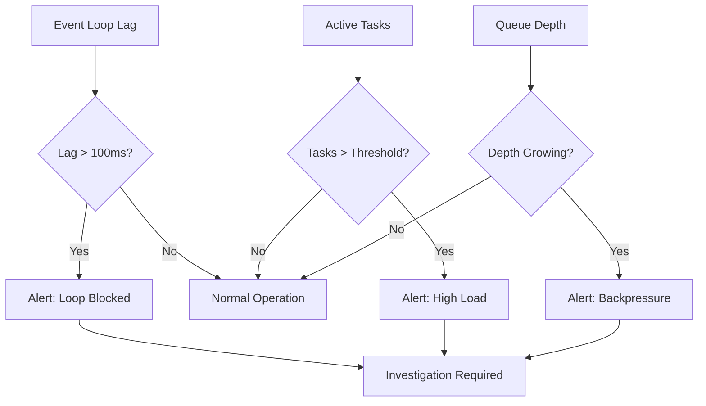

# How to Monitor Asyncio Event Loop Performance with OpenTelemetry Metrics

Author: [nawazdhandala](https://www.github.com/nawazdhandala)

Tags: OpenTelemetry, Python, asyncio, Event Loop, Metrics, Performance

Description: Learn how to monitor asyncio event loop performance using OpenTelemetry metrics to detect bottlenecks, measure task execution times, and optimize concurrent Python applications.

Asyncio applications can suffer from hidden performance issues that are difficult to diagnose without proper observability. Event loop blocking, slow coroutines, and task queue buildup can silently degrade your application's responsiveness. OpenTelemetry provides the tools to capture detailed metrics about your asyncio event loop, giving you visibility into what's happening under the hood.

## Why Monitor the Event Loop

The asyncio event loop is the heart of your asynchronous Python application. When it performs poorly, everything suffers. Common problems include:

- Blocking operations that prevent other tasks from running
- Growing task queues indicating backpressure
- Slow callbacks that delay event processing
- Resource exhaustion from too many concurrent tasks

Without metrics, these issues manifest as vague slowness that's hard to pin down. With proper instrumentation, you can identify the exact bottleneck.

## Setting Up OpenTelemetry Metrics

First, install the required dependencies. You'll need the OpenTelemetry API, SDK, and exporters.

```bash
pip install opentelemetry-api opentelemetry-sdk opentelemetry-exporter-otlp
```

Here's the basic setup for metrics collection. This creates a meter provider and configures it to export metrics every 30 seconds.

```python
from opentelemetry import metrics
from opentelemetry.sdk.metrics import MeterProvider
from opentelemetry.sdk.metrics.export import PeriodicExportingMetricReader
from opentelemetry.exporter.otlp.proto.grpc.metric_exporter import OTLPMetricExporter
from opentelemetry.sdk.resources import Resource

# Create a resource that identifies your service
resource = Resource(attributes={
    "service.name": "asyncio-service",
    "service.version": "1.0.0"
})

# Configure the OTLP exporter to send metrics to your backend
exporter = OTLPMetricExporter(
    endpoint="http://localhost:4317",
    insecure=True
)

# Create a metric reader that exports every 30 seconds
reader = PeriodicExportingMetricReader(
    exporter=exporter,
    export_interval_millis=30000
)

# Set up the meter provider
provider = MeterProvider(resource=resource, metric_readers=[reader])
metrics.set_meter_provider(provider)

# Get a meter for creating instruments
meter = metrics.get_meter("asyncio.event_loop", "1.0.0")
```

## Measuring Event Loop Lag

Event loop lag is the time between when a callback should run and when it actually runs. High lag indicates the loop is blocked or overloaded.

```python
import asyncio
import time
from typing import Optional

class EventLoopMonitor:
    def __init__(self, meter):
        # Histogram for measuring lag in milliseconds
        self.lag_histogram = meter.create_histogram(
            name="asyncio.event_loop.lag",
            description="Event loop lag in milliseconds",
            unit="ms"
        )

        # Counter for total iterations
        self.iteration_counter = meter.create_counter(
            name="asyncio.event_loop.iterations",
            description="Total event loop iterations"
        )

        self._last_check: Optional[float] = None
        self._expected_interval = 0.1  # Check every 100ms

    async def monitor(self):
        """Continuously monitor event loop lag"""
        while True:
            current_time = time.perf_counter()

            if self._last_check is not None:
                # Calculate how long since last check
                actual_interval = current_time - self._last_check
                # Lag is the difference from expected interval
                lag_ms = (actual_interval - self._expected_interval) * 1000

                # Only record if there's measurable lag
                if lag_ms > 0:
                    self.lag_histogram.record(lag_ms)

                self.iteration_counter.add(1)

            self._last_check = current_time
            await asyncio.sleep(self._expected_interval)

# Start monitoring in your application
async def main():
    monitor = EventLoopMonitor(meter)

    # Run monitor as a background task
    asyncio.create_task(monitor.monitor())

    # Your application code here
    await asyncio.sleep(60)

asyncio.run(main())
```

## Tracking Active Tasks

Knowing how many tasks are running helps you understand load and detect leaks where tasks never complete.

```python
class TaskTracker:
    def __init__(self, meter):
        # UpDownCounter tracks values that can go up or down
        self.active_tasks = meter.create_up_down_counter(
            name="asyncio.tasks.active",
            description="Number of currently active tasks"
        )

        # Histogram for task duration
        self.task_duration = meter.create_histogram(
            name="asyncio.tasks.duration",
            description="Task execution duration in seconds",
            unit="s"
        )

        # Counter for completed tasks
        self.completed_tasks = meter.create_counter(
            name="asyncio.tasks.completed",
            description="Total number of completed tasks"
        )

    def track_task(self, coro, task_name: str):
        """Wrap a coroutine to track its execution"""
        async def wrapper():
            self.active_tasks.add(1, {"task.name": task_name})
            start_time = time.perf_counter()

            try:
                result = await coro
                return result
            finally:
                duration = time.perf_counter() - start_time
                self.task_duration.record(duration, {"task.name": task_name})
                self.active_tasks.add(-1, {"task.name": task_name})
                self.completed_tasks.add(1, {"task.name": task_name})

        return wrapper()

# Usage example
tracker = TaskTracker(meter)

async def fetch_data(url: str):
    """Simulate an async operation"""
    await asyncio.sleep(0.5)
    return f"Data from {url}"

async def main():
    # Wrap tasks with tracking
    tasks = [
        tracker.track_task(fetch_data(f"http://api.example.com/{i}"), "fetch_data")
        for i in range(10)
    ]

    results = await asyncio.gather(*tasks)
```

## Monitoring Callback Queue Depth

The callback queue depth indicates how many callbacks are waiting to execute. A growing queue suggests the event loop can't keep up.

```python
import sys

class CallbackQueueMonitor:
    def __init__(self, meter):
        self.queue_depth = meter.create_observable_gauge(
            name="asyncio.callback_queue.depth",
            description="Number of callbacks waiting in the queue",
            callbacks=[self._observe_queue_depth]
        )

        self._loop: Optional[asyncio.AbstractEventLoop] = None

    def _observe_queue_depth(self, options):
        """Callback to observe current queue depth"""
        if self._loop is None:
            try:
                self._loop = asyncio.get_running_loop()
            except RuntimeError:
                return

        # Get queue depth from loop internals
        # Note: This is implementation-specific and may not work on all Python versions
        if hasattr(self._loop, '_ready'):
            depth = len(self._loop._ready)
            yield metrics.Observation(depth)

# Initialize the monitor
queue_monitor = CallbackQueueMonitor(meter)
```

## Complete Monitoring Solution

Here's a complete example that combines all the monitoring components into a reusable class.

```python
from dataclasses import dataclass
from typing import Callable, Any
import functools

@dataclass
class EventLoopMetrics:
    lag_ms: float
    active_tasks: int
    queue_depth: int
    iteration_rate: float

class AsyncioObservability:
    def __init__(self, meter):
        self.meter = meter
        self.event_loop_monitor = EventLoopMonitor(meter)
        self.task_tracker = TaskTracker(meter)
        self.queue_monitor = CallbackQueueMonitor(meter)

        # Observable gauge for custom metrics
        self.custom_gauge = meter.create_observable_gauge(
            name="asyncio.custom.metric",
            description="Custom application metrics",
            callbacks=[self._observe_custom_metrics]
        )

        self._custom_metrics = {}

    def _observe_custom_metrics(self, options):
        """Export custom metrics"""
        for metric_name, value in self._custom_metrics.items():
            yield metrics.Observation(value, {"metric.name": metric_name})

    def set_custom_metric(self, name: str, value: float):
        """Set a custom metric value"""
        self._custom_metrics[name] = value

    async def start_monitoring(self):
        """Start all monitoring tasks"""
        await self.event_loop_monitor.monitor()

    def instrument_function(self, func_name: str = None):
        """Decorator to instrument async functions"""
        def decorator(func: Callable) -> Callable:
            name = func_name or func.__name__

            @functools.wraps(func)
            async def wrapper(*args, **kwargs):
                return await self.task_tracker.track_task(
                    func(*args, **kwargs),
                    name
                )

            return wrapper
        return decorator

# Application example
observability = AsyncioObservability(meter)

@observability.instrument_function("process_request")
async def process_request(request_id: int):
    """Process a request with automatic instrumentation"""
    await asyncio.sleep(0.1)
    observability.set_custom_metric("last_request_id", request_id)
    return f"Processed {request_id}"

async def main():
    # Start monitoring in background
    monitor_task = asyncio.create_task(observability.start_monitoring())

    # Run your application
    tasks = [process_request(i) for i in range(100)]
    await asyncio.gather(*tasks)

    # Keep monitoring running
    await monitor_task

if __name__ == "__main__":
    asyncio.run(main())
```

## Visualizing Metrics

Once metrics are exported to your observability backend, create dashboards to visualize:



## Best Practices

**Use Sampling for High-Frequency Operations**: If you're processing thousands of tasks per second, sample metrics instead of recording every operation to avoid overhead.

**Set Appropriate Alert Thresholds**: Event loop lag above 50-100ms usually indicates problems. Queue depth should remain relatively stable.

**Correlate with Traces**: Combine metrics with distributed tracing to understand which operations are causing slowdowns.

**Monitor in Production**: Development environments rarely show the same patterns as production. Always monitor real traffic.

**Track Resource Usage**: Combine asyncio metrics with system metrics like CPU, memory, and network I/O for complete visibility.

## Debugging Performance Issues

When you detect problems through metrics, use this systematic approach:

1. Check event loop lag to confirm the loop is blocked
2. Examine active task counts to identify runaway operations
3. Look at task duration histograms to find slow operations
4. Review queue depth trends to detect backpressure
5. Correlate with application logs and traces

The combination of these metrics gives you the complete picture of your asyncio application's health and performance characteristics.

## Conclusion

Monitoring asyncio event loop performance with OpenTelemetry transforms debugging from guesswork into data-driven investigation. By tracking lag, task counts, and queue depth, you can quickly identify performance bottlenecks and optimize your asynchronous Python applications. The metrics you collect become the foundation for alerting, capacity planning, and performance optimization.
