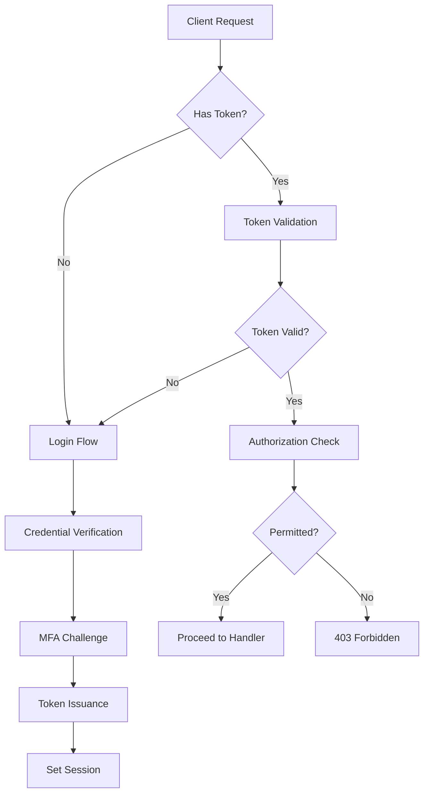

# How to Monitor Authentication and Authorization Flows with OpenTelemetry

Author: [nawazdhandala](https://www.github.com/nawazdhandala)

Tags: OpenTelemetry, Authentication, Authorization, Security, OAuth, RBAC, Tracing, Metrics, Observability

Description: Learn how to instrument authentication and authorization flows with OpenTelemetry to detect failures, track token lifecycle, monitor RBAC decisions, and improve security observability.

---

Authentication and authorization are the front door to every application. When they break, users get locked out. When they are slow, every single page load feels sluggish because auth checks happen on nearly every request. And when they are compromised, you need to know immediately.

Despite their importance, most teams treat auth as a black box. They know if login is up or down, but they cannot tell you the p99 latency of token validation, how often RBAC policy evaluation takes more than 50ms, or which OAuth provider is causing intermittent failures. OpenTelemetry changes that by giving you fine-grained traces and metrics across the entire auth pipeline.

---

## The Auth Pipeline

Authentication and authorization might seem like a single step, but they involve multiple stages:



Each of these stages can fail or be slow for different reasons. Token validation might be slow because your JWKS endpoint is unreachable. MFA might fail because the SMS provider is having issues. Authorization might be slow because your policy engine is evaluating too many rules. Tracing each stage separately lets you pinpoint exactly where the problem is.

---

## Setting Up Instrumentation

Start with the standard OpenTelemetry setup, with both tracing and metrics configured:

```python
# pip install opentelemetry-api opentelemetry-sdk opentelemetry-exporter-otlp

from opentelemetry import trace, metrics
from opentelemetry.sdk.trace import TracerProvider
from opentelemetry.sdk.trace.export import BatchSpanProcessor
from opentelemetry.sdk.metrics import MeterProvider
from opentelemetry.sdk.metrics.export import PeriodicExportingMetricReader
from opentelemetry.exporter.otlp.proto.grpc.trace_exporter import OTLPSpanExporter
from opentelemetry.exporter.otlp.proto.grpc.metric_exporter import OTLPMetricExporter
from opentelemetry.sdk.resources import Resource

resource = Resource.create({
    "service.name": "auth-service",
    "service.version": "2.0.4",
    "deployment.environment": "production",
})

# Tracing setup
trace_provider = TracerProvider(resource=resource)
trace_provider.add_span_processor(
    BatchSpanProcessor(OTLPSpanExporter(endpoint="otel-collector:4317"))
)
trace.set_tracer_provider(trace_provider)

# Metrics setup
metric_reader = PeriodicExportingMetricReader(
    OTLPMetricExporter(endpoint="otel-collector:4317"),
    export_interval_millis=15000,
)
meter_provider = MeterProvider(resource=resource, metric_readers=[metric_reader])
metrics.set_meter_provider(meter_provider)

tracer = trace.get_tracer("auth.service")
meter = metrics.get_meter("auth.service")
```

For auth services specifically, you want to be careful about what you put in span attributes. Never log passwords, tokens, or session IDs as plain text in traces. Use hashed or truncated values when you need to correlate across requests.

---

## Tracing the Login Flow

The login flow is the most visible auth operation. Users notice when it is slow, and failed logins generate support tickets. Here is how to trace it end to end:

```python
# Login metrics
login_attempts = meter.create_counter(
    name="auth.login.attempts_total",
    description="Total login attempts",
)

login_failures = meter.create_counter(
    name="auth.login.failures_total",
    description="Failed login attempts by reason",
)

login_latency = meter.create_histogram(
    name="auth.login.latency",
    description="Login flow latency",
    unit="ms",
)

def handle_login(credentials, client_info):
    """Handle a login request through all auth stages."""
    with tracer.start_as_current_span(
        "auth.login",
        attributes={
            "auth.method": credentials.method,  # password, oauth, saml
            "auth.client_type": client_info.type,  # web, mobile, api
            # Never log the actual username in production traces
            # Use a hash if you need to correlate
            "auth.user_hash": hash_identifier(credentials.username),
        },
    ) as span:
        login_attempts.add(1, {
            "auth.method": credentials.method,
            "auth.client_type": client_info.type,
        })

        try:
            # Step 1: Verify credentials against the identity store
            user = verify_credentials(credentials)

            # Step 2: Check if MFA is required
            if user.mfa_enabled:
                verify_mfa(user, credentials)

            # Step 3: Check account status (locked, disabled, etc.)
            check_account_status(user)

            # Step 4: Issue tokens
            tokens = issue_tokens(user, client_info)

            span.set_attribute("auth.login.success", True)
            span.set_attribute("auth.user.roles", ",".join(user.roles))

            return tokens

        except AuthenticationError as e:
            span.set_attribute("auth.login.success", False)
            span.set_attribute("auth.login.failure_reason", e.reason)
            login_failures.add(1, {
                "auth.method": credentials.method,
                "auth.failure_reason": e.reason,
            })
            raise
```

The failure reason attribute is critical for security monitoring. You want to be able to quickly answer questions like "are we seeing a spike in invalid_password failures from a single IP range?" which could indicate a credential stuffing attack.

---

## Instrumenting Credential Verification

Credential verification often involves external calls, like hitting an LDAP server, a database, or an OAuth provider. Each of these has different failure modes:

```python
def verify_credentials(credentials):
    """Verify user credentials against the appropriate identity store."""
    with tracer.start_as_current_span(
        "auth.verify_credentials",
        attributes={"auth.identity_store": credentials.store_type},
    ) as span:
        if credentials.method == "password":
            return verify_password(credentials)
        elif credentials.method == "oauth":
            return verify_oauth_token(credentials)
        elif credentials.method == "saml":
            return verify_saml_assertion(credentials)


def verify_password(credentials):
    """Verify username and password against the local database."""
    with tracer.start_as_current_span("auth.verify_password") as span:
        # Look up the user
        user = user_store.find_by_username(credentials.username)
        if not user:
            raise AuthenticationError(reason="user_not_found")

        # Check password hash
        # bcrypt is intentionally slow, so this span helps track that cost
        if not bcrypt.checkpw(credentials.password, user.password_hash):
            # Record failed attempt for rate limiting
            rate_limiter.record_failure(credentials.username)
            raise AuthenticationError(reason="invalid_password")

        span.set_attribute("auth.password.hash_algorithm", "bcrypt")
        span.set_attribute("auth.password.hash_rounds", user.bcrypt_rounds)
        return user


def verify_oauth_token(credentials):
    """Verify an OAuth token with the external provider."""
    with tracer.start_as_current_span(
        "auth.verify_oauth",
        attributes={
            "auth.oauth.provider": credentials.provider,
        },
    ) as span:
        # Fetch the provider's JWKS for token verification
        with tracer.start_as_current_span("auth.oauth.fetch_jwks") as jwks_span:
            jwks = jwks_cache.get_or_fetch(credentials.provider)
            jwks_span.set_attribute("auth.oauth.jwks_cached", jwks.from_cache)

        # Validate the token signature and claims
        claims = jwt_validator.validate(credentials.token, jwks)
        span.set_attribute("auth.oauth.token_issuer", claims.issuer)
        span.set_attribute("auth.oauth.token_age_seconds", claims.age_seconds)

        # Map external identity to internal user
        user = user_store.find_by_external_id(
            provider=credentials.provider,
            external_id=claims.subject,
        )

        if not user:
            raise AuthenticationError(reason="unmapped_external_identity")

        return user
```

The JWKS fetch span is especially valuable. JWKS endpoints occasionally go down or become slow, and without tracing you would only see a generic "login is slow" symptom. With this span, you can immediately identify that the OAuth provider's key endpoint is the bottleneck.

---

## Tracing MFA Verification

Multi-factor authentication adds another external dependency, whether it is TOTP validation, SMS delivery, or a push notification:

```python
# MFA metrics
mfa_attempts = meter.create_counter(
    name="auth.mfa.attempts_total",
    description="MFA verification attempts by method",
)

mfa_latency = meter.create_histogram(
    name="auth.mfa.latency",
    description="MFA verification latency by method",
    unit="ms",
)

def verify_mfa(user, credentials):
    """Verify the second authentication factor."""
    mfa_method = user.mfa_method  # totp, sms, push

    with tracer.start_as_current_span(
        "auth.mfa.verify",
        attributes={
            "auth.mfa.method": mfa_method,
            "auth.mfa.backup_code_used": credentials.is_backup_code,
        },
    ) as span:
        mfa_attempts.add(1, {"auth.mfa.method": mfa_method})

        if mfa_method == "totp":
            # TOTP is fast since it is computed locally
            valid = totp_validator.verify(user.totp_secret, credentials.mfa_code)
        elif mfa_method == "sms":
            # SMS verification involves an external provider
            with tracer.start_as_current_span(
                "auth.mfa.sms_verify",
                attributes={"auth.mfa.sms_provider": "twilio"},
            ):
                valid = sms_provider.verify_code(
                    user.phone_number, credentials.mfa_code
                )
        elif mfa_method == "push":
            # Push notification and wait for user approval
            with tracer.start_as_current_span("auth.mfa.push_verify") as push_span:
                result = push_provider.send_and_wait(
                    user.device_id, timeout_seconds=60
                )
                push_span.set_attribute(
                    "auth.mfa.push_response_time_ms", result.response_time_ms
                )
                valid = result.approved

        if not valid:
            raise AuthenticationError(reason="mfa_failed")

        span.set_attribute("auth.mfa.success", True)
```

Push notification MFA is interesting from a monitoring perspective because it depends on the user responding. The response time attribute helps you understand whether users are struggling with the push flow, which could indicate UX issues or notification delivery problems.

---

## Monitoring Authorization Decisions

Authorization happens on every request, not just during login. This makes it the highest-volume auth operation and a common source of latency if policies are complex:

```python
# Authorization metrics
authz_decisions = meter.create_counter(
    name="auth.authz.decisions_total",
    description="Authorization decisions by result",
)

authz_latency = meter.create_histogram(
    name="auth.authz.latency",
    description="Authorization decision latency",
    unit="ms",
)

policy_eval_count = meter.create_histogram(
    name="auth.authz.policies_evaluated",
    description="Number of policies evaluated per decision",
    unit="policies",
)

def check_authorization(user, resource, action):
    """Check if a user is authorized to perform an action on a resource."""
    with tracer.start_as_current_span(
        "auth.authz.check",
        attributes={
            "auth.authz.resource_type": resource.type,
            "auth.authz.action": action,
            "auth.authz.user_role": user.primary_role,
        },
    ) as span:
        # Evaluate RBAC policies
        with tracer.start_as_current_span("auth.authz.rbac_eval") as rbac_span:
            rbac_result = rbac_engine.evaluate(user.roles, resource, action)
            rbac_span.set_attribute(
                "auth.authz.policies_checked", rbac_result.policies_checked
            )
            policy_eval_count.record(rbac_result.policies_checked)

        # Check resource-level permissions (ownership, sharing, etc.)
        with tracer.start_as_current_span("auth.authz.resource_check") as res_span:
            resource_result = resource_permissions.check(user.id, resource)
            res_span.set_attribute(
                "auth.authz.is_owner", resource_result.is_owner
            )

        # Combine results
        permitted = rbac_result.allowed or resource_result.allowed

        span.set_attribute("auth.authz.permitted", permitted)
        span.set_attribute("auth.authz.decision_source",
                          "rbac" if rbac_result.allowed else "resource" if resource_result.allowed else "denied")

        authz_decisions.add(1, {
            "auth.authz.permitted": str(permitted),
            "auth.authz.resource_type": resource.type,
        })

        if not permitted:
            span.add_event("authorization_denied", {
                "resource_type": resource.type,
                "action": action,
                "user_role": user.primary_role,
            })

        return permitted
```

The `policies_checked` metric helps you spot policy bloat. If the number of policies evaluated per request is growing over time, your RBAC engine is doing more work on every request. This is a common performance regression that goes unnoticed until it causes latency spikes.

---

## Security Alerting

With these traces and metrics in place, build security-focused alerts:

- **Login failure rate exceeding 20% over 5 minutes.** This could indicate a credential stuffing attack or a broken auth provider.
- **MFA failure rate above 10%.** Either users are struggling or an attacker is brute forcing MFA codes.
- **Authorization denial spikes for a specific resource type.** This might indicate a misconfigured permission or unauthorized access.
- **JWKS fetch latency exceeding 2 seconds.** Your OAuth provider might be having issues.

---

## Wrapping Up

Authentication and authorization touch every request in your application, making them both critical to monitor and easy to overlook. By tracing each stage separately you get the visibility needed to debug slow logins, catch security anomalies, and keep your auth infrastructure healthy. Trace the flow and the timing, but never put sensitive credentials in your telemetry data.
