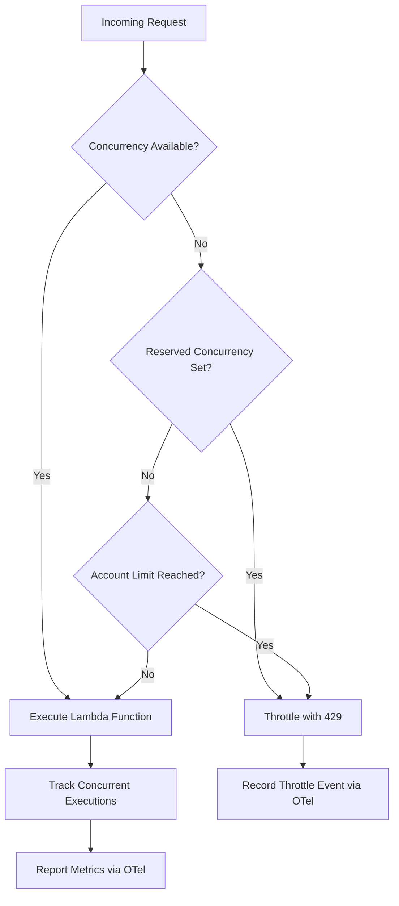
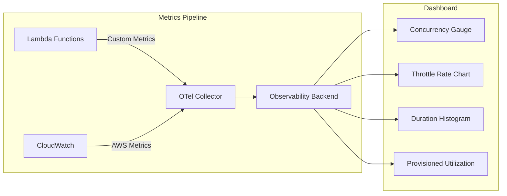

# How to Monitor AWS Lambda Concurrency and Throttling with OpenTelemetry

Author: [nawazdhandala](https://www.github.com/nawazdhandala)

Tags: OpenTelemetry, AWS Lambda, Serverless, Concurrency, Throttling, Monitoring, CloudWatch, Observability

Description: Learn how to monitor AWS Lambda concurrency limits and throttling events using OpenTelemetry metrics and custom instrumentation for proactive serverless observability.

---

When your Lambda functions start getting throttled, users feel the pain before you even notice. Throttling happens silently. AWS returns a 429 error, the request gets retried or dropped, and your application quietly degrades. The default CloudWatch metrics tell you that throttling happened, but they rarely tell you why or help you prevent it from happening again.

OpenTelemetry gives you the tools to build concurrency and throttling monitoring that actually helps you stay ahead of these problems. In this guide, we will set up custom metrics that track concurrency usage, detect throttling before it spirals, and give you the context you need to tune your Lambda configuration.

## How Lambda Concurrency and Throttling Work

Before we instrument anything, it helps to understand the mechanics. AWS Lambda allocates concurrent executions from a regional pool. When all available concurrency is consumed, new invocations get throttled.



There are three concurrency flavors to watch:
- **Unreserved concurrency** is the default shared pool across all functions in your account
- **Reserved concurrency** guarantees a fixed number of instances for a specific function
- **Provisioned concurrency** keeps instances warm and ready to handle requests instantly

Each of these has different throttling behavior, and your monitoring needs to account for all of them.

## Setting Up the OpenTelemetry Lambda Layer

Start by adding the OpenTelemetry Lambda layer to your function. This gives you the SDK and auto-instrumentation without bundling it into your deployment package.

```yaml
# serverless.yml
service: concurrency-monitor

provider:
  name: aws
  runtime: nodejs18.x
  region: us-east-1
  environment:
    # Point telemetry to your OTLP collector endpoint
    OTEL_EXPORTER_OTLP_ENDPOINT: https://your-collector:4318
    # Identify this service in your observability platform
    OTEL_SERVICE_NAME: concurrency-monitor
    # Enable the Lambda wrapper for auto-instrumentation
    AWS_LAMBDA_EXEC_WRAPPER: /opt/otel-handler

functions:
  processOrders:
    handler: handler.processOrders
    # Reserve 50 concurrent executions for this critical function
    reservedConcurrency: 50
    layers:
      # OpenTelemetry Lambda layer for Node.js
      - arn:aws:lambda:us-east-1:901920570463:layer:aws-otel-nodejs-amd64-ver-1-18-1:1
```

The layer handles trace context propagation and basic span creation. But for concurrency and throttling monitoring, we need custom metrics.

## Building a Concurrency Tracking Middleware

The key insight here is that each running Lambda instance represents one unit of concurrency. By tracking active invocations with a gauge metric, you can see your real-time concurrency usage across all instances.

```javascript
// concurrency-tracker.js
const { metrics } = require('@opentelemetry/api');
const { Resource } = require('@opentelemetry/resources');

// Get a meter instance scoped to our monitoring module
const meter = metrics.getMeter('lambda-concurrency-monitor', '1.0.0');

// Create an UpDownCounter to track active concurrent executions.
// This increments when a function starts and decrements when it finishes.
const activeConcurrency = meter.createUpDownCounter(
  'lambda.concurrency.active',
  {
    description: 'Number of currently active Lambda executions',
    unit: '{executions}',
  }
);

// Create a counter to track throttled invocations explicitly.
// We detect these from error responses on downstream calls.
const throttleCounter = meter.createCounter(
  'lambda.throttle.count',
  {
    description: 'Number of detected throttling events',
    unit: '{events}',
  }
);

// Create a histogram to record how long each execution takes.
// Combined with concurrency data, this helps identify functions
// that hold concurrency slots for too long.
const executionDuration = meter.createHistogram(
  'lambda.execution.duration',
  {
    description: 'Duration of Lambda executions',
    unit: 'ms',
  }
);

// Wrap your handler with concurrency tracking
function withConcurrencyTracking(handler) {
  return async (event, context) => {
    const startTime = Date.now();
    const attributes = {
      'faas.name': context.functionName,
      'faas.version': context.functionVersion,
      'cloud.region': process.env.AWS_REGION,
    };

    // Increment the active concurrency counter when execution starts
    activeConcurrency.add(1, attributes);

    try {
      const result = await handler(event, context);
      return result;
    } catch (error) {
      // Check if the error is a throttling response from a downstream
      // Lambda invocation or AWS service call
      if (isThrottlingError(error)) {
        throttleCounter.add(1, {
          ...attributes,
          'throttle.reason': error.code || 'unknown',
        });
      }
      throw error;
    } finally {
      // Always decrement concurrency and record duration,
      // even if the function threw an error
      activeConcurrency.add(-1, attributes);
      executionDuration.record(Date.now() - startTime, attributes);
    }
  };
}

// Identify throttling errors from AWS SDK responses
function isThrottlingError(error) {
  const throttleCodes = [
    'TooManyRequestsException',
    'ThrottlingException',
    'RequestLimitExceeded',
    'ProvisionedThroughputExceededException',
  ];
  return throttleCodes.includes(error.code) || error.statusCode === 429;
}

module.exports = { withConcurrencyTracking };
```

The `UpDownCounter` is the right metric type here because concurrency goes up and down. A regular counter would only go up. The throttle counter is a plain counter because each throttle event is a discrete occurrence that we want to accumulate over time.

## Applying the Middleware to Your Handler

Now wrap your actual business logic with the concurrency tracker.

```javascript
// handler.js
const { withConcurrencyTracking } = require('./concurrency-tracker');

// Your actual business logic stays clean and focused
async function processOrdersHandler(event, context) {
  const orders = event.Records || [];

  for (const order of orders) {
    // Process each order
    await saveOrder(JSON.parse(order.body));
  }

  return {
    statusCode: 200,
    body: JSON.stringify({ processed: orders.length }),
  };
}

// Export the wrapped handler so Lambda picks it up
// with concurrency tracking enabled
module.exports.processOrders = withConcurrencyTracking(processOrdersHandler);
```

This pattern keeps your business code separate from the observability concerns. The middleware handles all the metric recording transparently.

## Pulling CloudWatch Concurrency Metrics into OpenTelemetry

AWS already publishes concurrency and throttle metrics to CloudWatch. Rather than duplicating that data, you can pull it into your OpenTelemetry pipeline using the CloudWatch receiver in the OpenTelemetry Collector.

```yaml
# otel-collector-config.yaml
receivers:
  # Scrape Lambda concurrency metrics directly from CloudWatch
  awscloudwatch:
    region: us-east-1
    # Poll every 60 seconds to match CloudWatch's minimum resolution
    poll_interval: 60s
    metrics:
      named:
        # Track concurrent executions across the account
        lambda_concurrent_executions:
          namespace: AWS/Lambda
          metric_name: ConcurrentExecutions
          period: 60s
          statistics: [Maximum]
          dimensions:
            - name: FunctionName
              value: processOrders
        # Track throttle events reported by AWS
        lambda_throttles:
          namespace: AWS/Lambda
          metric_name: Throttles
          period: 60s
          statistics: [Sum]
          dimensions:
            - name: FunctionName
              value: processOrders

processors:
  # Add resource attributes so these metrics correlate
  # with the custom metrics from our Lambda code
  resource:
    attributes:
      - key: service.name
        value: concurrency-monitor
        action: upsert

exporters:
  otlp:
    endpoint: https://your-backend:4317
    tls:
      insecure: false

service:
  pipelines:
    metrics:
      receivers: [awscloudwatch]
      processors: [resource]
      exporters: [otlp]
```

This collector config pulls the official AWS metrics and enriches them with resource attributes so they show up alongside your custom metrics in the same dashboards.

## Setting Up Throttle Alerts with Metric Conditions

With metrics flowing, you need alerts that fire before throttling becomes a user-facing problem. The trick is to alert on concurrency approaching the limit, not just on actual throttles.

```javascript
// alert-rules.js
// These conditions would be configured in your observability platform,
// but here is the logic for reference

const alertRules = [
  {
    name: 'concurrency-approaching-limit',
    // Fire when active concurrency exceeds 80% of reserved capacity.
    // This gives you a window to react before actual throttling starts.
    condition: 'lambda.concurrency.active > (reserved_concurrency * 0.8)',
    severity: 'warning',
    description: 'Lambda concurrency usage above 80% of reserved limit',
  },
  {
    name: 'throttle-rate-spike',
    // Fire when throttle rate exceeds 5 events per minute.
    // Occasional throttles might be acceptable, but a sustained
    // rate indicates a real problem.
    condition: 'rate(lambda.throttle.count[1m]) > 5',
    severity: 'critical',
    description: 'Lambda throttling rate exceeding acceptable threshold',
  },
  {
    name: 'concurrency-duration-anomaly',
    // Fire when p99 execution time jumps significantly.
    // Long-running executions hold concurrency slots longer,
    // which can trigger throttling for other invocations.
    condition: 'histogram_quantile(0.99, lambda.execution.duration) > 10000',
    severity: 'warning',
    description: 'Lambda execution duration p99 exceeds 10 seconds',
  },
];
```

The most valuable alert in that list is the concurrency approaching limit warning. It gives you time to increase reserved concurrency or investigate what is driving the spike before any requests get dropped.

## Tracking Provisioned Concurrency Utilization

If you use provisioned concurrency to avoid cold starts, you also want to track how efficiently those warm instances are being used. Paying for provisioned concurrency that sits idle wastes money.

```javascript
// provisioned-utilization.js
const { metrics } = require('@opentelemetry/api');

const meter = metrics.getMeter('lambda-provisioned-monitor', '1.0.0');

// Track the ratio of used provisioned concurrency to allocated.
// This helps you right-size your provisioned concurrency setting.
const provisionedUtilization = meter.createObservableGauge(
  'lambda.provisioned_concurrency.utilization',
  {
    description: 'Ratio of used to allocated provisioned concurrency',
    unit: '1',
  }
);

// Use an observable callback to compute the ratio periodically
provisionedUtilization.addCallback(async (observableResult) => {
  const { LambdaClient, GetFunctionConcurrencyCommand } = require('@aws-sdk/client-lambda');
  const client = new LambdaClient({});

  const response = await client.send(
    new GetFunctionConcurrencyCommand({
      FunctionName: process.env.AWS_LAMBDA_FUNCTION_NAME,
    })
  );

  // Calculate utilization as a percentage
  const allocated = response.ReservedConcurrentExecutions || 0;
  if (allocated > 0) {
    observableResult.observe(currentActive / allocated, {
      'faas.name': process.env.AWS_LAMBDA_FUNCTION_NAME,
    });
  }
});
```

When utilization stays consistently below 50%, you are probably over-provisioning and can scale back. When it spikes above 90%, you need more capacity.

## Visualizing Concurrency Trends

Once all these metrics are flowing, build a dashboard that shows concurrency over time alongside throttle events. The correlation between the two tells the story of your Lambda scaling behavior.



The combination of custom in-function metrics and CloudWatch scraped metrics gives you both real-time visibility and historical context. You can see not just that throttling happened, but exactly which functions were consuming concurrency when it did.

## Wrapping Up

Monitoring Lambda concurrency with OpenTelemetry is about building feedback loops. The custom metrics from inside your functions show you the real-time picture. The CloudWatch metrics give you the AWS perspective. Together they help you tune reserved and provisioned concurrency settings so your functions run smoothly without wasting money on over-provisioning.

Start with the concurrency tracking middleware, add the CloudWatch receiver to your collector, and set up the approaching-limit alert. That combination alone will catch most throttling problems before they reach your users.
