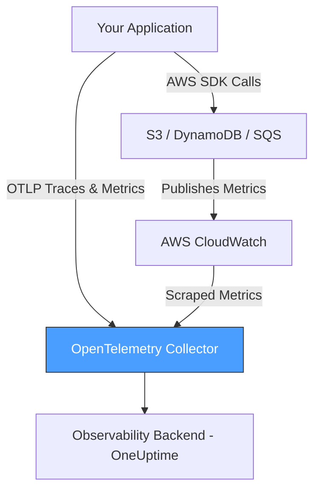
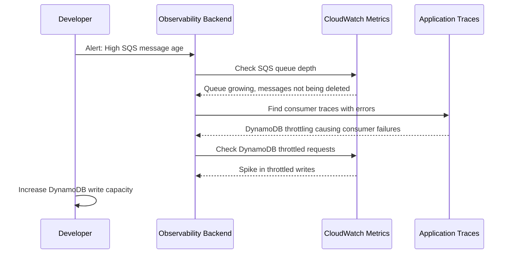

# How to Monitor AWS S3, DynamoDB, and SQS with OpenTelemetry

Author: [nawazdhandala](https://www.github.com/nawazdhandala)

Tags: OpenTelemetry, AWS, S3, DynamoDB, SQS, Monitoring, CloudWatch, Metrics

Description: Learn how to monitor AWS S3, DynamoDB, and SQS using OpenTelemetry by collecting CloudWatch metrics and tracing SDK calls for full visibility.

---

Monitoring managed AWS services like S3, DynamoDB, and SQS is tricky because you do not own the infrastructure. You cannot install agents on S3 or attach a profiler to DynamoDB. Instead, you need to pull metrics from CloudWatch and instrument your application's interactions with these services through traces and custom metrics.

OpenTelemetry gives you a unified way to do both. You can use the AWS CloudWatch receiver in the OpenTelemetry Collector to pull service metrics, and you can instrument your AWS SDK calls to trace every API call your code makes to these services.

This guide covers both approaches so you get complete visibility into how your application uses S3, DynamoDB, and SQS.

## Architecture Overview

There are two complementary layers to monitoring AWS services with OpenTelemetry: infrastructure metrics from CloudWatch and application-level traces from SDK instrumentation.



The collector sits in the middle, receiving trace data from your application and pulling CloudWatch metrics on a schedule. Both streams end up in your backend, where you can correlate high latency DynamoDB calls with table-level throttle metrics, for example.

## Collecting CloudWatch Metrics with the OpenTelemetry Collector

The OpenTelemetry Collector has a `awscloudwatch` receiver that queries CloudWatch APIs and converts the metrics into the OpenTelemetry metric format. This lets you ingest AWS service metrics alongside your application telemetry.

You will need the OpenTelemetry Collector Contrib distribution (or ADOT) since the CloudWatch receiver is not in the core distribution.

### S3 Metrics Configuration

S3 publishes request-level metrics to CloudWatch when you enable request metrics on your bucket. The following collector configuration scrapes key S3 metrics including request counts, latency, and error rates.

```yaml
# otel-collector-s3.yaml
receivers:
  awscloudwatch:
    region: us-east-1
    poll_interval: 60s   # How often to query CloudWatch
    metrics:
      named:
        # Track total number of HTTP requests to your S3 bucket
        s3_all_requests:
          metric_name: AllRequests
          namespace: AWS/S3
          period: 300s   # CloudWatch aggregation period
          statistics: [Sum]
          dimensions:
            - name: BucketName
              value: my-app-bucket
            - name: FilterId
              value: EntireBucket

        # Track first byte latency for GET requests
        s3_first_byte_latency:
          metric_name: FirstByteLatency
          namespace: AWS/S3
          period: 300s
          statistics: [Average, p99]
          dimensions:
            - name: BucketName
              value: my-app-bucket
            - name: FilterId
              value: EntireBucket

        # Track 4xx and 5xx errors
        s3_4xx_errors:
          metric_name: 4xxErrors
          namespace: AWS/S3
          period: 300s
          statistics: [Sum]
          dimensions:
            - name: BucketName
              value: my-app-bucket
            - name: FilterId
              value: EntireBucket

        s3_5xx_errors:
          metric_name: 5xxErrors
          namespace: AWS/S3
          period: 300s
          statistics: [Sum]
          dimensions:
            - name: BucketName
              value: my-app-bucket
            - name: FilterId
              value: EntireBucket
```

Remember to enable S3 request metrics in the bucket configuration first, otherwise CloudWatch will not have data to report.

### DynamoDB Metrics Configuration

DynamoDB publishes several critical metrics to CloudWatch by default. The most important ones are consumed capacity, throttled requests, and latency.

```yaml
# Add these to the awscloudwatch receiver metrics section
        # Track consumed read capacity units on your table
        dynamodb_consumed_rcu:
          metric_name: ConsumedReadCapacityUnits
          namespace: AWS/DynamoDB
          period: 60s
          statistics: [Sum]
          dimensions:
            - name: TableName
              value: my-users-table

        # Track consumed write capacity units
        dynamodb_consumed_wcu:
          metric_name: ConsumedWriteCapacityUnits
          namespace: AWS/DynamoDB
          period: 60s
          statistics: [Sum]
          dimensions:
            - name: TableName
              value: my-users-table

        # Track throttled requests - critical for detecting capacity issues
        dynamodb_throttled_requests:
          metric_name: ThrottledRequests
          namespace: AWS/DynamoDB
          period: 60s
          statistics: [Sum]
          dimensions:
            - name: TableName
              value: my-users-table

        # Track successful request latency
        dynamodb_latency:
          metric_name: SuccessfulRequestLatency
          namespace: AWS/DynamoDB
          period: 60s
          statistics: [Average, p99]
          dimensions:
            - name: TableName
              value: my-users-table
            - name: Operation
              value: GetItem
```

DynamoDB throttling is one of the most common production issues. Having this metric in your observability platform, right next to your application traces, makes debugging much faster.

### SQS Metrics Configuration

SQS metrics tell you about queue depth, message age, and throughput. These are essential for monitoring asynchronous workloads.

```yaml
# SQS metrics configuration for the awscloudwatch receiver
        # Number of messages available for retrieval
        sqs_visible_messages:
          metric_name: ApproximateNumberOfMessagesVisible
          namespace: AWS/SQS
          period: 60s
          statistics: [Average]
          dimensions:
            - name: QueueName
              value: my-processing-queue

        # Age of oldest message in queue - indicates processing lag
        sqs_oldest_message_age:
          metric_name: ApproximateAgeOfOldestMessage
          namespace: AWS/SQS
          period: 60s
          statistics: [Maximum]
          dimensions:
            - name: QueueName
              value: my-processing-queue

        # Number of messages sent to the queue
        sqs_messages_sent:
          metric_name: NumberOfMessagesSent
          namespace: AWS/SQS
          period: 60s
          statistics: [Sum]
          dimensions:
            - name: QueueName
              value: my-processing-queue

        # Number of messages received from the queue
        sqs_messages_received:
          metric_name: NumberOfMessagesReceived
          namespace: AWS/SQS
          period: 60s
          statistics: [Sum]
          dimensions:
            - name: QueueName
              value: my-processing-queue

        # Number of messages deleted (successfully processed)
        sqs_messages_deleted:
          metric_name: NumberOfMessagesDeleted
          namespace: AWS/SQS
          period: 60s
          statistics: [Sum]
          dimensions:
            - name: QueueName
              value: my-processing-queue
```

The gap between `NumberOfMessagesReceived` and `NumberOfMessagesDeleted` tells you about processing failures. If messages are received but not deleted, your consumers are either failing or timing out.

## Complete Collector Pipeline

Here is the full collector configuration that ties the CloudWatch metrics together with a standard OTLP receiver for application traces.

```yaml
# otel-collector-full.yaml - Complete config for AWS service monitoring
receivers:
  # Receive traces and metrics from your application
  otlp:
    protocols:
      grpc:
        endpoint: 0.0.0.0:4317
      http:
        endpoint: 0.0.0.0:4318

  # Pull metrics from CloudWatch for S3, DynamoDB, and SQS
  awscloudwatch:
    region: us-east-1
    poll_interval: 60s
    metrics:
      named:
        # ... all the metrics defined above ...

processors:
  batch:
    timeout: 10s
    send_batch_size: 512

  # Add resource attributes identifying this collector
  resource:
    attributes:
      - key: service.name
        value: aws-metrics-collector
        action: upsert

exporters:
  otlphttp:
    endpoint: "https://oneuptime.com/otlp"

service:
  pipelines:
    traces:
      receivers: [otlp]
      processors: [batch]
      exporters: [otlphttp]
    metrics:
      receivers: [otlp, awscloudwatch]
      processors: [resource, batch]
      exporters: [otlphttp]
```

## Tracing AWS SDK Calls from Your Application

CloudWatch metrics give you the service-side view. To complete the picture, you need the client-side view: how your application interacts with these services. OpenTelemetry auto-instrumentation libraries for the AWS SDK capture every API call as a span.

For Python applications using boto3, install the AWS SDK instrumentation library.

```bash
# Install OpenTelemetry instrumentation for boto3 and botocore
pip install opentelemetry-instrumentation-botocore
```

The instrumentation wraps every boto3 call with a span that includes the service name, operation, and request parameters.

```python
# app.py - Example showing traced S3, DynamoDB, and SQS operations
from opentelemetry.instrumentation.botocore import BotocoreInstrumentor
import boto3

# Enable auto-instrumentation for all AWS SDK calls
BotocoreInstrumentor().instrument()

# Every call below will generate an OpenTelemetry span
s3 = boto3.client("s3")
dynamodb = boto3.resource("dynamodb")
sqs = boto3.client("sqs")

# This creates a span: "S3.GetObject"
response = s3.get_object(Bucket="my-bucket", Key="data.json")

# This creates a span: "DynamoDB.GetItem"
table = dynamodb.Table("my-users-table")
user = table.get_item(Key={"user_id": "12345"})

# This creates a span: "SQS.SendMessage"
sqs.send_message(
    QueueUrl="https://sqs.us-east-1.amazonaws.com/123456789012/my-queue",
    MessageBody='{"event": "user_signup"}'
)
```

Each span includes attributes like `rpc.service`, `rpc.method`, `aws.region`, and HTTP status codes. When a DynamoDB call is slow, you will see it in your traces alongside the CloudWatch throttling metrics.

## Correlating Metrics and Traces

The real power comes when you view CloudWatch metrics and application traces side by side. Here is a typical debugging workflow.



Without both metrics and traces flowing through the same platform, this kind of cross-service debugging requires switching between multiple AWS console tabs and guessing at correlations.

## IAM Permissions

The collector needs CloudWatch read permissions to scrape metrics. Here is a minimal IAM policy.

```json
{
  "Version": "2012-10-17",
  "Statement": [
    {
      "Effect": "Allow",
      "Action": [
        "cloudwatch:GetMetricData",
        "cloudwatch:GetMetricStatistics",
        "cloudwatch:ListMetrics"
      ],
      "Resource": "*"
    }
  ]
}
```

Attach this policy to the IAM role used by your collector, whether that is an EC2 instance profile, ECS task role, or EKS service account via IRSA.

## Summary

Monitoring AWS managed services with OpenTelemetry involves two layers. First, use the CloudWatch receiver in the collector to pull infrastructure metrics from S3, DynamoDB, and SQS. Second, instrument your application's AWS SDK calls to capture client-side traces for every API call. Together, these give you both the service provider view and the consumer view, which is exactly what you need to troubleshoot issues that span multiple AWS services.
