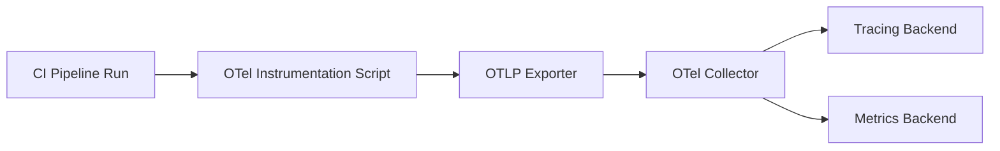

# How to Monitor Build Times and CI Pipeline Performance with OpenTelemetry

Author: [nawazdhandala](https://www.github.com/nawazdhandala)

Tags: OpenTelemetry, CI/CD, Build Performance, GitHub Actions, Observability, DevOps

Description: Learn how to instrument your CI/CD pipelines with OpenTelemetry to monitor build times, track step-level performance, and detect regressions before they slow down your team.

---

Slow CI pipelines are a silent productivity killer. When a build that used to take four minutes starts taking twelve, developers context-switch, stack up pull requests, and lose momentum. The worst part is that most teams have no systematic way to track build performance over time. They notice it is slow, complain in Slack, and move on.

OpenTelemetry changes this by treating CI pipeline runs as distributed traces. Each pipeline run becomes a trace. Each job becomes a span. Each step within a job becomes a child span. You get the same hierarchical timing visibility that you would expect from application tracing, but applied to your build and deploy infrastructure.

This guide covers how to instrument CI pipelines, with a focus on GitHub Actions, to emit OpenTelemetry traces and metrics that give you real observability into build performance.

## The Case for CI Observability

Most CI systems give you a log view of each run. Some show a timeline. But none of them give you trend data out of the box. You cannot easily answer questions like:

- How has the average build time changed over the last 30 days?
- Which step contributes the most to total pipeline duration?
- Are test runs getting slower, and if so, which test suites are responsible?
- How often do builds fail at the linting stage vs. the integration test stage?

OpenTelemetry lets you answer all of these by exporting structured telemetry from your CI runs into a backend where you can query, visualize, and alert on it.

## Architecture

The approach uses a lightweight wrapper script or GitHub Action that creates OpenTelemetry spans around each stage of your pipeline. Spans are exported via OTLP to a Collector, which forwards them to your tracing backend.



For GitHub Actions specifically, you can use the `otel-cli` tool or a custom action to wrap steps with span creation. For Jenkins, GitLab CI, or other platforms, the same approach applies with minor adjustments to how you invoke the instrumentation.

## Instrumenting GitHub Actions with otel-cli

The `otel-cli` is a command-line tool that creates OpenTelemetry spans from shell scripts. It is perfect for CI environments where you want to wrap existing commands without modifying them.

Install it in your workflow:

```yaml
# .github/workflows/build.yml
# GitHub Actions workflow with OpenTelemetry instrumentation

name: Build and Test

on:
  push:
    branches: [main]
  pull_request:
    branches: [main]

env:
  # Point to your OTel Collector endpoint
  OTEL_EXPORTER_OTLP_ENDPOINT: "https://collector.example.com:4317"
  OTEL_SERVICE_NAME: "ci-pipeline"

jobs:
  build:
    runs-on: ubuntu-latest
    steps:
      - name: Checkout code
        uses: actions/checkout@v4

      - name: Install otel-cli
        run: |
          # Download and install the otel-cli binary
          curl -L -o otel-cli.tar.gz \
            https://github.com/equinix-labs/otel-cli/releases/latest/download/otel-cli-linux-amd64.tar.gz
          tar xzf otel-cli.tar.gz
          sudo mv otel-cli /usr/local/bin/

      - name: Install dependencies
        run: |
          # Wrap the install step in an OTel span
          otel-cli exec \
            --name "install-dependencies" \
            --attrs "ci.step=install,ci.job=build" \
            -- npm ci

      - name: Lint
        run: |
          # Track linting duration as a span
          otel-cli exec \
            --name "lint" \
            --attrs "ci.step=lint,ci.job=build" \
            -- npm run lint

      - name: Run unit tests
        run: |
          # Track unit test execution time
          otel-cli exec \
            --name "unit-tests" \
            --attrs "ci.step=test,ci.test.type=unit,ci.job=build" \
            -- npm test

      - name: Build
        run: |
          # Track the build step
          otel-cli exec \
            --name "build" \
            --attrs "ci.step=build,ci.job=build" \
            -- npm run build
```

The `otel-cli exec` command creates a span, runs the wrapped command, and closes the span when the command finishes. If the command exits with a non-zero code, the span is marked as errored. The `--attrs` flag lets you attach custom attributes for filtering and grouping.

## Creating a Pipeline-Level Trace

The individual step spans from `otel-cli` are useful, but to get a single trace that represents the entire pipeline run, you need a parent span that ties everything together. Here is a wrapper script that does this:

```bash
#!/bin/bash
# scripts/ci-trace-wrapper.sh
# Creates a parent span for the entire CI pipeline run and links child spans

set -euo pipefail

# Generate a trace ID that will be shared across all steps
export TRACEPARENT=$(otel-cli span background \
  --name "pipeline: ${GITHUB_WORKFLOW}" \
  --attrs "ci.pipeline=${GITHUB_WORKFLOW},ci.run_id=${GITHUB_RUN_ID},ci.ref=${GITHUB_REF},ci.sha=${GITHUB_SHA},ci.actor=${GITHUB_ACTOR}" \
  --timeout 3600)

echo "TRACEPARENT=${TRACEPARENT}" >> "$GITHUB_ENV"

echo "Pipeline trace started with traceparent: ${TRACEPARENT}"
```

Run this script at the beginning of your workflow, and all subsequent `otel-cli exec` calls will automatically pick up the `TRACEPARENT` environment variable, making their spans children of the pipeline span.

```yaml
      # Add this as the first step after checkout and otel-cli install
      - name: Start pipeline trace
        run: |
          # Initialize the parent span for the entire pipeline
          chmod +x scripts/ci-trace-wrapper.sh
          ./scripts/ci-trace-wrapper.sh
```

## A Python-Based Approach for More Control

If you need richer instrumentation, such as recording custom metrics alongside traces, or you want to integrate with existing Python tooling, here is a script that instruments a CI pipeline using the OpenTelemetry Python SDK:

```python
# scripts/ci_telemetry.py
# Python-based CI telemetry that emits both traces and metrics

import subprocess
import sys
import os
import time

from opentelemetry import trace, metrics
from opentelemetry.sdk.trace import TracerProvider
from opentelemetry.sdk.trace.export import BatchSpanProcessor
from opentelemetry.sdk.metrics import MeterProvider
from opentelemetry.sdk.metrics.export import PeriodicExportingMetricReader
from opentelemetry.exporter.otlp.proto.grpc.trace_exporter import OTLPSpanExporter
from opentelemetry.exporter.otlp.proto.grpc.metric_exporter import OTLPMetricExporter
from opentelemetry.trace.status import Status, StatusCode


def setup_telemetry():
    """Initialize both tracing and metrics providers."""
    # Set up tracing
    trace_exporter = OTLPSpanExporter()
    trace_provider = TracerProvider()
    trace_provider.add_span_processor(BatchSpanProcessor(trace_exporter))
    trace.set_tracer_provider(trace_provider)

    # Set up metrics for build duration histograms
    metric_exporter = OTLPMetricExporter()
    reader = PeriodicExportingMetricReader(metric_exporter, export_interval_millis=5000)
    meter_provider = MeterProvider(metric_readers=[reader])
    metrics.set_meter_provider(meter_provider)

    return trace.get_tracer("ci.pipeline"), metrics.get_meter("ci.pipeline")


def run_step(tracer, meter, step_name, command, parent_context=None):
    """Execute a CI step and record its duration as both a span and a metric."""
    # Create a histogram to track step durations
    duration_histogram = meter.create_histogram(
        name="ci.step.duration",
        description="Duration of CI pipeline steps in seconds",
        unit="s",
    )

    # Start a span for this step
    with tracer.start_as_current_span(step_name, context=parent_context) as span:
        span.set_attribute("ci.step.command", command)
        span.set_attribute("ci.pipeline", os.environ.get("GITHUB_WORKFLOW", "local"))
        span.set_attribute("ci.run_id", os.environ.get("GITHUB_RUN_ID", "0"))

        start_time = time.time()
        try:
            # Run the actual command
            result = subprocess.run(
                command, shell=True, check=True,
                capture_output=True, text=True
            )
            span.set_status(Status(StatusCode.OK))
            span.set_attribute("ci.step.exit_code", 0)
        except subprocess.CalledProcessError as e:
            span.set_status(Status(StatusCode.ERROR, str(e)))
            span.set_attribute("ci.step.exit_code", e.returncode)
            span.set_attribute("ci.step.stderr", e.stderr[:1000])
            raise
        finally:
            elapsed = time.time() - start_time
            # Record the duration as a metric for aggregation
            duration_histogram.record(elapsed, {"ci.step": step_name})
            span.set_attribute("ci.step.duration_seconds", elapsed)


if __name__ == "__main__":
    tracer, meter = setup_telemetry()

    # Define pipeline steps
    steps = [
        ("install-dependencies", "npm ci"),
        ("lint", "npm run lint"),
        ("unit-tests", "npm test"),
        ("build", "npm run build"),
    ]

    # Execute all steps under a single pipeline span
    with tracer.start_as_current_span("pipeline-run") as pipeline_span:
        pipeline_span.set_attribute("ci.pipeline", os.environ.get("GITHUB_WORKFLOW", "local"))
        pipeline_span.set_attribute("ci.sha", os.environ.get("GITHUB_SHA", "unknown"))

        for step_name, command in steps:
            run_step(tracer, meter, step_name, command)

    # Flush all telemetry before the process exits
    trace.get_tracer_provider().force_flush()
    metrics.get_meter_provider().force_flush()
```

This script creates both spans and metric histograms. The spans give you per-run details, while the histograms let you build dashboards showing percentile distributions of step durations across hundreds of pipeline runs.

## Collector Configuration

Configure your Collector to receive traces and metrics from CI runs:

```yaml
# otel-collector-config.yaml
# Collector config for CI pipeline telemetry

receivers:
  otlp:
    protocols:
      grpc:
        endpoint: 0.0.0.0:4317
      http:
        endpoint: 0.0.0.0:4318

processors:
  batch:
    timeout: 10s

  resource:
    attributes:
      # Tag all CI telemetry with a consistent service name
      - key: service.name
        value: "ci-pipeline"
        action: upsert

exporters:
  otlp:
    endpoint: your-backend:4317

service:
  pipelines:
    traces:
      receivers: [otlp]
      processors: [resource, batch]
      exporters: [otlp]
    metrics:
      receivers: [otlp]
      processors: [resource, batch]
      exporters: [otlp]
```

## Building Dashboards and Alerts

Once telemetry is flowing, build dashboards that answer the questions your team actually cares about:

- **Build duration trend**: Plot the p50 and p95 of total pipeline duration over time. A creeping p95 means something is getting slower.
- **Step breakdown**: Show each step's average duration as a stacked bar chart. This makes it obvious which step dominates.
- **Failure rate by step**: Track which steps fail most often. A flaky test step that fails 10% of the time is worth investigating.
- **Queue time**: If your CI system has limited runners, track the time between trigger and first step execution to measure queue wait.

For alerts, start with these:

- Total pipeline duration exceeds 2x the 30-day average
- Any step failure rate exceeds 15% over a rolling 24-hour window
- Build success rate drops below 80% in the last hour

## Extending to Other CI Platforms

The same approach works on any CI platform. For GitLab CI, use `before_script` and `after_script` hooks. For Jenkins, use the OpenTelemetry plugin that is available in the Jenkins plugin ecosystem. For CircleCI, wrap step commands with `otel-cli` just like in the GitHub Actions example.

The key principle is the same everywhere: treat each pipeline run as a trace, each job as a span, and each step as a child span. Export to a Collector, and let your observability backend handle the rest.

## Wrapping Up

CI pipeline performance degrades gradually, and without proper observability, teams just accept slower builds as the new normal. OpenTelemetry gives you the tools to measure, track, and alert on build performance with the same rigor you apply to production services. Once you can see exactly which step is slow and how it trends over time, you can make targeted improvements instead of guessing. Start with traces for visibility, add metrics for trend analysis, and set up alerts so regressions never sneak past you again.
