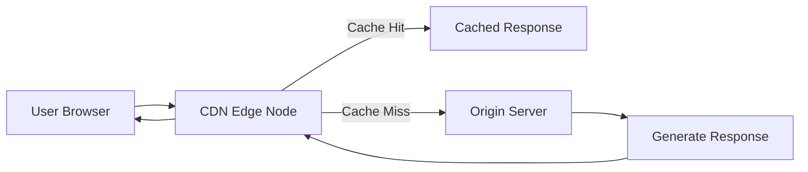

# How to Monitor Content Delivery Networks (CDN) with OpenTelemetry

Author: [nawazdhandala](https://www.github.com/nawazdhandala)

Tags: OpenTelemetry, CDN, Monitoring, Performance, Edge Computing, Observability

Description: Learn how to monitor CDN performance using OpenTelemetry to track cache hit ratios, edge latency, origin fetches, and content delivery health.

---

Content delivery networks sit between your users and your origin servers, caching and serving content from edge locations around the world. When a CDN is working well, users get fast responses and your origin servers stay relaxed. When something goes wrong, the symptoms can be confusing. Users in one region experience slow loads while everyone else is fine. Cache hit ratios drop unexpectedly. Origin servers suddenly get hammered with requests that should have been served from the edge.

Monitoring your CDN with OpenTelemetry gives you visibility into what is actually happening at the edge, at the origin, and everywhere in between. This guide walks through practical approaches to instrumenting CDN-related workflows so you can catch problems before your users notice them.

## Understanding CDN Observability Challenges

CDNs are unique from a monitoring perspective because you often do not control the edge infrastructure directly. Most CDN providers give you logs and some basic analytics, but integrating that data into your broader observability stack requires extra work.

The key areas to monitor include cache hit and miss ratios, time to first byte from edge locations, origin fetch latency when the cache misses, error rates at both the edge and origin, and content invalidation or purge operations.

Here is a high-level view of how requests flow through a CDN:



## Instrumenting Your Origin Server

The origin server is where you have the most control. Start by instrumenting it to understand how CDN-originated requests behave compared to direct requests.

```python
# origin_server.py - Instrumented origin with CDN-awareness
from opentelemetry import trace, metrics
from opentelemetry.sdk.trace import TracerProvider
from opentelemetry.sdk.trace.export import BatchSpanProcessor
from opentelemetry.exporter.otlp.proto.grpc.trace_exporter import OTLPSpanExporter
from opentelemetry.sdk.resources import Resource
from flask import Flask, request

# Initialize the tracer with origin-specific resource info
resource = Resource.create({
    "service.name": "cdn-origin-server",
    "service.version": "1.4.0",
    "deployment.environment": "production",
})

provider = TracerProvider(resource=resource)
provider.add_span_processor(BatchSpanProcessor(OTLPSpanExporter()))
trace.set_tracer_provider(provider)

tracer = trace.get_tracer("cdn-origin-server")

app = Flask(__name__)

@app.route("/assets/<path:asset_path>")
def serve_asset(asset_path):
    with tracer.start_as_current_span("cdn.origin_fetch") as span:
        # Extract CDN-specific headers that tell us about the request
        cdn_request_id = request.headers.get("X-CDN-Request-Id", "unknown")
        cdn_pop = request.headers.get("X-CDN-POP", "unknown")
        cache_status = request.headers.get("X-Cache-Status", "unknown")

        # Record CDN metadata as span attributes
        span.set_attribute("cdn.request_id", cdn_request_id)
        span.set_attribute("cdn.pop_location", cdn_pop)
        span.set_attribute("cdn.cache_status", cache_status)
        span.set_attribute("cdn.asset_path", asset_path)
        span.set_attribute("cdn.is_origin_fetch", True)

        # Determine the content type and size
        content, content_type, size = fetch_asset(asset_path)

        span.set_attribute("cdn.content_type", content_type)
        span.set_attribute("cdn.response_size_bytes", size)

        return content, 200, {"Content-Type": content_type}
```

Most CDN providers include custom headers in requests they send to your origin. Headers like `X-CDN-POP` tell you which edge location made the request, and `X-Cache-Status` tells you why the request reached your origin (cache miss, expired content, cache bypass, etc.). Capturing these as span attributes lets you correlate origin performance with specific edge locations.

## Tracking Cache Performance with Metrics

Cache hit ratio is the single most important CDN metric. A drop in hit ratio means more requests are reaching your origin, which increases latency for users and load on your infrastructure.

```python
from opentelemetry import metrics
from opentelemetry.sdk.metrics import MeterProvider
from opentelemetry.sdk.metrics.export import PeriodicExportingMetricReader
from opentelemetry.exporter.otlp.proto.grpc.metric_exporter import OTLPMetricExporter

# Set up the meter provider for CDN metrics
metric_reader = PeriodicExportingMetricReader(OTLPMetricExporter())
meter_provider = MeterProvider(
    resource=resource,
    metric_readers=[metric_reader],
)
metrics.set_meter_provider(meter_provider)

meter = metrics.get_meter("cdn-metrics", "1.0.0")

# Counter for cache hit and miss events
cache_requests = meter.create_counter(
    name="cdn.cache.requests",
    description="Number of CDN cache lookups",
    unit="1",
)

# Histogram for edge-to-user latency
edge_latency = meter.create_histogram(
    name="cdn.edge.latency_ms",
    description="Latency from CDN edge to the end user",
    unit="ms",
)

# Histogram for origin fetch duration
origin_fetch_duration = meter.create_histogram(
    name="cdn.origin.fetch_duration_ms",
    description="Time taken for the CDN to fetch from origin",
    unit="ms",
)

def record_cdn_metrics(log_entry):
    """Parse a CDN log entry and record metrics."""
    # Determine cache status from the log
    cache_status = log_entry.get("cache_status", "unknown")
    pop_location = log_entry.get("pop", "unknown")
    content_type = log_entry.get("content_type", "unknown")

    # Increment cache request counter with status label
    cache_requests.add(1, {
        "cdn.cache_status": cache_status,    # hit, miss, expired, bypass
        "cdn.pop_location": pop_location,
        "cdn.content_type": content_type,
    })

    # Record latency metrics
    if "edge_latency_ms" in log_entry:
        edge_latency.record(log_entry["edge_latency_ms"], {
            "cdn.pop_location": pop_location,
        })

    if "origin_fetch_ms" in log_entry and cache_status != "hit":
        origin_fetch_duration.record(log_entry["origin_fetch_ms"], {
            "cdn.pop_location": pop_location,
        })
```

By breaking down cache metrics by POP location and content type, you can quickly spot regional issues. If a specific edge location suddenly has a high miss rate while others are fine, that points to a localized cache eviction problem or a configuration issue at that POP.

## Processing CDN Logs with the OpenTelemetry Collector

Most CDN providers offer real-time log streaming or periodic log exports. You can use the OpenTelemetry Collector to ingest these logs, extract metrics, and forward everything to your observability backend.

```yaml
# otel-collector-config.yaml - CDN log processing pipeline
receivers:
  # Receive CDN logs via HTTP endpoint
  # Your CDN provider sends log batches here
  otlp:
    protocols:
      http:
        endpoint: 0.0.0.0:4318

  # Or pull logs from a file if the CDN writes locally
  filelog:
    include:
      - /var/log/cdn/*.json
    operators:
      # Parse JSON-formatted CDN logs
      - type: json_parser
        timestamp:
          parse_from: attributes.timestamp
          layout: "%Y-%m-%dT%H:%M:%S.%LZ"

processors:
  # Add resource attributes to all CDN telemetry
  resource:
    attributes:
      - key: service.name
        value: cdn-edge
        action: upsert

  # Extract metrics from log attributes
  # This turns log volume into actionable metrics
  attributes:
    actions:
      - key: cdn.cache_status
        from_attribute: cache_status
        action: upsert
      - key: cdn.status_code
        from_attribute: status_code
        action: upsert
      - key: cdn.pop_location
        from_attribute: pop
        action: upsert

  batch:
    timeout: 10s
    send_batch_size: 500

exporters:
  otlp:
    endpoint: observability-backend:4317

service:
  pipelines:
    logs:
      receivers: [filelog]
      processors: [resource, attributes, batch]
      exporters: [otlp]
```

This configuration takes raw CDN log files, parses them, enriches them with resource attributes, and forwards them to your observability backend. The key is standardizing the attribute names so your dashboards and alerts work consistently regardless of which CDN provider you are using.

## Monitoring Cache Invalidation and Purge Operations

Cache purges are operationally risky. A bad purge can wipe your entire cache and send a thundering herd of requests to your origin. Tracing purge operations helps you understand who triggered them, what was affected, and how the system recovered.

```python
async def purge_cdn_cache(purge_request):
    """Purge CDN cache with full tracing."""
    with tracer.start_as_current_span("cdn.cache_purge") as span:
        span.set_attribute("cdn.purge.type", purge_request.purge_type)
        span.set_attribute("cdn.purge.initiated_by", purge_request.user)
        span.set_attribute("cdn.purge.pattern", purge_request.pattern)

        # Record the scope of the purge
        if purge_request.purge_type == "wildcard":
            span.set_attribute("cdn.purge.scope", "broad")
            span.add_event("wildcard_purge_warning", {
                "message": "Broad cache purge may cause origin load spike",
                "pattern": purge_request.pattern,
            })
        else:
            span.set_attribute("cdn.purge.scope", "targeted")

        # Execute the purge via CDN API
        result = await cdn_api.purge(
            pattern=purge_request.pattern,
            regions=purge_request.regions or "all",
        )

        span.set_attribute("cdn.purge.affected_objects", result.objects_purged)
        span.set_attribute("cdn.purge.duration_ms", result.duration_ms)
        span.set_attribute("cdn.purge.regions_affected", str(result.regions))

        # Record a metric for purge tracking
        purge_counter.add(1, {
            "cdn.purge.type": purge_request.purge_type,
            "cdn.purge.scope": purge_request.purge_type,
        })

        return result
```

Adding a span event for wildcard purges is especially useful. You can set up alerts that fire whenever a broad purge happens, giving your operations team a heads-up that origin load might spike in the next few minutes.

## Synthetic Monitoring from Edge Locations

To get a true picture of CDN performance from the user's perspective, you can run synthetic checks that measure time to first byte and total download time from different geographic regions.

```python
import aiohttp
import time

async def synthetic_cdn_check(url, region):
    """Run a synthetic CDN check and record telemetry."""
    with tracer.start_as_current_span("cdn.synthetic_check") as span:
        span.set_attribute("cdn.synthetic.url", url)
        span.set_attribute("cdn.synthetic.region", region)

        start = time.monotonic()

        async with aiohttp.ClientSession() as session:
            async with session.get(url) as response:
                # Measure time to first byte
                ttfb = (time.monotonic() - start) * 1000

                # Read the full response
                body = await response.read()
                total_time = (time.monotonic() - start) * 1000

                # Extract CDN headers from the response
                cache_status = response.headers.get("X-Cache", "unknown")
                served_by = response.headers.get("X-Served-By", "unknown")

                span.set_attribute("cdn.synthetic.ttfb_ms", ttfb)
                span.set_attribute("cdn.synthetic.total_time_ms", total_time)
                span.set_attribute("cdn.synthetic.cache_status", cache_status)
                span.set_attribute("cdn.synthetic.served_by", served_by)
                span.set_attribute("cdn.synthetic.status_code", response.status)
                span.set_attribute("cdn.synthetic.response_size", len(body))

                # Record in histograms for long-term trending
                ttfb_histogram.record(ttfb, {
                    "cdn.synthetic.region": region,
                    "cdn.cache_status": cache_status,
                })

                return {
                    "ttfb_ms": ttfb,
                    "total_ms": total_time,
                    "cache": cache_status,
                    "status": response.status,
                }
```

Running these checks on a schedule from multiple regions gives you a continuous baseline for CDN performance. When the numbers deviate from the baseline, you know something has changed, whether it is a cache configuration update, a CDN provider issue, or a problem with your origin.

## Alerting on CDN Degradation

With your metrics flowing into your observability backend, set up alerts that catch CDN issues early. The most important alerts to configure are a cache hit ratio dropping below your baseline (typically 85-95% depending on your content mix), origin fetch latency exceeding acceptable thresholds, error rate spikes at the edge (especially 5xx responses), and TTFB increases in specific geographic regions.

Using OpenTelemetry's consistent attribute naming across all your CDN telemetry makes building these alerts straightforward. You can group by `cdn.pop_location` to get region-specific alerting, or by `cdn.content_type` to catch issues with specific asset types.

## Wrapping Up

CDN monitoring with OpenTelemetry brings your edge infrastructure into the same observability platform as everything else. By instrumenting your origin server, processing CDN logs through the Collector, tracing cache operations, and running synthetic checks, you build a complete picture of how content reaches your users. The key is treating the CDN not as a black box but as another component in your distributed system that deserves the same level of observability as your application services.
