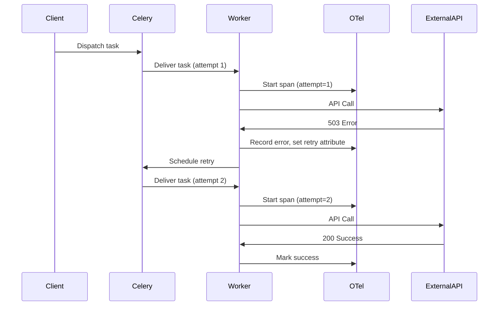
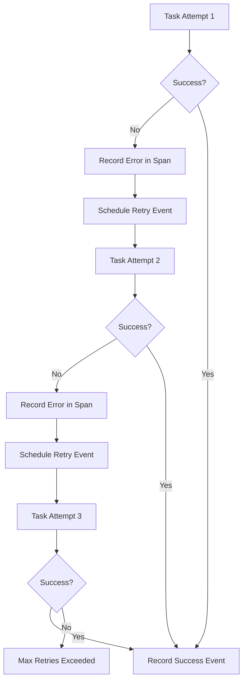

# How to Monitor Celery Task Retries and Failures with OpenTelemetry Spans

Author: [nawazdhandala](https://www.github.com/nawazdhandala)

Tags: OpenTelemetry, Celery, Retries, Failures, Python, Error Tracking

Description: Learn how to instrument Celery task retries and failures with OpenTelemetry spans to track error patterns, retry behavior, and task reliability metrics.

Celery's automatic retry mechanism is powerful for handling transient failures, but without proper observability, it becomes a black box. When tasks fail and retry, you need to know why they failed, how many times they retried, and whether retries eventually succeed or exhaust their attempts. OpenTelemetry spans provide the perfect mechanism to track this behavior and identify patterns in task failures.

The challenge is capturing retry metadata, linking retry attempts together, and distinguishing between temporary failures that resolve and permanent failures that require intervention. You also need to track the time between retries and the cumulative impact of retries on system resources.

## Understanding Celery Retry Behavior

Celery supports automatic retries with exponential backoff, max retry limits, and custom retry logic. Each retry attempt is essentially a new task execution, but they should all be traced as part of the same logical operation.



## Setting Up OpenTelemetry with Celery

Install the required packages for comprehensive Celery instrumentation.

```bash
pip install celery \
    redis \
    opentelemetry-api \
    opentelemetry-sdk \
    opentelemetry-instrumentation-celery \
    opentelemetry-exporter-otlp \
    opentelemetry-semantic-conventions
```

Initialize OpenTelemetry with configuration optimized for tracking retries and failures.

```python
from opentelemetry import trace
from opentelemetry.sdk.trace import TracerProvider
from opentelemetry.sdk.trace.export import BatchSpanProcessor
from opentelemetry.exporter.otlp.proto.grpc.trace_exporter import OTLPSpanExporter
from opentelemetry.trace import Status, StatusCode, SpanKind
from opentelemetry.semconv.trace import SpanAttributes
from celery import Celery, Task
from celery.exceptions import Retry, MaxRetriesExceededError
import time
import logging

# Configure logging
logging.basicConfig(level=logging.INFO)
logger = logging.getLogger(__name__)

# Set up OpenTelemetry
provider = TracerProvider()
processor = BatchSpanProcessor(OTLPSpanExporter(
    endpoint="http://localhost:4317",
    insecure=True
))
provider.add_span_processor(processor)
trace.set_tracer_provider(provider)

# Get tracer
tracer = trace.get_tracer(__name__)

# Create Celery app
app = Celery('tasks', broker='redis://localhost:6379/0')
app.conf.update(
    task_serializer='json',
    accept_content=['json'],
    result_serializer='json',
    task_track_started=True,
)
```

## Creating a Retry-Aware Task Base Class

Build a custom task base class that automatically tracks retry attempts and failure reasons.

```python
class RetryTrackedTask(Task):
    """
    Custom Celery Task that tracks retries and failures with OpenTelemetry.

    Automatically records:
    - Retry attempt number
    - Failure reasons
    - Time between retries
    - Final success or failure status
    """

    def __call__(self, *args, **kwargs):
        """Execute task with retry tracking."""
        # Get retry information from request
        task_id = self.request.id
        retries = self.request.retries
        max_retries = self.max_retries

        # Start span for this execution attempt
        with tracer.start_as_current_span(
            f"celery.task.{self.name}",
            kind=SpanKind.CONSUMER
        ) as span:
            # Add task metadata
            span.set_attribute("celery.task.name", self.name)
            span.set_attribute("celery.task.id", task_id)
            span.set_attribute("celery.task.retry.current", retries)
            span.set_attribute("celery.task.retry.max", max_retries)

            # Calculate whether this is a retry
            is_retry = retries > 0
            span.set_attribute("celery.task.is_retry", is_retry)

            if is_retry:
                span.add_event("task_retry_attempt", {
                    "retry.number": retries,
                    "retry.max": max_retries,
                    "retry.remaining": max_retries - retries
                })

            try:
                # Execute the task
                result = super().__call__(*args, **kwargs)

                # Task succeeded
                span.set_status(Status(StatusCode.OK))
                span.set_attribute("celery.task.status", "success")

                if is_retry:
                    # Task succeeded after retry
                    span.add_event("task_retry_succeeded", {
                        "retry.attempts": retries
                    })
                    logger.info(f"Task {task_id} succeeded after {retries} retries")

                return result

            except Retry as exc:
                # Task is being retried
                span.set_attribute("celery.task.status", "retrying")
                span.add_event("task_scheduled_for_retry", {
                    "retry.eta": str(exc.when) if hasattr(exc, 'when') else None,
                    "retry.reason": str(exc)
                })

                # Record the exception that caused the retry
                if exc.__cause__:
                    span.record_exception(exc.__cause__)
                    span.set_attribute("celery.task.retry.reason", str(exc.__cause__))

                span.set_status(Status(StatusCode.ERROR, "Task will retry"))
                raise

            except MaxRetriesExceededError as exc:
                # Task failed permanently
                span.set_attribute("celery.task.status", "failed_max_retries")
                span.add_event("task_max_retries_exceeded", {
                    "retry.attempts": retries,
                    "retry.max": max_retries
                })

                span.record_exception(exc)
                span.set_status(Status(StatusCode.ERROR, "Max retries exceeded"))
                logger.error(f"Task {task_id} failed after {retries} retry attempts")
                raise

            except Exception as exc:
                # Task failed with unhandled exception
                span.set_attribute("celery.task.status", "failed")
                span.set_attribute("error.type", type(exc).__name__)

                span.record_exception(exc)
                span.set_status(Status(StatusCode.ERROR, str(exc)))
                logger.error(f"Task {task_id} failed: {exc}")
                raise

    def on_retry(self, exc, task_id, args, kwargs, einfo):
        """
        Called when a task is retried.
        Creates a link event to connect retry attempts.
        """
        with tracer.start_as_current_span("celery.task.on_retry") as span:
            span.set_attribute("celery.task.name", self.name)
            span.set_attribute("celery.task.id", task_id)
            span.set_attribute("celery.task.retry.current", self.request.retries)

            span.add_event("retry_scheduled", {
                "exception": str(exc),
                "exception.type": type(exc).__name__
            })

    def on_failure(self, exc, task_id, args, kwargs, einfo):
        """Called when a task fails permanently."""
        with tracer.start_as_current_span("celery.task.on_failure") as span:
            span.set_attribute("celery.task.name", self.name)
            span.set_attribute("celery.task.id", task_id)
            span.set_attribute("celery.task.failed", True)

            span.add_event("task_failed_permanently", {
                "exception": str(exc),
                "exception.type": type(exc).__name__,
                "retry.attempts": self.request.retries
            })

    def on_success(self, retval, task_id, args, kwargs):
        """Called when a task completes successfully."""
        # Only log if this was a retry that succeeded
        if self.request.retries > 0:
            with tracer.start_as_current_span("celery.task.on_success_after_retry") as span:
                span.set_attribute("celery.task.name", self.name)
                span.set_attribute("celery.task.id", task_id)
                span.set_attribute("celery.task.retry.total_attempts", self.request.retries)

                span.add_event("task_recovered", {
                    "retry.count": self.request.retries
                })
```

## Creating Tasks with Retry Logic

Define tasks that use the retry-tracking base class and implement intelligent retry strategies.

```python
import requests
from requests.exceptions import RequestException

@app.task(
    base=RetryTrackedTask,
    bind=True,
    autoretry_for=(RequestException,),
    retry_kwargs={'max_retries': 5},
    retry_backoff=True,
    retry_backoff_max=600,
    retry_jitter=True
)
def fetch_external_api(self, url: str):
    """
    Fetch data from external API with automatic retry on failures.

    Args:
        url: The API endpoint to fetch from

    Retries on RequestException with exponential backoff up to 5 times.
    """
    with tracer.start_as_current_span("fetch_api_data") as span:
        span.set_attribute(SpanAttributes.HTTP_URL, url)
        span.set_attribute(SpanAttributes.HTTP_METHOD, "GET")

        try:
            # Make the API request
            response = requests.get(url, timeout=10)

            span.set_attribute(SpanAttributes.HTTP_STATUS_CODE, response.status_code)

            # Check for HTTP errors
            response.raise_for_status()

            span.set_attribute("http.response.size", len(response.content))
            return response.json()

        except requests.HTTPError as e:
            # Record HTTP error details
            span.set_attribute("error.http_status", e.response.status_code)
            span.record_exception(e)

            # Retry on 5xx errors, fail immediately on 4xx
            if 500 <= e.response.status_code < 600:
                logger.warning(f"API returned {e.response.status_code}, will retry")
                raise  # This triggers autoretry

            # Don't retry on client errors
            span.set_attribute("error.no_retry", True)
            raise

        except RequestException as e:
            # Network errors, timeouts, etc
            span.record_exception(e)
            logger.warning(f"Request failed: {e}, will retry")
            raise  # This triggers autoretry


@app.task(
    base=RetryTrackedTask,
    bind=True,
    max_retries=3,
    default_retry_delay=60
)
def process_data_with_custom_retry(self, data_id: str):
    """
    Process data with custom retry logic.
    Uses manual retry control for fine-grained error handling.
    """
    with tracer.start_as_current_span("process_data") as span:
        span.set_attribute("data.id", data_id)

        try:
            # Simulate data processing that might fail
            result = process_complex_data(data_id)

            span.set_attribute("process.result", "success")
            return result

        except ValueError as exc:
            # Non-retryable error
            span.set_attribute("error.retryable", False)
            span.record_exception(exc)
            logger.error(f"Data validation error for {data_id}: {exc}")
            raise

        except Exception as exc:
            # Retryable error
            span.set_attribute("error.retryable", True)
            span.record_exception(exc)

            # Custom retry logic with exponential backoff
            retry_delay = self.default_retry_delay * (2 ** self.request.retries)

            span.add_event("scheduling_retry", {
                "retry.delay_seconds": retry_delay,
                "retry.attempt": self.request.retries + 1
            })

            logger.warning(f"Processing failed for {data_id}, retrying in {retry_delay}s")

            # Manually raise retry exception
            raise self.retry(exc=exc, countdown=retry_delay)


def process_complex_data(data_id: str):
    """Simulate complex data processing that might fail."""
    import random

    # Simulate different failure scenarios
    rand = random.random()

    if rand < 0.3:
        # Transient failure
        raise ConnectionError("Database temporarily unavailable")
    elif rand < 0.4:
        # Permanent failure
        raise ValueError(f"Invalid data format for {data_id}")
    else:
        # Success
        time.sleep(0.5)
        return {"processed": data_id, "status": "complete"}
```

## Tracking Retry Patterns and Metrics

Use OpenTelemetry metrics alongside spans to track aggregate retry behavior.

```python
from opentelemetry import metrics
from opentelemetry.sdk.metrics import MeterProvider
from opentelemetry.sdk.metrics.export import PeriodicExportingMetricReader
from opentelemetry.exporter.otlp.proto.grpc.metric_exporter import OTLPMetricExporter

# Set up metrics
metric_reader = PeriodicExportingMetricReader(
    OTLPMetricExporter(endpoint="http://localhost:4317", insecure=True),
    export_interval_millis=5000
)
meter_provider = MeterProvider(metric_readers=[metric_reader])
metrics.set_meter_provider(meter_provider)

# Get meter
meter = metrics.get_meter(__name__)

# Create metrics for retry tracking
task_retry_counter = meter.create_counter(
    "celery.task.retries",
    description="Number of task retry attempts",
    unit="retries"
)

task_failure_counter = meter.create_counter(
    "celery.task.failures",
    description="Number of permanent task failures",
    unit="failures"
)

task_success_after_retry_counter = meter.create_counter(
    "celery.task.success_after_retry",
    description="Tasks that succeeded after retrying",
    unit="tasks"
)

retry_delay_histogram = meter.create_histogram(
    "celery.task.retry_delay",
    description="Time between retry attempts",
    unit="seconds"
)


class MetricsTrackedTask(RetryTrackedTask):
    """Task base class that tracks both spans and metrics."""

    def __call__(self, *args, **kwargs):
        """Execute task with metrics tracking."""
        retries = self.request.retries
        is_retry = retries > 0

        if is_retry:
            # Record retry attempt
            task_retry_counter.add(1, {
                "task.name": self.name,
                "retry.attempt": retries
            })

        try:
            result = super().__call__(*args, **kwargs)

            if is_retry:
                # Task succeeded after retry
                task_success_after_retry_counter.add(1, {
                    "task.name": self.name,
                    "retry.attempts": retries
                })

            return result

        except MaxRetriesExceededError:
            # Permanent failure
            task_failure_counter.add(1, {
                "task.name": self.name,
                "failure.reason": "max_retries_exceeded",
                "retry.attempts": retries
            })
            raise

        except Exception as exc:
            # Other failures
            task_failure_counter.add(1, {
                "task.name": self.name,
                "failure.reason": type(exc).__name__
            })
            raise


@app.task(
    base=MetricsTrackedTask,
    bind=True,
    autoretry_for=(Exception,),
    max_retries=5,
    retry_backoff=True
)
def monitored_task(self, operation_id: str):
    """Task with comprehensive retry monitoring."""
    with tracer.start_as_current_span("monitored_operation") as span:
        span.set_attribute("operation.id", operation_id)

        # Your task logic here
        result = perform_operation(operation_id)

        return result


def perform_operation(operation_id: str):
    """Simulate an operation that might fail."""
    import random
    if random.random() < 0.4:
        raise ConnectionError("Service temporarily unavailable")
    return {"operation_id": operation_id, "status": "completed"}
```

## Implementing Circuit Breaker Pattern

When tasks consistently fail, a circuit breaker can prevent wasting resources on doomed retry attempts.

```python
import time
from collections import defaultdict
from threading import Lock

class CircuitBreaker:
    """
    Circuit breaker for Celery tasks.
    Tracks failure rates and opens circuit when threshold is exceeded.
    """

    def __init__(self, failure_threshold: int = 5, timeout: int = 60):
        self.failure_threshold = failure_threshold
        self.timeout = timeout
        self.failures = defaultdict(int)
        self.last_failure_time = defaultdict(float)
        self.circuit_open = defaultdict(bool)
        self.lock = Lock()

    def is_open(self, task_name: str) -> bool:
        """Check if circuit is open for a task."""
        with self.lock:
            if not self.circuit_open[task_name]:
                return False

            # Check if timeout has passed
            if time.time() - self.last_failure_time[task_name] > self.timeout:
                # Reset circuit
                self.circuit_open[task_name] = False
                self.failures[task_name] = 0
                return False

            return True

    def record_failure(self, task_name: str):
        """Record a task failure."""
        with self.lock:
            self.failures[task_name] += 1
            self.last_failure_time[task_name] = time.time()

            if self.failures[task_name] >= self.failure_threshold:
                self.circuit_open[task_name] = True

    def record_success(self, task_name: str):
        """Record a task success."""
        with self.lock:
            if self.circuit_open[task_name]:
                # Half-open state: success closes circuit
                self.circuit_open[task_name] = False
            self.failures[task_name] = 0


# Global circuit breaker
circuit_breaker = CircuitBreaker(failure_threshold=5, timeout=60)


class CircuitBreakerTask(MetricsTrackedTask):
    """Task with circuit breaker pattern."""

    def __call__(self, *args, **kwargs):
        """Execute task with circuit breaker check."""
        with tracer.start_as_current_span("circuit_breaker_check") as span:
            span.set_attribute("task.name", self.name)

            # Check if circuit is open
            if circuit_breaker.is_open(self.name):
                span.set_attribute("circuit_breaker.state", "open")
                span.add_event("circuit_breaker_open", {
                    "failures": circuit_breaker.failures[self.name]
                })

                logger.warning(f"Circuit breaker open for {self.name}, failing fast")
                raise Exception("Circuit breaker is open")

            span.set_attribute("circuit_breaker.state", "closed")

        try:
            result = super().__call__(*args, **kwargs)

            # Record success
            circuit_breaker.record_success(self.name)
            return result

        except Exception as exc:
            # Record failure
            circuit_breaker.record_failure(self.name)

            with tracer.start_as_current_span("circuit_breaker_failure") as span:
                span.set_attribute("task.name", self.name)
                span.set_attribute("circuit_breaker.failures", circuit_breaker.failures[self.name])

                if circuit_breaker.is_open(self.name):
                    span.add_event("circuit_breaker_opened")
                    logger.error(f"Circuit breaker opened for {self.name}")

            raise


@app.task(
    base=CircuitBreakerTask,
    bind=True,
    autoretry_for=(Exception,),
    max_retries=3
)
def protected_task(self, resource_id: str):
    """Task protected by circuit breaker."""
    with tracer.start_as_current_span("protected_operation") as span:
        span.set_attribute("resource.id", resource_id)

        # Call external service that might be down
        result = call_unreliable_service(resource_id)

        return result


def call_unreliable_service(resource_id: str):
    """Simulate calling an unreliable external service."""
    import random
    if random.random() < 0.6:
        raise ConnectionError("Service is down")
    return {"resource_id": resource_id, "data": "success"}
```

## Analyzing Retry Patterns

Create helper functions to analyze retry behavior from your observability backend.

```python
from datetime import datetime, timedelta

def create_retry_analysis_span(task_name: str, time_window_minutes: int = 60):
    """
    Create a span that analyzes retry patterns for a task.
    In practice, this data would come from your observability backend.
    """
    with tracer.start_as_current_span("analyze_retry_patterns") as span:
        span.set_attribute("analysis.task_name", task_name)
        span.set_attribute("analysis.time_window_minutes", time_window_minutes)

        # In a real implementation, query your observability backend
        # This is a simulation
        span.add_event("retry_pattern_analysis", {
            "total_executions": 150,
            "successful_first_attempt": 100,
            "successful_after_retry": 35,
            "failed_permanently": 15,
            "average_retries_until_success": 2.1,
            "most_common_error": "ConnectionError"
        })

        logger.info(f"Retry analysis for {task_name}: "
                   f"Success rate: {((100 + 35) / 150) * 100:.1f}%")
```

## Visualizing Retry Flows

Your instrumented tasks create detailed traces showing retry attempts and their outcomes.



## Best Practices

Always set max_retries to prevent infinite retry loops. Without a limit, a permanently failing task wastes resources indefinitely.

Use exponential backoff with jitter to prevent thundering herd problems. Jitter adds randomness to retry delays, distributing load when many tasks retry simultaneously.

Distinguish between retryable and non-retryable errors. Client errors like validation failures shouldn't trigger retries, while transient network errors should.

Record detailed error information in spans. Include error types, status codes, and context to help identify patterns in failures.

Implement circuit breakers for external service calls. When a service is down, failing fast is better than retrying hundreds of tasks.

Monitor success-after-retry rates. High rates indicate transient issues that resolve, while low rates suggest permanent problems needing attention.

## Conclusion

Monitoring Celery task retries and failures with OpenTelemetry provides deep insight into task reliability and error patterns. By instrumenting retry attempts, recording failure reasons, and tracking metrics, you can identify problematic tasks, optimize retry strategies, and detect systemic issues before they impact users. The combination of detailed spans and aggregate metrics enables both debugging individual failures and understanding system-wide retry behavior.
