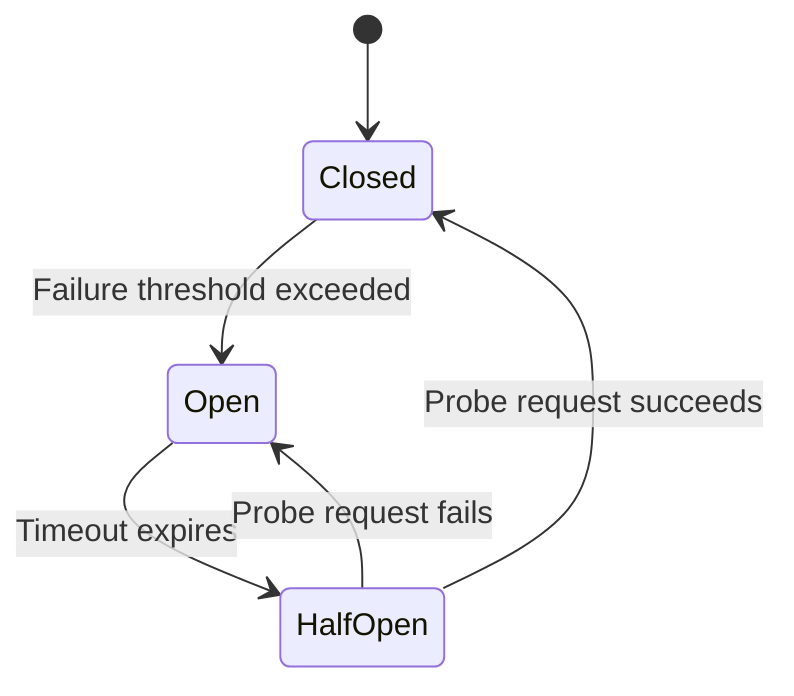
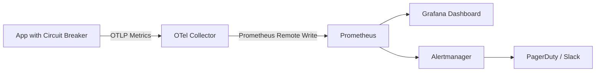

# How to Monitor Circuit Breaker State Changes with OpenTelemetry Metrics

Author: [nawazdhandala](https://www.github.com/nawazdhandala)

Tags: OpenTelemetry, Metrics, Circuit Breaker, Resilience, Observability, Microservices

Description: Learn how to track circuit breaker state transitions using OpenTelemetry metrics to improve resilience observability in your microservices architecture.

---

Circuit breakers are one of those patterns that quietly save your microservices from cascading failures. When a downstream service starts failing, the circuit breaker trips open and stops sending requests to it, giving the failing service time to recover. It's a simple concept, but monitoring circuit breaker behavior in production is surprisingly tricky without the right instrumentation.

OpenTelemetry gives us a clean way to capture circuit breaker state changes as metrics. Instead of digging through logs to figure out when a breaker opened or closed, you can build dashboards, set up alerts, and analyze patterns over time. This guide walks through exactly how to set that up.

## How Circuit Breakers Work

Before jumping into the instrumentation, let's quickly review the three states a circuit breaker moves through.



In the **Closed** state, requests pass through normally. The breaker tracks failures, and once they cross a configured threshold, it transitions to **Open**. In the Open state, all requests are immediately rejected without calling the downstream service. After a timeout period, the breaker moves to **Half-Open**, where it lets a limited number of probe requests through. If those succeed, it goes back to Closed. If they fail, it returns to Open.

Each of these transitions is something you want visibility into. A circuit breaker that keeps bouncing between Open and Half-Open tells you something very different from one that stays Closed for weeks.

## Setting Up OpenTelemetry Metrics

First, you need to set up the OpenTelemetry SDK with a metrics pipeline. We'll use Node.js for the examples here, but the concepts apply to any language.

Install the required packages to get started with OpenTelemetry metrics collection.

```bash
# Install the core OpenTelemetry SDK and metrics packages
npm install @opentelemetry/sdk-node \
  @opentelemetry/sdk-metrics \
  @opentelemetry/exporter-metrics-otlp-grpc \
  @opentelemetry/api
```

Now configure the metrics provider. This sets up the pipeline that will export your circuit breaker metrics to an OpenTelemetry Collector or any OTLP-compatible backend.

```javascript
// metrics-setup.js
const { MeterProvider, PeriodicExportingMetricReader } = require('@opentelemetry/sdk-metrics');
const { OTLPMetricExporter } = require('@opentelemetry/exporter-metrics-otlp-grpc');
const { Resource } = require('@opentelemetry/resources');

// Create the OTLP exporter pointing at your collector
const exporter = new OTLPMetricExporter({
  url: 'http://localhost:4317', // gRPC endpoint of the OTel Collector
});

// Set up a periodic reader that exports metrics every 10 seconds
const metricReader = new PeriodicExportingMetricReader({
  exporter,
  exportIntervalMillis: 10000,
});

// Initialize the meter provider with service metadata
const meterProvider = new MeterProvider({
  resource: new Resource({
    'service.name': 'order-service',
    'service.version': '1.2.0',
  }),
  readers: [metricReader],
});

// Export the provider so other modules can create meters
module.exports = { meterProvider };
```

## Defining Circuit Breaker Metrics

There are a few key metrics you'll want to track for each circuit breaker. A counter for state transitions lets you see how often the breaker changes state. A gauge for the current state gives you a real-time view. And a histogram for request durations while the breaker is in different states helps you understand performance impact.

Here's how to define these instruments using the OpenTelemetry Metrics API.

```javascript
// circuit-breaker-metrics.js
const { meterProvider } = require('./metrics-setup');

// Create a meter specifically for circuit breaker instrumentation
const meter = meterProvider.getMeter('circuit-breaker', '1.0.0');

// Counter: tracks how many times each state transition happens
const stateTransitionCounter = meter.createCounter('circuit_breaker.state_transitions', {
  description: 'Number of circuit breaker state transitions',
  unit: '{transitions}',
});

// Gauge: reports the current state of each circuit breaker
// 0 = closed, 1 = half-open, 2 = open
const currentStateGauge = meter.createObservableGauge('circuit_breaker.current_state', {
  description: 'Current state of the circuit breaker (0=closed, 1=half-open, 2=open)',
  unit: '{state}',
});

// Counter: tracks requests that were rejected by the circuit breaker
const rejectedRequestsCounter = meter.createCounter('circuit_breaker.rejected_requests', {
  description: 'Number of requests rejected by an open circuit breaker',
  unit: '{requests}',
});

// Histogram: measures how long the breaker stays in each state
const stateDurationHistogram = meter.createHistogram('circuit_breaker.state_duration', {
  description: 'Duration spent in each circuit breaker state',
  unit: 'ms',
});

module.exports = {
  stateTransitionCounter,
  currentStateGauge,
  rejectedRequestsCounter,
  stateDurationHistogram,
};
```

## Building an Instrumented Circuit Breaker

Now let's tie it all together in a circuit breaker class that automatically records metrics on every state change. This implementation wraps the core circuit breaker logic with OpenTelemetry instrumentation.

```javascript
// instrumented-circuit-breaker.js
const {
  stateTransitionCounter,
  currentStateGauge,
  rejectedRequestsCounter,
  stateDurationHistogram,
} = require('./circuit-breaker-metrics');

const STATE = { CLOSED: 0, HALF_OPEN: 1, OPEN: 2 };
const STATE_NAMES = { 0: 'closed', 1: 'half_open', 2: 'open' };

class InstrumentedCircuitBreaker {
  constructor(name, options = {}) {
    this.name = name;
    this.state = STATE.CLOSED;
    this.failureCount = 0;
    this.successCount = 0;
    this.failureThreshold = options.failureThreshold || 5;
    this.resetTimeout = options.resetTimeout || 30000; // 30 seconds
    this.stateEnteredAt = Date.now();

    // Register callback for the observable gauge so it always reports current state
    currentStateGauge.addCallback((observableResult) => {
      observableResult.observe(this.state, {
        'circuit_breaker.name': this.name,
      });
    });
  }

  // Transition to a new state and record all relevant metrics
  transitionTo(newState) {
    const oldState = this.state;
    if (oldState === newState) return;

    // Record how long we spent in the previous state
    const duration = Date.now() - this.stateEnteredAt;
    stateDurationHistogram.record(duration, {
      'circuit_breaker.name': this.name,
      'circuit_breaker.state': STATE_NAMES[oldState],
    });

    // Record the state transition event
    stateTransitionCounter.add(1, {
      'circuit_breaker.name': this.name,
      'circuit_breaker.from_state': STATE_NAMES[oldState],
      'circuit_breaker.to_state': STATE_NAMES[newState],
    });

    this.state = newState;
    this.stateEnteredAt = Date.now();
    console.log(`Circuit breaker "${this.name}": ${STATE_NAMES[oldState]} -> ${STATE_NAMES[newState]}`);
  }

  // Execute a function through the circuit breaker
  async execute(fn) {
    if (this.state === STATE.OPEN) {
      // Record the rejected request
      rejectedRequestsCounter.add(1, {
        'circuit_breaker.name': this.name,
      });
      throw new Error(`Circuit breaker "${this.name}" is open`);
    }

    try {
      const result = await fn();
      this.onSuccess();
      return result;
    } catch (error) {
      this.onFailure();
      throw error;
    }
  }

  onSuccess() {
    this.failureCount = 0;
    if (this.state === STATE.HALF_OPEN) {
      this.transitionTo(STATE.CLOSED);
    }
  }

  onFailure() {
    this.failureCount++;
    if (this.state === STATE.HALF_OPEN) {
      this.transitionTo(STATE.OPEN);
      this.scheduleReset();
    } else if (this.failureCount >= this.failureThreshold) {
      this.transitionTo(STATE.OPEN);
      this.scheduleReset();
    }
  }

  // After the reset timeout, move to half-open to test if the service recovered
  scheduleReset() {
    setTimeout(() => {
      if (this.state === STATE.OPEN) {
        this.transitionTo(STATE.HALF_OPEN);
      }
    }, this.resetTimeout);
  }
}

module.exports = { InstrumentedCircuitBreaker };
```

## Using the Instrumented Circuit Breaker

Here's how you'd use this in a real service that calls a downstream payment API. The circuit breaker automatically tracks every state change and rejected request.

```javascript
// payment-service.js
const { InstrumentedCircuitBreaker } = require('./instrumented-circuit-breaker');
const axios = require('axios');

// Create a circuit breaker for the payment service dependency
const paymentBreaker = new InstrumentedCircuitBreaker('payment-service', {
  failureThreshold: 3,    // Open after 3 consecutive failures
  resetTimeout: 15000,    // Try again after 15 seconds
});

async function processPayment(orderId, amount) {
  // The circuit breaker wraps the actual HTTP call
  return paymentBreaker.execute(async () => {
    const response = await axios.post('https://payments.internal/charge', {
      orderId,
      amount,
    }, { timeout: 5000 });
    return response.data;
  });
}
```

## Collector Configuration

Your OpenTelemetry Collector needs to be set up to receive and process these metrics. Here's a configuration that receives OTLP metrics and exports them to Prometheus for querying and alerting.

```yaml
# otel-collector-config.yaml
receivers:
  otlp:
    protocols:
      grpc:
        endpoint: 0.0.0.0:4317
      http:
        endpoint: 0.0.0.0:4318

processors:
  # Batch metrics to reduce export overhead
  batch:
    timeout: 10s
    send_batch_size: 1000

  # Add resource attributes for better metric identification
  resource:
    attributes:
      - key: environment
        value: production
        action: upsert

exporters:
  # Export to Prometheus for dashboarding and alerting
  prometheus:
    endpoint: 0.0.0.0:8889
    namespace: otel
    const_labels:
      team: platform

service:
  pipelines:
    metrics:
      receivers: [otlp]
      processors: [batch, resource]
      exporters: [prometheus]
```

## Building Alerts on Circuit Breaker Metrics

Once the metrics flow into Prometheus, you can build alerts that notify your team when circuit breakers behave unexpectedly. Here are some PromQL queries that are useful for monitoring.

```yaml
# prometheus-alerts.yaml
groups:
  - name: circuit_breaker_alerts
    rules:
      # Alert when a circuit breaker has been open for more than 5 minutes
      - alert: CircuitBreakerStuckOpen
        expr: otel_circuit_breaker_current_state{} == 2
        for: 5m
        labels:
          severity: critical
        annotations:
          summary: "Circuit breaker {{ $labels.circuit_breaker_name }} stuck open"

      # Alert on frequent state transitions (flapping)
      - alert: CircuitBreakerFlapping
        expr: rate(otel_circuit_breaker_state_transitions_total[5m]) > 0.1
        for: 10m
        labels:
          severity: warning
        annotations:
          summary: "Circuit breaker {{ $labels.circuit_breaker_name }} is flapping"
```

## Visualizing State Changes

The data model we've set up lends itself well to time-series visualization. Here is how the metric flow looks from your application through to your dashboards.



In Grafana, you can create a state timeline panel that shows when each circuit breaker was in which state. Overlay that with a graph of the `state_transitions` counter rate to spot flapping. The `rejected_requests` counter tells you exactly how much traffic was shed during outages.

## Best Practices

There are a few things worth keeping in mind when instrumenting circuit breakers. Always include the circuit breaker name as an attribute on every metric so you can filter and aggregate by specific breakers. Use semantic conventions where they exist - OpenTelemetry's semantic conventions don't have a dedicated circuit breaker namespace yet, but prefixing with `circuit_breaker.` keeps things organized.

Don't forget to set appropriate metric boundaries for your histograms. State durations can range from milliseconds (for a quick close-open-close flap) to hours (for a healthy closed breaker), so configure your histogram buckets accordingly.

Finally, consider correlating your circuit breaker metrics with traces. When a request gets rejected by an open circuit breaker, record a span event on the active trace. That way, when someone investigates a slow or failed request in the trace view, they'll immediately see that a circuit breaker was involved.

## Wrapping Up

Monitoring circuit breakers with OpenTelemetry metrics gives you a clear picture of your system's resilience behavior. You can see which downstream dependencies are flaky, how often breakers trip, and how long services take to recover. The combination of counters for transitions, gauges for current state, and histograms for state duration covers the full picture. And because it's all standard OpenTelemetry, you're not locked into any specific monitoring backend.
