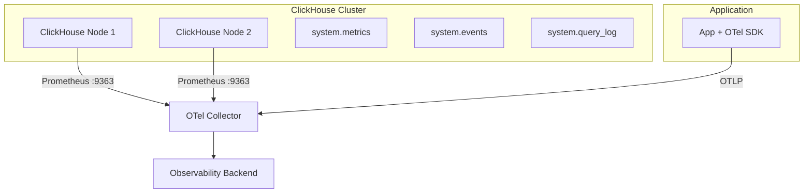

# How to Monitor ClickHouse Query Performance with OpenTelemetry

Author: [nawazdhandala](https://www.github.com/nawazdhandala)

Tags: OpenTelemetry, ClickHouse, Query Performance, Observability, Analytics Database, Metrics, Tracing

Description: A hands-on guide to monitoring ClickHouse query performance using OpenTelemetry for metrics collection, query tracing, and identifying performance bottlenecks.

---

> ClickHouse is one of the fastest analytical databases available, capable of scanning billions of rows per second. But "fast" is relative. A poorly written query, a missing index, or an under-provisioned cluster can still lead to queries that take minutes instead of milliseconds. Monitoring query performance is essential for keeping ClickHouse fast at scale.

OpenTelemetry provides the tools to capture both server-side ClickHouse metrics and application-level query traces. This guide walks through setting up comprehensive ClickHouse monitoring, from scraping system metrics to tracing individual queries through your application.

---

## Monitoring Architecture

ClickHouse exposes metrics through its system tables and an optional Prometheus endpoint. The OpenTelemetry Collector scrapes these metrics while your application sends query-level traces via OTLP.



---

## Step 1: Enable the ClickHouse Prometheus Endpoint

ClickHouse has a built-in Prometheus metrics endpoint. Enable it by adding the following to your ClickHouse server configuration.

This configuration exposes metrics on port 9363 at the `/metrics` path.

```xml
<!-- /etc/clickhouse-server/config.d/prometheus.xml -->
<clickhouse>
    <!-- Enable the Prometheus endpoint for metric scraping -->
    <prometheus>
        <endpoint>/metrics</endpoint>
        <port>9363</port>
        <!-- Expose per-query metrics from the system.events table -->
        <metrics>true</metrics>
        <!-- Expose async metrics like memory usage and disk I/O -->
        <asynchronous_metrics>true</asynchronous_metrics>
        <!-- Expose per-query event counters -->
        <events>true</events>
        <!-- Expose status information -->
        <status_info>true</status_info>
    </prometheus>
</clickhouse>
```

After updating the configuration, restart ClickHouse and verify the endpoint is accessible.

```bash
# Verify the Prometheus endpoint is serving metrics
# You should see a list of metric names and values in Prometheus format
curl http://localhost:9363/metrics | head -20
```

---

## Step 2: Configure the OpenTelemetry Collector

With the Prometheus endpoint enabled, configure the collector to scrape ClickHouse metrics and receive application traces.

This collector configuration scrapes metrics from a two-node ClickHouse cluster and processes them for export.

```yaml
# otel-collector-config.yaml
receivers:
  # Scrape ClickHouse Prometheus metrics
  prometheus:
    config:
      scrape_configs:
        - job_name: 'clickhouse'
          scrape_interval: 15s
          static_configs:
            - targets:
              - 'clickhouse-node1:9363'
              - 'clickhouse-node2:9363'
          # Add node labels for per-node dashboards
          relabel_configs:
            - source_labels: [__address__]
              target_label: clickhouse_node
              regex: '(.+):9363'
              replacement: '${1}'

  # Receive application traces and metrics via OTLP
  otlp:
    protocols:
      grpc:
        endpoint: 0.0.0.0:4317

processors:
  batch:
    timeout: 10s
    send_batch_size: 1024

  # Filter to the most important ClickHouse metrics
  filter/clickhouse:
    metrics:
      include:
        match_type: regexp
        metric_names:
          # Query execution metrics
          - ClickHouseProfileEvents_Query
          - ClickHouseProfileEvents_SelectQuery
          - ClickHouseProfileEvents_InsertQuery
          - ClickHouseProfileEvents_FailedQuery
          - ClickHouseProfileEvents_QueryTimeMicroseconds
          # Memory usage
          - ClickHouseMetrics_MemoryTracking
          - ClickHouseMetrics_MemoryTrackingForMerges
          # Connection metrics
          - ClickHouseMetrics_TCPConnection
          - ClickHouseMetrics_HTTPConnection
          # Merge and part metrics
          - ClickHouseMetrics_Merge
          - ClickHouseMetrics_PartMutation
          - ClickHouseProfileEvents_MergedRows
          - ClickHouseProfileEvents_MergedUncompressedBytes
          # I/O metrics
          - ClickHouseProfileEvents_ReadCompressedBytes
          - ClickHouseProfileEvents_CompressedReadBufferBytes
          - ClickHouseProfileEvents_WriteBufferFromFileDescriptorWriteBytes
          # Replication metrics
          - ClickHouseMetrics_ReplicatedChecks
          - ClickHouseMetrics_ReplicatedFetch
          - ClickHouseMetrics_ReplicatedSend
          # ZooKeeper metrics (for replicated tables)
          - ClickHouseMetrics_ZooKeeperRequest
          - ClickHouseMetrics_ZooKeeperWatch

exporters:
  otlp:
    endpoint: https://oneuptime.com/otlp
    tls:
      insecure: false

service:
  pipelines:
    metrics:
      receivers: [prometheus, otlp]
      processors: [filter/clickhouse, batch]
      exporters: [otlp]
    traces:
      receivers: [otlp]
      processors: [batch]
      exporters: [otlp]
```

---

## Step 3: Key ClickHouse Metrics to Monitor

ClickHouse exposes a large number of metrics. Focus on these categories for query performance monitoring.

**Query Throughput:**
- `ClickHouseProfileEvents_Query` - Total query count (SELECT + INSERT + other).
- `ClickHouseProfileEvents_SelectQuery` - SELECT query count. Track this alongside `FailedQuery` to compute error rates.
- `ClickHouseProfileEvents_InsertQuery` - INSERT query count. Spikes often correlate with data ingestion pipeline behavior.

**Query Timing:**
- `ClickHouseProfileEvents_QueryTimeMicroseconds` - Total time spent executing queries. Divide by query count for average query time.
- `ClickHouseProfileEvents_RealTimeMicroseconds` - Wall-clock time including I/O waits.

**Memory:**
- `ClickHouseMetrics_MemoryTracking` - Current memory used by queries. ClickHouse can use a lot of RAM for large aggregations and joins.
- `ClickHouseMetrics_MemoryTrackingForMerges` - Memory used for background merge operations. If this is high, merges are competing with queries for RAM.

**Merges and Parts:**
- `ClickHouseMetrics_Merge` - Active merge operations. Too many concurrent merges degrade query performance.
- `ClickHouseProfileEvents_MergedRows` - Rows processed by merges. This tells you how much background work ClickHouse is doing.

---

## Step 4: Instrument Application Queries

Server metrics give you the cluster-level view. Application-level instrumentation shows you exactly which queries are slow and why. Here is a Python example using the `clickhouse-connect` library.

Install the required packages for Python ClickHouse tracing.

```bash
# Install the ClickHouse client and OpenTelemetry packages
pip install clickhouse-connect
pip install opentelemetry-api opentelemetry-sdk opentelemetry-exporter-otlp
```

This instrumentation wrapper captures every ClickHouse query as a span with timing, row counts, and query metadata.

```python
import time
import clickhouse_connect
from opentelemetry import trace, metrics
from opentelemetry.sdk.trace import TracerProvider
from opentelemetry.sdk.trace.export import BatchSpanProcessor
from opentelemetry.exporter.otlp.proto.grpc.trace_exporter import OTLPSpanExporter
from opentelemetry.sdk.metrics import MeterProvider
from opentelemetry.sdk.metrics.export import PeriodicExportingMetricReader
from opentelemetry.exporter.otlp.proto.grpc.metrics_exporter import OTLPMetricExporter
from opentelemetry.sdk.resources import Resource

# Configure OpenTelemetry tracing and metrics
resource = Resource.create({"service.name": "clickhouse-analytics-app"})

# Set up tracing
trace_provider = TracerProvider(resource=resource)
trace_provider.add_span_processor(
    BatchSpanProcessor(OTLPSpanExporter(endpoint="http://localhost:4317"))
)
trace.set_tracer_provider(trace_provider)

# Set up metrics
metric_reader = PeriodicExportingMetricReader(
    OTLPMetricExporter(endpoint="http://localhost:4317"),
    export_interval_millis=15000
)
meter_provider = MeterProvider(resource=resource, metric_readers=[metric_reader])
metrics.set_meter_provider(meter_provider)

tracer = trace.get_tracer("clickhouse-client")
meter = metrics.get_meter("clickhouse-client")

# Create metrics for query performance tracking
query_duration = meter.create_histogram(
    "clickhouse.query.duration",
    description="ClickHouse query duration in milliseconds",
    unit="ms"
)
rows_read = meter.create_histogram(
    "clickhouse.query.rows_read",
    description="Number of rows read by ClickHouse queries"
)

class TracedClickHouseClient:
    """A wrapper around clickhouse-connect that adds OpenTelemetry tracing."""

    def __init__(self, host, port=8123, username='default', password=''):
        # Initialize the ClickHouse connection
        self.client = clickhouse_connect.get_client(
            host=host, port=port,
            username=username, password=password
        )

    def query(self, sql, parameters=None, query_name="unnamed"):
        """Execute a SELECT query with full tracing."""
        with tracer.start_as_current_span("clickhouse.query") as span:
            # Set standard database attributes
            span.set_attribute("db.system", "clickhouse")
            span.set_attribute("db.statement", sql)
            span.set_attribute("db.query.name", query_name)
            span.set_attribute("db.operation", "SELECT")

            start = time.monotonic()
            try:
                # Execute the query
                result = self.client.query(sql, parameters=parameters)
                duration_ms = (time.monotonic() - start) * 1000

                # Record result metadata on the span
                span.set_attribute("db.clickhouse.rows_read", result.row_count)
                span.set_attribute("db.clickhouse.duration_ms", duration_ms)
                span.set_attribute("db.clickhouse.bytes_read",
                    result.summary.get('read_bytes', 0))

                # Record metrics for aggregate analysis
                attrs = {
                    "db.query.name": query_name,
                    "db.system": "clickhouse"
                }
                query_duration.record(duration_ms, attrs)
                rows_read.record(result.row_count, attrs)

                # Flag slow queries (over 5 seconds for analytical workloads)
                if duration_ms > 5000:
                    span.set_attribute("db.query.slow", True)
                    span.add_event("slow_query", {
                        "duration_ms": duration_ms,
                        "rows_read": result.row_count
                    })

                return result

            except Exception as e:
                duration_ms = (time.monotonic() - start) * 1000
                span.record_exception(e)
                span.set_status(trace.StatusCode.ERROR, str(e))
                # Record the failed query duration too
                query_duration.record(duration_ms, {
                    "db.query.name": query_name,
                    "db.system": "clickhouse",
                    "error": "true"
                })
                raise

# Usage example
ch = TracedClickHouseClient(host='clickhouse-node1')

# This query will be fully traced with timing and row count data
result = ch.query(
    "SELECT toDate(event_time) as day, count() as events "
    "FROM analytics.page_views "
    "WHERE event_time >= today() - 7 "
    "GROUP BY day ORDER BY day",
    query_name="weekly_pageview_summary"
)
```

---

## Step 5: Query the system.query_log for Historical Analysis

ClickHouse maintains a detailed query log in the `system.query_log` table. You can periodically export this data to your observability backend for long-term analysis.

This script reads from the query log and exports slow queries as OpenTelemetry spans.

```python
def export_slow_queries_from_log(ch_client, threshold_ms=5000):
    """Read ClickHouse query_log and export slow queries as spans."""
    # Query the system.query_log for recent slow queries
    # This captures queries from all clients, not just your instrumented app
    sql = """
        SELECT
            query_id,
            query,
            query_duration_ms,
            read_rows,
            read_bytes,
            memory_usage,
            event_time,
            user,
            client_hostname
        FROM system.query_log
        WHERE type = 'QueryFinish'
          AND query_duration_ms > %(threshold)s
          AND event_time > now() - INTERVAL 5 MINUTE
        ORDER BY query_duration_ms DESC
        LIMIT 100
    """

    result = ch_client.client.query(sql, parameters={"threshold": threshold_ms})

    for row in result.named_results():
        # Create a span for each slow query found in the log
        with tracer.start_as_current_span("clickhouse.slow_query.logged") as span:
            span.set_attribute("db.system", "clickhouse")
            span.set_attribute("db.statement", row['query'][:1000])
            span.set_attribute("db.clickhouse.query_id", row['query_id'])
            span.set_attribute("db.clickhouse.duration_ms", row['query_duration_ms'])
            span.set_attribute("db.clickhouse.read_rows", row['read_rows'])
            span.set_attribute("db.clickhouse.read_bytes", row['read_bytes'])
            span.set_attribute("db.clickhouse.memory_usage", row['memory_usage'])
            span.set_attribute("db.clickhouse.user", row['user'])
            span.set_attribute("db.clickhouse.client_hostname", row['client_hostname'])
            span.set_attribute("db.query.slow", True)
```

Run this export periodically (every 5 minutes) as a background job to capture slow queries from all sources, including ad-hoc queries run directly against ClickHouse.

---

## Step 6: Build a ClickHouse Performance Dashboard

Organize your dashboard around the query lifecycle, from ingestion to query execution to background maintenance.

```mermaid
flowchart TD
    subgraph Dashboard["ClickHouse Performance Dashboard"]
        direction TB
        A[Query Performance]
        B[Resource Usage]
        C[Background Operations]
        D[Cluster Health]
    end

    A --> A1["Query Rate: SELECT/INSERT per second"]
    A --> A2["Query Latency: p50 / p95 / p99"]
    A --> A3["Failed Queries Rate"]
    A --> A4["Slow Queries Count"]

    B --> B1["Memory: Query vs Merge usage"]
    B --> B2["Disk I/O: Read and Write bytes/sec"]
    B --> B3["CPU: User vs System time"]

    C --> C1["Active Merges Count"]
    C --> C2["Parts Count per Table"]
    C --> C3["Merge Throughput: rows/sec"]

    D --> D1["Active Connections"]
    D --> D2["Replication Lag"]
    D --> D3["ZooKeeper Request Rate"]
```



---

## Monitoring INSERT Performance

ClickHouse performance depends heavily on how data is ingested. Frequent small inserts create many parts that need merging, while large batch inserts are more efficient. Track insert patterns to avoid the "too many parts" error.

This configuration adds a custom metric that tracks the number of active parts per table.

```sql
-- Run this query periodically and export the results as a gauge metric
-- High part counts indicate that inserts are too frequent or merges are behind
SELECT
    database,
    table,
    count() as parts_count,
    sum(rows) as total_rows,
    formatReadableSize(sum(bytes_on_disk)) as disk_size
FROM system.parts
WHERE active = 1
GROUP BY database, table
ORDER BY parts_count DESC
```

If parts_count exceeds 300 for any table, ClickHouse will start rejecting inserts. Monitor this metric closely and set alerts at 200 parts.

---

## Practical Tips

**Use query_id for correlation.** ClickHouse assigns a `query_id` to every query. Record it in your OpenTelemetry spans so you can look up the same query in ClickHouse's system tables for detailed execution statistics.

**Monitor merge activity.** ClickHouse relies on background merges to keep query performance high. If merges fall behind (part counts increase), queries slow down because they need to read more files. Track the `Merge` metric and the parts count.

**Set appropriate slow query thresholds.** Unlike OLTP databases where 500ms is slow, ClickHouse analytical queries routinely take seconds. Start with a 5-second threshold for analytical queries and 100ms for point lookups.

**Track memory per query.** ClickHouse can consume large amounts of RAM for complex GROUP BY operations and JOINs. The `MemoryTracking` metric shows current usage, but also record peak memory per query in your application spans for queries that trigger memory limits.

---

## Conclusion

Monitoring ClickHouse query performance with OpenTelemetry gives you visibility at every level. Server metrics from the Prometheus endpoint show cluster health and resource usage. Application-level instrumentation shows individual query timing and behavior. And the system.query_log provides a historical record of every query that runs. Together with a backend like [OneUptime](https://oneuptime.com), this gives you everything you need to keep ClickHouse running fast as your data and query volume grow.
