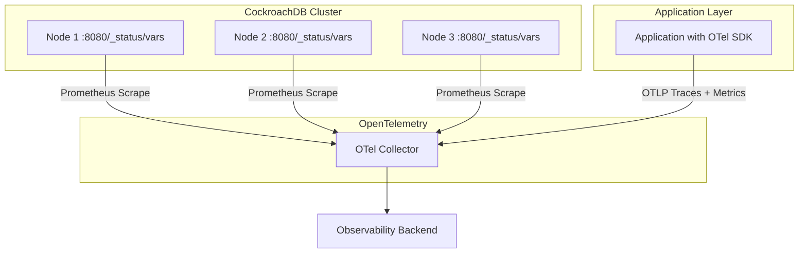
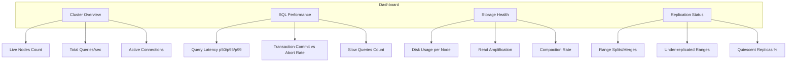

# How to Monitor CockroachDB with OpenTelemetry

Author: [nawazdhandala](https://www.github.com/nawazdhandala)

Tags: OpenTelemetry, CockroachDB, Database Monitoring, Observability, Distributed Database, Metrics, Tracing

Description: A practical guide to monitoring CockroachDB clusters using OpenTelemetry for metrics collection, query tracing, and performance analysis across distributed nodes.

---

> CockroachDB is built for distributed resilience, but that distributed nature makes monitoring more challenging. A query might touch multiple nodes, a range might split mid-transaction, and replication lag can create subtle inconsistencies. You need observability that understands distributed database behavior.

OpenTelemetry provides the framework to collect metrics from CockroachDB's Prometheus-compatible endpoint, trace queries through your application, and correlate everything in a single observability backend. This guide covers the full setup from cluster metrics to application-level query tracing.

---

## CockroachDB Monitoring Architecture

CockroachDB exposes a Prometheus metrics endpoint on each node at `/_status/vars`. The OpenTelemetry Collector can scrape these endpoints to gather cluster health, query performance, and storage metrics. On the application side, you instrument your database driver to capture query-level traces.



---

## Step 1: Scrape CockroachDB Metrics with the Collector

CockroachDB exposes hundreds of metrics covering SQL execution, storage engine health, replication status, and more. The OpenTelemetry Collector's Prometheus receiver can scrape these directly.

This collector configuration scrapes metrics from a three-node CockroachDB cluster. Adjust the targets to match your cluster topology.

```yaml
# otel-collector-config.yaml
receivers:
  # Scrape CockroachDB's built-in Prometheus metrics endpoint
  prometheus:
    config:
      scrape_configs:
        - job_name: 'cockroachdb'
          # Scrape every 15 seconds for timely visibility
          scrape_interval: 15s
          metrics_path: '/_status/vars'
          static_configs:
            - targets:
              # List all CockroachDB nodes in your cluster
              - 'cockroachdb-node1:8080'
              - 'cockroachdb-node2:8080'
              - 'cockroachdb-node3:8080'
          # Relabel to add meaningful identifiers
          relabel_configs:
            - source_labels: [__address__]
              target_label: instance
              regex: '(.+):8080'
              replacement: '${1}'

  # Also receive OTLP data from your application
  otlp:
    protocols:
      grpc:
        endpoint: 0.0.0.0:4317

processors:
  batch:
    timeout: 10s
    send_batch_size: 1024

  # Filter to keep only the most relevant CockroachDB metrics
  # CockroachDB exposes hundreds of metrics; focus on what matters
  filter/cockroachdb:
    metrics:
      include:
        match_type: regexp
        metric_names:
          # SQL query performance
          - sql_exec_latency.*
          - sql_query_count
          - sql_failure_count
          - sql_distsql_queries_active
          # Transaction metrics
          - sql_txn_commit_count
          - sql_txn_abort_count
          - sql_txn_latency.*
          # Storage and LSM metrics
          - rocksdb_block_cache_hits
          - rocksdb_block_cache_misses
          - rocksdb_compactions
          - rocksdb_read_amplification
          # Replication health
          - replicas_quiescent
          - replicas_leaders
          - range_splits
          - range_merges
          # Liveness and cluster health
          - liveness_livenodes
          - node_id
          - capacity_available
          - capacity_used

exporters:
  otlp:
    endpoint: https://oneuptime.com/otlp
    tls:
      insecure: false

service:
  pipelines:
    metrics:
      receivers: [prometheus, otlp]
      processors: [filter/cockroachdb, batch]
      exporters: [otlp]
    traces:
      receivers: [otlp]
      processors: [batch]
      exporters: [otlp]
```

---

## Step 2: Understand Key CockroachDB Metrics

Not all metrics are equally useful. Here are the ones that matter most for day-to-day operations, grouped by category.

**SQL Performance Metrics:**
- `sql_exec_latency` - Time spent executing SQL statements. Track p50, p95, and p99 to catch slow query regressions.
- `sql_query_count` - Total queries executed. Useful for capacity planning and spotting traffic spikes.
- `sql_failure_count` - Failed SQL statements. A sudden increase usually indicates application bugs or schema issues.
- `sql_distsql_queries_active` - Number of active distributed queries. High values suggest long-running queries holding resources.

**Transaction Metrics:**
- `sql_txn_commit_count` - Successful transaction commits per second.
- `sql_txn_abort_count` - Aborted transactions. High abort rates often point to contention issues.
- `sql_txn_latency` - End-to-end transaction latency including retries.

**Storage Metrics:**
- `rocksdb_read_amplification` - How many SST files are read per query. Values above 15-20 suggest compaction is falling behind.
- `capacity_available` and `capacity_used` - Disk space tracking. CockroachDB needs free space for compaction and rebalancing.

**Cluster Health:**
- `liveness_livenodes` - Number of live nodes. If this drops below your expected count, a node is down or partitioned.

---

## Step 3: Instrument Application-Level Queries

Cluster metrics tell you about overall database health. To trace individual queries and understand application-level performance, you need driver instrumentation.

For Go applications using the CockroachDB-compatible `pgx` driver, here is how to set up OpenTelemetry tracing.

```go
package main

import (
    "context"
    "log"

    "github.com/jackc/pgx/v5/pgxpool"
    "go.opentelemetry.io/otel"
    "go.opentelemetry.io/otel/attribute"
    "go.opentelemetry.io/otel/exporters/otlp/otlptrace/otlptracegrpc"
    "go.opentelemetry.io/otel/sdk/resource"
    sdktrace "go.opentelemetry.io/otel/sdk/trace"
    semconv "go.opentelemetry.io/otel/semconv/v1.21.0"
)

// initTracer configures OpenTelemetry with OTLP export
func initTracer() (*sdktrace.TracerProvider, error) {
    exporter, err := otlptracegrpc.New(
        context.Background(),
        otlptracegrpc.WithEndpoint("localhost:4317"),
        otlptracegrpc.WithInsecure(),
    )
    if err != nil {
        return nil, err
    }

    // Define the service resource with CockroachDB as the database system
    res := resource.NewWithAttributes(
        semconv.SchemaURL,
        semconv.ServiceName("my-cockroachdb-app"),
        attribute.String("db.system", "cockroachdb"),
    )

    tp := sdktrace.NewTracerProvider(
        sdktrace.WithBatcher(exporter),
        sdktrace.WithResource(res),
    )
    otel.SetTracerProvider(tp)
    return tp, nil
}

// queryWithTracing wraps a database query with OpenTelemetry span
func queryWithTracing(ctx context.Context, pool *pgxpool.Pool, query string) error {
    tracer := otel.Tracer("cockroachdb-client")

    // Start a span for this database query
    ctx, span := tracer.Start(ctx, "db.query")
    defer span.End()

    // Record the SQL statement and database system as span attributes
    span.SetAttribute(attribute.String("db.statement", query))
    span.SetAttribute(attribute.String("db.system", "cockroachdb"))
    span.SetAttribute(attribute.String("db.name", "mydb"))

    // Execute the query
    rows, err := pool.Query(ctx, query)
    if err != nil {
        // Record the error on the span for visibility in traces
        span.RecordError(err)
        return err
    }
    defer rows.Close()

    return nil
}

func main() {
    tp, err := initTracer()
    if err != nil {
        log.Fatal(err)
    }
    defer tp.Shutdown(context.Background())

    // Connect to CockroachDB using the PostgreSQL-compatible driver
    pool, err := pgxpool.New(context.Background(),
        "postgresql://root@localhost:26257/mydb?sslmode=disable")
    if err != nil {
        log.Fatal(err)
    }

    // Execute a traced query
    err = queryWithTracing(context.Background(), pool,
        "SELECT * FROM orders WHERE status = 'pending'")
    if err != nil {
        log.Printf("Query failed: %v", err)
    }
}
```

Since CockroachDB is wire-compatible with PostgreSQL, any PostgreSQL OpenTelemetry instrumentation library works. For Python, use `opentelemetry-instrumentation-psycopg2`. For Java, use `opentelemetry-instrumentation-jdbc`.

---

## Step 4: Monitor Distributed Query Execution

CockroachDB's DistSQL engine splits queries across multiple nodes. Monitoring distributed query performance requires attention to specific metrics.

This configuration adds processing rules to compute the distributed query ratio and flag potential issues.

```yaml
# Additional processor for CockroachDB-specific metric transformations
processors:
  # Transform processor to compute useful derived metrics
  transform:
    metric_statements:
      - context: datapoint
        statements:
          # Tag datapoints from nodes with high read amplification
          # Read amplification above 20 often indicates compaction issues
          - set(attributes["high_read_amp"], "true")
            where metric.name == "rocksdb_read_amplification" and value_int > 20

  # Group metrics by node for per-node health dashboards
  groupbyattrs:
    keys:
      - instance
      - job
```

---

## Step 5: Set Up Alerts for CockroachDB Health

Effective alerting requires understanding what normal looks like for your cluster. Here are recommended alert conditions that catch real problems without generating noise.

```yaml
# Alert rule examples (for reference when configuring in your backend)
# These represent the conditions you should monitor

# Node availability alert
# Condition: liveness_livenodes < expected_node_count
# Severity: Critical
# Description: A CockroachDB node has gone offline

# Transaction abort rate alert
# Condition: rate(sql_txn_abort_count[5m]) / rate(sql_txn_commit_count[5m]) > 0.1
# Severity: Warning
# Description: More than 10% of transactions are being aborted (contention likely)

# Query latency alert
# Condition: sql_exec_latency_p99 > 1000 (milliseconds)
# Severity: Warning
# Description: p99 query latency exceeds 1 second

# Disk capacity alert
# Condition: capacity_used / (capacity_used + capacity_available) > 0.8
# Severity: Warning
# Description: Node disk usage exceeds 80%, rebalancing may be impacted

# Read amplification alert
# Condition: rocksdb_read_amplification > 25
# Severity: Warning
# Description: High read amplification indicates compaction is falling behind
```

---

## Step 6: Build a CockroachDB Dashboard

With metrics and traces flowing, build a dashboard that gives you a single view of cluster health. Organize it into sections.



**Cluster Overview** shows high-level health. If live nodes drop or active connections spike, you know immediately.

**SQL Performance** tracks the metrics your application cares about. Query latency trends help you catch regressions before they hit users.

**Storage Health** surfaces compaction and disk issues early. CockroachDB needs headroom for its LSM tree operations.

**Replication Status** ensures data safety. Under-replicated ranges mean your fault tolerance has decreased.

---

## Troubleshooting Common Issues

**Metrics not appearing:** Verify CockroachDB's HTTP endpoint is accessible. Try `curl http://cockroachdb-node1:8080/_status/vars` from the collector host. If the cluster uses TLS, you need to configure certificates in the Prometheus receiver.

**High cardinality warnings:** CockroachDB exposes per-range and per-store metrics that can create high cardinality. The filter processor in the collector configuration above limits this by selecting only the metrics you need.

**Missing query traces:** Ensure your application's database driver is instrumented. CockroachDB itself does not emit OpenTelemetry traces. The tracing comes from your application's database client library.

---

## Conclusion

Monitoring CockroachDB with OpenTelemetry gives you a unified view of both cluster health and application-level query performance. Scrape node metrics with the Prometheus receiver, instrument your database driver for query-level traces, and use a backend like [OneUptime](https://oneuptime.com) to bring it all together. The combination of cluster metrics and distributed traces makes it possible to quickly identify whether a performance issue is caused by the database, the network, or the application itself.
