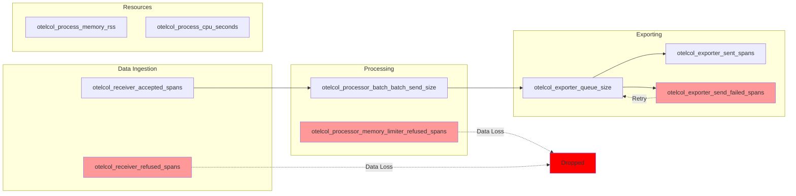

# How to Monitor the Collector with Its Internal Metrics

Author: [nawazdhandala](https://www.github.com/nawazdhandala)

Tags: OpenTelemetry, Collector, Monitoring, Metrics, Observability, Prometheus

Description: Comprehensive guide to monitoring OpenTelemetry Collector health and performance using internal metrics, including configuration, key metrics, and alerting strategies.

The OpenTelemetry Collector is a critical component in your observability infrastructure, responsible for receiving, processing, and forwarding telemetry data. Like any critical infrastructure component, it must be monitored to ensure reliability and optimal performance. Fortunately, the collector exposes comprehensive internal metrics about its own operation.

This guide covers how to enable, collect, and analyze the collector's internal metrics to maintain a healthy telemetry pipeline and detect issues before they impact your observability system.

## Understanding Collector Internal Metrics

The OpenTelemetry Collector instruments itself using OpenTelemetry metrics, exposing data about:

- **Receivers**: Data received from applications and infrastructure
- **Processors**: Data transformation and filtering operations
- **Exporters**: Data sent to backend systems
- **Queues**: Buffer states and capacity
- **System Resources**: Memory and CPU usage

These metrics follow OpenTelemetry semantic conventions and are exposed in Prometheus format, making them easy to scrape and visualize.

## Enabling Internal Metrics

Configure the collector to expose its internal metrics on a designated port:

```yaml
receivers:
  otlp:
    protocols:
      grpc:
        endpoint: 0.0.0.0:4317

processors:
  batch:
    timeout: 10s
    send_batch_size: 8192

exporters:
  otlp/backend:
    endpoint: backend.example.com:4317

extensions:
  # Health check endpoint
  health_check:
    endpoint: :13133

  # zPages for debugging
  zpages:
    endpoint: :55679

service:
  # Enable extensions
  extensions: [health_check, zpages]

  # Configure internal telemetry
  telemetry:
    logs:
      level: info
      # Optional: output internal logs to file
      output_paths: [stdout]

    metrics:
      # Metric detail level: none, basic, normal, detailed
      level: detailed

      # Address to expose Prometheus metrics
      address: :8888

  pipelines:
    traces:
      receivers: [otlp]
      processors: [batch]
      exporters: [otlp/backend]
```

With this configuration, the collector exposes metrics at `http://localhost:8888/metrics` in Prometheus format.

## Collecting Collector Metrics with Prometheus

Configure Prometheus to scrape the collector's metrics endpoint:

```yaml
# prometheus.yml
global:
  scrape_interval: 15s
  evaluation_interval: 15s

scrape_configs:
  # Scrape OpenTelemetry Collector metrics
  - job_name: 'otel-collector'
    scrape_interval: 10s
    static_configs:
      - targets:
        - 'collector-1.example.com:8888'
        - 'collector-2.example.com:8888'
        - 'collector-3.example.com:8888'
        labels:
          environment: 'production'
          cluster: 'us-east-1'
```

For Kubernetes deployments, use service discovery:

```yaml
# prometheus.yml for Kubernetes
scrape_configs:
  - job_name: 'otel-collector'
    kubernetes_sd_configs:
      - role: pod
        namespaces:
          names:
            - observability
    relabel_configs:
      # Only scrape pods with specific labels
      - source_labels: [__meta_kubernetes_pod_label_app]
        action: keep
        regex: otel-collector
      # Use pod name as instance label
      - source_labels: [__meta_kubernetes_pod_name]
        action: replace
        target_label: instance
      # Add namespace label
      - source_labels: [__meta_kubernetes_namespace]
        action: replace
        target_label: namespace
```

## Self-Monitoring: Collector Collecting Its Own Metrics

The collector can scrape and export its own metrics, creating a complete observability loop:

```yaml
receivers:
  # Receive application telemetry
  otlp:
    protocols:
      grpc:
        endpoint: 0.0.0.0:4317

  # Scrape own metrics endpoint
  prometheus:
    config:
      scrape_configs:
        - job_name: 'self'
          scrape_interval: 10s
          static_configs:
            - targets: ['localhost:8888']

processors:
  batch:
    timeout: 10s
    send_batch_size: 8192

  # Add collector identification
  resource:
    attributes:
      - key: service.name
        value: otel-collector
        action: insert
      - key: service.instance.id
        value: ${HOSTNAME}
        action: insert

exporters:
  # Export application data
  otlp/traces:
    endpoint: backend.example.com:4317

  # Export collector metrics to monitoring backend
  prometheusremotewrite:
    endpoint: http://prometheus:9090/api/v1/write
    # Optional: add external labels
    external_labels:
      cluster: production
      region: us-east-1

service:
  telemetry:
    metrics:
      level: detailed
      address: :8888

  pipelines:
    # Application traces
    traces:
      receivers: [otlp]
      processors: [batch]
      exporters: [otlp/traces]

    # Collector's own metrics
    metrics/internal:
      receivers: [prometheus]
      processors: [resource, batch]
      exporters: [prometheusremotewrite]
```

This creates a self-contained monitoring solution where the collector monitors itself and exports the data to your metrics backend.

## Key Receiver Metrics

Monitor these metrics to understand data ingestion health:

### Accepted Data Points

Tracks successfully received telemetry:

```promql
# Spans accepted per second
rate(otelcol_receiver_accepted_spans{receiver="otlp"}[5m])

# Metrics accepted per second
rate(otelcol_receiver_accepted_metric_points{receiver="otlp"}[5m])

# Logs accepted per second
rate(otelcol_receiver_accepted_log_records{receiver="otlp"}[5m])
```

### Refused Data Points

Indicates back-pressure or capacity issues:

```promql
# Spans refused per second (back-pressure indicator)
rate(otelcol_receiver_refused_spans{receiver="otlp"}[5m])

# Alert when any data is being refused
otelcol_receiver_refused_spans > 0
```

If data is being refused, the collector is overloaded. Consider scaling or adjusting batch processor settings.

## Key Processor Metrics

### Batch Processor Metrics

Understanding batching behavior is critical for performance tuning:

```promql
# Average batch size sent
rate(otelcol_processor_batch_batch_send_size_sum[5m]) /
rate(otelcol_processor_batch_batch_send_size_count[5m])

# Number of batches sent due to timeout vs size
rate(otelcol_processor_batch_timeout_trigger_send[5m])
rate(otelcol_processor_batch_batch_size_trigger_send[5m])
```

A high ratio of timeout-triggered sends suggests your batch size settings may be too large for your traffic patterns.

### Memory Limiter Metrics

Monitor memory pressure:

```promql
# Memory limiter is dropping data (critical alert)
rate(otelcol_processor_refused_spans{processor="memory_limiter"}[5m]) > 0

# Memory usage percentage
otelcol_processor_memory_limiter_memory_usage_bytes /
otelcol_processor_memory_limiter_memory_limit_bytes
```

## Key Exporter Metrics

### Successfully Sent Data

Track data successfully forwarded to backends:

```promql
# Spans exported per second
rate(otelcol_exporter_sent_spans{exporter="otlp"}[5m])

# Metrics exported per second
rate(otelcol_exporter_sent_metric_points{exporter="otlp"}[5m])
```

### Failed Exports

Critical metric indicating backend connectivity or performance issues:

```promql
# Failed exports (requires immediate attention)
rate(otelcol_exporter_send_failed_spans{exporter="otlp"}[5m])

# Export failures per total exports (error rate)
rate(otelcol_exporter_send_failed_spans[5m]) /
(rate(otelcol_exporter_sent_spans[5m]) + rate(otelcol_exporter_send_failed_spans[5m]))
```

### Queue Metrics

Monitor sending queue health:

```promql
# Current queue size
otelcol_exporter_queue_size{exporter="otlp"}

# Queue capacity
otelcol_exporter_queue_capacity{exporter="otlp"}

# Queue utilization percentage
otelcol_exporter_queue_size / otelcol_exporter_queue_capacity

# Queue is filling up (warning threshold at 80%)
(otelcol_exporter_queue_size / otelcol_exporter_queue_capacity) > 0.8
```

### Retry Metrics

Track export retry behavior:

```promql
# Items in retry queue
otelcol_exporter_retry_queue_length{exporter="otlp"}

# Retry operations per second
rate(otelcol_exporter_enqueue_failed_spans[5m])
```

## System Resource Metrics

The collector exposes Go runtime metrics that help understand resource utilization:

```promql
# Memory usage
otelcol_process_memory_rss

# CPU time
rate(otelcol_process_cpu_seconds[5m])

# Goroutine count (high counts may indicate leaks)
otelcol_process_runtime_total_sys_memory_bytes

# Garbage collection duration
rate(otelcol_process_runtime_gc_duration_microseconds_sum[5m])
```

## Metric Flow Visualization

Understanding how data flows through the collector helps identify bottlenecks:



## Comprehensive Dashboard Configuration

Create a Grafana dashboard to visualize collector health:

```json
{
  "dashboard": {
    "title": "OpenTelemetry Collector Monitoring",
    "panels": [
      {
        "title": "Spans Received (per second)",
        "targets": [
          {
            "expr": "rate(otelcol_receiver_accepted_spans[5m])"
          }
        ]
      },
      {
        "title": "Data Loss (Refused Spans)",
        "targets": [
          {
            "expr": "rate(otelcol_receiver_refused_spans[5m])"
          }
        ]
      },
      {
        "title": "Queue Utilization (%)",
        "targets": [
          {
            "expr": "100 * (otelcol_exporter_queue_size / otelcol_exporter_queue_capacity)"
          }
        ]
      },
      {
        "title": "Export Success Rate (%)",
        "targets": [
          {
            "expr": "100 * (rate(otelcol_exporter_sent_spans[5m]) / (rate(otelcol_exporter_sent_spans[5m]) + rate(otelcol_exporter_send_failed_spans[5m])))"
          }
        ]
      },
      {
        "title": "Memory Usage (MB)",
        "targets": [
          {
            "expr": "otelcol_process_memory_rss / 1024 / 1024"
          }
        ]
      },
      {
        "title": "CPU Usage",
        "targets": [
          {
            "expr": "rate(otelcol_process_cpu_seconds[5m])"
          }
        ]
      },
      {
        "title": "Average Batch Size",
        "targets": [
          {
            "expr": "rate(otelcol_processor_batch_batch_send_size_sum[5m]) / rate(otelcol_processor_batch_batch_send_size_count[5m])"
          }
        ]
      },
      {
        "title": "Batch Send Triggers",
        "targets": [
          {
            "expr": "rate(otelcol_processor_batch_timeout_trigger_send[5m])",
            "legendFormat": "Timeout"
          },
          {
            "expr": "rate(otelcol_processor_batch_batch_size_trigger_send[5m])",
            "legendFormat": "Size"
          }
        ]
      }
    ]
  }
}
```

## Alerting Rules

Define Prometheus alerting rules for critical collector issues:

```yaml
# prometheus-alerts.yml
groups:
  - name: otel_collector
    interval: 30s
    rules:
      # Critical: Data is being dropped
      - alert: CollectorDroppingData
        expr: rate(otelcol_receiver_refused_spans[5m]) > 0
        for: 5m
        labels:
          severity: critical
        annotations:
          summary: "OpenTelemetry Collector dropping data"
          description: "Collector {{ $labels.instance }} is refusing spans due to overload"

      # Critical: Export failures
      - alert: CollectorExportFailing
        expr: rate(otelcol_exporter_send_failed_spans[5m]) > 0
        for: 5m
        labels:
          severity: critical
        annotations:
          summary: "OpenTelemetry Collector export failures"
          description: "Collector {{ $labels.instance }} failing to export to {{ $labels.exporter }}"

      # Warning: Queue filling up
      - alert: CollectorQueueFillingUp
        expr: (otelcol_exporter_queue_size / otelcol_exporter_queue_capacity) > 0.8
        for: 10m
        labels:
          severity: warning
        annotations:
          summary: "OpenTelemetry Collector queue filling up"
          description: "Collector {{ $labels.instance }} queue {{ $labels.exporter }} is {{ $value | humanizePercentage }} full"

      # Warning: High memory usage
      - alert: CollectorHighMemoryUsage
        expr: (otelcol_process_memory_rss / 1024 / 1024 / 1024) > 8
        for: 15m
        labels:
          severity: warning
        annotations:
          summary: "OpenTelemetry Collector high memory usage"
          description: "Collector {{ $labels.instance }} using {{ $value }} GB memory"

      # Warning: Inefficient batching
      - alert: CollectorInefficientBatching
        expr: |
          (rate(otelcol_processor_batch_timeout_trigger_send[5m]) /
          (rate(otelcol_processor_batch_timeout_trigger_send[5m]) +
           rate(otelcol_processor_batch_batch_size_trigger_send[5m]))) > 0.9
        for: 30m
        labels:
          severity: warning
        annotations:
          summary: "OpenTelemetry Collector inefficient batching"
          description: "Collector {{ $labels.instance }} sending 90%+ batches due to timeout rather than size"

      # Info: Collector restarted
      - alert: CollectorRestarted
        expr: time() - otelcol_process_uptime < 300
        labels:
          severity: info
        annotations:
          summary: "OpenTelemetry Collector restarted"
          description: "Collector {{ $labels.instance }} restarted {{ $value | humanizeDuration }} ago"
```

## Health Check Endpoints

The collector provides several endpoints for health checking and debugging:

### Health Check Extension

Basic liveness check:

```bash
# Check if collector is alive
curl http://localhost:13133/

# Response: {"status":"Server available"}
```

Configure the health check extension:

```yaml
extensions:
  health_check:
    endpoint: :13133
    path: /health
    # Check specific pipelines
    check_collector_pipeline:
      enabled: true
      interval: 5m
      exporter_failure_threshold: 5

service:
  extensions: [health_check]
```

### zPages Extension

Detailed debugging information:

```yaml
extensions:
  zpages:
    endpoint: :55679

service:
  extensions: [zpages]
```

Available zPages:

- `http://localhost:55679/debug/tracez` - Trace pipeline information
- `http://localhost:55679/debug/pipelinez` - Pipeline configuration and status
- `http://localhost:55679/debug/extensionz` - Extension status
- `http://localhost:55679/debug/servicez` - Service information

## Custom Metrics from Processors

Some processors expose additional metrics for their specific functionality:

### Tail Sampling Processor

```promql
# Number of traces in the decision buffer
otelcol_processor_tail_sampling_num_traces_in_memory

# Traces sampled per policy
rate(otelcol_processor_tail_sampling_count_traces_sampled[5m])
```

### Probabilistic Sampler

```promql
# Sampling decisions
rate(otelcol_processor_probabilistic_sampler_count_traces_sampled[5m])
```

## Complete Monitoring Configuration

Here's a production-ready configuration with comprehensive monitoring:

```yaml
receivers:
  # Application telemetry
  otlp:
    protocols:
      grpc:
        endpoint: 0.0.0.0:4317

  # Self-monitoring
  prometheus:
    config:
      scrape_configs:
        - job_name: 'self'
          scrape_interval: 10s
          static_configs:
            - targets: ['localhost:8888']

processors:
  memory_limiter:
    check_interval: 1s
    limit_percentage: 80
    spike_limit_percentage: 25

  batch:
    timeout: 10s
    send_batch_size: 8192
    send_batch_max_size: 16384

  resource:
    attributes:
      - key: service.name
        value: otel-collector
        action: insert
      - key: service.instance.id
        value: ${HOSTNAME}
        action: insert
      - key: deployment.environment
        value: ${ENV}
        action: insert

exporters:
  # Application data
  otlp/backend:
    endpoint: backend.example.com:4317
    compression: gzip
    sending_queue:
      enabled: true
      queue_size: 10000

  # Collector metrics
  prometheusremotewrite:
    endpoint: http://prometheus:9090/api/v1/write
    external_labels:
      cluster: ${CLUSTER_NAME}
      region: ${REGION}

extensions:
  health_check:
    endpoint: :13133
    check_collector_pipeline:
      enabled: true
      interval: 5m
      exporter_failure_threshold: 5

  zpages:
    endpoint: :55679

  file_storage:
    directory: /var/lib/otel-collector/storage

service:
  extensions: [health_check, zpages, file_storage]

  telemetry:
    logs:
      level: info

    metrics:
      level: detailed
      address: :8888

  pipelines:
    # Application traces
    traces:
      receivers: [otlp]
      processors: [memory_limiter, batch]
      exporters: [otlp/backend]

    # Collector metrics
    metrics/internal:
      receivers: [prometheus]
      processors: [resource, batch]
      exporters: [prometheusremotewrite]
```

## Troubleshooting with Internal Metrics

### Scenario 1: High CPU Usage

Check these metrics:

```promql
# CPU usage
rate(otelcol_process_cpu_seconds[5m])

# Incoming data rate
rate(otelcol_receiver_accepted_spans[5m])

# Batch sizes
rate(otelcol_processor_batch_batch_send_size_sum[5m]) /
rate(otelcol_processor_batch_batch_send_size_count[5m])
```

If CPU is high relative to data rate, consider:
- Reducing expensive processors (sampling, attributes processing)
- Increasing batch sizes
- Scaling horizontally

### Scenario 2: Memory Growth

Check memory usage and queue depths:

```promql
# Memory usage over time
otelcol_process_memory_rss

# Queue sizes
otelcol_exporter_queue_size

# Number of goroutines (potential leak indicator)
otelcol_process_runtime_total_alloc_bytes
```

If memory is growing unbounded:
- Enable memory limiter
- Reduce queue sizes
- Check for export failures causing queue buildup

### Scenario 3: Data Loss

Identify where data is being dropped:

```promql
# Receiver refusing data
rate(otelcol_receiver_refused_spans[5m])

# Memory limiter dropping data
rate(otelcol_processor_refused_spans{processor="memory_limiter"}[5m])

# Export failures
rate(otelcol_exporter_send_failed_spans[5m])
```

## Related Resources

For more information on operating OpenTelemetry Collector:

- [How to Scale the OpenTelemetry Collector for High-Throughput Environments](https://oneuptime.com/blog/post/scale-opentelemetry-collector-high-throughput/view)
- [How to Tune Batch Processor Settings for Optimal Collector Performance](https://oneuptime.com/blog/post/tune-batch-processor-optimal-collector-performance/view)
- [How to Configure Sending Queues and Retry Logic in the Collector](https://oneuptime.com/blog/post/configure-sending-queues-retry-logic-collector/view)
- [How to Configure Mutual TLS (mTLS) for the OpenTelemetry Collector](https://oneuptime.com/blog/post/configure-mtls-opentelemetry-collector/view)

Monitoring your OpenTelemetry Collector with its internal metrics is essential for maintaining a reliable observability pipeline. By tracking the right metrics, setting up appropriate alerts, and understanding what the metrics tell you about collector health, you can proactively address issues and ensure your telemetry data flows reliably from applications to backends.
