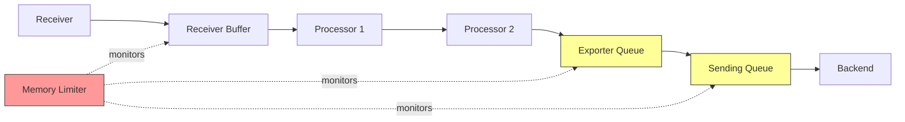

# How to Monitor Collector Queue Depth and Backpressure

Author: [nawazdhandala](https://www.github.com/nawazdhandala)

Tags: OpenTelemetry, Collector, Monitoring, Performance, Queue Management, Backpressure

Description: Complete guide to monitoring and managing queue depth and backpressure in OpenTelemetry Collector with practical metrics, alerts, and configuration strategies.

Queue management in the OpenTelemetry Collector is critical for reliable telemetry delivery. When queues fill up due to backpressure from slow exporters or traffic spikes, data loss occurs. Understanding how to monitor queue depth and respond to backpressure prevents gaps in observability data and ensures stable collector operation.

## Understanding Collector Queue Architecture

The OpenTelemetry Collector uses multiple queues at different stages of the pipeline to buffer telemetry data.



Each queue serves a specific purpose:

- **Receiver buffers** temporarily hold incoming data before processing
- **Processor buffers** maintain data between transformation steps
- **Exporter queues** buffer data waiting to be sent to backends
- **Sending queues** handle retry logic for failed exports

When any queue fills to capacity, backpressure propagates upstream, eventually causing receivers to refuse new connections or drop data.

## Key Metrics for Queue Monitoring

The OpenTelemetry Collector exposes metrics that reveal queue health. Understanding these metrics is essential for effective monitoring.

### Exporter Queue Metrics

```yaml
# otel-collector-config.yaml
service:
  telemetry:
    # Enable detailed internal metrics
    metrics:
      level: detailed
      address: 0.0.0.0:8888

exporters:
  otlp:
    endpoint: "backend.observability.svc.cluster.local:4317"

    # Configure sending queue with metrics
    sending_queue:
      enabled: true
      # Queue capacity
      queue_size: 10000
      # Number of parallel consumers
      num_consumers: 10

    # Timeout for export attempts
    timeout: 30s

    # Retry configuration
    retry_on_failure:
      enabled: true
      initial_interval: 5s
      max_interval: 30s
      max_elapsed_time: 300s
```

Critical metrics to monitor:

```promql
# Current queue size (items waiting to be sent)
otelcol_exporter_queue_size

# Queue capacity (maximum items)
otelcol_exporter_queue_capacity

# Queue utilization percentage
(otelcol_exporter_queue_size / otelcol_exporter_queue_capacity) * 100

# Failed send attempts (indicates backend issues)
rate(otelcol_exporter_send_failed_spans[5m])

# Enqueue failures (queue full, data dropped)
rate(otelcol_exporter_enqueue_failed_spans[5m])

# Successful send rate
rate(otelcol_exporter_sent_spans[5m])
```

### Processor Queue Metrics

```promql
# Batch processor queue size
otelcol_processor_batch_batch_size_trigger_send

# Batch processor timeout trigger
otelcol_processor_batch_timeout_trigger_send

# Memory limiter decisions (data refused due to memory pressure)
rate(otelcol_processor_refused_spans[5m])
```

### Receiver Metrics

```promql
# Accepted data rate
rate(otelcol_receiver_accepted_spans[5m])

# Refused data rate (indicates receiver backpressure)
rate(otelcol_receiver_refused_spans[5m])

# Ratio of refused to accepted (should be near zero)
rate(otelcol_receiver_refused_spans[5m]) / rate(otelcol_receiver_accepted_spans[5m])
```

## Setting Up Queue Monitoring

### Prometheus Scraping Configuration

Configure Prometheus to scrape collector metrics.

```yaml
# prometheus-config.yaml
scrape_configs:
- job_name: 'otel-collector'
  scrape_interval: 15s
  scrape_timeout: 10s

  static_configs:
  - targets:
    - 'otel-collector.observability.svc.cluster.local:8888'

  # Add labels to identify collector instances
  relabel_configs:
  - source_labels: [__address__]
    target_label: collector_instance
  - target_label: collector_cluster
    replacement: 'production'

  # Keep only relevant metrics to reduce cardinality
  metric_relabel_configs:
  - source_labels: [__name__]
    regex: 'otelcol_(receiver|processor|exporter)_.*'
    action: keep
```

### Grafana Dashboard

Create a comprehensive dashboard to visualize queue health.

```json
{
  "dashboard": {
    "title": "OpenTelemetry Collector Queue Health",
    "panels": [
      {
        "title": "Exporter Queue Utilization %",
        "type": "graph",
        "targets": [
          {
            "expr": "(otelcol_exporter_queue_size / otelcol_exporter_queue_capacity) * 100",
            "legendFormat": "{{exporter}} - {{collector_instance}}"
          }
        ],
        "yaxes": [
          {
            "label": "Utilization %",
            "max": 100,
            "min": 0
          }
        ],
        "thresholds": [
          {
            "value": 80,
            "colorMode": "critical",
            "fill": true,
            "line": true
          },
          {
            "value": 60,
            "colorMode": "warning"
          }
        ]
      },
      {
        "title": "Queue Size Absolute",
        "type": "graph",
        "targets": [
          {
            "expr": "otelcol_exporter_queue_size",
            "legendFormat": "{{exporter}} - {{collector_instance}}"
          },
          {
            "expr": "otelcol_exporter_queue_capacity",
            "legendFormat": "{{exporter}} - capacity"
          }
        ]
      },
      {
        "title": "Enqueue vs Dequeue Rate",
        "type": "graph",
        "targets": [
          {
            "expr": "rate(otelcol_exporter_enqueue_sent_spans[5m])",
            "legendFormat": "Enqueue - {{exporter}}"
          },
          {
            "expr": "rate(otelcol_exporter_sent_spans[5m])",
            "legendFormat": "Sent - {{exporter}}"
          }
        ]
      },
      {
        "title": "Failed Operations",
        "type": "graph",
        "targets": [
          {
            "expr": "rate(otelcol_exporter_enqueue_failed_spans[5m])",
            "legendFormat": "Enqueue Failed - {{exporter}}"
          },
          {
            "expr": "rate(otelcol_exporter_send_failed_spans[5m])",
            "legendFormat": "Send Failed - {{exporter}}"
          },
          {
            "expr": "rate(otelcol_receiver_refused_spans[5m])",
            "legendFormat": "Receiver Refused"
          }
        ]
      },
      {
        "title": "Receiver Backpressure Indicator",
        "type": "stat",
        "targets": [
          {
            "expr": "rate(otelcol_receiver_refused_spans[5m]) / rate(otelcol_receiver_accepted_spans[5m])",
            "legendFormat": "Refused Ratio"
          }
        ],
        "thresholds": [
          {
            "value": 0.01,
            "color": "red"
          },
          {
            "value": 0,
            "color": "green"
          }
        ]
      }
    ]
  }
}
```

### Alerting Rules

Define alerts for queue saturation and backpressure.

```yaml
# prometheus-alerts.yaml
groups:
- name: otel-collector-queue-health
  interval: 30s
  rules:

  # Alert when queue utilization is high
  - alert: CollectorQueueHighUtilization
    expr: |
      (otelcol_exporter_queue_size / otelcol_exporter_queue_capacity) * 100 > 80
    for: 5m
    labels:
      severity: warning
      component: otel-collector
    annotations:
      summary: "Collector queue utilization above 80%"
      description: |
        Collector {{ $labels.collector_instance }} exporter {{ $labels.exporter }}
        queue is {{ $value | humanize }}% full. Backpressure may occur soon.

  # Alert when queue is critically full
  - alert: CollectorQueueCritical
    expr: |
      (otelcol_exporter_queue_size / otelcol_exporter_queue_capacity) * 100 > 95
    for: 2m
    labels:
      severity: critical
      component: otel-collector
    annotations:
      summary: "Collector queue critically full"
      description: |
        Collector {{ $labels.collector_instance }} exporter {{ $labels.exporter }}
        queue is {{ $value | humanize }}% full. Data loss is imminent.

  # Alert when enqueue operations fail
  - alert: CollectorEnqueueFailing
    expr: rate(otelcol_exporter_enqueue_failed_spans[5m]) > 0
    for: 3m
    labels:
      severity: critical
      component: otel-collector
    annotations:
      summary: "Collector dropping data due to queue full"
      description: |
        Collector {{ $labels.collector_instance }} is dropping {{ $value | humanize }}
        spans per second because queues are full.

  # Alert when receivers refuse data
  - alert: CollectorReceiverBackpressure
    expr: rate(otelcol_receiver_refused_spans[5m]) > 0
    for: 3m
    labels:
      severity: warning
      component: otel-collector
    annotations:
      summary: "Collector receivers experiencing backpressure"
      description: |
        Collector {{ $labels.collector_instance }} receiver is refusing {{ $value | humanize }}
        spans per second due to downstream backpressure.

  # Alert when send success rate drops
  - alert: CollectorExporterSendFailures
    expr: |
      rate(otelcol_exporter_send_failed_spans[5m]) /
      (rate(otelcol_exporter_sent_spans[5m]) + rate(otelcol_exporter_send_failed_spans[5m])) > 0.05
    for: 5m
    labels:
      severity: warning
      component: otel-collector
    annotations:
      summary: "High exporter send failure rate"
      description: |
        Collector {{ $labels.collector_instance }} exporter {{ $labels.exporter }}
        failing {{ $value | humanizePercentage }} of send attempts.

  # Alert when batch processor isn't batching efficiently
  - alert: CollectorBatchingInefficient
    expr: |
      rate(otelcol_processor_batch_timeout_trigger_send[5m]) /
      (rate(otelcol_processor_batch_timeout_trigger_send[5m]) +
       rate(otelcol_processor_batch_batch_size_trigger_send[5m])) > 0.8
    for: 10m
    labels:
      severity: info
      component: otel-collector
    annotations:
      summary: "Batch processor mostly timeout-triggered"
      description: |
        Collector {{ $labels.collector_instance }} batch processor is triggering
        {{ $value | humanizePercentage }} sends by timeout rather than batch size.
        Consider adjusting batch size or timeout settings.
```

## Configuring Queue Behavior

### Optimal Queue Sizing

Queue size depends on your traffic patterns, export latency, and acceptable data loss risk.

```yaml
# otel-collector-config.yaml
exporters:
  otlp:
    endpoint: "backend.observability.svc.cluster.local:4317"

    sending_queue:
      enabled: true

      # Queue size calculation:
      # queue_size = peak_spans_per_second * max_export_delay_seconds
      # Example: 10,000 spans/sec * 30 sec delay = 300,000
      queue_size: 300000

      # Number of parallel consumers
      # Higher = more export parallelism but more memory/CPU
      # Start with 10 and increase if export rate is bottlenecked
      num_consumers: 10

      # Storage type: memory or persistent (experimental)
      # Persistent queues survive collector restarts but slower
      storage: memory

    # Timeout must be shorter than backend timeout
    timeout: 30s

    # Compression reduces network bandwidth and backend load
    compression: gzip

    retry_on_failure:
      enabled: true
      # Initial retry delay
      initial_interval: 5s
      # Maximum retry delay (exponential backoff)
      max_interval: 30s
      # Stop retrying after 5 minutes
      max_elapsed_time: 300s
```

### Batch Processor Tuning

The batch processor affects queue behavior by controlling when data moves from processing to export queues.

```yaml
# otel-collector-config.yaml
processors:
  batch:
    # Batch timeout: shorter = lower latency, more exports
    # Longer = better batching, fewer exports, more memory
    timeout: 10s

    # Trigger send when batch reaches this size
    # Larger = better compression and backend efficiency
    # Smaller = lower memory usage and latency
    send_batch_size: 8192

    # Maximum batch size (safety limit)
    # Should be 2x send_batch_size
    send_batch_max_size: 16384

    # Optional: metadata keys to batch by
    # Useful for multi-tenant scenarios
    metadata_keys:
    - tenant_id

  # Memory limiter MUST come before batch processor
  memory_limiter:
    check_interval: 1s

    # Soft limit: start refusing new data
    # Set to 80% of container memory limit
    limit_mib: 1600

    # Spike limit: additional headroom for bursts
    # Set to 20% of container memory limit
    spike_limit_mib: 400

service:
  pipelines:
    traces:
      receivers: [otlp]
      # Memory limiter MUST be first to protect collector
      processors: [memory_limiter, batch]
      exporters: [otlp]
```

### Multiple Pipeline Configurations

Separate pipelines with different queue configurations for different data priorities.

```yaml
# otel-collector-config.yaml
receivers:
  otlp:
    protocols:
      grpc:
        endpoint: 0.0.0.0:4317

  # Separate receiver for high-priority telemetry
  otlp/priority:
    protocols:
      grpc:
        endpoint: 0.0.0.0:4320

exporters:
  # High-priority exporter with larger queue
  otlp/priority:
    endpoint: "backend.observability.svc.cluster.local:4317"
    sending_queue:
      enabled: true
      # Larger queue for critical telemetry
      queue_size: 500000
      num_consumers: 20
    timeout: 30s

  # Standard exporter with normal queue
  otlp/standard:
    endpoint: "backend.observability.svc.cluster.local:4317"
    sending_queue:
      enabled: true
      queue_size: 200000
      num_consumers: 10
    timeout: 30s

processors:
  batch/priority:
    timeout: 5s
    send_batch_size: 4096

  batch/standard:
    timeout: 15s
    send_batch_size: 16384

  memory_limiter:
    check_interval: 1s
    limit_mib: 1600
    spike_limit_mib: 400

service:
  pipelines:
    # High-priority pipeline: shorter latency, larger queue
    traces/priority:
      receivers: [otlp/priority]
      processors: [memory_limiter, batch/priority]
      exporters: [otlp/priority]

    # Standard pipeline: optimized for throughput
    traces/standard:
      receivers: [otlp]
      processors: [memory_limiter, batch/standard]
      exporters: [otlp/standard]
```

## Responding to Backpressure

### Automatic Scaling with HPA

Use Horizontal Pod Autoscaler to scale collectors based on queue depth.

```yaml
# hpa.yaml
apiVersion: autoscaling/v2
kind: HorizontalPodAutoscaler
metadata:
  name: otel-collector-hpa
  namespace: observability
spec:
  scaleTargetRef:
    apiVersion: apps/v1
    kind: Deployment
    name: otel-collector

  minReplicas: 3
  maxReplicas: 20

  metrics:
  # Scale based on CPU utilization
  - type: Resource
    resource:
      name: cpu
      target:
        type: Utilization
        averageUtilization: 70

  # Scale based on memory utilization
  - type: Resource
    resource:
      name: memory
      target:
        type: Utilization
        averageUtilization: 75

  # Scale based on custom queue depth metric
  - type: Pods
    pods:
      metric:
        name: otelcol_exporter_queue_utilization_percent
      target:
        type: AverageValue
        averageValue: "60"

  behavior:
    scaleUp:
      # Scale up quickly when queues fill
      stabilizationWindowSeconds: 30
      policies:
      - type: Percent
        value: 100
        periodSeconds: 30
      - type: Pods
        value: 4
        periodSeconds: 30
      selectPolicy: Max

    scaleDown:
      # Scale down slowly to avoid thrashing
      stabilizationWindowSeconds: 300
      policies:
      - type: Percent
        value: 50
        periodSeconds: 60
      selectPolicy: Min
```

Export queue utilization as a custom metric:

```yaml
# prometheus-adapter-config.yaml
rules:
- seriesQuery: 'otelcol_exporter_queue_size'
  resources:
    overrides:
      namespace: {resource: "namespace"}
      pod: {resource: "pod"}
  name:
    matches: "^otelcol_exporter_queue_size$"
    as: "otelcol_exporter_queue_utilization_percent"
  metricsQuery: |
    (otelcol_exporter_queue_size / otelcol_exporter_queue_capacity) * 100
```

### Load Shedding Strategy

Implement intelligent load shedding when queues approach capacity.

```yaml
# otel-collector-config.yaml
processors:
  # Probabilistic sampler to reduce load under pressure
  probabilistic_sampler:
    # Sample 100% by default
    sampling_percentage: 100

  # Tail sampling to keep important traces
  tail_sampling:
    # Decision wait time
    decision_wait: 10s

    # Number of traces to keep in memory
    num_traces: 50000

    policies:
    # Always sample errors
    - name: error-policy
      type: status_code
      status_code:
        status_codes: [ERROR]

    # Sample slow traces
    - name: latency-policy
      type: latency
      latency:
        threshold_ms: 5000

    # Sample 10% of normal traffic
    - name: probabilistic-policy
      type: probabilistic
      probabilistic:
        sampling_percentage: 10

  # Attribute processor to add priority tags
  attributes/priority:
    actions:
    - key: telemetry.priority
      value: high
      action: insert
      # Add priority based on service name
      match:
        regexp:
          service.name: "^(payment|checkout|auth).*"

  # Filter processor to drop low-priority data under pressure
  filter/load_shed:
    # Drop traces without priority tag when queue is full
    traces:
      span:
      - 'attributes["telemetry.priority"] == nil'
    # Only activate filter based on external signal (requires custom extension)

service:
  pipelines:
    traces:
      receivers: [otlp]
      processors:
      - memory_limiter
      - attributes/priority
      - tail_sampling
      - batch
      exporters: [otlp]
```

### Persistent Queue Configuration

For critical telemetry that must not be lost, use persistent queues (experimental feature).

```yaml
# otel-collector-config.yaml
exporters:
  otlp:
    endpoint: "backend.observability.svc.cluster.local:4317"

    sending_queue:
      enabled: true
      queue_size: 100000
      num_consumers: 10

      # Enable persistent queue (requires storage extension)
      storage: file_storage

extensions:
  # File storage extension for persistent queues
  file_storage:
    # Directory for queue data
    directory: /var/lib/otelcol/queue
    # Timeout for storage operations
    timeout: 10s
    # Compact storage periodically
    compaction:
      on_start: true
      on_rebound: true
      directory: /var/lib/otelcol/compact

service:
  extensions: [file_storage]
  pipelines:
    traces:
      receivers: [otlp]
      processors: [batch]
      exporters: [otlp]
```

Mount persistent volume for queue storage:

```yaml
# deployment-with-persistent-queue.yaml
apiVersion: apps/v1
kind: Deployment
metadata:
  name: otel-collector
  namespace: observability
spec:
  replicas: 3
  selector:
    matchLabels:
      app: otel-collector
  template:
    metadata:
      labels:
        app: otel-collector
    spec:
      containers:
      - name: otel-collector
        image: otel/opentelemetry-collector-contrib:0.93.0

        volumeMounts:
        - name: queue-storage
          mountPath: /var/lib/otelcol/queue
        - name: config
          mountPath: /conf

        resources:
          requests:
            cpu: 1000m
            memory: 2Gi
          limits:
            cpu: 2000m
            memory: 4Gi

      volumes:
      - name: config
        configMap:
          name: otel-collector-config
      - name: queue-storage
        persistentVolumeClaim:
          claimName: otel-collector-queue-pvc
---
apiVersion: v1
kind: PersistentVolumeClaim
metadata:
  name: otel-collector-queue-pvc
  namespace: observability
spec:
  accessModes:
  - ReadWriteOnce
  resources:
    requests:
      # Size depends on queue_size and average span size
      # Estimate: 100,000 spans * 1KB = 100MB (add 10x safety margin)
      storage: 1Gi
  storageClassName: fast-ssd
```

## Queue Health Runbook

When alerts fire, follow this troubleshooting sequence:

### 1. Check Queue Utilization

```bash
# Query current queue state
curl -s http://otel-collector.observability.svc.cluster.local:8888/metrics | \
  grep "otelcol_exporter_queue"
```

### 2. Identify Bottleneck

```promql
# Which exporter has the fullest queue?
topk(5, otelcol_exporter_queue_size / otelcol_exporter_queue_capacity)

# Is the bottleneck sending or receiving?
rate(otelcol_exporter_enqueue_sent_spans[5m]) - rate(otelcol_exporter_sent_spans[5m])
```

### 3. Check Backend Health

```bash
# Test connectivity to backend
kubectl exec -it deployment/otel-collector -n observability -- sh -c \
  "nc -zv backend.observability.svc.cluster.local 4317"

# Check backend response time
kubectl exec -it deployment/otel-collector -n observability -- sh -c \
  "time grpcurl -plaintext backend.observability.svc.cluster.local:4317 list"
```

### 4. Temporary Mitigation

```bash
# Scale up collectors immediately
kubectl scale deployment/otel-collector -n observability --replicas=10

# Or increase queue size (requires config change)
kubectl edit configmap otel-collector-config -n observability
# Edit sending_queue.queue_size, then restart pods
kubectl rollout restart deployment/otel-collector -n observability
```

### 5. Long-term Fix

Based on root cause:

- **Backend slow**: Optimize backend, add caching, scale backend
- **Network issues**: Investigate connectivity, increase timeout
- **Traffic spike**: Implement auto-scaling, increase queue capacity
- **Configuration issue**: Adjust batch size, timeout, or consumer count

## Best Practices

1. **Monitor queue utilization continuously** and alert before reaching capacity
2. **Set queue size based on measured traffic** with 2-3x safety margin
3. **Use memory limiter** as first processor to prevent OOM
4. **Configure appropriate timeouts** to fail fast on backend issues
5. **Implement auto-scaling** based on queue depth metrics
6. **Test backpressure scenarios** in staging before production deployment
7. **Use persistent queues** for critical telemetry that cannot be lost
8. **Separate pipelines** for different priority levels of telemetry
9. **Monitor memory usage** alongside queue depth
10. **Document expected queue behavior** for your traffic patterns

## Related Resources

For comprehensive OpenTelemetry Collector troubleshooting:

- [How to Fix Collector Slow Startup in Kubernetes](https://oneuptime.com/blog/post/2026-02-06-fix-collector-slow-startup-kubernetes/view)
- [How to Debug Collector Receiver Connection Drops](https://oneuptime.com/blog/post/2026-02-06-debug-collector-receiver-connection-drops/view)
- [How to Fix Collector Exporter Timeout Errors](https://oneuptime.com/blog/post/2026-02-06-fix-collector-exporter-timeout-errors/view)
- [How to Troubleshoot Multi-Pipeline Routing Issues in the Collector](https://oneuptime.com/blog/post/2026-02-06-troubleshoot-multi-pipeline-routing-issues-collector/view)

Effective queue management prevents data loss and ensures reliable telemetry delivery. By monitoring queue depth metrics, configuring appropriate queue sizes, and implementing automated responses to backpressure, you can build resilient observability pipelines that handle traffic spikes and backend issues gracefully.
