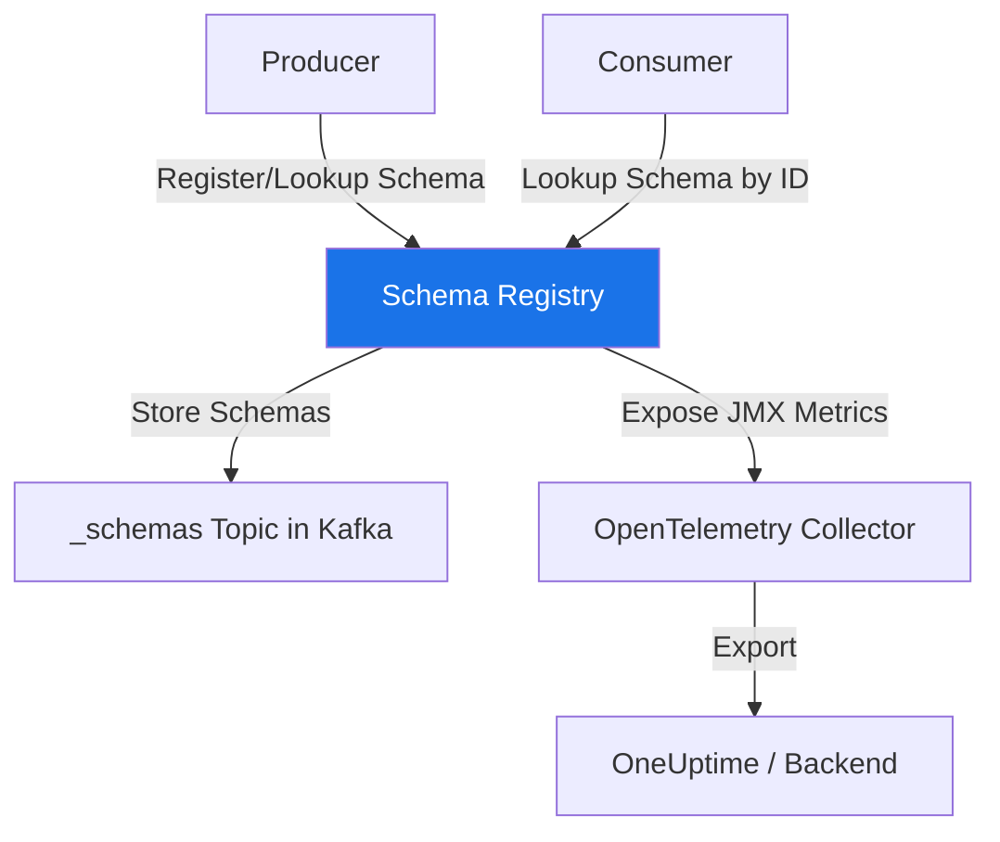

# How to Monitor Confluent Schema Registry with OpenTelemetry

Author: [nawazdhandala](https://www.github.com/nawazdhandala)

Tags: OpenTelemetry, Confluent, Schema Registry, Kafka, Monitoring, Metrics

Description: Learn how to monitor Confluent Schema Registry with OpenTelemetry to track schema evolution, API performance, and compatibility checks across your Kafka ecosystem.

---

Confluent Schema Registry is the central nervous system of type safety in Kafka-based architectures. It stores and manages Avro, Protobuf, and JSON schemas that producers and consumers use to serialize and deserialize messages. When Schema Registry has issues, the impact cascades across your entire streaming platform. Producers fail to serialize, consumers fail to deserialize, and data pipelines grind to a halt.

Monitoring Schema Registry with OpenTelemetry gives you visibility into API latency, schema evolution patterns, compatibility check failures, and the overall health of your schema management infrastructure.

## Why Schema Registry Monitoring Matters

Schema Registry is often treated as a "set it and forget it" service. Teams deploy it alongside Kafka and rarely think about it until something breaks. But Schema Registry handles critical operations in the hot path of every message:

- Schema lookups on every produce and consume operation (with client-side caching)
- Compatibility checks on every schema registration
- Subject management as your topic count grows
- Storage backend operations against Kafka or the internal topic

When Schema Registry slows down or returns errors, the symptoms show up elsewhere. Producers see increased latency. Consumers throw deserialization exceptions. New deployments fail because schema compatibility checks time out. Monitoring the registry directly gives you a head start on diagnosing these problems.



## Collecting Schema Registry JMX Metrics

Schema Registry exposes internal metrics through JMX (Java Management Extensions). The OpenTelemetry Collector can scrape these using the JMX receiver or through Prometheus exposition if you enable the JMX exporter.

First, configure Schema Registry to expose JMX metrics over HTTP by adding the Prometheus JMX exporter agent to the startup configuration.

```bash
# Add to schema-registry-run-class or SCHEMA_REGISTRY_JMX_OPTS
export SCHEMA_REGISTRY_JMX_OPTS="-javaagent:/opt/jmx_exporter/jmx_prometheus_javaagent.jar=7071:/opt/jmx_exporter/schema-registry.yml"
```

The JMX exporter configuration file maps JMX MBeans to Prometheus-format metrics.

```yaml
# jmx_exporter/schema-registry.yml
# Map Schema Registry JMX beans to Prometheus metrics
rules:
  # API request latency metrics
  - pattern: "kafka.schema.registry<type=jersey-metrics, name=(.+)><>(\\w+)"
    name: "schema_registry_jersey_$1_$2"
    type: GAUGE

  # Schema store metrics
  - pattern: "kafka.schema.registry<type=master-slave-role><>(\\w+)"
    name: "schema_registry_master_slave_$1"
    type: GAUGE

  # Kafka store metrics for the _schemas topic
  - pattern: "kafka.schema.registry<type=kafka-store><>(\\w+)"
    name: "schema_registry_kafka_store_$1"
    type: GAUGE

  # Serializer metrics
  - pattern: "kafka.schema.registry<type=json-schema-provider><>(\\w+)"
    name: "schema_registry_json_schema_$1"
    type: GAUGE

  - pattern: "kafka.schema.registry<type=avro-schema-provider><>(\\w+)"
    name: "schema_registry_avro_schema_$1"
    type: GAUGE

  - pattern: "kafka.schema.registry<type=protobuf-schema-provider><>(\\w+)"
    name: "schema_registry_protobuf_schema_$1"
    type: GAUGE
```

These rules capture the most important metric categories: API request performance through the Jersey metrics, the master/slave role status for multi-node deployments, the Kafka store operations for the internal `_schemas` topic, and per-schema-type provider metrics.

## OpenTelemetry Collector Configuration

With JMX metrics exposed as Prometheus endpoints, configure the OpenTelemetry Collector to scrape them.

```yaml
# Collector config for Schema Registry monitoring
receivers:
  # Scrape Schema Registry Prometheus metrics
  prometheus:
    config:
      scrape_configs:
        - job_name: schema-registry
          scrape_interval: 15s
          static_configs:
            - targets:
                - schema-registry-1:7071
                - schema-registry-2:7071
          # Relabel to add instance identification
          relabel_configs:
            - source_labels: [__address__]
              target_label: instance

  # Also receive OTLP traces from instrumented clients
  otlp:
    protocols:
      grpc:
        endpoint: 0.0.0.0:4317

processors:
  batch:
    timeout: 10s
    send_batch_size: 256

  # Add resource attributes for Schema Registry metrics
  resource:
    attributes:
      - key: service.name
        value: confluent-schema-registry
        action: upsert

exporters:
  otlp:
    endpoint: https://your-oneuptime-instance.com:4317

service:
  pipelines:
    metrics:
      receivers: [prometheus]
      processors: [resource, batch]
      exporters: [otlp]
    traces:
      receivers: [otlp]
      processors: [batch]
      exporters: [otlp]
```

The resource processor ensures all Schema Registry metrics carry a consistent `service.name` attribute, making it easy to build dashboards and alerts specifically for this service.

## Instrumenting Schema Registry API Calls in Clients

Beyond server-side metrics, instrumenting your application's Schema Registry client calls gives you the consumer perspective on registry performance. Here is how to wrap the Confluent Python client's schema operations with OpenTelemetry spans.

```python
from confluent_kafka.schema_registry import SchemaRegistryClient
from opentelemetry import trace

tracer = trace.get_tracer("schema.registry.client")

class TracedSchemaRegistryClient:
    """Wrapper that adds OpenTelemetry tracing to Schema Registry operations."""

    def __init__(self, config):
        # Initialize the underlying Confluent client
        self._client = SchemaRegistryClient(config)
        self._url = config.get("url", "unknown")

    def get_schema(self, schema_id):
        # Trace schema lookups by ID
        with tracer.start_as_current_span(
            "schema_registry.get_schema",
            kind=trace.SpanKind.CLIENT,
            attributes={
                "schema_registry.url": self._url,
                "schema_registry.schema_id": schema_id,
                "schema_registry.operation": "get_schema",
            }
        ) as span:
            try:
                schema = self._client.get_schema(schema_id)
                span.set_attribute("schema_registry.schema_type", schema.schema_type)
                return schema
            except Exception as e:
                span.set_status(trace.StatusCode.ERROR, str(e))
                span.record_exception(e)
                raise

    def register_schema(self, subject_name, schema):
        # Trace schema registration attempts
        with tracer.start_as_current_span(
            "schema_registry.register_schema",
            kind=trace.SpanKind.CLIENT,
            attributes={
                "schema_registry.url": self._url,
                "schema_registry.subject": subject_name,
                "schema_registry.operation": "register_schema",
                "schema_registry.schema_type": schema.schema_type,
            }
        ) as span:
            try:
                schema_id = self._client.register_schema(subject_name, schema)
                span.set_attribute("schema_registry.schema_id", schema_id)
                return schema_id
            except Exception as e:
                span.set_status(trace.StatusCode.ERROR, str(e))
                span.record_exception(e)
                raise

    def check_compatibility(self, subject_name, schema, version="latest"):
        # Trace compatibility check calls
        with tracer.start_as_current_span(
            "schema_registry.check_compatibility",
            kind=trace.SpanKind.CLIENT,
            attributes={
                "schema_registry.url": self._url,
                "schema_registry.subject": subject_name,
                "schema_registry.operation": "check_compatibility",
                "schema_registry.version": str(version),
            }
        ) as span:
            try:
                is_compatible = self._client.test_compatibility(
                    subject_name, schema, version
                )
                span.set_attribute("schema_registry.compatible", is_compatible)
                return is_compatible
            except Exception as e:
                span.set_status(trace.StatusCode.ERROR, str(e))
                span.record_exception(e)
                raise
```

This wrapper class delegates all real work to the underlying Confluent client while adding spans around each operation. The span attributes capture enough context to understand which subject and schema were involved when something goes wrong. The `check_compatibility` method is especially important to trace because compatibility failures during CI/CD deployments are a common source of pipeline blockages.

## Tracking Schema Evolution Metrics

You can build custom metrics that track schema evolution patterns over time. This helps you understand how quickly your schemas are changing and which subjects are most active.

```python
from opentelemetry import metrics

meter = metrics.get_meter("schema.registry.evolution")

# Counter for schema registrations
schema_registrations = meter.create_counter(
    name="schema_registry.registrations",
    description="Number of new schema versions registered",
    unit="registrations",
)

# Counter for compatibility check outcomes
compatibility_checks = meter.create_counter(
    name="schema_registry.compatibility_checks",
    description="Number of compatibility checks performed",
    unit="checks",
)

def register_with_metrics(client, subject, schema):
    """Register a schema and record metrics about the operation."""
    try:
        schema_id = client.register_schema(subject, schema)

        # Record successful registration
        schema_registrations.add(1, {
            "schema_registry.subject": subject,
            "schema_registry.schema_type": schema.schema_type,
            "schema_registry.outcome": "success",
        })

        return schema_id
    except Exception as e:
        # Record failed registration
        schema_registrations.add(1, {
            "schema_registry.subject": subject,
            "schema_registry.schema_type": schema.schema_type,
            "schema_registry.outcome": "failure",
            "schema_registry.error_type": type(e).__name__,
        })
        raise

def check_compat_with_metrics(client, subject, schema):
    """Check compatibility and track outcomes as metrics."""
    is_compatible = client.check_compatibility(subject, schema)

    compatibility_checks.add(1, {
        "schema_registry.subject": subject,
        "schema_registry.compatible": str(is_compatible),
    })

    return is_compatible
```

These counters let you build dashboards that show schema registration rates by subject and type, compatibility check pass/fail ratios, and error type distributions. When a team pushes a breaking schema change, you will see the compatibility check failure spike before producers start failing.

## Monitoring Multi-Node Registry Clusters

In production, Schema Registry typically runs as a cluster with one master and one or more replicas. Monitoring the master election and node health is critical for availability.

```yaml
# Alert rules for Schema Registry cluster health
# These can be configured in your monitoring backend (e.g., OneUptime)
#
# Key metrics to alert on:
#
# schema_registry_master_slave_master_slave_role
#   Value 1 = master, 0 = slave
#   Alert if no node reports as master for > 30 seconds
#
# schema_registry_jersey_request_error_rate
#   Alert if error rate exceeds 1% over a 5-minute window
#
# schema_registry_kafka_store_flush_latency
#   Alert if p99 latency for _schemas topic writes exceeds 500ms
```

The master/slave role metric is the most critical one for cluster health. If you are running three Schema Registry nodes and none of them report as master, no write operations (schema registrations) can succeed. Read operations (schema lookups) will continue to work from any node because schemas are cached locally, but this is a situation that needs immediate attention.

## Wrapping Up

Monitoring Confluent Schema Registry with OpenTelemetry gives you visibility at both the server level (through JMX metrics) and the client level (through instrumented API calls). The server metrics tell you about overall registry health, request latency, and cluster role status. The client-side traces tell you exactly which schema operations are slow or failing from your application's perspective.

Start by setting up the JMX exporter and Prometheus scraping in your collector. Then add the client-side instrumentation wrapper to your most critical producer and consumer applications. The schema evolution metrics are a nice addition once you have the basics running, especially if you have many teams registering schemas across shared Kafka clusters.
