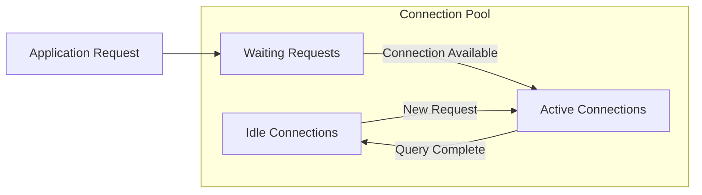
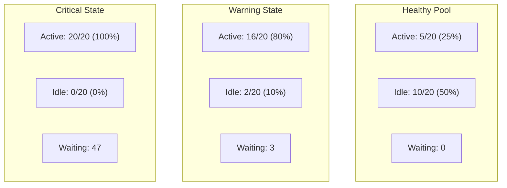

# How to Monitor Connection Pool Statistics (Idle, Active, Wait) with OpenTelemetry

Author: [nawazdhandala](https://www.github.com/nawazdhandala)

Tags: OpenTelemetry, Connection Pool, Database, Metrics, Monitoring, Performance

Description: How to instrument and monitor database connection pool metrics like idle, active, and waiting connections using OpenTelemetry custom metrics.

---

Connection pools are the unsung heroes of database performance. They sit between your application and the database, reusing connections instead of creating new ones for every query. When the pool is healthy, everything runs smoothly. When it is not, you get connection timeouts, request queuing, and cascading failures that are notoriously hard to debug without the right metrics.

Most connection pool libraries expose statistics about their internal state: how many connections are active, how many are idle, how many requests are waiting for a connection. The problem is that these statistics usually live inside your application process and never make it to your monitoring dashboard. OpenTelemetry fixes this by letting you export pool statistics as standard metrics.

## What Connection Pool Metrics Tell You

There are three core metrics that every pool exposes in some form.



**Active connections** are currently executing a query. A high number means your database is under load.

**Idle connections** are open but not doing anything. They are ready to serve the next request without the overhead of establishing a new connection. Too many idle connections waste database resources. Too few means every burst of traffic requires creating new connections, which is slow.

**Waiting requests** are application threads that need a database connection but all pool connections are in use. This is the most critical metric. If requests are waiting, your users are experiencing latency. If the wait exceeds your timeout, they get errors.

## Instrumenting HikariCP (Java)

HikariCP is the default connection pool for Spring Boot and one of the most widely used pools in the Java ecosystem. It exposes metrics through JMX or Micrometer. Here is how to pipe those into OpenTelemetry.

Add the OpenTelemetry dependencies to your project.

```xml
<!-- pom.xml - Add OpenTelemetry metrics dependencies -->
<dependency>
    <groupId>io.opentelemetry</groupId>
    <artifactId>opentelemetry-api</artifactId>
    <version>1.35.0</version>
</dependency>
<dependency>
    <groupId>io.opentelemetry</groupId>
    <artifactId>opentelemetry-sdk-metrics</artifactId>
    <version>1.35.0</version>
</dependency>
<dependency>
    <groupId>io.opentelemetry</groupId>
    <artifactId>opentelemetry-exporter-otlp</artifactId>
    <version>1.35.0</version>
</dependency>
```

Create a metrics collector that reads HikariCP pool statistics and reports them as OpenTelemetry gauges.

```java
// HikariPoolMetrics.java
import com.zaxxer.hikari.HikariDataSource;
import com.zaxxer.hikari.HikariPoolMXBean;
import io.opentelemetry.api.metrics.Meter;
import io.opentelemetry.api.metrics.ObservableDoubleGauge;
import io.opentelemetry.api.common.Attributes;
import io.opentelemetry.api.common.AttributeKey;

public class HikariPoolMetrics {

    private final HikariPoolMXBean poolBean;
    private final Attributes poolAttributes;

    public HikariPoolMetrics(HikariDataSource dataSource, Meter meter) {
        this.poolBean = dataSource.getHikariPoolMXBean();
        // Tag all metrics with the pool name for identification
        this.poolAttributes = Attributes.of(
            AttributeKey.stringKey("pool.name"), dataSource.getPoolName()
        );

        // Register a gauge for active connections (currently executing queries)
        meter.gaugeBuilder("db.pool.active_connections")
            .setDescription("Number of connections currently in use")
            .setUnit("connections")
            .buildWithCallback(measurement -> {
                measurement.record(poolBean.getActiveConnections(), poolAttributes);
            });

        // Register a gauge for idle connections (available and waiting)
        meter.gaugeBuilder("db.pool.idle_connections")
            .setDescription("Number of idle connections in the pool")
            .setUnit("connections")
            .buildWithCallback(measurement -> {
                measurement.record(poolBean.getIdleConnections(), poolAttributes);
            });

        // Register a gauge for threads waiting for a connection
        meter.gaugeBuilder("db.pool.waiting_threads")
            .setDescription("Number of threads waiting for a connection")
            .setUnit("threads")
            .buildWithCallback(measurement -> {
                measurement.record(poolBean.getThreadsAwaitingConnection(), poolAttributes);
            });

        // Register total connections (active + idle = total)
        meter.gaugeBuilder("db.pool.total_connections")
            .setDescription("Total number of connections in the pool")
            .setUnit("connections")
            .buildWithCallback(measurement -> {
                measurement.record(poolBean.getTotalConnections(), poolAttributes);
            });
    }
}
```

Register it during application startup.

```java
// Application.java
import io.opentelemetry.api.GlobalOpenTelemetry;
import io.opentelemetry.api.metrics.Meter;

public class Application {
    public static void main(String[] args) {
        HikariDataSource dataSource = createDataSource();

        // Get a meter instance from the global OpenTelemetry provider
        Meter meter = GlobalOpenTelemetry.getMeter("connection-pool-monitor");

        // Start collecting pool metrics
        new HikariPoolMetrics(dataSource, meter);

        // ... rest of your application startup
    }
}
```

## Instrumenting psycopg2 Connection Pool (Python)

For Python applications using psycopg2's built-in connection pool (or psycopg2-pool), here is how to export pool statistics.

```python
# pool_metrics.py
import threading
import time
from psycopg2 import pool
from opentelemetry import metrics
from opentelemetry.sdk.metrics import MeterProvider
from opentelemetry.sdk.metrics.export import PeriodicExportingMetricReader
from opentelemetry.exporter.otlp.proto.http.metric_exporter import OTLPMetricExporter
from opentelemetry.sdk.resources import Resource

# Set up the OpenTelemetry meter provider
resource = Resource.create({"service.name": "api-service"})
exporter = OTLPMetricExporter(endpoint="http://localhost:4318/v1/metrics")
reader = PeriodicExportingMetricReader(exporter, export_interval_millis=15000)
provider = MeterProvider(resource=resource, metric_readers=[reader])
metrics.set_meter_provider(provider)

meter = metrics.get_meter("connection-pool")

# Create the connection pool with min/max bounds
connection_pool = pool.ThreadedConnectionPool(
    minconn=5,    # Minimum idle connections to maintain
    maxconn=20,   # Maximum total connections allowed
    host="localhost",
    database="myapp",
    user="appuser",
    password="secret",
)

# Track pool usage with observable gauges that sample on each collection
active_gauge = meter.create_observable_gauge(
    "db.pool.active_connections",
    description="Connections currently checked out and in use",
    unit="connections",
)

idle_gauge = meter.create_observable_gauge(
    "db.pool.idle_connections",
    description="Connections available in the pool",
    unit="connections",
)


class PoolStatsCollector:
    """
    Collects connection pool statistics and exposes them as
    OpenTelemetry observable gauge callbacks.
    """
    def __init__(self, pool_instance, pool_name="default"):
        self.pool = pool_instance
        self.pool_name = pool_name
        # Track waiting requests manually since psycopg2 pool does not expose this
        self._waiting_count = 0
        self._lock = threading.Lock()

    def get_active_callback(self, options):
        """Callback for the active connections gauge."""
        # psycopg2 pool tracks used connections in _used dict
        used = len(getattr(self.pool, '_used', {}))
        yield metrics.Observation(
            value=used,
            attributes={"pool.name": self.pool_name}
        )

    def get_idle_callback(self, options):
        """Callback for the idle connections gauge."""
        # Available connections are stored in the _pool list
        available = len(getattr(self.pool, '_pool', []))
        yield metrics.Observation(
            value=available,
            attributes={"pool.name": self.pool_name}
        )

    def get_waiting_callback(self, options):
        """Callback for waiting requests gauge."""
        with self._lock:
            yield metrics.Observation(
                value=self._waiting_count,
                attributes={"pool.name": self.pool_name}
            )


# Initialize the collector and register callbacks
collector = PoolStatsCollector(connection_pool, pool_name="main-db")

meter.create_observable_gauge(
    "db.pool.active_connections",
    callbacks=[collector.get_active_callback],
    description="Active connections",
    unit="connections",
)

meter.create_observable_gauge(
    "db.pool.idle_connections",
    callbacks=[collector.get_idle_callback],
    description="Idle connections",
    unit="connections",
)

meter.create_observable_gauge(
    "db.pool.waiting_requests",
    callbacks=[collector.get_waiting_callback],
    description="Requests waiting for a connection",
    unit="requests",
)
```

## Instrumenting node-postgres (pg) Pool (Node.js)

The `pg` library for Node.js exposes pool statistics through properties on the pool object.

```javascript
// pool-metrics.js
const { Pool } = require('pg');
const { metrics } = require('@opentelemetry/api');

// Create the database connection pool
const pool = new Pool({
  host: 'localhost',
  database: 'myapp',
  user: 'appuser',
  password: 'secret',
  max: 20,              // Maximum number of connections
  idleTimeoutMillis: 30000,  // Close idle connections after 30 seconds
  connectionTimeoutMillis: 5000,  // Fail if no connection available in 5 seconds
});

const meter = metrics.getMeter('pg-pool');

// Register observable gauges that read pool state on each metric collection
meter.createObservableGauge('db.pool.total_connections', {
  description: 'Total connections in the pool (active + idle)',
  unit: 'connections',
}).addCallback((result) => {
  // pool.totalCount gives us active + idle connections
  result.observe(pool.totalCount, { 'pool.name': 'main-db' });
});

meter.createObservableGauge('db.pool.idle_connections', {
  description: 'Connections sitting idle in the pool',
  unit: 'connections',
}).addCallback((result) => {
  result.observe(pool.idleCount, { 'pool.name': 'main-db' });
});

meter.createObservableGauge('db.pool.waiting_requests', {
  description: 'Client requests waiting for a connection',
  unit: 'requests',
}).addCallback((result) => {
  // waitingCount shows how many callers are queued for a connection
  result.observe(pool.waitingCount, { 'pool.name': 'main-db' });
});

// Also track connection acquisition time as a histogram
const acquisitionTime = meter.createHistogram('db.pool.acquisition_time', {
  description: 'Time spent waiting to acquire a connection from the pool',
  unit: 'ms',
});

// Wrap pool.connect to measure acquisition time
const originalConnect = pool.connect.bind(pool);
pool.connect = async function () {
  const start = Date.now();
  try {
    const client = await originalConnect();
    const duration = Date.now() - start;
    // Record how long we waited for this connection
    acquisitionTime.record(duration, { 'pool.name': 'main-db' });
    return client;
  } catch (error) {
    const duration = Date.now() - start;
    acquisitionTime.record(duration, {
      'pool.name': 'main-db',
      'error': 'true',
    });
    throw error;
  }
};

module.exports = pool;
```

## What Healthy vs Unhealthy Pools Look Like

Understanding normal pool behavior makes it easier to set good alert thresholds.



**Healthy**: Active connections fluctuate with traffic, there is always a buffer of idle connections, and nothing is waiting.

**Warning**: Most connections are active, few are idle, and some requests are starting to queue. This is the time to investigate. Maybe a slow query is holding connections longer than expected, or traffic has grown beyond what the pool can handle.

**Critical**: Pool is fully saturated, idle connections are gone, and a large queue of waiting requests is building up. Connection timeouts and application errors are imminent.

## Alert Thresholds Worth Setting

Here are practical thresholds based on common production patterns:

- **Waiting requests > 0 for more than 30 seconds** - Something is wrong. Either your pool is too small or queries are too slow.
- **Active connections > 80% of max pool size for more than 2 minutes** - You are approaching saturation.
- **Idle connections = 0 for more than 1 minute** - No buffer left for traffic spikes.
- **Connection acquisition time p99 > 500ms** - Users are waiting too long for database access.

## Connecting Pool Metrics to Traces

Pool metrics tell you that something is wrong. Traces tell you why. When you see a spike in waiting requests, you want to know which queries are holding connections for too long. By correlating your pool metrics timestamp with your trace data, you can find the slow queries that caused the pool exhaustion.

A practical approach is to add pool state as span attributes on every database query span.

```python
# Add pool stats to every query span for correlation
def execute_query(query, params):
    span = trace.get_current_span()
    # Snapshot pool state at query execution time
    span.set_attribute("db.pool.active_at_query_time", len(pool._used))
    span.set_attribute("db.pool.idle_at_query_time", len(pool._pool))

    conn = pool.getconn()
    try:
        cursor = conn.cursor()
        cursor.execute(query, params)
        return cursor.fetchall()
    finally:
        pool.putconn(conn)
```

This way, when you find a slow query in your traces, you can see what the pool looked like when that query ran. If every slow query shows 20/20 active connections and 0 idle, you know pool exhaustion was part of the problem.

Monitoring connection pools is one of the highest-value, lowest-effort observability wins you can get. A few gauges and one histogram give you the early warning system that prevents database-related outages.
