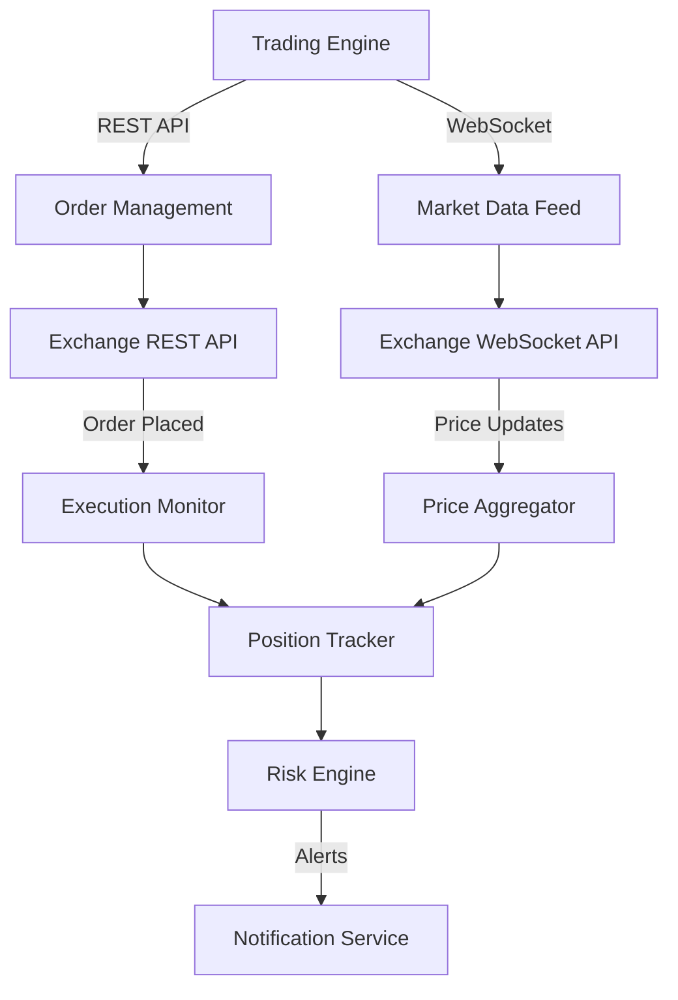

# How to Monitor Cryptocurrency Exchange APIs with OpenTelemetry

Author: [nawazdhandala](https://www.github.com/nawazdhandala)

Tags: OpenTelemetry, Cryptocurrency, Exchange API, Monitoring, Financial Systems, WebSocket

Description: Learn how to monitor cryptocurrency exchange APIs with OpenTelemetry, covering REST and WebSocket instrumentation, order execution tracking, and price feed monitoring.

---

Cryptocurrency exchange APIs are some of the most latency-sensitive integrations you can work with. When you submit a market order, every millisecond between your request and the exchange's fill can mean a different price. When you are consuming a WebSocket price feed, a dropped connection or a delayed message can leave your trading system working with stale data. And when you are managing withdrawals, reliability is not optional because a failed transaction with no visibility can mean lost funds.

OpenTelemetry lets you instrument your exchange API interactions so you know exactly what is happening at every step: how long orders take to fill, whether your price feeds are lagging, how often rate limits are hit, and where your API calls are spending their time. This guide walks through instrumenting the most common exchange API patterns.

## Exchange API Integration Architecture

Most exchange integrations involve both REST APIs for order management and WebSocket connections for real-time data. Here is a typical setup:



## Instrumenting REST API Calls to Exchanges

Exchange REST APIs handle order placement, account queries, and withdrawal requests. Each call needs to be traced with attributes that capture the exchange-specific context.

```python
# exchange_client.py - Instrumented exchange API client
import time
import hmac
import hashlib
from opentelemetry import trace, metrics
from opentelemetry.sdk.trace import TracerProvider
from opentelemetry.sdk.trace.export import BatchSpanProcessor
from opentelemetry.exporter.otlp.proto.grpc.trace_exporter import OTLPSpanExporter
from opentelemetry.sdk.metrics import MeterProvider
from opentelemetry.sdk.metrics.export import PeriodicExportingMetricReader
from opentelemetry.exporter.otlp.proto.grpc.metric_exporter import OTLPMetricExporter
from opentelemetry.sdk.resources import Resource, SERVICE_NAME
import httpx

# Initialize OpenTelemetry
resource = Resource.create({
    SERVICE_NAME: "exchange-api-client",
    "service.namespace": "crypto-trading",
})

tracer_provider = TracerProvider(resource=resource)
tracer_provider.add_span_processor(BatchSpanProcessor(
    OTLPSpanExporter(endpoint="otel-collector:4317", insecure=True)
))
trace.set_tracer_provider(tracer_provider)

meter_provider = MeterProvider(resource=resource, metric_readers=[
    PeriodicExportingMetricReader(
        OTLPMetricExporter(endpoint="otel-collector:4317", insecure=True),
        export_interval_millis=5000,
    )
])
metrics.set_meter_provider(meter_provider)

tracer = trace.get_tracer("exchange-client")
meter = metrics.get_meter("exchange-client")

# Metrics for exchange API interactions
api_latency = meter.create_histogram(
    "exchange.api.latency_ms",
    description="Exchange API call latency",
    unit="ms",
)
api_errors = meter.create_counter(
    "exchange.api.errors_total",
    description="Exchange API errors by type",
)
rate_limit_hits = meter.create_counter(
    "exchange.api.rate_limit_hits",
    description="Number of times rate limits were hit",
)
order_fill_time = meter.create_histogram(
    "exchange.order.fill_time_ms",
    description="Time from order submission to fill",
    unit="ms",
)


class InstrumentedExchangeClient:
    """Exchange API client with comprehensive OpenTelemetry instrumentation."""

    def __init__(self, exchange_name: str, api_key: str, api_secret: str):
        self.exchange = exchange_name
        self.api_key = api_key
        self.api_secret = api_secret
        self.base_url = f"https://api.{exchange_name}.com"
        self.client = httpx.AsyncClient(timeout=10.0)

    async def _request(self, method: str, endpoint: str, params: dict = None,
                       signed: bool = False):
        """Make an authenticated API request with full tracing."""

        with tracer.start_as_current_span(
            f"exchange.api.{method.lower()}",
            attributes={
                "exchange.name": self.exchange,
                "exchange.endpoint": endpoint,
                "http.method": method,
                "exchange.signed": signed,
            },
        ) as span:
            start = time.monotonic()

            try:
                # Build request with authentication
                headers = {"X-API-KEY": self.api_key}
                if signed:
                    # Add HMAC signature for authenticated endpoints
                    with tracer.start_as_current_span("sign_request"):
                        signature = self._sign_request(endpoint, params)
                        headers["X-SIGNATURE"] = signature

                # Execute the request
                response = await self.client.request(
                    method,
                    f"{self.base_url}{endpoint}",
                    params=params if method == "GET" else None,
                    json=params if method == "POST" else None,
                    headers=headers,
                )

                elapsed_ms = (time.monotonic() - start) * 1000

                # Record latency metric
                api_latency.record(elapsed_ms, {
                    "exchange": self.exchange,
                    "endpoint": endpoint,
                    "method": method,
                })

                # Handle rate limiting
                if response.status_code == 429:
                    rate_limit_hits.add(1, {"exchange": self.exchange})
                    span.set_attribute("exchange.rate_limited", True)

                    # Extract retry-after if available
                    retry_after = response.headers.get("Retry-After", "unknown")
                    span.set_attribute("exchange.retry_after", retry_after)
                    span.add_event("rate_limited", {
                        "retry_after": retry_after,
                    })

                span.set_attribute("http.status_code", response.status_code)
                span.set_attribute("exchange.latency_ms", elapsed_ms)

                # Track exchange-reported rate limit headers
                remaining = response.headers.get("X-RateLimit-Remaining")
                if remaining:
                    span.set_attribute("exchange.rate_limit_remaining", int(remaining))

                response.raise_for_status()
                return response.json()

            except httpx.TimeoutException as e:
                api_errors.add(1, {
                    "exchange": self.exchange,
                    "error_type": "timeout",
                })
                span.record_exception(e)
                span.set_status(trace.StatusCode.ERROR, "Request timed out")
                raise

            except httpx.HTTPStatusError as e:
                api_errors.add(1, {
                    "exchange": self.exchange,
                    "error_type": f"http_{e.response.status_code}",
                })
                span.record_exception(e)
                span.set_status(trace.StatusCode.ERROR, str(e))
                raise

    def _sign_request(self, endpoint, params):
        """Create HMAC signature for authenticated requests."""
        message = f"{endpoint}{str(params or '')}"
        return hmac.new(
            self.api_secret.encode(),
            message.encode(),
            hashlib.sha256,
        ).hexdigest()
```

The API client wraps every exchange call with a span that captures the endpoint, response code, latency, and rate limit state. The rate limit tracking is especially important because most exchanges enforce strict rate limits, and hitting them means your orders will not go through.

## Order Lifecycle Tracking

Placing an order is just the beginning. You need to track the full lifecycle from submission through fill or cancellation.

```python
# order_tracker.py - Full order lifecycle instrumentation
async def place_and_track_order(self, symbol: str, side: str, order_type: str,
                                quantity: float, price: float = None):
    """Place an order and track it through its complete lifecycle."""

    with tracer.start_as_current_span(
        "exchange.order.lifecycle",
        attributes={
            "order.symbol": symbol,
            "order.side": side,
            "order.type": order_type,
            "order.quantity": quantity,
            "order.requested_price": price or 0.0,
            "exchange.name": self.exchange,
        },
    ) as lifecycle_span:
        submit_time = time.monotonic()

        # Step 1: Submit the order
        with tracer.start_as_current_span("exchange.order.submit") as submit_span:
            order_params = {
                "symbol": symbol,
                "side": side,
                "type": order_type,
                "quantity": quantity,
            }
            if price:
                order_params["price"] = price

            result = await self._request("POST", "/v1/order", order_params, signed=True)
            order_id = result["orderId"]

            submit_span.set_attribute("order.id", order_id)
            submit_span.set_attribute("order.exchange_timestamp",
                                      result.get("transactTime", ""))

        lifecycle_span.set_attribute("order.id", order_id)
        lifecycle_span.add_event("order_submitted", {"order.id": order_id})

        # Step 2: Poll for order status until terminal state
        with tracer.start_as_current_span("exchange.order.await_fill") as fill_span:
            max_polls = 30
            poll_count = 0

            while poll_count < max_polls:
                poll_count += 1
                status = await self._request("GET", f"/v1/order/{order_id}",
                                             signed=True)

                current_status = status["status"]
                fill_span.add_event("order_status_check", {
                    "status": current_status,
                    "poll_number": poll_count,
                    "filled_qty": status.get("filledQty", 0),
                })

                if current_status in ("FILLED", "CANCELED", "REJECTED", "EXPIRED"):
                    break

                await asyncio.sleep(0.5)  # Poll every 500ms

            fill_span.set_attribute("order.final_status", current_status)
            fill_span.set_attribute("order.poll_count", poll_count)

        # Record fill metrics
        fill_time_ms = (time.monotonic() - submit_time) * 1000

        if current_status == "FILLED":
            filled_price = float(status["avgPrice"])
            order_fill_time.record(fill_time_ms, {
                "exchange": self.exchange,
                "symbol": symbol,
                "side": side,
                "order_type": order_type,
            })

            # Calculate slippage for market orders
            if price and order_type == "LIMIT":
                slippage_bps = abs(filled_price - price) / price * 10000
                lifecycle_span.set_attribute("order.slippage_bps", slippage_bps)

            lifecycle_span.set_attributes({
                "order.filled_price": filled_price,
                "order.filled_quantity": float(status["filledQty"]),
                "order.fill_time_ms": fill_time_ms,
            })
        else:
            lifecycle_span.set_attribute("order.failure_reason",
                                         status.get("reason", current_status))

        return status
```

The order lifecycle span captures the complete journey of an order. The slippage calculation for limit orders is a critical business metric, showing you how much worse your actual fill price was compared to what you requested, measured in basis points.

## WebSocket Price Feed Monitoring

WebSocket connections deliver real-time market data. Monitoring them requires tracking connection health, message lag, and data freshness.

```python
# ws_monitor.py - WebSocket price feed monitoring
import asyncio
import json
import time
from opentelemetry import trace, metrics

tracer = trace.get_tracer("ws-price-feed")
meter = metrics.get_meter("ws-price-feed")

# WebSocket health metrics
ws_messages_received = meter.create_counter(
    "exchange.ws.messages_total",
    description="Total WebSocket messages received",
)
ws_message_lag = meter.create_histogram(
    "exchange.ws.message_lag_ms",
    description="Lag between exchange timestamp and local receipt",
    unit="ms",
)
ws_reconnections = meter.create_counter(
    "exchange.ws.reconnections_total",
    description="Number of WebSocket reconnections",
)
ws_gaps = meter.create_counter(
    "exchange.ws.sequence_gaps_total",
    description="Number of detected sequence gaps in the feed",
)
price_staleness = meter.create_histogram(
    "exchange.price.staleness_ms",
    description="Age of the most recent price update",
    unit="ms",
)


class InstrumentedPriceFeed:
    """WebSocket price feed with staleness and gap detection."""

    def __init__(self, exchange: str, symbols: list):
        self.exchange = exchange
        self.symbols = symbols
        self.last_sequence = {}
        self.last_update_time = {}
        self.connection_start = None

    async def connect_and_monitor(self, ws_url: str):
        """Connect to the exchange WebSocket and monitor the feed."""

        while True:
            with tracer.start_as_current_span(
                "exchange.ws.session",
                attributes={
                    "exchange.name": self.exchange,
                    "ws.url": ws_url,
                    "ws.symbols": ",".join(self.symbols),
                },
            ) as session_span:
                try:
                    self.connection_start = time.monotonic()

                    async with websockets.connect(ws_url) as ws:
                        session_span.add_event("connected")

                        # Subscribe to price channels
                        subscribe_msg = json.dumps({
                            "method": "SUBSCRIBE",
                            "params": [f"{s.lower()}@ticker" for s in self.symbols],
                        })
                        await ws.send(subscribe_msg)

                        # Process messages
                        async for raw_message in ws:
                            self._process_message(raw_message)

                except websockets.ConnectionClosed as e:
                    session_span.add_event("disconnected", {
                        "code": e.code,
                        "reason": e.reason or "unknown",
                        "session_duration_s": time.monotonic() - self.connection_start,
                    })
                    ws_reconnections.add(1, {"exchange": self.exchange, "reason": "closed"})

                except Exception as e:
                    session_span.record_exception(e)
                    ws_reconnections.add(1, {"exchange": self.exchange, "reason": "error"})

                # Backoff before reconnecting
                await asyncio.sleep(1.0)

    def _process_message(self, raw_message: str):
        """Process a single WebSocket message and record metrics."""

        message = json.loads(raw_message)
        if "s" not in message:
            return  # Skip non-ticker messages

        symbol = message["s"]
        now_ms = time.time() * 1000

        ws_messages_received.add(1, {
            "exchange": self.exchange,
            "symbol": symbol,
        })

        # Check for message lag (difference between exchange and local time)
        exchange_time_ms = message.get("E", 0)
        if exchange_time_ms:
            lag = now_ms - exchange_time_ms
            ws_message_lag.record(lag, {
                "exchange": self.exchange,
                "symbol": symbol,
            })

        # Detect sequence gaps that indicate missed messages
        sequence = message.get("u", 0)
        if symbol in self.last_sequence:
            expected = self.last_sequence[symbol] + 1
            if sequence > expected:
                gap_size = sequence - expected
                ws_gaps.add(1, {
                    "exchange": self.exchange,
                    "symbol": symbol,
                })
                # Create a span for the detected gap
                with tracer.start_as_current_span("ws.sequence_gap", attributes={
                    "exchange.name": self.exchange,
                    "symbol": symbol,
                    "gap.size": gap_size,
                    "gap.expected_seq": expected,
                    "gap.received_seq": sequence,
                }) as gap_span:
                    gap_span.set_status(trace.StatusCode.ERROR,
                                        f"Missed {gap_size} messages")

        self.last_sequence[symbol] = sequence
        self.last_update_time[symbol] = now_ms

    def check_staleness(self):
        """Check for stale price data across all symbols."""

        now_ms = time.time() * 1000
        for symbol, last_time in self.last_update_time.items():
            staleness = now_ms - last_time
            price_staleness.record(staleness, {
                "exchange": self.exchange,
                "symbol": symbol,
            })
```

The WebSocket monitoring tracks three critical signals. Message lag tells you how much time passes between when the exchange generates a price update and when your system receives it. Sequence gaps tell you that messages were lost, which means your local order book or price data is incomplete. Price staleness tells you when a symbol has not received an update in an unusually long time, which could indicate a feed problem or a very illiquid market.

## Alerting Configuration

For cryptocurrency exchange monitoring, configure alerts on these key metrics:

- **API latency P99 above 2 seconds** for order endpoints means fills may not happen at expected prices
- **Rate limit hits exceeding 5 per minute** means you need to throttle your request rate or risk being temporarily banned
- **WebSocket reconnections above 3 per hour** suggests network instability or exchange-side issues
- **Price staleness exceeding 5 seconds** for actively traded pairs means your trading decisions may be based on outdated data
- **Order fill time P95 above 10 seconds** indicates exchange matching engine congestion or connectivity problems

## Conclusion

Monitoring cryptocurrency exchange APIs with OpenTelemetry gives you the visibility needed to operate in a market where milliseconds and reliability both matter. The combination of REST API tracing for order management, WebSocket monitoring for price feeds, and business-level metrics like slippage and fill time creates a complete picture of your exchange interactions. Start with the order lifecycle tracking since that is where money is directly at stake, then add price feed monitoring to ensure your trading decisions are based on fresh data.
