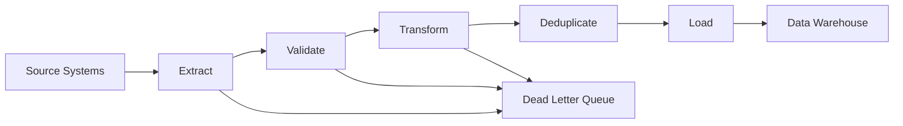

# How to Monitor Data Pipeline ETL Jobs with OpenTelemetry

Author: [nawazdhandala](https://www.github.com/nawazdhandala)

Tags: OpenTelemetry, ETL, Data Pipelines, Monitoring, Tracing, Data Engineering, Observability

Description: Learn how to monitor ETL data pipelines with OpenTelemetry for tracking extraction, transformation, and loading stages with full observability.

---

ETL jobs are the backbone of data-driven organizations. They extract data from source systems, transform it into a usable format, and load it into destination databases or warehouses. When an ETL job fails or runs slow, the downstream impact can be severe: stale dashboards, incorrect reports, and broken machine learning models that depend on fresh data.

The challenge with monitoring ETL pipelines is that they are often batch-oriented, long-running, and composed of multiple stages that each have different failure modes. OpenTelemetry is well suited for this because it lets you trace the entire pipeline as a single unit of work while capturing detailed metrics at each stage.

## ETL Pipeline Architecture

A typical ETL pipeline has three main stages, but real-world implementations often have many substeps within each stage. Data validation, schema mapping, deduplication, and error handling all add complexity.



## Initializing OpenTelemetry for ETL Jobs

ETL jobs are different from web services in that they have a defined start and end rather than running continuously. This means you need to make sure the tracer provider flushes all spans before the process exits.

```python
# etl_tracing.py - OpenTelemetry setup for batch ETL jobs
from opentelemetry import trace, metrics
from opentelemetry.sdk.trace import TracerProvider
from opentelemetry.sdk.trace.export import BatchSpanProcessor
from opentelemetry.exporter.otlp.proto.grpc.trace_exporter import OTLPSpanExporter
from opentelemetry.sdk.metrics import MeterProvider
from opentelemetry.sdk.metrics.export import PeriodicExportingMetricReader
from opentelemetry.exporter.otlp.proto.grpc.metric_exporter import OTLPMetricExporter
from opentelemetry.sdk.resources import Resource
import atexit

# Resource attributes identify this specific ETL pipeline
resource = Resource.create({
    "service.name": "etl-pipeline",
    "service.version": "2.0.0",
    "etl.pipeline_name": "user-events-to-warehouse",
    "deployment.environment": "production",
})

# Set up tracing with a batch processor
trace_provider = TracerProvider(resource=resource)
span_processor = BatchSpanProcessor(OTLPSpanExporter())
trace_provider.add_span_processor(span_processor)
trace.set_tracer_provider(trace_provider)

# Set up metrics
metric_reader = PeriodicExportingMetricReader(
    OTLPMetricExporter(),
    export_interval_millis=15000,  # Export every 15 seconds
)
meter_provider = MeterProvider(resource=resource, metric_readers=[metric_reader])
metrics.set_meter_provider(meter_provider)

# Ensure all telemetry is flushed before the process exits
def shutdown_telemetry():
    trace_provider.shutdown()
    meter_provider.shutdown()

atexit.register(shutdown_telemetry)

tracer = trace.get_tracer("etl-pipeline", "2.0.0")
meter = metrics.get_meter("etl-pipeline", "2.0.0")

# ETL-specific metrics
records_processed = meter.create_counter(
    "etl.records_processed",
    description="Total records processed by stage",
)

records_failed = meter.create_counter(
    "etl.records_failed",
    description="Total records that failed processing",
)

stage_duration = meter.create_histogram(
    "etl.stage_duration_seconds",
    description="Duration of each ETL stage",
    unit="s",
)

batch_size_histogram = meter.create_histogram(
    "etl.batch_size",
    description="Number of records in each processing batch",
)
```

The `atexit` handler is critical for batch jobs. Without it, your last batch of spans and metrics might never get exported because the process exits before the batch processor has a chance to flush.

## Tracing the Extract Stage

The extract stage pulls data from source systems. These sources might be databases, APIs, message queues, or flat files. Each source type has its own set of things that can go wrong.

```python
import time

async def extract_from_source(source_config, job_context):
    """Extract data from a source system with full tracing."""
    with tracer.start_as_current_span("etl.extract") as span:
        span.set_attribute("etl.source.type", source_config.source_type)
        span.set_attribute("etl.source.name", source_config.name)
        span.set_attribute("etl.job_id", job_context.job_id)
        span.set_attribute("etl.run_id", job_context.run_id)

        start_time = time.monotonic()
        total_records = 0
        batches = 0

        try:
            # Extract data in batches to avoid memory issues
            async for batch in source_config.reader.read_batches(
                batch_size=source_config.batch_size,
                since=job_context.last_checkpoint,
            ):
                batches += 1
                batch_record_count = len(batch)
                total_records += batch_record_count

                # Record batch-level metrics
                batch_size_histogram.record(batch_record_count, {
                    "etl.stage": "extract",
                    "etl.source.name": source_config.name,
                })

                # Log progress as span events for long-running extractions
                if batches % 100 == 0:
                    span.add_event("extract_progress", {
                        "etl.batches_read": batches,
                        "etl.records_read": total_records,
                    })

                yield batch

            duration = time.monotonic() - start_time
            span.set_attribute("etl.extract.total_records", total_records)
            span.set_attribute("etl.extract.total_batches", batches)
            span.set_attribute("etl.extract.duration_seconds", duration)
            span.set_attribute("etl.extract.records_per_second",
                             total_records / duration if duration > 0 else 0)

            records_processed.add(total_records, {
                "etl.stage": "extract",
                "etl.source.name": source_config.name,
            })

            stage_duration.record(duration, {"etl.stage": "extract"})

        except Exception as e:
            span.record_exception(e)
            span.set_attribute("etl.extract.failed_at_batch", batches)
            span.set_attribute("etl.extract.records_before_failure", total_records)
            raise
```

Recording progress events every 100 batches is important for long-running extractions. If an extract takes 30 minutes and fails at the end, the span events help you understand how far it got and how fast it was progressing. This information is invaluable for estimating recovery time.

## Tracing the Transform Stage

The transform stage is where business logic lives. Data gets cleaned, enriched, mapped to target schemas, and validated against business rules. Failures here are often subtle, producing incorrect data rather than outright errors.

```python
async def transform_batch(batch, transform_config, job_context):
    """Transform a batch of records with validation and error tracking."""
    with tracer.start_as_current_span("etl.transform") as span:
        span.set_attribute("etl.job_id", job_context.job_id)
        span.set_attribute("etl.transform.input_count", len(batch))
        span.set_attribute("etl.transform.pipeline", transform_config.name)

        transformed = []
        failed = []
        validation_errors = {}

        for record in batch:
            try:
                # Step 1: Validate the raw record against the source schema
                validation_result = schema_validator.validate(
                    record, transform_config.source_schema
                )

                if not validation_result.valid:
                    for error in validation_result.errors:
                        # Track which validation rules fail most often
                        error_key = error.rule_name
                        validation_errors[error_key] = validation_errors.get(error_key, 0) + 1
                    failed.append({
                        "record": record,
                        "errors": validation_result.errors,
                        "stage": "validation",
                    })
                    continue

                # Step 2: Apply transformations
                result = record
                for transform in transform_config.transforms:
                    result = transform.apply(result)

                # Step 3: Validate against target schema
                target_validation = schema_validator.validate(
                    result, transform_config.target_schema
                )

                if target_validation.valid:
                    transformed.append(result)
                else:
                    failed.append({
                        "record": record,
                        "errors": target_validation.errors,
                        "stage": "target_validation",
                    })

            except Exception as e:
                failed.append({
                    "record": record,
                    "error": str(e),
                    "stage": "transform",
                })

        # Record transformation outcomes
        span.set_attribute("etl.transform.output_count", len(transformed))
        span.set_attribute("etl.transform.failed_count", len(failed))
        span.set_attribute("etl.transform.success_rate",
                         len(transformed) / len(batch) if batch else 0)

        # Record validation error breakdown
        for error_type, count in validation_errors.items():
            span.add_event("validation_errors", {
                "etl.validation.rule": error_type,
                "etl.validation.count": count,
            })

        records_processed.add(len(transformed), {
            "etl.stage": "transform",
            "etl.status": "success",
        })

        records_failed.add(len(failed), {
            "etl.stage": "transform",
        })

        # Send failed records to dead letter queue for investigation
        if failed:
            await dead_letter_queue.send(failed, job_context)

        return transformed
```

Tracking validation error types as span events is particularly useful. Over time, you can identify patterns like "10% of records fail the email format check" or "records from source X always have missing timestamps." This drives data quality improvements at the source rather than just patching things in the transform stage.

## Tracing the Load Stage

The load stage writes transformed data to the destination. This is where you encounter issues like constraint violations, write timeouts, and throughput bottlenecks.

```python
async def load_to_warehouse(batches, load_config, job_context):
    """Load transformed data into the warehouse with progress tracking."""
    with tracer.start_as_current_span("etl.load") as span:
        span.set_attribute("etl.job_id", job_context.job_id)
        span.set_attribute("etl.destination.type", load_config.destination_type)
        span.set_attribute("etl.destination.table", load_config.target_table)
        span.set_attribute("etl.load.strategy", load_config.strategy)  # upsert, append, replace

        start_time = time.monotonic()
        total_loaded = 0
        total_errors = 0
        retry_count = 0

        for batch in batches:
            with tracer.start_as_current_span("etl.load_batch") as batch_span:
                batch_span.set_attribute("etl.batch.size", len(batch))

                for attempt in range(load_config.max_retries + 1):
                    try:
                        # Write the batch to the destination
                        result = await warehouse_client.write(
                            table=load_config.target_table,
                            records=batch,
                            strategy=load_config.strategy,
                        )

                        batch_span.set_attribute("etl.batch.loaded", result.rows_affected)
                        batch_span.set_attribute("etl.batch.attempt", attempt + 1)
                        total_loaded += result.rows_affected
                        break

                    except RetryableError as e:
                        retry_count += 1
                        batch_span.add_event("load_retry", {
                            "etl.retry.attempt": attempt + 1,
                            "etl.retry.reason": str(e),
                        })

                        if attempt == load_config.max_retries:
                            batch_span.record_exception(e)
                            total_errors += len(batch)
                            records_failed.add(len(batch), {
                                "etl.stage": "load",
                                "etl.failure_reason": "max_retries_exceeded",
                            })

                        # Exponential backoff between retries
                        await asyncio.sleep(2 ** attempt)

                    except NonRetryableError as e:
                        batch_span.record_exception(e)
                        total_errors += len(batch)
                        records_failed.add(len(batch), {
                            "etl.stage": "load",
                            "etl.failure_reason": type(e).__name__,
                        })
                        break

        duration = time.monotonic() - start_time
        span.set_attribute("etl.load.total_loaded", total_loaded)
        span.set_attribute("etl.load.total_errors", total_errors)
        span.set_attribute("etl.load.total_retries", retry_count)
        span.set_attribute("etl.load.duration_seconds", duration)
        span.set_attribute("etl.load.records_per_second",
                         total_loaded / duration if duration > 0 else 0)

        records_processed.add(total_loaded, {
            "etl.stage": "load",
            "etl.status": "success",
        })

        stage_duration.record(duration, {"etl.stage": "load"})

        return {"loaded": total_loaded, "errors": total_errors, "retries": retry_count}
```

Distinguishing between retryable and non-retryable errors in the load stage is important for understanding pipeline reliability. A high retry count with eventual success means you have a flaky connection but the data gets through. Non-retryable errors indicate structural problems like schema mismatches that need human attention.

## Orchestrating the Full Pipeline

The pipeline orchestrator ties all stages together and provides the top-level span that represents the complete ETL job.

```python
async def run_etl_pipeline(pipeline_config):
    """Execute the full ETL pipeline with end-to-end tracing."""
    with tracer.start_as_current_span("etl.pipeline_run") as span:
        job_id = generate_job_id()
        run_id = generate_run_id()

        span.set_attribute("etl.job_id", job_id)
        span.set_attribute("etl.run_id", run_id)
        span.set_attribute("etl.pipeline_name", pipeline_config.name)
        span.set_attribute("etl.scheduled_time", pipeline_config.scheduled_time)

        job_context = JobContext(job_id=job_id, run_id=run_id)
        pipeline_start = time.monotonic()

        try:
            # Extract
            raw_batches = extract_from_source(pipeline_config.source, job_context)

            # Transform each batch
            transformed_batches = []
            async for batch in raw_batches:
                transformed = await transform_batch(batch, pipeline_config.transform, job_context)
                if transformed:
                    transformed_batches.append(transformed)

            # Load
            load_result = await load_to_warehouse(
                transformed_batches, pipeline_config.load, job_context
            )

            total_duration = time.monotonic() - pipeline_start
            span.set_attribute("etl.pipeline.status", "success")
            span.set_attribute("etl.pipeline.total_duration_seconds", total_duration)
            span.set_attribute("etl.pipeline.records_loaded", load_result["loaded"])

            # Record pipeline-level metrics
            stage_duration.record(total_duration, {"etl.stage": "pipeline_total"})

            return {"status": "success", "job_id": job_id, "result": load_result}

        except Exception as e:
            total_duration = time.monotonic() - pipeline_start
            span.record_exception(e)
            span.set_attribute("etl.pipeline.status", "failed")
            span.set_attribute("etl.pipeline.total_duration_seconds", total_duration)
            span.set_attribute("etl.pipeline.failure_stage",
                             getattr(e, "stage", "unknown"))

            records_failed.add(1, {
                "etl.stage": "pipeline",
                "etl.failure_reason": type(e).__name__,
            })

            raise
```

## Checkpointing for Resumable Pipelines

Long-running ETL jobs should support checkpointing so they can resume from where they left off after a failure. Tracing checkpoints helps you understand recovery patterns.

```python
async def save_checkpoint(job_context, checkpoint_data):
    """Save a pipeline checkpoint with tracing."""
    with tracer.start_as_current_span("etl.save_checkpoint") as span:
        span.set_attribute("etl.job_id", job_context.job_id)
        span.set_attribute("etl.checkpoint.records_processed",
                         checkpoint_data.records_processed)
        span.set_attribute("etl.checkpoint.last_offset",
                         checkpoint_data.last_offset)

        await checkpoint_store.save(
            job_id=job_context.job_id,
            data=checkpoint_data,
        )

        span.add_event("checkpoint_saved", {
            "etl.checkpoint.offset": checkpoint_data.last_offset,
        })
```

## Wrapping Up

ETL pipelines benefit from the same observability practices as online services, but with some adjustments for their batch-oriented nature. The key differences are making sure telemetry gets flushed before the process exits, tracking progress through span events for long-running stages, and recording record-level metrics that help you spot data quality trends. With OpenTelemetry instrumented across your extract, transform, and load stages, you can quickly identify whether a pipeline failure is caused by a source system outage, a data quality issue, or a destination bottleneck. That visibility turns ETL debugging from a multi-hour investigation into a quick trace lookup.
