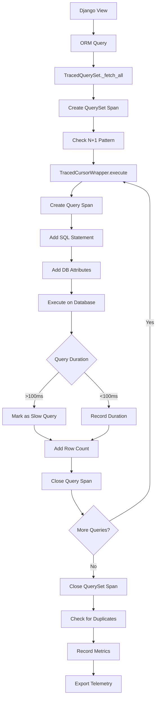

# How to Monitor Django Database Queries with OpenTelemetry

Author: [nawazdhandala](https://www.github.com/nawazdhandala)

Tags: OpenTelemetry, Django, Database, SQL, Python, Query Tracing

Description: Learn how to instrument Django database queries with OpenTelemetry to track query performance, detect N+1 problems, monitor connection pools, and optimize database operations.

Database queries are often the primary performance bottleneck in Django applications. OpenTelemetry provides powerful instrumentation for tracking every database interaction, from simple selects to complex joins and transactions. This visibility helps you identify slow queries, detect N+1 query problems, and optimize your database access patterns.

## Why Database Query Monitoring Matters

Django's ORM makes database operations convenient but can hide performance issues. Without proper monitoring, you might not notice:

- N+1 query problems where related objects trigger dozens of additional queries
- Unindexed queries that perform full table scans
- Queries that transfer large amounts of data unnecessarily
- Connection pool exhaustion during traffic spikes
- Transaction deadlocks and lock contention
- Inefficient query patterns from prefetch or select_related misuse

OpenTelemetry captures detailed information about each query: SQL text, execution time, rows returned, database connection details, and transaction context.

## Automatic Database Instrumentation

The easiest way to start monitoring database queries is with auto-instrumentation. Install the database-specific instrumentation library:

```bash
# For PostgreSQL (psycopg2)
pip install opentelemetry-instrumentation-psycopg2

# For MySQL (mysqlclient)
pip install opentelemetry-instrumentation-mysql

# For SQLite
pip install opentelemetry-instrumentation-sqlite3

# Install Django instrumentation
pip install opentelemetry-instrumentation-django
```

Bootstrap auto-instrumentation to enable database tracing:

```bash
opentelemetry-bootstrap -a install
```

Run your Django application with instrumentation:

```bash
export OTEL_SERVICE_NAME="django-app"
export OTEL_EXPORTER_OTLP_ENDPOINT="https://oneuptime.com/otlp"
export OTEL_EXPORTER_OTLP_HEADERS="x-oneuptime-service-token=your-token"

opentelemetry-instrument python manage.py runserver
```

With auto-instrumentation enabled, every database query automatically generates a span with:

- SQL statement text
- Query execution time
- Database name and connection details
- Number of rows affected
- Query parameters (optional, for security reasons often disabled)

## Manual Database Query Instrumentation

For more control over what gets instrumented, manually instrument your database layer:

```python
# myproject/database/tracer.py

from opentelemetry import trace
from opentelemetry.trace import SpanKind, Status, StatusCode
from django.db import connection
from django.db.backends.utils import CursorWrapper
import time
import functools

class TracedCursorWrapper(CursorWrapper):
    """Cursor wrapper that traces all database queries."""

    tracer = trace.get_tracer(__name__)

    def execute(self, sql, params=None):
        """Trace single query execution."""
        with self.tracer.start_as_current_span(
            "db.query",
            kind=SpanKind.CLIENT
        ) as span:
            # Add database attributes
            span.set_attribute("db.system", connection.vendor)
            span.set_attribute("db.name", connection.settings_dict['NAME'])
            span.set_attribute("db.operation", self._get_operation_type(sql))

            # Add SQL statement (sanitize sensitive data)
            span.set_attribute("db.statement", sql)

            # Add connection pool info
            if hasattr(connection, 'queries_log'):
                span.set_attribute("db.connection.id", id(self.cursor))

            start_time = time.time()

            try:
                result = super().execute(sql, params)

                # Add timing
                duration = (time.time() - start_time) * 1000
                span.set_attribute("db.duration_ms", duration)

                # Add row count if available
                if self.cursor.rowcount >= 0:
                    span.set_attribute("db.rows_affected", self.cursor.rowcount)

                # Mark slow queries
                if duration > 100:  # 100ms threshold
                    span.set_attribute("db.slow_query", True)

                span.set_status(Status(StatusCode.OK))
                return result

            except Exception as exc:
                span.record_exception(exc)
                span.set_status(Status(StatusCode.ERROR, str(exc)))
                raise

    def executemany(self, sql, param_list):
        """Trace batch query execution."""
        with self.tracer.start_as_current_span(
            "db.query.batch",
            kind=SpanKind.CLIENT
        ) as span:
            span.set_attribute("db.system", connection.vendor)
            span.set_attribute("db.name", connection.settings_dict['NAME'])
            span.set_attribute("db.operation", self._get_operation_type(sql))
            span.set_attribute("db.statement", sql)
            span.set_attribute("db.batch_size", len(param_list))

            start_time = time.time()

            try:
                result = super().executemany(sql, param_list)

                duration = (time.time() - start_time) * 1000
                span.set_attribute("db.duration_ms", duration)
                span.set_attribute("db.rows_affected", self.cursor.rowcount)

                span.set_status(Status(StatusCode.OK))
                return result

            except Exception as exc:
                span.record_exception(exc)
                span.set_status(Status(StatusCode.ERROR, str(exc)))
                raise

    def _get_operation_type(self, sql):
        """Extract operation type from SQL statement."""
        sql_upper = sql.strip().upper()
        if sql_upper.startswith('SELECT'):
            return 'SELECT'
        elif sql_upper.startswith('INSERT'):
            return 'INSERT'
        elif sql_upper.startswith('UPDATE'):
            return 'UPDATE'
        elif sql_upper.startswith('DELETE'):
            return 'DELETE'
        else:
            return 'OTHER'
```

## Detecting N+1 Query Problems

N+1 queries are a common Django ORM pitfall. Here's how to detect them:

```python
# myapp/querysets/traced.py

from django.db.models import QuerySet
from opentelemetry import trace
import time

class TracedQuerySet(QuerySet):
    """QuerySet that tracks query patterns to detect N+1 problems."""

    tracer = trace.get_tracer(__name__)

    def __init__(self, *args, **kwargs):
        super().__init__(*args, **kwargs)
        self._query_count_start = None
        self._parent_span = None

    def _fetch_all(self):
        """Override to track query execution."""
        if self._result_cache is None:
            span = trace.get_current_span()

            with self.tracer.start_as_current_span("queryset.fetch") as qs_span:
                qs_span.set_attribute("db.model", self.model.__name__)
                qs_span.set_attribute("db.query_type", "fetch_all")

                # Count queries before
                from django.db import connection
                query_count_before = len(connection.queries)

                start = time.time()
                super()._fetch_all()
                duration = (time.time() - start) * 1000

                # Count queries after
                query_count_after = len(connection.queries)
                queries_executed = query_count_after - query_count_before

                qs_span.set_attribute("db.queries_executed", queries_executed)
                qs_span.set_attribute("db.duration_ms", duration)
                qs_span.set_attribute("db.result_count", len(self._result_cache))

                # Check for potential N+1
                if queries_executed > 1 and len(self._result_cache) > 0:
                    qs_span.set_attribute("db.potential_n_plus_1", True)
                    qs_span.set_attribute("db.n_plus_1.query_count", queries_executed)

                    # Add warning to parent span
                    span.add_event(
                        "Potential N+1 query detected",
                        attributes={
                            "model": self.model.__name__,
                            "queries": queries_executed,
                            "results": len(self._result_cache)
                        }
                    )

    def iterator(self, chunk_size=2000):
        """Trace queryset iteration."""
        with self.tracer.start_as_current_span("queryset.iterate") as span:
            span.set_attribute("db.model", self.model.__name__)
            span.set_attribute("db.chunk_size", chunk_size)

            count = 0
            for obj in super().iterator(chunk_size=chunk_size):
                count += 1
                yield obj

            span.set_attribute("db.iterated_count", count)


# Custom manager that uses TracedQuerySet
class TracedManager(models.Manager):
    def get_queryset(self):
        return TracedQuerySet(self.model, using=self._db)
```

Use the traced manager in your models:

```python
# myapp/models.py

from django.db import models
from myapp.querysets.traced import TracedManager

class Article(models.Model):
    title = models.CharField(max_length=200)
    author = models.ForeignKey('Author', on_delete=models.CASCADE)

    objects = TracedManager()  # Use traced manager


class Author(models.Model):
    name = models.CharField(max_length=100)

    objects = TracedManager()


# This will trigger N+1 detection
def list_articles_bad():
    """Bad: N+1 queries."""
    articles = Article.objects.all()
    for article in articles:
        print(article.author.name)  # Each access queries the database


# This won't trigger N+1 detection
def list_articles_good():
    """Good: Uses select_related."""
    articles = Article.objects.select_related('author').all()
    for article in articles:
        print(article.author.name)  # Author is already loaded
```

## Monitoring Query Performance Patterns

Create a middleware to analyze query patterns across requests:

```python
# myapp/middleware/query_analysis.py

from django.db import connection, reset_queries
from django.conf import settings
from opentelemetry import trace, metrics
import time

class QueryAnalysisMiddleware:
    """Middleware that analyzes database query patterns."""

    def __init__(self, get_response):
        self.get_response = get_response

        # Set up metrics
        meter = metrics.get_meter(__name__)

        self.query_counter = meter.create_counter(
            name="db.queries.count",
            description="Number of database queries per request",
            unit="1"
        )

        self.query_duration = meter.create_histogram(
            name="db.queries.duration",
            description="Database query duration",
            unit="ms"
        )

        self.duplicate_queries = meter.create_counter(
            name="db.queries.duplicate",
            description="Number of duplicate queries",
            unit="1"
        )

    def __call__(self, request):
        # Enable query logging for this request
        settings.DEBUG = True  # Required for query logging
        reset_queries()

        span = trace.get_current_span()
        start_time = time.time()

        response = self.get_response(request)

        # Analyze queries
        queries = connection.queries
        total_queries = len(queries)

        if total_queries > 0:
            # Calculate total query time
            total_duration = sum(float(q['time']) * 1000 for q in queries)

            # Detect duplicate queries
            query_hashes = {}
            duplicate_count = 0

            for query in queries:
                sql = query['sql']
                if sql in query_hashes:
                    duplicate_count += 1
                    query_hashes[sql] += 1
                else:
                    query_hashes[sql] = 1

            # Add to span
            span.set_attribute("db.query.count", total_queries)
            span.set_attribute("db.query.duration_ms", total_duration)
            span.set_attribute("db.query.duplicate_count", duplicate_count)

            # Find slowest query
            slowest = max(queries, key=lambda q: float(q['time']))
            span.set_attribute("db.query.slowest_ms", float(slowest['time']) * 1000)
            span.set_attribute("db.query.slowest_sql", slowest['sql'][:200])

            # Record metrics
            attributes = {
                "http.method": request.method,
                "http.route": request.path,
            }

            self.query_counter.add(total_queries, attributes)
            self.query_duration.record(total_duration, attributes)

            if duplicate_count > 0:
                self.duplicate_queries.add(duplicate_count, attributes)
                span.set_attribute("db.query.has_duplicates", True)

                # Add event for duplicates
                span.add_event(
                    "Duplicate queries detected",
                    attributes={
                        "duplicate_count": duplicate_count,
                        "total_queries": total_queries
                    }
                )

            # Warn if too many queries
            if total_queries > 50:
                span.add_event(
                    "High query count detected",
                    attributes={"query_count": total_queries}
                )

        return response
```

## Transaction Monitoring

Monitor database transactions for deadlocks and long-running transactions:

```python
# myapp/database/transactions.py

from django.db import transaction
from opentelemetry import trace
from opentelemetry.trace import Status, StatusCode
import time
import functools

def traced_atomic(using=None, savepoint=True, durable=False):
    """Decorator that traces database transactions."""

    tracer = trace.get_tracer(__name__)

    def decorator(func):
        @functools.wraps(func)
        def wrapper(*args, **kwargs):
            with tracer.start_as_current_span(
                f"db.transaction.{func.__name__}",
                kind=trace.SpanKind.CLIENT
            ) as span:
                span.set_attribute("db.transaction.function", func.__name__)
                span.set_attribute("db.transaction.savepoint", savepoint)

                # Count queries in transaction
                from django.db import connection
                query_count_before = len(connection.queries)

                start_time = time.time()

                try:
                    # Use Django's atomic context manager
                    with transaction.atomic(using=using, savepoint=savepoint, durable=durable):
                        result = func(*args, **kwargs)

                    duration = (time.time() - start_time) * 1000
                    query_count_after = len(connection.queries)
                    queries_in_transaction = query_count_after - query_count_before

                    span.set_attribute("db.transaction.duration_ms", duration)
                    span.set_attribute("db.transaction.query_count", queries_in_transaction)
                    span.set_attribute("db.transaction.committed", True)

                    # Warn on long transactions
                    if duration > 1000:  # 1 second
                        span.set_attribute("db.transaction.slow", True)
                        span.add_event(
                            "Long transaction detected",
                            attributes={"duration_ms": duration}
                        )

                    span.set_status(Status(StatusCode.OK))
                    return result

                except Exception as exc:
                    duration = (time.time() - start_time) * 1000

                    span.set_attribute("db.transaction.duration_ms", duration)
                    span.set_attribute("db.transaction.committed", False)
                    span.set_attribute("db.transaction.rolled_back", True)

                    # Check for deadlock
                    if "deadlock" in str(exc).lower():
                        span.set_attribute("db.transaction.deadlock", True)

                    span.record_exception(exc)
                    span.set_status(Status(StatusCode.ERROR, str(exc)))
                    raise

        return wrapper

    return decorator


# Usage example
@traced_atomic()
def create_order_with_items(customer, items):
    """Create order and items in a transaction."""
    order = Order.objects.create(
        customer=customer,
        total=sum(item['price'] * item['quantity'] for item in items)
    )

    for item_data in items:
        OrderItem.objects.create(
            order=order,
            product_id=item_data['product_id'],
            quantity=item_data['quantity'],
            price=item_data['price']
        )

    return order
```

## Connection Pool Monitoring

Track database connection pool health:

```python
# myapp/database/pool_monitor.py

from django.db import connections
from opentelemetry import metrics
import threading
import time

class ConnectionPoolMonitor:
    """Monitor database connection pool metrics."""

    def __init__(self, interval=60):
        self.interval = interval
        self.running = False
        self.thread = None

        # Set up metrics
        meter = metrics.get_meter(__name__)

        self.pool_size = meter.create_up_down_counter(
            name="db.pool.size",
            description="Current database connection pool size",
            unit="1"
        )

        self.pool_active = meter.create_up_down_counter(
            name="db.pool.active",
            description="Active database connections",
            unit="1"
        )

        self.pool_idle = meter.create_up_down_counter(
            name="db.pool.idle",
            description="Idle database connections",
            unit="1"
        )

    def start(self):
        """Start monitoring in background thread."""
        if not self.running:
            self.running = True
            self.thread = threading.Thread(target=self._monitor_loop, daemon=True)
            self.thread.start()

    def stop(self):
        """Stop monitoring."""
        self.running = False
        if self.thread:
            self.thread.join()

    def _monitor_loop(self):
        """Main monitoring loop."""
        while self.running:
            self._collect_metrics()
            time.sleep(self.interval)

    def _collect_metrics(self):
        """Collect connection pool metrics."""
        for alias in connections:
            connection = connections[alias]

            attributes = {
                "db.alias": alias,
                "db.vendor": connection.vendor,
            }

            # Try to get pool stats (varies by backend)
            try:
                if hasattr(connection, 'pool'):
                    pool = connection.pool

                    if hasattr(pool, 'size'):
                        self.pool_size.add(pool.size(), attributes)

                    if hasattr(pool, 'checkedout'):
                        self.pool_active.add(pool.checkedout(), attributes)

                    if hasattr(pool, 'idle'):
                        self.pool_idle.add(pool.idle(), attributes)
            except Exception:
                pass  # Pool stats not available for this backend


# Initialize in Django settings or apps.py
pool_monitor = ConnectionPoolMonitor()
pool_monitor.start()
```

## Query Execution Flow Visualization

Here's how database queries flow through instrumented Django:



## Optimizing Based on Query Traces

Use trace data to identify optimization opportunities:

```python
# myapp/views/optimized.py

from django.views.generic import ListView
from myapp.models import Article
from opentelemetry import trace

class ArticleListView(ListView):
    """Optimized article list with tracing."""

    model = Article
    tracer = trace.get_tracer(__name__)

    def get_queryset(self):
        """Get articles with optimized query."""
        with self.tracer.start_as_current_span("get_article_queryset") as span:
            # Use select_related for foreign keys
            # Use prefetch_related for many-to-many and reverse foreign keys
            queryset = Article.objects.select_related(
                'author',
                'category'
            ).prefetch_related(
                'tags',
                'comments__user'
            ).only(
                # Only load needed fields
                'id', 'title', 'slug', 'published_at',
                'author__name', 'category__name'
            )

            span.set_attribute("queryset.optimized", True)
            span.set_attribute("queryset.select_related", "author,category")
            span.set_attribute("queryset.prefetch_related", "tags,comments")

            return queryset


# Compare with unoptimized version
class ArticleListViewUnoptimized(ListView):
    """Unoptimized version for comparison."""

    model = Article

    def get_queryset(self):
        # This will cause N+1 queries when accessing author, category, tags
        return Article.objects.all()
```

## Database Query Analysis Dashboard

Create a view to analyze query patterns:

```python
# myapp/management/commands/analyze_queries.py

from django.core.management.base import BaseCommand
from django.db import connection
from collections import Counter
import re

class Command(BaseCommand):
    help = 'Analyze database query patterns'

    def handle(self, *args, **options):
        """Analyze queries from Django query log."""
        queries = connection.queries

        # Analyze query types
        query_types = Counter()
        table_access = Counter()
        slow_queries = []

        for query in queries:
            sql = query['sql']
            duration = float(query['time']) * 1000

            # Extract query type
            query_type = sql.split()[0].upper()
            query_types[query_type] += 1

            # Extract table names
            tables = re.findall(r'FROM\s+["`]?(\w+)["`]?', sql, re.IGNORECASE)
            tables += re.findall(r'JOIN\s+["`]?(\w+)["`]?', sql, re.IGNORECASE)

            for table in tables:
                table_access[table] += 1

            # Track slow queries
            if duration > 100:
                slow_queries.append({
                    'sql': sql[:200],
                    'duration': duration
                })

        # Output analysis
        self.stdout.write(f"\n=== Query Analysis ===")
        self.stdout.write(f"Total queries: {len(queries)}")

        self.stdout.write(f"\nQuery types:")
        for qtype, count in query_types.most_common():
            self.stdout.write(f"  {qtype}: {count}")

        self.stdout.write(f"\nMost accessed tables:")
        for table, count in table_access.most_common(10):
            self.stdout.write(f"  {table}: {count}")

        if slow_queries:
            self.stdout.write(f"\nSlow queries (>100ms):")
            for query in sorted(slow_queries, key=lambda q: q['duration'], reverse=True)[:5]:
                self.stdout.write(f"  {query['duration']:.2f}ms: {query['sql']}")
```

## Next Steps

With comprehensive database monitoring in place:

- Set up alerts for slow queries and high query counts
- Create dashboards to visualize query patterns over time
- Implement query result caching based on trace data
- Optimize high-frequency queries identified in traces

For WebSocket applications, check out our guide on [OpenTelemetry context propagation in Django Channels](https://oneuptime.com/blog/post/2026-02-06-opentelemetry-context-propagation-django-channels-websockets/view).

Database query monitoring with OpenTelemetry transforms how you understand and optimize your Django application's data access layer. The detailed traces help you identify bottlenecks, fix N+1 problems, and make data-driven decisions about query optimization.
