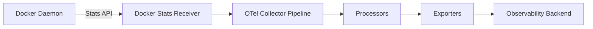

# How to Monitor Docker Container Metrics with the OpenTelemetry Docker Stats Receiver

Author: [nawazdhandala](https://www.github.com/nawazdhandala)

Tags: OpenTelemetry, Docker, Monitoring, Metrics, Containers, Observability

Description: A practical guide to collecting Docker container metrics like CPU, memory, network, and disk I/O using the OpenTelemetry Collector's Docker Stats Receiver.

---

If you're running Docker containers in production, you need visibility into how they're performing. How much CPU is each container using? Is any container hitting its memory limit? What does the network traffic look like? These are questions you need answers to before your users start complaining.

The OpenTelemetry Collector has a built-in receiver called the Docker Stats Receiver that pulls metrics directly from the Docker daemon's stats API. It gives you per-container metrics for CPU, memory, network I/O, and block I/O - essentially the same data you'd see from `docker stats`, but structured as proper OpenTelemetry metrics that you can export to any backend.

Let's set it up from scratch.

## How the Docker Stats Receiver Works

The Docker Stats Receiver communicates with the Docker Engine API (the same Unix socket or TCP endpoint that the Docker CLI uses). It periodically queries the `/containers/{id}/stats` endpoint for each running container and converts the response into OpenTelemetry metrics.



The receiver runs inside the OpenTelemetry Collector, so you need the collector deployed on each Docker host where you want to collect metrics. If you're running Docker Compose or standalone Docker, this typically means running the collector as another container on the same host.

## Prerequisites

You'll need:

- Docker Engine 19.03 or later
- Docker Compose (optional, but makes things easier)
- The OpenTelemetry Collector Contrib distribution (the core distribution doesn't include this receiver)

## Basic Collector Configuration

Here's a minimal collector configuration that uses the Docker Stats Receiver to collect container metrics and log them to the console for testing.

```yaml
# otel-collector-config.yaml
# Collector config that scrapes Docker container stats every 10 seconds
receivers:
  docker_stats:
    # The Docker API endpoint - this is the default Unix socket path
    endpoint: unix:///var/run/docker.sock
    # How often to collect stats from each container
    collection_interval: 10s
    # Timeout for each stats API call
    timeout: 5s
    # Which Docker API version to use
    api_version: 1.24

processors:
  batch:
    # Batch metrics before exporting for efficiency
    send_batch_size: 512
    timeout: 5s

exporters:
  debug:
    # Log metrics to stdout so we can verify everything works
    verbosity: detailed

service:
  pipelines:
    metrics:
      receivers: [docker_stats]
      processors: [batch]
      exporters: [debug]
```

## Running the Collector with Docker

The collector needs access to the Docker socket to query container stats. Here's how to run it as a Docker container itself.

```yaml
# docker-compose.yaml
# Runs the OTel Collector with access to Docker socket for stats collection
version: "3.8"
services:
  otel-collector:
    image: otel/opentelemetry-collector-contrib:latest
    container_name: otel-collector
    command: ["--config=/etc/otelcol-contrib/config.yaml"]
    volumes:
      # Mount the collector config
      - ./otel-collector-config.yaml:/etc/otelcol-contrib/config.yaml:ro
      # Mount the Docker socket so the receiver can access the Docker API
      - /var/run/docker.sock:/var/run/docker.sock:ro
    ports:
      - "4317:4317"   # OTLP gRPC
      - "4318:4318"   # OTLP HTTP
    # The collector needs to read the Docker socket
    user: "0:0"

  # Example workload containers for testing
  nginx:
    image: nginx:latest
    container_name: test-nginx
    ports:
      - "8080:80"

  redis:
    image: redis:latest
    container_name: test-redis
```

Start everything up:

```bash
# Launch the collector and test containers
docker compose up -d

# Verify the collector is running and check for errors
docker logs otel-collector --tail=30
```

You should see metric data points in the collector logs showing stats for the nginx and redis containers.

## Available Metrics

The Docker Stats Receiver collects a comprehensive set of metrics. Here are the key ones:

| Metric | Description | Unit |
|--------|-------------|------|
| `container.cpu.usage.total` | Total CPU time consumed | nanoseconds |
| `container.cpu.percent` | Percentage of CPU used | percent |
| `container.cpu.usage.kernelmode` | CPU time in kernel mode | nanoseconds |
| `container.cpu.usage.usermode` | CPU time in user mode | nanoseconds |
| `container.memory.usage.total` | Current memory usage including cache | bytes |
| `container.memory.usage.limit` | Memory limit for the container | bytes |
| `container.memory.percent` | Percentage of memory limit used | percent |
| `container.network.io.usage.rx_bytes` | Bytes received on network | bytes |
| `container.network.io.usage.tx_bytes` | Bytes transmitted on network | bytes |
| `container.blockio.io_service_bytes_recursive.read` | Bytes read from disk | bytes |
| `container.blockio.io_service_bytes_recursive.write` | Bytes written to disk | bytes |

Each metric gets tagged with resource attributes like `container.name`, `container.id`, `container.image.name`, and `container.runtime`, which let you filter and group by container in your backend.

## Filtering Containers

You probably don't want to monitor every container on the host. The collector itself, sidecar containers, and short-lived utility containers can add noise. You can filter containers by name, image, or label.

```yaml
# Collector config with container filtering
receivers:
  docker_stats:
    endpoint: unix:///var/run/docker.sock
    collection_interval: 10s
    # Only monitor containers with specific labels
    container_labels_to_metric_labels:
      # Map Docker labels to metric attributes
      com.docker.compose.service: "compose_service"
      environment: "env"
    # Exclude containers you don't want to monitor
    excluded_images:
      - "otel/opentelemetry-collector-contrib"
      - "gcr.io/k8s-minikube/*"
    # Set environment type as a resource attribute
    env_vars_to_metric_labels:
      ENV: "deployment_environment"

processors:
  batch:
    send_batch_size: 512
    timeout: 5s
  # Add resource attributes to help identify the host
  resourcedetection:
    detectors: [env, system, docker]
    timeout: 5s

exporters:
  otlp:
    endpoint: "your-backend.example.com:4317"
    tls:
      insecure: false

service:
  pipelines:
    metrics:
      receivers: [docker_stats]
      processors: [resourcedetection, batch]
      exporters: [otlp]
```

The `excluded_images` field supports glob patterns, so you can use wildcards to exclude whole families of images. The `container_labels_to_metric_labels` field is particularly useful because it lets you carry Docker labels (like the ones Docker Compose sets) through to your metrics as attributes.

## Enabling Optional Metrics

Some metrics are disabled by default because they can be verbose. You can opt into them individually.

```yaml
# Enable additional optional metrics
receivers:
  docker_stats:
    endpoint: unix:///var/run/docker.sock
    collection_interval: 10s
    metrics:
      # Enable per-CPU usage tracking
      container.cpu.usage.percpu:
        enabled: true
      # Enable detailed memory breakdown
      container.memory.active_anon:
        enabled: true
      container.memory.inactive_anon:
        enabled: true
      container.memory.active_file:
        enabled: true
      container.memory.inactive_file:
        enabled: true
      # Enable network error tracking
      container.network.io.usage.rx_errors:
        enabled: true
      container.network.io.usage.tx_errors:
        enabled: true
      container.network.io.usage.rx_dropped:
        enabled: true
      container.network.io.usage.tx_dropped:
        enabled: true
```

The detailed memory metrics help you understand whether memory usage is from your application's heap allocations (anonymous pages) or from filesystem cache (file-backed pages). This distinction matters when you're troubleshooting OOM kills.

## Adding Alerts with a Metrics Pipeline

A common pattern is to use the collector to derive alerting signals from raw container metrics. You can do this with the `transform` processor to compute useful ratios.

```yaml
# Configuration with metric transforms for alerting
receivers:
  docker_stats:
    endpoint: unix:///var/run/docker.sock
    collection_interval: 10s

processors:
  batch:
    send_batch_size: 512
    timeout: 5s
  # Use memory_limiter to protect the collector from runaway memory usage
  memory_limiter:
    check_interval: 5s
    limit_mib: 256
    spike_limit_mib: 64
  # Filter to only keep the most important metrics
  filter/important:
    metrics:
      include:
        match_type: regexp
        metric_names:
          - "container\\.cpu\\.percent"
          - "container\\.memory\\.percent"
          - "container\\.memory\\.usage\\.total"
          - "container\\.network\\.io\\.usage\\.*"

exporters:
  otlp:
    endpoint: "your-backend.example.com:4317"
    tls:
      insecure: false

service:
  pipelines:
    metrics:
      receivers: [docker_stats]
      processors: [memory_limiter, filter/important, batch]
      exporters: [otlp]
```

By filtering down to the most important metrics, you reduce the volume of data sent to your backend and keep your metrics costs under control.

## Monitoring the Monitoring: Collector Health

It's worth keeping an eye on the collector itself. The collector exposes internal metrics on a Prometheus endpoint that you can scrape or check manually.

```yaml
# Enable the collector's internal metrics and health endpoints
service:
  telemetry:
    metrics:
      # Expose collector internal metrics on port 8888
      address: 0.0.0.0:8888
      level: detailed
  extensions: [health_check]
  pipelines:
    metrics:
      receivers: [docker_stats]
      processors: [batch]
      exporters: [otlp]

extensions:
  health_check:
    # Health check endpoint for container orchestration
    endpoint: 0.0.0.0:13133
```

You can then curl `http://localhost:13133` to check the collector's health status, or scrape `http://localhost:8888/metrics` for Prometheus-format internal metrics.

## Security Considerations

Mounting the Docker socket into a container gives it significant power. The Docker socket effectively provides root-level access to the host. In production, consider these mitigations:

- Run the collector container as read-only (`read_only: true` in Docker Compose)
- Use a Docker socket proxy like Tecnativa's docker-socket-proxy that restricts which API endpoints are accessible
- Drop all capabilities and only add back what's needed
- Use a dedicated service account if your Docker daemon supports authorization plugins

## Wrapping Up

The Docker Stats Receiver is a straightforward way to get container-level metrics into your observability pipeline. You get CPU, memory, network, and disk I/O metrics per container with minimal configuration. Combined with the collector's processing capabilities, you can filter, transform, and route those metrics to whatever backend you prefer.

For Docker Compose environments and standalone Docker hosts, this receiver fills the gap that Kubernetes-native tools don't cover. If you're running containers outside of Kubernetes, this is one of the best ways to get visibility into what your containers are doing.
