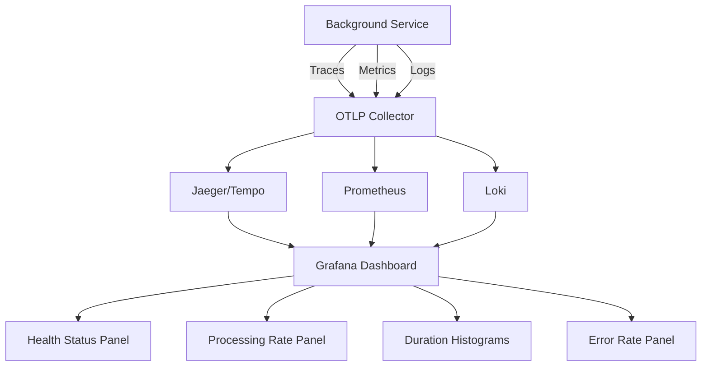

# How to Monitor .NET Background Services with OpenTelemetry

Author: [nawazdhandala](https://www.github.com/nawazdhandala)

Tags: OpenTelemetry, .NET, Background Services, IHostedService, Monitoring, C#

Description: Learn how to instrument and monitor .NET background services using OpenTelemetry to track execution, performance, and health of long-running tasks.

Background services are critical components in modern .NET applications, handling scheduled tasks, message processing, and continuous operations. Without proper instrumentation, these services run blind, making it difficult to diagnose issues, track performance, or understand execution patterns. OpenTelemetry provides the observability framework needed to monitor these services effectively.

## Understanding .NET Background Services

.NET provides the `IHostedService` interface and the `BackgroundService` base class for implementing long-running operations. These services execute outside the typical request-response cycle, making traditional request-based monitoring insufficient.

Background services typically:
- Run continuously throughout the application lifetime
- Execute scheduled or periodic tasks
- Process queued work items
- Handle batch operations
- Maintain connections to external systems

The challenge with monitoring these services is capturing activity that happens asynchronously and potentially at irregular intervals.

## Setting Up OpenTelemetry for Background Services

First, install the necessary OpenTelemetry packages for your .NET application:

```bash
dotnet add package OpenTelemetry.Extensions.Hosting
dotnet add package OpenTelemetry.Instrumentation.Runtime
dotnet add package OpenTelemetry.Exporter.Console
dotnet add package OpenTelemetry.Exporter.OpenTelemetryProtocol
```

Configure OpenTelemetry in your Program.cs or Startup.cs to capture traces and metrics from background services:

```csharp
using OpenTelemetry.Resources;
using OpenTelemetry.Trace;
using OpenTelemetry.Metrics;

var builder = WebApplication.CreateBuilder(args);

// Configure OpenTelemetry with tracing and metrics
builder.Services.AddOpenTelemetry()
    .ConfigureResource(resource => resource
        .AddService("BackgroundServiceApp", serviceVersion: "1.0.0")
        .AddAttributes(new Dictionary<string, object>
        {
            ["environment"] = builder.Environment.EnvironmentName,
            ["host.name"] = Environment.MachineName
        }))
    .WithTracing(tracing => tracing
        .AddSource("BackgroundService.*")
        .AddAspNetCoreInstrumentation()
        .AddHttpClientInstrumentation()
        .AddOtlpExporter(options =>
        {
            options.Endpoint = new Uri("http://localhost:4317");
        }))
    .WithMetrics(metrics => metrics
        .AddMeter("BackgroundService.*")
        .AddRuntimeInstrumentation()
        .AddOtlpExporter(options =>
        {
            options.Endpoint = new Uri("http://localhost:4317");
        }));

// Register your background service
builder.Services.AddHostedService<DataProcessingService>();

var app = builder.Build();
app.Run();
```

## Creating an Instrumented Background Service

Here's a comprehensive example of a background service with full OpenTelemetry instrumentation:

```csharp
using System.Diagnostics;
using System.Diagnostics.Metrics;
using Microsoft.Extensions.Hosting;
using Microsoft.Extensions.Logging;

public class DataProcessingService : BackgroundService
{
    private readonly ILogger<DataProcessingService> _logger;
    private readonly ActivitySource _activitySource;
    private readonly Meter _meter;
    private readonly Counter<long> _itemsProcessedCounter;
    private readonly Histogram<double> _processingDurationHistogram;
    private readonly ObservableGauge<int> _queueSizeGauge;
    private int _currentQueueSize = 0;

    public DataProcessingService(ILogger<DataProcessingService> logger)
    {
        _logger = logger;

        // Create ActivitySource for distributed tracing
        _activitySource = new ActivitySource("BackgroundService.DataProcessing");

        // Create Meter for metrics
        _meter = new Meter("BackgroundService.DataProcessing", "1.0.0");

        // Define metrics
        _itemsProcessedCounter = _meter.CreateCounter<long>(
            "data_processing.items.processed",
            unit: "items",
            description: "Total number of items processed");

        _processingDurationHistogram = _meter.CreateHistogram<double>(
            "data_processing.duration",
            unit: "ms",
            description: "Duration of processing operations");

        _queueSizeGauge = _meter.CreateObservableGauge(
            "data_processing.queue.size",
            () => _currentQueueSize,
            unit: "items",
            description: "Current size of the processing queue");
    }

    protected override async Task ExecuteAsync(CancellationToken stoppingToken)
    {
        _logger.LogInformation("Data Processing Service started");

        while (!stoppingToken.IsCancellationRequested)
        {
            // Create a span for each processing cycle
            using var activity = _activitySource.StartActivity(
                "ProcessingCycle",
                ActivityKind.Internal);

            try
            {
                activity?.SetTag("cycle.timestamp", DateTime.UtcNow);

                await ProcessBatchAsync(stoppingToken);

                activity?.SetStatus(ActivityStatusCode.Ok);
            }
            catch (Exception ex)
            {
                _logger.LogError(ex, "Error during processing cycle");

                activity?.SetStatus(ActivityStatusCode.Error, ex.Message);
                activity?.RecordException(ex);
            }

            // Wait before next cycle
            await Task.Delay(TimeSpan.FromSeconds(30), stoppingToken);
        }

        _logger.LogInformation("Data Processing Service stopped");
    }

    private async Task ProcessBatchAsync(CancellationToken cancellationToken)
    {
        using var activity = _activitySource.StartActivity(
            "ProcessBatch",
            ActivityKind.Internal);

        var stopwatch = Stopwatch.StartNew();

        try
        {
            // Simulate fetching items from a queue
            var items = await FetchItemsFromQueueAsync(cancellationToken);
            _currentQueueSize = items.Count;

            activity?.SetTag("batch.size", items.Count);
            activity?.AddEvent(new ActivityEvent("BatchFetched"));

            foreach (var item in items)
            {
                await ProcessItemAsync(item, cancellationToken);
                _itemsProcessedCounter.Add(1,
                    new KeyValuePair<string, object?>("item.type", item.Type));
            }

            stopwatch.Stop();
            _processingDurationHistogram.Record(stopwatch.ElapsedMilliseconds);

            activity?.SetTag("processing.duration_ms", stopwatch.ElapsedMilliseconds);
            activity?.SetStatus(ActivityStatusCode.Ok);
        }
        catch (Exception ex)
        {
            stopwatch.Stop();
            activity?.SetStatus(ActivityStatusCode.Error, ex.Message);
            activity?.RecordException(ex);
            throw;
        }
    }

    private async Task ProcessItemAsync(WorkItem item, CancellationToken cancellationToken)
    {
        using var activity = _activitySource.StartActivity(
            "ProcessItem",
            ActivityKind.Internal);

        activity?.SetTag("item.id", item.Id);
        activity?.SetTag("item.type", item.Type);
        activity?.SetTag("item.priority", item.Priority);

        try
        {
            // Add baggage for correlation across service boundaries
            activity?.SetBaggage("item.id", item.Id);

            // Simulate processing work
            await Task.Delay(Random.Shared.Next(100, 500), cancellationToken);

            // Add processing details as events
            activity?.AddEvent(new ActivityEvent("ProcessingStarted"));

            // Simulate external API call
            await CallExternalServiceAsync(item, cancellationToken);

            activity?.AddEvent(new ActivityEvent("ProcessingCompleted"));
            activity?.SetStatus(ActivityStatusCode.Ok);

            _logger.LogInformation("Successfully processed item {ItemId}", item.Id);
        }
        catch (Exception ex)
        {
            activity?.SetStatus(ActivityStatusCode.Error, ex.Message);
            activity?.RecordException(ex);
            _logger.LogError(ex, "Failed to process item {ItemId}", item.Id);
            throw;
        }
    }

    private async Task<List<WorkItem>> FetchItemsFromQueueAsync(CancellationToken cancellationToken)
    {
        using var activity = _activitySource.StartActivity(
            "FetchItemsFromQueue",
            ActivityKind.Internal);

        // Simulate fetching from a queue or database
        await Task.Delay(50, cancellationToken);

        var items = new List<WorkItem>
        {
            new WorkItem { Id = Guid.NewGuid().ToString(), Type = "TypeA", Priority = 1 },
            new WorkItem { Id = Guid.NewGuid().ToString(), Type = "TypeB", Priority = 2 }
        };

        activity?.SetTag("items.fetched", items.Count);
        return items;
    }

    private async Task CallExternalServiceAsync(WorkItem item, CancellationToken cancellationToken)
    {
        using var activity = _activitySource.StartActivity(
            "CallExternalService",
            ActivityKind.Client);

        activity?.SetTag("external.service", "DataValidationAPI");
        activity?.SetTag("item.id", item.Id);

        // Simulate HTTP call (if using HttpClient, it would be auto-instrumented)
        await Task.Delay(200, cancellationToken);
    }

    public override void Dispose()
    {
        _activitySource?.Dispose();
        _meter?.Dispose();
        base.Dispose();
    }
}

public class WorkItem
{
    public string Id { get; set; } = string.Empty;
    public string Type { get; set; } = string.Empty;
    public int Priority { get; set; }
}
```

## Monitoring Health and Lifecycle Events

Add health checks to monitor the status of your background services:

```csharp
using Microsoft.Extensions.Diagnostics.HealthChecks;

public class BackgroundServiceHealthCheck : IHealthCheck
{
    private readonly ActivitySource _activitySource;
    private DateTime _lastSuccessfulRun = DateTime.UtcNow;
    private bool _isHealthy = true;

    public BackgroundServiceHealthCheck()
    {
        _activitySource = new ActivitySource("BackgroundService.HealthCheck");
    }

    public void RecordSuccessfulRun()
    {
        _lastSuccessfulRun = DateTime.UtcNow;
        _isHealthy = true;
    }

    public void RecordFailure()
    {
        _isHealthy = false;
    }

    public Task<HealthCheckResult> CheckHealthAsync(
        HealthCheckContext context,
        CancellationToken cancellationToken = default)
    {
        using var activity = _activitySource.StartActivity("HealthCheck");

        var timeSinceLastRun = DateTime.UtcNow - _lastSuccessfulRun;

        activity?.SetTag("health.last_run_minutes_ago", timeSinceLastRun.TotalMinutes);
        activity?.SetTag("health.is_healthy", _isHealthy);

        if (!_isHealthy)
        {
            return Task.FromResult(
                HealthCheckResult.Unhealthy("Background service reported failure"));
        }

        if (timeSinceLastRun.TotalMinutes > 5)
        {
            return Task.FromResult(
                HealthCheckResult.Degraded(
                    $"No successful run in {timeSinceLastRun.TotalMinutes:F1} minutes"));
        }

        return Task.FromResult(HealthCheckResult.Healthy());
    }
}

// Register in Program.cs
builder.Services.AddSingleton<BackgroundServiceHealthCheck>();
builder.Services.AddHealthChecks()
    .AddCheck<BackgroundServiceHealthCheck>("background_service");
```

## Tracking Long-Running Operations

For background services that perform long-running operations, implement progress tracking:

```csharp
public class LongRunningService : BackgroundService
{
    private readonly ActivitySource _activitySource;
    private readonly Counter<long> _progressCounter;

    public LongRunningService()
    {
        _activitySource = new ActivitySource("BackgroundService.LongRunning");
        var meter = new Meter("BackgroundService.LongRunning");
        _progressCounter = meter.CreateCounter<long>("operation.progress");
    }

    protected override async Task ExecuteAsync(CancellationToken stoppingToken)
    {
        while (!stoppingToken.IsCancellationRequested)
        {
            using var activity = _activitySource.StartActivity(
                "LongRunningOperation",
                ActivityKind.Internal);

            var totalItems = 1000;
            activity?.SetTag("operation.total_items", totalItems);

            for (int i = 0; i < totalItems && !stoppingToken.IsCancellationRequested; i++)
            {
                await ProcessItemAsync(i, stoppingToken);

                // Record progress
                _progressCounter.Add(1);

                // Add progress events at milestones
                if ((i + 1) % 100 == 0)
                {
                    var progressPercent = ((i + 1) * 100.0) / totalItems;
                    activity?.AddEvent(new ActivityEvent($"Progress: {progressPercent:F0}%"));
                }
            }

            activity?.SetStatus(ActivityStatusCode.Ok);
            await Task.Delay(TimeSpan.FromHours(1), stoppingToken);
        }
    }

    private async Task ProcessItemAsync(int index, CancellationToken cancellationToken)
    {
        // Processing logic with automatic parent activity correlation
        await Task.Delay(100, cancellationToken);
    }
}
```

## Visualizing Background Service Telemetry

The telemetry data from your background services can be visualized in various ways:



## Best Practices for Background Service Observability

**Use Semantic Conventions**: Follow OpenTelemetry semantic conventions for attributes. For background services, include operation type, duration, and result status.

**Implement Structured Logging**: Combine OpenTelemetry traces with structured logging to correlate logs with specific operations.

**Set Appropriate Span Kinds**: Use `ActivityKind.Internal` for background processing operations and `ActivityKind.Client` when making outbound calls.

**Monitor Resource Usage**: Include runtime instrumentation to track memory, CPU, and thread pool usage alongside your business metrics.

**Create Meaningful Metrics**: Track not just counts but also rates, distributions, and gauges that indicate service health.

**Handle Cancellation Gracefully**: Ensure your instrumentation properly captures when operations are cancelled versus when they fail.

**Use Activity Events**: Mark important milestones in long-running operations with events rather than creating new spans for every small step.

## Troubleshooting Common Issues

When background services don't appear in your telemetry backend, verify that your ActivitySource name matches what you configured in the OpenTelemetry setup. The wildcard pattern "BackgroundService.*" will match any source starting with that prefix.

If metrics aren't being collected, ensure that your Meter is created before the OpenTelemetry SDK initializes, typically by registering it as a singleton service.

For missing correlation between background service operations and incoming requests, use baggage propagation to carry context across async boundaries and service calls.

Background services are the workhorses of modern applications, and OpenTelemetry gives you the visibility needed to keep them running smoothly. With proper instrumentation, you can track execution patterns, identify bottlenecks, and diagnose issues before they impact your users.
