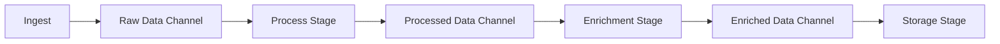

# How to Monitor .NET Channels and Pipelines with OpenTelemetry

Author: [nawazdhandala](https://www.github.com/nawazdhandala)

Tags: OpenTelemetry, .NET, Channels, Pipelines, System.IO.Pipelines, C#

Description: Learn to instrument System.Threading.Channels and System.IO.Pipelines with OpenTelemetry for visibility into high-performance async data flows.

System.Threading.Channels and System.IO.Pipelines are foundational building blocks for high-performance .NET applications. Channels provide producer-consumer patterns without locks, while Pipelines optimize I/O operations by minimizing allocations. When you build data processing systems with these primitives, observability becomes critical for understanding throughput, latency, and backpressure.

## Why Monitor Channels and Pipelines

These low-level abstractions don't come with built-in telemetry. When data flows through channels between producers and consumers, or when pipelines process network streams, you need to know:

- How fast data moves through the system
- Where bottlenecks occur
- When backpressure happens
- How long items wait in channels
- Pipeline buffer utilization
- Error rates in processing stages

OpenTelemetry provides the instrumentation to answer these questions.

## Setting Up the Project

Create a new project and add OpenTelemetry packages:

```bash
dotnet new web -n ChannelPipelineMonitoring
cd ChannelPipelineMonitoring
dotnet add package OpenTelemetry.Extensions.Hosting
dotnet add package OpenTelemetry.Instrumentation.AspNetCore
dotnet add package OpenTelemetry.Exporter.OpenTelemetryProtocol
dotnet add package System.Threading.Channels
dotnet add package System.IO.Pipelines
```

Configure OpenTelemetry in your application:

```csharp
using OpenTelemetry.Resources;
using OpenTelemetry.Trace;
using OpenTelemetry.Metrics;

var builder = WebApplication.CreateBuilder(args);

builder.Services.AddOpenTelemetry()
    .ConfigureResource(resource => resource
        .AddService("channel-pipeline-service", serviceVersion: "1.0.0"))
    .WithTracing(tracing => tracing
        .AddAspNetCoreInstrumentation()
        .AddSource("ChannelPipeline.Processing")
        .AddOtlpExporter(options =>
        {
            options.Endpoint = new Uri("http://localhost:4317");
        }))
    .WithMetrics(metrics => metrics
        .AddAspNetCoreInstrumentation()
        .AddMeter("ChannelPipeline.Metrics")
        .AddOtlpExporter(options =>
        {
            options.Endpoint = new Uri("http://localhost:4317");
        }));

var app = builder.Build();
app.Run();
```

## Instrumenting Channels

Channels facilitate async producer-consumer patterns. Create an instrumented channel wrapper to track operations:

```csharp
using System.Diagnostics;
using System.Diagnostics.Metrics;
using System.Threading.Channels;

public class InstrumentedChannel<T>
{
    private static readonly ActivitySource ActivitySource =
        new ActivitySource("ChannelPipeline.Processing");

    private static readonly Meter Meter =
        new Meter("ChannelPipeline.Metrics");

    private readonly Channel<T> _channel;
    private readonly string _channelName;

    private readonly Counter<long> _itemsWritten;
    private readonly Counter<long> _itemsRead;
    private readonly Counter<long> _writeFailures;
    private readonly Histogram<double> _writeLatency;
    private readonly Histogram<double> _readLatency;
    private readonly ObservableGauge<int> _queueDepth;

    private long _currentDepth;

    public InstrumentedChannel(
        string channelName,
        int capacity = -1)
    {
        _channelName = channelName;

        // Create bounded or unbounded channel
        _channel = capacity > 0
            ? Channel.CreateBounded<T>(new BoundedChannelOptions(capacity)
            {
                FullMode = BoundedChannelFullMode.Wait
            })
            : Channel.CreateUnbounded<T>();

        // Initialize metrics
        _itemsWritten = Meter.CreateCounter<long>(
            "channel.items.written",
            description: "Number of items written to channel");

        _itemsRead = Meter.CreateCounter<long>(
            "channel.items.read",
            description: "Number of items read from channel");

        _writeFailures = Meter.CreateCounter<long>(
            "channel.write.failures",
            description: "Number of failed write attempts");

        _writeLatency = Meter.CreateHistogram<double>(
            "channel.write.latency",
            unit: "ms",
            description: "Time taken to write item to channel");

        _readLatency = Meter.CreateHistogram<double>(
            "channel.read.latency",
            unit: "ms",
            description: "Time taken to read item from channel");

        _queueDepth = Meter.CreateObservableGauge<int>(
            "channel.queue.depth",
            () => (int)Interlocked.Read(ref _currentDepth),
            description: "Current number of items in channel");
    }

    public ChannelReader<T> Reader => _channel.Reader;
    public ChannelWriter<T> Writer => _channel.Writer;

    public async Task<bool> WriteAsync(
        T item,
        CancellationToken cancellationToken = default)
    {
        using var activity = ActivitySource.StartActivity(
            "Channel.Write",
            ActivityKind.Producer);

        activity?.SetTag("channel.name", _channelName);
        activity?.SetTag("item.type", typeof(T).Name);

        var startTime = DateTime.UtcNow;

        try
        {
            var written = await _channel.Writer.WaitToWriteAsync(cancellationToken);

            if (!written)
            {
                activity?.SetTag("write.success", false);
                activity?.SetTag("write.reason", "channel_closed");
                return false;
            }

            _channel.Writer.TryWrite(item);

            Interlocked.Increment(ref _currentDepth);

            var duration = (DateTime.UtcNow - startTime).TotalMilliseconds;

            _itemsWritten.Add(1, new KeyValuePair<string, object?>("channel", _channelName));
            _writeLatency.Record(duration, new KeyValuePair<string, object?>("channel", _channelName));

            activity?.SetTag("write.success", true);
            activity?.SetTag("write.latency_ms", duration);
            activity?.SetTag("queue.depth", _currentDepth);

            return true;
        }
        catch (Exception ex)
        {
            _writeFailures.Add(1, new KeyValuePair<string, object?>("channel", _channelName));

            activity?.SetStatus(ActivityStatusCode.Error, ex.Message);
            activity?.RecordException(ex);
            activity?.SetTag("write.success", false);

            throw;
        }
    }

    public async Task<(bool Success, T? Item)> ReadAsync(
        CancellationToken cancellationToken = default)
    {
        using var activity = ActivitySource.StartActivity(
            "Channel.Read",
            ActivityKind.Consumer);

        activity?.SetTag("channel.name", _channelName);
        activity?.SetTag("item.type", typeof(T).Name);

        var startTime = DateTime.UtcNow;

        try
        {
            var available = await _channel.Reader.WaitToReadAsync(cancellationToken);

            if (!available)
            {
                activity?.SetTag("read.success", false);
                activity?.SetTag("read.reason", "channel_empty_and_closed");
                return (false, default);
            }

            if (_channel.Reader.TryRead(out var item))
            {
                Interlocked.Decrement(ref _currentDepth);

                var duration = (DateTime.UtcNow - startTime).TotalMilliseconds;

                _itemsRead.Add(1, new KeyValuePair<string, object?>("channel", _channelName));
                _readLatency.Record(duration, new KeyValuePair<string, object?>("channel", _channelName));

                activity?.SetTag("read.success", true);
                activity?.SetTag("read.latency_ms", duration);
                activity?.SetTag("queue.depth", _currentDepth);

                return (true, item);
            }

            return (false, default);
        }
        catch (Exception ex)
        {
            activity?.SetStatus(ActivityStatusCode.Error, ex.Message);
            activity?.RecordException(ex);
            activity?.SetTag("read.success", false);

            throw;
        }
    }

    public void Complete() => _channel.Writer.Complete();
}
```

## Building a Data Processing Pipeline

Create a multi-stage processing pipeline using instrumented channels:

```csharp
using System.Diagnostics;

public class DataProcessingPipeline
{
    private static readonly ActivitySource ActivitySource =
        new ActivitySource("ChannelPipeline.Processing");

    private readonly InstrumentedChannel<RawData> _rawDataChannel;
    private readonly InstrumentedChannel<ProcessedData> _processedDataChannel;
    private readonly InstrumentedChannel<EnrichedData> _enrichedDataChannel;
    private readonly ILogger<DataProcessingPipeline> _logger;

    public DataProcessingPipeline(ILogger<DataProcessingPipeline> logger)
    {
        _rawDataChannel = new InstrumentedChannel<RawData>("raw-data", capacity: 100);
        _processedDataChannel = new InstrumentedChannel<ProcessedData>("processed-data", capacity: 100);
        _enrichedDataChannel = new InstrumentedChannel<EnrichedData>("enriched-data", capacity: 100);
        _logger = logger;
    }

    public async Task StartAsync(CancellationToken cancellationToken)
    {
        // Start processing stages in parallel
        var tasks = new[]
        {
            Task.Run(() => ProcessStageAsync(cancellationToken), cancellationToken),
            Task.Run(() => EnrichmentStageAsync(cancellationToken), cancellationToken),
            Task.Run(() => StorageStageAsync(cancellationToken), cancellationToken)
        };

        await Task.WhenAll(tasks);
    }

    public async Task IngestDataAsync(RawData data, CancellationToken cancellationToken)
    {
        using var activity = ActivitySource.StartActivity(
            "Pipeline.Ingest",
            ActivityKind.Producer);

        activity?.SetTag("data.id", data.Id);
        activity?.SetTag("data.source", data.Source);

        await _rawDataChannel.WriteAsync(data, cancellationToken);

        activity?.AddEvent(new ActivityEvent("DataIngested"));
    }

    private async Task ProcessStageAsync(CancellationToken cancellationToken)
    {
        while (!cancellationToken.IsCancellationRequested)
        {
            var (success, rawData) = await _rawDataChannel.ReadAsync(cancellationToken);

            if (!success)
                break;

            using var activity = ActivitySource.StartActivity(
                "Pipeline.Process",
                ActivityKind.Internal);

            activity?.SetTag("data.id", rawData.Id);
            activity?.SetTag("stage", "processing");

            try
            {
                // Simulate processing work
                await Task.Delay(Random.Shared.Next(10, 50), cancellationToken);

                var processedData = new ProcessedData
                {
                    Id = rawData.Id,
                    Source = rawData.Source,
                    ProcessedValue = rawData.RawValue.ToUpper(),
                    ProcessedAt = DateTime.UtcNow
                };

                await _processedDataChannel.WriteAsync(processedData, cancellationToken);

                activity?.SetTag("processing.success", true);
                activity?.AddEvent(new ActivityEvent("DataProcessed"));
            }
            catch (Exception ex)
            {
                activity?.SetStatus(ActivityStatusCode.Error, ex.Message);
                activity?.RecordException(ex);
                _logger.LogError(ex, "Failed to process data {DataId}", rawData.Id);
            }
        }
    }

    private async Task EnrichmentStageAsync(CancellationToken cancellationToken)
    {
        while (!cancellationToken.IsCancellationRequested)
        {
            var (success, processedData) = await _processedDataChannel.ReadAsync(cancellationToken);

            if (!success)
                break;

            using var activity = ActivitySource.StartActivity(
                "Pipeline.Enrich",
                ActivityKind.Internal);

            activity?.SetTag("data.id", processedData.Id);
            activity?.SetTag("stage", "enrichment");

            try
            {
                // Simulate enrichment work
                await Task.Delay(Random.Shared.Next(20, 100), cancellationToken);

                var enrichedData = new EnrichedData
                {
                    Id = processedData.Id,
                    Source = processedData.Source,
                    ProcessedValue = processedData.ProcessedValue,
                    EnrichedMetadata = $"Enriched-{processedData.Id}",
                    ProcessedAt = processedData.ProcessedAt,
                    EnrichedAt = DateTime.UtcNow
                };

                await _enrichedDataChannel.WriteAsync(enrichedData, cancellationToken);

                activity?.SetTag("enrichment.success", true);
                activity?.AddEvent(new ActivityEvent("DataEnriched"));
            }
            catch (Exception ex)
            {
                activity?.SetStatus(ActivityStatusCode.Error, ex.Message);
                activity?.RecordException(ex);
                _logger.LogError(ex, "Failed to enrich data {DataId}", processedData.Id);
            }
        }
    }

    private async Task StorageStageAsync(CancellationToken cancellationToken)
    {
        while (!cancellationToken.IsCancellationRequested)
        {
            var (success, enrichedData) = await _enrichedDataChannel.ReadAsync(cancellationToken);

            if (!success)
                break;

            using var activity = ActivitySource.StartActivity(
                "Pipeline.Store",
                ActivityKind.Internal);

            activity?.SetTag("data.id", enrichedData.Id);
            activity?.SetTag("stage", "storage");

            try
            {
                // Simulate storage work
                await Task.Delay(Random.Shared.Next(5, 30), cancellationToken);

                var totalLatency = (enrichedData.EnrichedAt - enrichedData.ProcessedAt).TotalMilliseconds;

                activity?.SetTag("storage.success", true);
                activity?.SetTag("pipeline.total_latency_ms", totalLatency);
                activity?.AddEvent(new ActivityEvent("DataStored"));

                _logger.LogInformation(
                    "Stored data {DataId} with total latency {Latency}ms",
                    enrichedData.Id,
                    totalLatency);
            }
            catch (Exception ex)
            {
                activity?.SetStatus(ActivityStatusCode.Error, ex.Message);
                activity?.RecordException(ex);
                _logger.LogError(ex, "Failed to store data {DataId}", enrichedData.Id);
            }
        }
    }
}

public record RawData(string Id, string Source, string RawValue);

public record ProcessedData
{
    public string Id { get; init; } = string.Empty;
    public string Source { get; init; } = string.Empty;
    public string ProcessedValue { get; init; } = string.Empty;
    public DateTime ProcessedAt { get; init; }
}

public record EnrichedData
{
    public string Id { get; init; } = string.Empty;
    public string Source { get; init; } = string.Empty;
    public string ProcessedValue { get; init; } = string.Empty;
    public string EnrichedMetadata { get; init; } = string.Empty;
    public DateTime ProcessedAt { get; init; }
    public DateTime EnrichedAt { get; init; }
}
```

## Instrumenting System.IO.Pipelines

Pipelines optimize I/O operations for network protocols and file processing. Create an instrumented pipeline wrapper:

```csharp
using System.Buffers;
using System.Diagnostics;
using System.Diagnostics.Metrics;
using System.IO.Pipelines;
using System.Text;

public class InstrumentedPipelineProcessor
{
    private static readonly ActivitySource ActivitySource =
        new ActivitySource("ChannelPipeline.Processing");

    private static readonly Meter Meter =
        new Meter("ChannelPipeline.Metrics");

    private readonly Pipe _pipe;
    private readonly string _pipelineName;

    private readonly Counter<long> _bytesWritten;
    private readonly Counter<long> _bytesRead;
    private readonly Counter<long> _messagesProcessed;
    private readonly Histogram<double> _messageSize;
    private readonly Histogram<double> _processingLatency;

    public InstrumentedPipelineProcessor(string pipelineName)
    {
        _pipelineName = pipelineName;
        _pipe = new Pipe();

        _bytesWritten = Meter.CreateCounter<long>(
            "pipeline.bytes.written",
            description: "Total bytes written to pipeline");

        _bytesRead = Meter.CreateCounter<long>(
            "pipeline.bytes.read",
            description: "Total bytes read from pipeline");

        _messagesProcessed = Meter.CreateCounter<long>(
            "pipeline.messages.processed",
            description: "Number of messages processed");

        _messageSize = Meter.CreateHistogram<double>(
            "pipeline.message.size",
            unit: "bytes",
            description: "Size of messages in pipeline");

        _processingLatency = Meter.CreateHistogram<double>(
            "pipeline.processing.latency",
            unit: "ms",
            description: "Time to process messages");
    }

    public PipeWriter Writer => _pipe.Writer;
    public PipeReader Reader => _pipe.Reader;

    public async Task WriteMessageAsync(
        string message,
        CancellationToken cancellationToken = default)
    {
        using var activity = ActivitySource.StartActivity(
            "Pipeline.WriteMessage",
            ActivityKind.Producer);

        activity?.SetTag("pipeline.name", _pipelineName);
        activity?.SetTag("message.length", message.Length);

        try
        {
            var bytes = Encoding.UTF8.GetBytes(message + "\n");
            var memory = _pipe.Writer.GetMemory(bytes.Length);
            bytes.CopyTo(memory);
            _pipe.Writer.Advance(bytes.Length);

            var result = await _pipe.Writer.FlushAsync(cancellationToken);

            _bytesWritten.Add(
                bytes.Length,
                new KeyValuePair<string, object?>("pipeline", _pipelineName));

            _messageSize.Record(
                bytes.Length,
                new KeyValuePair<string, object?>("pipeline", _pipelineName));

            activity?.SetTag("write.success", !result.IsCanceled && !result.IsCompleted);
            activity?.SetTag("bytes.written", bytes.Length);
        }
        catch (Exception ex)
        {
            activity?.SetStatus(ActivityStatusCode.Error, ex.Message);
            activity?.RecordException(ex);
            throw;
        }
    }

    public async Task<List<string>> ReadMessagesAsync(
        CancellationToken cancellationToken = default)
    {
        using var activity = ActivitySource.StartActivity(
            "Pipeline.ReadMessages",
            ActivityKind.Consumer);

        activity?.SetTag("pipeline.name", _pipelineName);

        var messages = new List<string>();
        var startTime = DateTime.UtcNow;

        try
        {
            var result = await _pipe.Reader.ReadAsync(cancellationToken);
            var buffer = result.Buffer;

            while (TryReadLine(ref buffer, out var line))
            {
                messages.Add(line);

                var messageBytes = Encoding.UTF8.GetByteCount(line);

                _messagesProcessed.Add(
                    1,
                    new KeyValuePair<string, object?>("pipeline", _pipelineName));

                _bytesRead.Add(
                    messageBytes,
                    new KeyValuePair<string, object?>("pipeline", _pipelineName));
            }

            _pipe.Reader.AdvanceTo(buffer.Start, buffer.End);

            var duration = (DateTime.UtcNow - startTime).TotalMilliseconds;

            _processingLatency.Record(
                duration,
                new KeyValuePair<string, object?>("pipeline", _pipelineName));

            activity?.SetTag("messages.read", messages.Count);
            activity?.SetTag("processing.latency_ms", duration);

            return messages;
        }
        catch (Exception ex)
        {
            activity?.SetStatus(ActivityStatusCode.Error, ex.Message);
            activity?.RecordException(ex);
            throw;
        }
    }

    private bool TryReadLine(ref ReadOnlySequence<byte> buffer, out string line)
    {
        var position = buffer.PositionOf((byte)'\n');

        if (position == null)
        {
            line = string.Empty;
            return false;
        }

        var lineBuffer = buffer.Slice(0, position.Value);
        line = Encoding.UTF8.GetString(lineBuffer);

        buffer = buffer.Slice(buffer.GetPosition(1, position.Value));

        return true;
    }

    public void Complete() => _pipe.Writer.Complete();
}
```

## Using Pipelines for Stream Processing

Create a high-performance stream processor using instrumented pipelines:

```csharp
using System.Diagnostics;
using System.IO.Pipelines;
using System.Net.Sockets;

public class NetworkStreamProcessor
{
    private static readonly ActivitySource ActivitySource =
        new ActivitySource("ChannelPipeline.Processing");

    private readonly ILogger<NetworkStreamProcessor> _logger;

    public NetworkStreamProcessor(ILogger<NetworkStreamProcessor> logger)
    {
        _logger = logger;
    }

    public async Task ProcessNetworkStreamAsync(
        NetworkStream stream,
        CancellationToken cancellationToken)
    {
        using var activity = ActivitySource.StartActivity(
            "ProcessNetworkStream",
            ActivityKind.Server);

        var pipe = new Pipe();

        var writingTask = FillPipeAsync(stream, pipe.Writer, cancellationToken);
        var readingTask = ProcessPipeAsync(pipe.Reader, cancellationToken);

        await Task.WhenAll(writingTask, readingTask);

        activity?.SetTag("stream.processing_complete", true);
    }

    private async Task FillPipeAsync(
        NetworkStream stream,
        PipeWriter writer,
        CancellationToken cancellationToken)
    {
        using var activity = ActivitySource.StartActivity(
            "Pipeline.Fill",
            ActivityKind.Internal);

        const int minimumBufferSize = 512;
        long totalBytesRead = 0;

        try
        {
            while (!cancellationToken.IsCancellationRequested)
            {
                var memory = writer.GetMemory(minimumBufferSize);
                var bytesRead = await stream.ReadAsync(memory, cancellationToken);

                if (bytesRead == 0)
                    break;

                totalBytesRead += bytesRead;
                writer.Advance(bytesRead);

                var result = await writer.FlushAsync(cancellationToken);

                if (result.IsCompleted)
                    break;
            }

            activity?.SetTag("bytes.read", totalBytesRead);
            activity?.SetTag("fill.complete", true);
        }
        catch (Exception ex)
        {
            activity?.SetStatus(ActivityStatusCode.Error, ex.Message);
            activity?.RecordException(ex);
            _logger.LogError(ex, "Error filling pipe");
        }
        finally
        {
            await writer.CompleteAsync();
        }
    }

    private async Task ProcessPipeAsync(
        PipeReader reader,
        CancellationToken cancellationToken)
    {
        using var activity = ActivitySource.StartActivity(
            "Pipeline.Process",
            ActivityKind.Internal);

        long totalBytesProcessed = 0;
        int messagesProcessed = 0;

        try
        {
            while (!cancellationToken.IsCancellationRequested)
            {
                var result = await reader.ReadAsync(cancellationToken);
                var buffer = result.Buffer;

                using (var messageActivity = ActivitySource.StartActivity(
                    "Pipeline.ProcessBatch",
                    ActivityKind.Internal))
                {
                    var (position, processed) = ProcessBuffer(buffer);

                    messagesProcessed += processed;
                    totalBytesProcessed += buffer.Slice(0, position).Length;

                    messageActivity?.SetTag("batch.messages", processed);
                    messageActivity?.SetTag("batch.bytes", buffer.Slice(0, position).Length);
                }

                reader.AdvanceTo(result.Buffer.Start, result.Buffer.End);

                if (result.IsCompleted)
                    break;
            }

            activity?.SetTag("bytes.processed", totalBytesProcessed);
            activity?.SetTag("messages.processed", messagesProcessed);
            activity?.SetTag("processing.complete", true);
        }
        catch (Exception ex)
        {
            activity?.SetStatus(ActivityStatusCode.Error, ex.Message);
            activity?.RecordException(ex);
            _logger.LogError(ex, "Error processing pipe");
        }
        finally
        {
            await reader.CompleteAsync();
        }
    }

    private (SequencePosition Position, int MessagesProcessed) ProcessBuffer(
        ReadOnlySequence<byte> buffer)
    {
        var reader = new SequenceReader<byte>(buffer);
        int count = 0;

        while (reader.TryReadTo(out ReadOnlySpan<byte> line, (byte)'\n'))
        {
            ProcessLine(line);
            count++;
        }

        return (reader.Position, count);
    }

    private void ProcessLine(ReadOnlySpan<byte> line)
    {
        // Process individual line
        // Add your business logic here
    }
}
```

## Visualizing Data Flow

OpenTelemetry traces show data moving through your pipeline stages:



Each stage creates spans showing timing, queue depths, and processing latency.

## Performance Monitoring Dashboard

Key metrics to track:

**Channel Metrics:**
- Items written/read per second
- Write and read latency percentiles
- Current queue depth
- Write failure rate

**Pipeline Metrics:**
- Bytes written/read per second
- Messages processed per second
- Message size distribution
- Processing latency percentiles

Configure alerts for:
- Queue depth exceeding threshold (backpressure)
- High latency percentiles (P95, P99)
- Increasing failure rates
- Low throughput

Your channel and pipeline implementations now have comprehensive instrumentation. You can see exactly how data flows through your system, identify bottlenecks, and optimize for throughput and latency. This visibility is essential for maintaining high-performance data processing pipelines in production.
