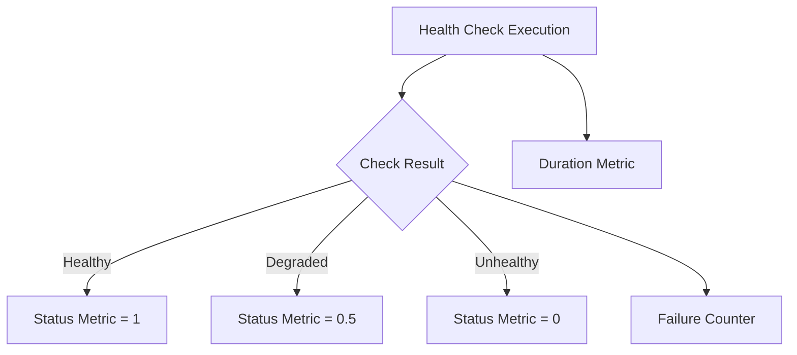

# How to Monitor .NET Health Checks with OpenTelemetry Metrics

Author: [nawazdhandala](https://www.github.com/nawazdhandala)

Tags: OpenTelemetry, .NET, Health Checks, Metrics, ASP.NET Core, Monitoring

Description: Complete guide to exposing .NET health check results as OpenTelemetry metrics for comprehensive application health monitoring and alerting.

Health checks in ASP.NET Core provide a standardized way to verify your application's dependencies and overall health. However, simply exposing a health endpoint isn't enough for production observability. You need metrics that track health check status over time, alert when checks start failing, and provide historical data for capacity planning.

OpenTelemetry metrics bridge this gap by converting health check results into time-series data that your observability platform can track, visualize, and alert on. This integration creates a complete picture of application health that goes beyond simple up/down status.

## Understanding Health Check Metrics Requirements

Health checks typically return one of three states: Healthy, Degraded, or Unhealthy. Converting these states into metrics requires careful consideration of the metric type. Gauges work well for representing current health status as a numeric value, while counters can track the number of times a check has failed.

Additionally, you want metrics that capture check duration, which helps identify performance degradation in dependencies before they become critical failures. A database health check that suddenly takes 5 seconds instead of 50ms indicates a problem even if the check technically passes.



## Setting Up Health Checks and OpenTelemetry

Start with a standard ASP.NET Core application configured with health checks and OpenTelemetry.

```csharp
using Microsoft.Extensions.Diagnostics.HealthChecks;
using OpenTelemetry.Metrics;
using OpenTelemetry.Resources;

var builder = WebApplication.CreateBuilder(args);

// Configure health checks
builder.Services.AddHealthChecks()
    .AddNpgSql(
        builder.Configuration.GetConnectionString("Database"),
        name: "database",
        failureStatus: HealthStatus.Unhealthy,
        tags: new[] { "db", "postgresql" })
    .AddRedis(
        builder.Configuration.GetConnectionString("Redis"),
        name: "redis-cache",
        failureStatus: HealthStatus.Degraded,
        tags: new[] { "cache", "redis" })
    .AddUrlGroup(
        new Uri(builder.Configuration["ExternalApi:BaseUrl"]),
        name: "external-api",
        failureStatus: HealthStatus.Degraded,
        tags: new[] { "external", "api" })
    .AddCheck<CustomBusinessHealthCheck>("business-logic", tags: new[] { "business" });

// Configure OpenTelemetry metrics
builder.Services.AddOpenTelemetry()
    .ConfigureResource(resource => resource
        .AddService("order-api", "1.0.0"))
    .WithMetrics(metrics => metrics
        .AddAspNetCoreInstrumentation()
        .AddHttpClientInstrumentation()
        .AddRuntimeInstrumentation()
        .AddMeter("HealthChecks")
        .AddOtlpExporter());

var app = builder.Build();

// Map health check endpoints
app.MapHealthChecks("/health");
app.MapHealthChecks("/health/ready", new HealthCheckOptions
{
    Predicate = check => check.Tags.Contains("ready")
});
app.MapHealthChecks("/health/live", new HealthCheckOptions
{
    Predicate = check => check.Tags.Contains("live")
});

app.Run();
```

## Creating a Health Check Metrics Publisher

ASP.NET Core provides IHealthCheckPublisher for reacting to health check results. Implement this interface to publish metrics.

```csharp
using System.Diagnostics.Metrics;
using Microsoft.Extensions.Diagnostics.HealthChecks;

namespace HealthMonitoring
{
    public class OpenTelemetryHealthCheckPublisher : IHealthCheckPublisher
    {
        private readonly Meter _meter;
        private readonly ObservableGauge<int> _healthStatusGauge;
        private readonly Histogram<double> _healthCheckDuration;
        private readonly Counter<long> _healthCheckFailures;

        private HealthReport _lastHealthReport;
        private readonly object _lock = new object();

        public OpenTelemetryHealthCheckPublisher()
        {
            _meter = new Meter("HealthChecks", "1.0.0");

            // Gauge for current health status (1 = healthy, 0.5 = degraded, 0 = unhealthy)
            _healthStatusGauge = _meter.CreateObservableGauge(
                "health_check_status",
                () => GetHealthStatusObservations(),
                description: "Current health check status (1=healthy, 0.5=degraded, 0=unhealthy)");

            // Histogram for health check duration
            _healthCheckDuration = _meter.CreateHistogram<double>(
                "health_check_duration_seconds",
                unit: "s",
                description: "Duration of health check execution");

            // Counter for failures
            _healthCheckFailures = _meter.CreateCounter<long>(
                "health_check_failures_total",
                description: "Total number of health check failures");
        }

        public Task PublishAsync(HealthReport report, CancellationToken cancellationToken)
        {
            lock (_lock)
            {
                _lastHealthReport = report;
            }

            // Record metrics for each individual check
            foreach (var entry in report.Entries)
            {
                var tags = new TagList
                {
                    { "check_name", entry.Key },
                    { "status", entry.Value.Status.ToString().ToLowerInvariant() }
                };

                // Add custom tags from health check
                if (entry.Value.Tags != null)
                {
                    foreach (var tag in entry.Value.Tags)
                    {
                        tags.Add($"tag_{tag}", "true");
                    }
                }

                // Record duration
                if (entry.Value.Duration > TimeSpan.Zero)
                {
                    _healthCheckDuration.Record(
                        entry.Value.Duration.TotalSeconds,
                        tags);
                }

                // Increment failure counter if unhealthy
                if (entry.Value.Status == HealthStatus.Unhealthy)
                {
                    _healthCheckFailures.Add(1, tags);
                }
            }

            return Task.CompletedTask;
        }

        private IEnumerable<Measurement<int>> GetHealthStatusObservations()
        {
            HealthReport report;
            lock (_lock)
            {
                report = _lastHealthReport;
            }

            if (report == null)
            {
                yield break;
            }

            foreach (var entry in report.Entries)
            {
                var statusValue = entry.Value.Status switch
                {
                    HealthStatus.Healthy => 1,
                    HealthStatus.Degraded => 0,
                    HealthStatus.Unhealthy => 0,
                    _ => 0
                };

                var tags = new TagList
                {
                    { "check_name", entry.Key },
                    { "status", entry.Value.Status.ToString().ToLowerInvariant() }
                };

                // Include tags from the health check
                if (entry.Value.Tags != null)
                {
                    foreach (var tag in entry.Value.Tags)
                    {
                        tags.Add($"tag_{tag}", "true");
                    }
                }

                yield return new Measurement<int>(statusValue, tags);
            }

            // Overall health status
            var overallStatus = report.Status switch
            {
                HealthStatus.Healthy => 1,
                HealthStatus.Degraded => 0,
                HealthStatus.Unhealthy => 0,
                _ => 0
            };

            yield return new Measurement<int>(
                overallStatus,
                new TagList { { "check_name", "overall" }, { "status", report.Status.ToString().ToLowerInvariant() } });
        }
    }
}
```

Register the health check publisher in your service configuration.

```csharp
builder.Services.AddSingleton<IHealthCheckPublisher, OpenTelemetryHealthCheckPublisher>();

// Configure health check publishing interval
builder.Services.Configure<HealthCheckPublisherOptions>(options =>
{
    options.Delay = TimeSpan.FromSeconds(5);
    options.Period = TimeSpan.FromSeconds(30);
});
```

## Creating Custom Health Checks with Rich Metrics

Custom health checks can provide additional context beyond simple status codes.

```csharp
using Microsoft.Extensions.Diagnostics.HealthChecks;
using System.Diagnostics.Metrics;

namespace HealthMonitoring
{
    public class CustomBusinessHealthCheck : IHealthCheck
    {
        private readonly IOrderRepository _orderRepository;
        private readonly Meter _meter;
        private readonly Histogram<long> _pendingOrdersHistogram;

        public CustomBusinessHealthCheck(IOrderRepository orderRepository)
        {
            _orderRepository = orderRepository;
            _meter = new Meter("HealthChecks.Business", "1.0.0");

            _pendingOrdersHistogram = _meter.CreateHistogram<long>(
                "business_pending_orders",
                description: "Number of pending orders during health check");
        }

        public async Task<HealthCheckResult> CheckHealthAsync(
            HealthCheckContext context,
            CancellationToken cancellationToken = default)
        {
            try
            {
                // Check if we can query the database
                var pendingOrders = await _orderRepository.GetPendingOrderCountAsync(cancellationToken);

                // Record metric
                _pendingOrdersHistogram.Record(pendingOrders);

                // Define thresholds for health status
                if (pendingOrders > 10000)
                {
                    return HealthCheckResult.Degraded(
                        $"High number of pending orders: {pendingOrders}",
                        data: new Dictionary<string, object>
                        {
                            ["pending_orders"] = pendingOrders,
                            ["threshold"] = 10000
                        });
                }

                if (pendingOrders > 50000)
                {
                    return HealthCheckResult.Unhealthy(
                        $"Critical number of pending orders: {pendingOrders}",
                        data: new Dictionary<string, object>
                        {
                            ["pending_orders"] = pendingOrders,
                            ["threshold"] = 50000
                        });
                }

                return HealthCheckResult.Healthy(
                    $"Pending orders within normal range: {pendingOrders}",
                    data: new Dictionary<string, object>
                    {
                        ["pending_orders"] = pendingOrders
                    });
            }
            catch (Exception ex)
            {
                return HealthCheckResult.Unhealthy(
                    "Failed to check business metrics",
                    exception: ex);
            }
        }
    }
}
```

## Advanced Metrics with Health Check Data

Extract additional metrics from health check data for deeper insights.

```csharp
namespace HealthMonitoring
{
    public class EnhancedHealthCheckPublisher : IHealthCheckPublisher
    {
        private readonly Meter _meter;
        private readonly Histogram<long> _dataMetrics;
        private readonly ILogger<EnhancedHealthCheckPublisher> _logger;

        public EnhancedHealthCheckPublisher(ILogger<EnhancedHealthCheckPublisher> logger)
        {
            _logger = logger;
            _meter = new Meter("HealthChecks.Enhanced", "1.0.0");

            _dataMetrics = _meter.CreateHistogram<long>(
                "health_check_data",
                description: "Additional data points from health checks");
        }

        public Task PublishAsync(HealthReport report, CancellationToken cancellationToken)
        {
            foreach (var entry in report.Entries)
            {
                // Extract custom data from health check results
                if (entry.Value.Data != null && entry.Value.Data.Any())
                {
                    foreach (var dataItem in entry.Value.Data)
                    {
                        if (dataItem.Value is long longValue)
                        {
                            _dataMetrics.Record(
                                longValue,
                                new TagList
                                {
                                    { "check_name", entry.Key },
                                    { "data_key", dataItem.Key }
                                });
                        }
                        else if (dataItem.Value is int intValue)
                        {
                            _dataMetrics.Record(
                                intValue,
                                new TagList
                                {
                                    { "check_name", entry.Key },
                                    { "data_key", dataItem.Key }
                                });
                        }
                    }
                }

                // Log detailed information for unhealthy checks
                if (entry.Value.Status == HealthStatus.Unhealthy)
                {
                    _logger.LogWarning(
                        "Health check {CheckName} is unhealthy: {Description}",
                        entry.Key,
                        entry.Value.Description);

                    if (entry.Value.Exception != null)
                    {
                        _logger.LogError(
                            entry.Value.Exception,
                            "Health check {CheckName} failed with exception",
                            entry.Key);
                    }
                }
            }

            return Task.CompletedTask;
        }
    }
}
```

## Creating a Health Check Dashboard Response

Expose detailed health information with metrics for monitoring dashboards.

```csharp
using Microsoft.AspNetCore.Diagnostics.HealthChecks;
using System.Text.Json;

// Configure detailed health check endpoint for monitoring
app.MapHealthChecks("/health/details", new HealthCheckOptions
{
    ResponseWriter = async (context, report) =>
    {
        context.Response.ContentType = "application/json";

        var result = new
        {
            status = report.Status.ToString(),
            timestamp = DateTime.UtcNow,
            duration = report.TotalDuration.TotalSeconds,
            checks = report.Entries.Select(entry => new
            {
                name = entry.Key,
                status = entry.Value.Status.ToString(),
                description = entry.Value.Description,
                duration = entry.Value.Duration.TotalSeconds,
                tags = entry.Value.Tags,
                data = entry.Value.Data,
                exception = entry.Value.Exception?.Message
            })
        };

        await context.Response.WriteAsync(
            JsonSerializer.Serialize(result, new JsonSerializerOptions
            {
                WriteIndented = true
            }));
    }
});
```

## Implementing Health Check Caching

For expensive health checks, implement caching to avoid excessive load.

```csharp
namespace HealthMonitoring
{
    public class CachedHealthCheck : IHealthCheck
    {
        private readonly IHealthCheck _innerCheck;
        private readonly TimeSpan _cacheDuration;
        private readonly SemaphoreSlim _semaphore;
        private HealthCheckResult _cachedResult;
        private DateTime _lastCheckTime;

        public CachedHealthCheck(IHealthCheck innerCheck, TimeSpan cacheDuration)
        {
            _innerCheck = innerCheck;
            _cacheDuration = cacheDuration;
            _semaphore = new SemaphoreSlim(1, 1);
        }

        public async Task<HealthCheckResult> CheckHealthAsync(
            HealthCheckContext context,
            CancellationToken cancellationToken = default)
        {
            await _semaphore.WaitAsync(cancellationToken);

            try
            {
                var now = DateTime.UtcNow;

                if (_cachedResult != null &&
                    now - _lastCheckTime < _cacheDuration)
                {
                    // Return cached result with age indicator
                    var age = now - _lastCheckTime;
                    var data = new Dictionary<string, object>(_cachedResult.Data)
                    {
                        ["cached"] = true,
                        ["cache_age_seconds"] = age.TotalSeconds
                    };

                    return new HealthCheckResult(
                        _cachedResult.Status,
                        _cachedResult.Description,
                        _cachedResult.Exception,
                        data);
                }

                // Execute actual health check
                _cachedResult = await _innerCheck.CheckHealthAsync(context, cancellationToken);
                _lastCheckTime = now;

                return _cachedResult;
            }
            finally
            {
                _semaphore.Release();
            }
        }
    }
}
```

## Monitoring Database Connection Pool Health

Create specialized health checks that monitor resource pool metrics.

```csharp
namespace HealthMonitoring
{
    public class DatabasePoolHealthCheck : IHealthCheck
    {
        private readonly IDbConnectionFactory _connectionFactory;
        private readonly Meter _meter;
        private readonly Gauge<int> _activeConnections;

        public DatabasePoolHealthCheck(IDbConnectionFactory connectionFactory)
        {
            _connectionFactory = connectionFactory;
            _meter = new Meter("HealthChecks.Database", "1.0.0");

            _activeConnections = _meter.CreateGauge<int>(
                "database_active_connections",
                description: "Number of active database connections");
        }

        public async Task<HealthCheckResult> CheckHealthAsync(
            HealthCheckContext context,
            CancellationToken cancellationToken = default)
        {
            try
            {
                var poolStats = await _connectionFactory.GetPoolStatisticsAsync(cancellationToken);

                _activeConnections.Record(
                    poolStats.ActiveConnections,
                    new TagList { { "pool", "main" } });

                var utilizationPercent = (double)poolStats.ActiveConnections / poolStats.MaxPoolSize * 100;

                var data = new Dictionary<string, object>
                {
                    ["active_connections"] = poolStats.ActiveConnections,
                    ["idle_connections"] = poolStats.IdleConnections,
                    ["max_pool_size"] = poolStats.MaxPoolSize,
                    ["utilization_percent"] = utilizationPercent
                };

                if (utilizationPercent > 90)
                {
                    return HealthCheckResult.Degraded(
                        $"Database connection pool at {utilizationPercent:F1}% capacity",
                        data: data);
                }

                if (utilizationPercent > 80)
                {
                    return HealthCheckResult.Healthy(
                        $"Database connection pool at {utilizationPercent:F1}% capacity",
                        data: data);
                }

                return HealthCheckResult.Healthy(
                    "Database connection pool healthy",
                    data: data);
            }
            catch (Exception ex)
            {
                return HealthCheckResult.Unhealthy(
                    "Failed to check database pool health",
                    exception: ex);
            }
        }
    }
}
```

## Setting Up Alerts Based on Health Metrics

With metrics flowing into your observability platform, configure alerts for health check failures.

Example Prometheus alert rules:

```yaml
groups:
  - name: health_checks
    interval: 30s
    rules:
      - alert: HealthCheckFailing
        expr: health_check_status{status="unhealthy"} == 0
        for: 2m
        labels:
          severity: critical
        annotations:
          summary: "Health check {{ $labels.check_name }} is failing"
          description: "Health check has been unhealthy for more than 2 minutes"

      - alert: HealthCheckDegraded
        expr: health_check_status{status="degraded"} == 0.5
        for: 5m
        labels:
          severity: warning
        annotations:
          summary: "Health check {{ $labels.check_name }} is degraded"
          description: "Health check has been degraded for more than 5 minutes"

      - alert: HealthCheckSlow
        expr: health_check_duration_seconds > 5
        for: 3m
        labels:
          severity: warning
        annotations:
          summary: "Health check {{ $labels.check_name }} is slow"
          description: "Health check taking longer than 5 seconds"
```

## Best Practices for Production

Keep health checks lightweight and fast. A health check endpoint that takes 30 seconds to respond defeats its purpose for load balancer health monitoring. Use caching for expensive checks and separate readiness checks from liveness checks.

Tag health checks appropriately so you can filter metrics by component, environment, or dependency type. This makes it easier to create focused dashboards and alerts for different operational concerns.

Consider the blast radius of health check failures. A failing cache health check might be degraded status rather than unhealthy if your application can function without the cache. Reserve unhealthy status for truly critical failures that should trigger immediate response.

Monitor the health check metrics themselves. If health checks start taking longer or failing more frequently, this often indicates underlying issues before they become customer-facing problems. Setting up alerts on health check duration and failure rate provides early warning of capacity or dependency issues.

Health checks with OpenTelemetry metrics transform simple status endpoints into powerful observability tools that provide continuous insight into application health and dependency status.