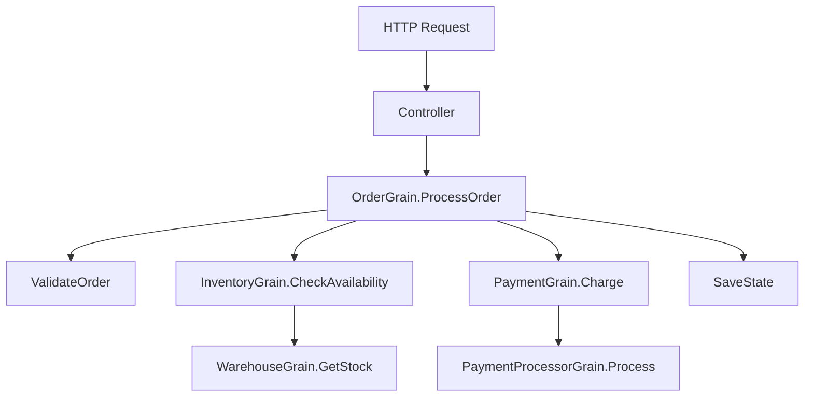

# How to Monitor .NET Orleans Grain Calls with OpenTelemetry

Author: [nawazdhandala](https://www.github.com/nawazdhandala)

Tags: OpenTelemetry, .NET, Orleans, Grains, Distributed, Actor Model

Description: Learn how to instrument Orleans grain calls with OpenTelemetry to get complete visibility into your actor-based distributed system.

Microsoft Orleans is a powerful framework for building distributed systems using the actor model. When you're running hundreds or thousands of grains across multiple silos, understanding call patterns, latency, and failures becomes critical. OpenTelemetry provides the observability layer you need to monitor grain activations, method calls, and inter-grain communication.

## Why Monitor Orleans with OpenTelemetry

Orleans abstracts away the complexity of distributed computing, but that abstraction can hide performance issues. A grain call that looks local might actually cross network boundaries, trigger activations, or wait on persistence operations. Without proper instrumentation, you're flying blind.

OpenTelemetry gives you:

- End-to-end traces across grain calls
- Visibility into grain activation lifecycle
- Performance metrics for individual grain methods
- Context propagation through the actor model
- Integration with your existing observability stack

## Setting Up Orleans with OpenTelemetry

First, add the required packages to your Orleans project:

```bash
dotnet add package Microsoft.Orleans.Server
dotnet add package OpenTelemetry.Extensions.Hosting
dotnet add package OpenTelemetry.Instrumentation.AspNetCore
dotnet add package OpenTelemetry.Exporter.OpenTelemetryProtocol
```

Configure OpenTelemetry in your silo host. Orleans 7.0+ includes built-in support for Activity-based tracing:

```csharp
using OpenTelemetry.Resources;
using OpenTelemetry.Trace;
using Orleans.Hosting;

var builder = WebApplication.CreateBuilder(args);

// Configure OpenTelemetry tracing
builder.Services.AddOpenTelemetry()
    .ConfigureResource(resource => resource
        .AddService("orleans-silo", serviceVersion: "1.0.0")
        .AddAttributes(new Dictionary<string, object>
        {
            ["deployment.environment"] = builder.Environment.EnvironmentName,
            ["silo.id"] = Environment.MachineName
        }))
    .WithTracing(tracing => tracing
        .AddAspNetCoreInstrumentation()
        .AddHttpClientInstrumentation()
        .AddSource("Microsoft.Orleans.Runtime")
        .AddSource("Microsoft.Orleans.Application")
        .AddOtlpExporter(options =>
        {
            options.Endpoint = new Uri("http://localhost:4317");
        }));

// Configure Orleans
builder.Host.UseOrleans((context, siloBuilder) =>
{
    siloBuilder
        .UseLocalhostClustering()
        .AddActivityPropagation(); // Enable distributed tracing
});

var app = builder.Build();
app.Run();
```

## Creating Instrumented Grains

Orleans automatically creates spans for grain method calls when activity propagation is enabled. However, adding custom instrumentation helps you understand what's happening inside your grains:

```csharp
using System.Diagnostics;
using Orleans;
using Orleans.Runtime;

public interface IOrderGrain : IGrainWithStringKey
{
    Task<OrderStatus> ProcessOrderAsync(OrderRequest request);
    Task<bool> CancelOrderAsync();
}

public class OrderGrain : Grain, IOrderGrain
{
    private static readonly ActivitySource ActivitySource =
        new ActivitySource("Microsoft.Orleans.Application");

    private readonly IPersistentState<OrderState> _orderState;
    private readonly ILogger<OrderGrain> _logger;

    public OrderGrain(
        [PersistentState("order")] IPersistentState<OrderState> orderState,
        ILogger<OrderGrain> logger)
    {
        _orderState = orderState;
        _logger = logger;
    }

    public async Task<OrderStatus> ProcessOrderAsync(OrderRequest request)
    {
        // Orleans creates a parent span for the grain call
        // We create child spans for internal operations
        using var activity = ActivitySource.StartActivity(
            "OrderGrain.ProcessOrder",
            ActivityKind.Internal);

        activity?.SetTag("order.id", this.GetPrimaryKeyString());
        activity?.SetTag("order.items.count", request.Items.Count);
        activity?.SetTag("order.total", request.TotalAmount);

        try
        {
            // Validate order
            using (var validateActivity = ActivitySource.StartActivity("ValidateOrder"))
            {
                ValidateOrder(request);
                validateActivity?.SetTag("validation.passed", true);
            }

            // Check inventory by calling another grain
            using (var inventoryActivity = ActivitySource.StartActivity("CheckInventory"))
            {
                var inventoryGrain = GrainFactory.GetGrain<IInventoryGrain>(0);
                var available = await inventoryGrain.CheckAvailabilityAsync(request.Items);

                inventoryActivity?.SetTag("inventory.available", available);

                if (!available)
                {
                    activity?.SetStatus(ActivityStatusCode.Error, "Insufficient inventory");
                    return OrderStatus.OutOfStock;
                }
            }

            // Process payment
            using (var paymentActivity = ActivitySource.StartActivity("ProcessPayment"))
            {
                var paymentGrain = GrainFactory.GetGrain<IPaymentGrain>(request.PaymentId);
                var paymentResult = await paymentGrain.ChargeAsync(request.TotalAmount);

                paymentActivity?.SetTag("payment.result", paymentResult.ToString());

                if (!paymentResult.Success)
                {
                    activity?.SetStatus(ActivityStatusCode.Error, "Payment failed");
                    return OrderStatus.PaymentFailed;
                }
            }

            // Save state
            using (var saveActivity = ActivitySource.StartActivity("SaveState"))
            {
                _orderState.State.Status = OrderStatus.Confirmed;
                _orderState.State.ProcessedAt = DateTime.UtcNow;
                await _orderState.WriteStateAsync();
            }

            activity?.SetTag("order.status", "confirmed");
            return OrderStatus.Confirmed;
        }
        catch (Exception ex)
        {
            activity?.SetStatus(ActivityStatusCode.Error, ex.Message);
            activity?.RecordException(ex);
            _logger.LogError(ex, "Failed to process order");
            throw;
        }
    }

    public async Task<bool> CancelOrderAsync()
    {
        using var activity = ActivitySource.StartActivity("OrderGrain.CancelOrder");
        activity?.SetTag("order.id", this.GetPrimaryKeyString());

        if (_orderState.State.Status != OrderStatus.Confirmed)
        {
            activity?.SetTag("cancel.allowed", false);
            return false;
        }

        _orderState.State.Status = OrderStatus.Cancelled;
        await _orderState.WriteStateAsync();

        activity?.SetTag("cancel.allowed", true);
        return true;
    }

    private void ValidateOrder(OrderRequest request)
    {
        if (request.Items.Count == 0)
            throw new ArgumentException("Order must contain at least one item");

        if (request.TotalAmount <= 0)
            throw new ArgumentException("Order total must be positive");
    }
}

public record OrderRequest(List<OrderItem> Items, decimal TotalAmount, string PaymentId);
public record OrderItem(string Sku, int Quantity);
public enum OrderStatus { Pending, Confirmed, OutOfStock, PaymentFailed, Cancelled }

public class OrderState
{
    public OrderStatus Status { get; set; }
    public DateTime ProcessedAt { get; set; }
}
```

## Monitoring Grain Lifecycle Events

Grain activations and deactivations are critical to Orleans performance. Create a grain call filter to track lifecycle events:

```csharp
using System.Diagnostics;
using Orleans;

public class TelemetryGrainCallFilter : IIncomingGrainCallFilter
{
    private static readonly ActivitySource ActivitySource =
        new ActivitySource("Microsoft.Orleans.Application");

    public async Task Invoke(IIncomingGrainCallContext context)
    {
        var grainType = context.Grain.GetType().Name;
        var methodName = context.InterfaceMethod.Name;

        using var activity = ActivitySource.StartActivity(
            $"{grainType}.{methodName}",
            ActivityKind.Server);

        activity?.SetTag("orleans.grain.type", grainType);
        activity?.SetTag("orleans.grain.key", context.Grain.GetPrimaryKeyString());
        activity?.SetTag("orleans.method", methodName);
        activity?.SetTag("orleans.silo", context.Grain.GetType().Assembly.GetName().Version?.ToString());

        var startTime = DateTime.UtcNow;

        try
        {
            await context.Invoke();

            var duration = DateTime.UtcNow - startTime;
            activity?.SetTag("orleans.call.duration_ms", duration.TotalMilliseconds);
            activity?.SetTag("orleans.call.success", true);
        }
        catch (Exception ex)
        {
            activity?.SetStatus(ActivityStatusCode.Error, ex.Message);
            activity?.RecordException(ex);
            activity?.SetTag("orleans.call.success", false);
            throw;
        }
    }
}
```

Register the filter in your silo configuration:

```csharp
builder.Host.UseOrleans((context, siloBuilder) =>
{
    siloBuilder
        .UseLocalhostClustering()
        .AddActivityPropagation()
        .AddIncomingGrainCallFilter<TelemetryGrainCallFilter>();
});
```

## Tracking Stream Operations

Orleans streams are first-class citizens for pub/sub patterns. Instrument stream operations to understand message flow:

```csharp
using System.Diagnostics;
using Orleans;
using Orleans.Streams;

public interface INotificationGrain : IGrainWithGuidKey
{
    Task SubscribeToOrderEventsAsync();
}

public class NotificationGrain : Grain, INotificationGrain
{
    private static readonly ActivitySource ActivitySource =
        new ActivitySource("Microsoft.Orleans.Application");

    private StreamSubscriptionHandle<OrderEvent>? _subscription;

    public async Task SubscribeToOrderEventsAsync()
    {
        using var activity = ActivitySource.StartActivity("NotificationGrain.Subscribe");

        var streamProvider = this.GetStreamProvider("StreamProvider");
        var stream = streamProvider.GetStream<OrderEvent>("orders", Guid.Empty);

        _subscription = await stream.SubscribeAsync(async (orderEvent, token) =>
        {
            // Create a new activity for each message received
            using var messageActivity = ActivitySource.StartActivity(
                "NotificationGrain.ProcessOrderEvent",
                ActivityKind.Consumer);

            messageActivity?.SetTag("order.event.type", orderEvent.Type);
            messageActivity?.SetTag("order.id", orderEvent.OrderId);
            messageActivity?.SetTag("stream.namespace", "orders");

            try
            {
                await ProcessOrderEventAsync(orderEvent);
                messageActivity?.SetTag("processing.success", true);
            }
            catch (Exception ex)
            {
                messageActivity?.SetStatus(ActivityStatusCode.Error, ex.Message);
                messageActivity?.RecordException(ex);
                throw;
            }
        });
    }

    private async Task ProcessOrderEventAsync(OrderEvent orderEvent)
    {
        // Send notifications based on order events
        await Task.Delay(100); // Simulate notification sending
    }

    public override Task OnDeactivateAsync(DeactivationReason reason, CancellationToken cancellationToken)
    {
        _subscription?.UnsubscribeAsync();
        return base.OnDeactivateAsync(reason, cancellationToken);
    }
}

public record OrderEvent(string OrderId, string Type);
```

## Visualizing Grain Call Chains

Understanding how grains interact is much easier with distributed traces. Here's the typical trace structure:



Each box in this diagram represents a span in your distributed trace. OpenTelemetry automatically propagates context through grain calls, so you get the complete picture without manual correlation.

## Client-Side Instrumentation

Don't forget to instrument your Orleans clients. The client creates the root span for operations that start outside your cluster:

```csharp
using OpenTelemetry.Resources;
using OpenTelemetry.Trace;
using Orleans;

var builder = WebApplication.CreateBuilder(args);

builder.Services.AddOpenTelemetry()
    .ConfigureResource(resource => resource
        .AddService("orleans-client", serviceVersion: "1.0.0"))
    .WithTracing(tracing => tracing
        .AddAspNetCoreInstrumentation()
        .AddHttpClientInstrumentation()
        .AddSource("Microsoft.Orleans.Application")
        .AddOtlpExporter(options =>
        {
            options.Endpoint = new Uri("http://localhost:4317");
        }));

builder.Host.UseOrleansClient((context, clientBuilder) =>
{
    clientBuilder
        .UseLocalhostClustering()
        .AddActivityPropagation();
});

var app = builder.Build();

app.MapPost("/orders", async (IClusterClient client, OrderRequest request) =>
{
    var orderGrain = client.GetGrain<IOrderGrain>(Guid.NewGuid().ToString());
    var status = await orderGrain.ProcessOrderAsync(request);
    return Results.Ok(new { status });
});

app.Run();
```

## Performance Considerations

Instrumentation adds overhead. Here are some strategies to minimize impact:

**Sampling**: Don't trace every grain call in production. Use head-based or tail-based sampling:

```csharp
.WithTracing(tracing => tracing
    .SetSampler(new TraceIdRatioBasedSampler(0.1)) // Sample 10% of traces
    .AddSource("Microsoft.Orleans.Runtime")
    .AddSource("Microsoft.Orleans.Application")
    .AddOtlpExporter());
```

**Selective Instrumentation**: Only instrument business-critical grains. Not every grain method needs custom spans.

**Batch Exports**: Configure the OTLP exporter to batch telemetry data:

```csharp
.AddOtlpExporter(options =>
{
    options.Endpoint = new Uri("http://localhost:4317");
    options.ExportProcessorType = ExportProcessorType.Batch;
    options.BatchExportProcessorOptions = new BatchExportProcessorOptions<Activity>
    {
        MaxQueueSize = 2048,
        ScheduledDelayMilliseconds = 5000,
        ExporterTimeoutMilliseconds = 30000,
        MaxExportBatchSize = 512
    };
});
```

## Troubleshooting Common Issues

**Missing spans**: Verify that activity propagation is enabled on both the silo and client. Check that your ActivitySource names match what you're listening for in the OpenTelemetry configuration.

**Disconnected traces**: This happens when context isn't propagated correctly. Orleans handles this automatically for grain calls, but custom async operations might lose context. Use `Activity.Current` to manually propagate if needed.

**High cardinality tags**: Avoid using unbounded values like timestamps or random IDs as tag values. This can overwhelm your backend storage.

## Monitoring Best Practices

Create dashboards for key grain metrics:

- Grain activation rate and count
- Average method call duration per grain type
- Error rates by grain and method
- Stream message processing latency
- State persistence duration

Set up alerts for:

- Grain call error rate exceeding threshold
- Unusually slow grain activations
- Failed state persistence operations
- Stream subscription failures

Your Orleans application is now fully instrumented with OpenTelemetry. You can trace requests from the client through multiple grain calls, see where time is spent, and quickly identify performance bottlenecks or errors in your distributed actor system.
