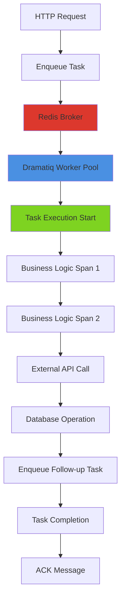

# How to Monitor Dramatiq Task Queues with OpenTelemetry

Author: [nawazdhandala](https://www.github.com/nawazdhandala)

Tags: OpenTelemetry, Dramatiq, Python, Task Queue, Background Jobs, Monitoring

Description: Learn how to implement comprehensive monitoring and distributed tracing for Dramatiq task queues using OpenTelemetry to track job execution, queue performance, and error rates.

Dramatiq is a fast and reliable distributed task processing library for Python that supports RabbitMQ and Redis as message brokers. When running background job systems in production, visibility into task execution, queue depths, retry patterns, and failure rates becomes critical for system reliability. OpenTelemetry provides instrumentation for Dramatiq that automatically traces task enqueueing, execution, retries, and failures.

## Why Monitor Dramatiq Task Queues

Background task processing is fundamental to modern applications. Dramatiq tasks handle:

- Email and notification delivery
- Image and video processing
- Report generation and data exports
- Scheduled data synchronization
- Long-running computations and batch jobs

Without proper monitoring, task queue systems fail silently. Messages get lost, tasks hang indefinitely, and error rates spike without visibility. OpenTelemetry makes Dramatiq observable by tracing every message through its lifecycle from enqueue to completion or failure.

## Installation and Dependencies

```bash
# Install Dramatiq with Redis broker support
pip install dramatiq redis

# Install OpenTelemetry packages
pip install opentelemetry-api opentelemetry-sdk
pip install opentelemetry-instrumentation
pip install opentelemetry-exporter-otlp

# Optional: Install APScheduler if using scheduled tasks
pip install apscheduler
```

Dramatiq doesn't have official OpenTelemetry instrumentation yet, so we'll implement custom instrumentation using middleware and manual span creation. This gives you complete control over what gets traced.

## Basic Dramatiq Setup with OpenTelemetry

Here's a complete example showing Dramatiq with OpenTelemetry tracing:

```python
import dramatiq
from dramatiq.brokers.redis import RedisBroker
from dramatiq.middleware import CurrentMessage
from opentelemetry import trace
from opentelemetry.sdk.trace import TracerProvider
from opentelemetry.sdk.trace.export import BatchSpanProcessor
from opentelemetry.exporter.otlp.proto.grpc.trace_exporter import OTLPSpanExporter
from opentelemetry.sdk.resources import Resource, SERVICE_NAME
from opentelemetry.trace.propagation.tracecontext import TraceContextTextMapPropagator

# Configure OpenTelemetry
resource = Resource(attributes={
    SERVICE_NAME: "dramatiq-worker-service",
    "service.type": "task_queue",
})

provider = TracerProvider(resource=resource)
otlp_exporter = OTLPSpanExporter(
    endpoint="http://localhost:4317",
    insecure=True
)
processor = BatchSpanProcessor(otlp_exporter)
provider.add_span_processor(processor)
trace.set_tracer_provider(provider)

tracer = trace.get_tracer(__name__)

# Configure Redis broker
redis_broker = RedisBroker(host="localhost", port=6379, db=0)
dramatiq.set_broker(redis_broker)

# Define a basic task
@dramatiq.actor
def send_email(user_id, subject, body):
    """Send email task that will be traced"""
    print(f"Sending email to user {user_id}: {subject}")
    # Email sending logic here
    import time
    time.sleep(1)  # Simulate email API call
    print(f"Email sent successfully to user {user_id}")

# Enqueue a task
send_email.send("user123", "Welcome", "Welcome to our platform!")
```

This basic setup works but doesn't create traces automatically. We need custom middleware to add tracing.

## Custom Tracing Middleware for Dramatiq

Create middleware that traces task execution with context propagation:

```python
from dramatiq import Middleware
from opentelemetry.trace.status import Status, StatusCode
from opentelemetry.propagate import extract, inject
import time

class OpenTelemetryMiddleware(Middleware):
    """Middleware that adds OpenTelemetry tracing to Dramatiq tasks"""

    def __init__(self):
        self.tracer = trace.get_tracer(__name__)
        self.propagator = TraceContextTextMapPropagator()

    def before_enqueue(self, broker, message, delay):
        """Inject trace context when enqueueing a task"""
        # Create a span for task enqueueing
        with self.tracer.start_as_current_span("dramatiq.enqueue") as span:
            span.set_attribute("messaging.system", "dramatiq")
            span.set_attribute("messaging.operation", "send")
            span.set_attribute("messaging.destination", message.queue_name)
            span.set_attribute("dramatiq.actor_name", message.actor_name)
            span.set_attribute("dramatiq.message_id", message.message_id)

            if delay:
                span.set_attribute("dramatiq.delay_ms", delay)

            # Inject trace context into message options
            carrier = {}
            inject(carrier)
            message.options["otel_context"] = carrier

    def before_process_message(self, broker, message):
        """Start a span when processing begins"""
        # Extract trace context from message
        carrier = message.options.get("otel_context", {})
        ctx = extract(carrier)

        # Start processing span with extracted context
        span = self.tracer.start_span(
            name=f"dramatiq.process.{message.actor_name}",
            context=ctx
        )

        span.set_attribute("messaging.system", "dramatiq")
        span.set_attribute("messaging.operation", "receive")
        span.set_attribute("dramatiq.actor_name", message.actor_name)
        span.set_attribute("dramatiq.message_id", message.message_id)
        span.set_attribute("dramatiq.queue_name", message.queue_name)
        span.set_attribute("dramatiq.retries", message.options.get("retries", 0))

        # Store span in message metadata for later access
        message.options["_otel_span"] = span
        message.options["_otel_start_time"] = time.time()

    def after_process_message(self, broker, message, *, result=None, exception=None):
        """End span after processing completes"""
        span = message.options.get("_otel_span")
        start_time = message.options.get("_otel_start_time")

        if span:
            # Calculate execution time
            if start_time:
                execution_time = time.time() - start_time
                span.set_attribute("dramatiq.execution_time_ms", execution_time * 1000)

            if exception:
                # Record exception in span
                span.record_exception(exception)
                span.set_status(Status(StatusCode.ERROR, str(exception)))
                span.set_attribute("dramatiq.status", "failed")
            else:
                span.set_status(Status(StatusCode.OK))
                span.set_attribute("dramatiq.status", "completed")

            span.end()

    def after_skip_message(self, broker, message):
        """Handle skipped messages"""
        span = message.options.get("_otel_span")
        if span:
            span.set_attribute("dramatiq.status", "skipped")
            span.set_status(Status(StatusCode.ERROR, "Message skipped"))
            span.end()

# Add middleware to broker
redis_broker.add_middleware(OpenTelemetryMiddleware())
```

Now every Dramatiq task will be automatically traced with context propagation.

## Tracing Task Execution with Custom Spans

Add custom spans within tasks to trace specific operations:

```python
@dramatiq.actor
def process_user_signup(user_id, email):
    """Process new user signup with detailed tracing"""

    # The middleware creates a parent span for the entire task
    # Add child spans for specific operations
    with tracer.start_as_current_span("validate_user_data") as span:
        span.set_attribute("user.id", user_id)
        span.set_attribute("user.email", email)

        # Validation logic
        if not email or "@" not in email:
            span.set_attribute("validation.error", "invalid_email")
            raise ValueError("Invalid email address")

    with tracer.start_as_current_span("create_user_account") as span:
        # Simulate database operation
        import time
        time.sleep(0.5)
        span.set_attribute("db.operation", "insert")
        span.set_attribute("db.table", "users")

    with tracer.start_as_current_span("send_welcome_email") as span:
        span.set_attribute("email.type", "welcome")
        span.set_attribute("email.recipient", email)
        # Email sending logic
        time.sleep(0.3)

    with tracer.start_as_current_span("create_onboarding_tasks") as span:
        # Enqueue follow-up tasks
        create_user_profile.send(user_id)
        send_onboarding_sequence.send(user_id)
        span.set_attribute("followup_tasks.count", 2)

@dramatiq.actor
def create_user_profile(user_id):
    """Create initial user profile"""
    with tracer.start_as_current_span("initialize_profile") as span:
        span.set_attribute("user.id", user_id)
        # Profile creation logic
        import time
        time.sleep(0.2)

@dramatiq.actor
def send_onboarding_sequence(user_id):
    """Send onboarding email sequence"""
    with tracer.start_as_current_span("schedule_onboarding") as span:
        span.set_attribute("user.id", user_id)
        # Schedule onboarding emails
        import time
        time.sleep(0.1)
```

## Tracing Task Chains and Pipelines

Dramatiq supports task pipelines. Trace the entire pipeline flow:

```python
from dramatiq import pipeline

@dramatiq.actor
def fetch_data(source_id):
    """Fetch data from external source"""
    with tracer.start_as_current_span("fetch_external_data") as span:
        span.set_attribute("data.source_id", source_id)
        span.set_attribute("data.source_type", "api")

        # Simulate API call
        import time
        time.sleep(0.5)

        data = {"source": source_id, "records": 100, "status": "success"}
        span.set_attribute("data.records_fetched", data["records"])

        return data

@dramatiq.actor
def transform_data(data):
    """Transform fetched data"""
    with tracer.start_as_current_span("transform_data") as span:
        span.set_attribute("data.input_records", data.get("records", 0))

        # Transformation logic
        import time
        time.sleep(0.3)

        transformed = {
            "source": data["source"],
            "records": data["records"],
            "transformed": True
        }

        span.set_attribute("data.output_records", transformed["records"])
        return transformed

@dramatiq.actor
def store_data(transformed_data):
    """Store transformed data"""
    with tracer.start_as_current_span("store_to_database") as span:
        span.set_attribute("db.operation", "bulk_insert")
        span.set_attribute("db.records_count", transformed_data.get("records", 0))

        # Database storage
        import time
        time.sleep(0.4)

        span.set_attribute("storage.status", "completed")
        return {"stored": True, "count": transformed_data["records"]}

# Execute pipeline with tracing across all tasks
def run_data_pipeline(source_id):
    """Run complete data pipeline with distributed tracing"""
    with tracer.start_as_current_span("data_pipeline") as span:
        span.set_attribute("pipeline.source_id", source_id)
        span.set_attribute("pipeline.stages", 3)

        # Create and execute pipeline
        pipe = (
            fetch_data.message(source_id)
            | transform_data.message()
            | store_data.message()
        )

        # Enqueue the pipeline
        pipe.run()

        span.set_attribute("pipeline.status", "enqueued")
```

## Monitoring Task Retries and Failures

Dramatiq automatically retries failed tasks. Track retry patterns:

```python
@dramatiq.actor(max_retries=3, min_backoff=1000, max_backoff=60000)
def unreliable_task(job_id):
    """Task that might fail and retry"""

    current_message = CurrentMessage.get_current_message()
    retry_count = current_message.options.get("retries", 0)

    with tracer.start_as_current_span("unreliable_operation") as span:
        span.set_attribute("job.id", job_id)
        span.set_attribute("job.retry_count", retry_count)
        span.set_attribute("job.max_retries", 3)

        # Simulate intermittent failure
        import random
        if random.random() < 0.6 and retry_count < 2:
            span.set_attribute("job.failure_reason", "simulated_failure")
            span.set_status(Status(StatusCode.ERROR, "Simulated failure"))
            raise Exception("Temporary failure - will retry")

        span.set_attribute("job.status", "succeeded")
        print(f"Job {job_id} completed successfully after {retry_count} retries")

@dramatiq.actor(max_retries=0)  # No retries for critical tasks
def critical_payment_task(payment_id, amount):
    """Critical task that should not retry automatically"""

    with tracer.start_as_current_span("process_payment") as span:
        span.set_attribute("payment.id", payment_id)
        span.set_attribute("payment.amount", amount)
        span.set_attribute("payment.retry_policy", "manual")

        try:
            # Payment processing logic
            import time
            time.sleep(0.5)
            span.set_attribute("payment.status", "completed")

        except Exception as e:
            # Log error but don't retry
            span.record_exception(e)
            span.set_attribute("payment.status", "failed")
            span.set_attribute("payment.requires_manual_review", True)
            raise
```

## Tracing Scheduled Tasks

Monitor periodic tasks with APScheduler integration:

```python
from apscheduler.schedulers.background import BackgroundScheduler

scheduler = BackgroundScheduler()

def scheduled_cleanup_job():
    """Periodic cleanup job with tracing"""
    with tracer.start_as_current_span("scheduled_cleanup") as span:
        span.set_attribute("job.type", "scheduled")
        span.set_attribute("job.name", "cleanup")

        # Enqueue cleanup tasks
        cleanup_old_sessions.send()
        cleanup_temp_files.send()
        generate_daily_reports.send()

        span.set_attribute("cleanup.tasks_enqueued", 3)

@dramatiq.actor
def cleanup_old_sessions():
    """Clean up expired sessions"""
    with tracer.start_as_current_span("cleanup_sessions") as span:
        # Cleanup logic
        import time
        time.sleep(0.2)
        deleted_count = 42  # Simulated
        span.set_attribute("cleanup.sessions_deleted", deleted_count)

@dramatiq.actor
def cleanup_temp_files():
    """Clean up temporary files"""
    with tracer.start_as_current_span("cleanup_temp_files") as span:
        import time
        time.sleep(0.3)
        span.set_attribute("cleanup.files_deleted", 15)

@dramatiq.actor
def generate_daily_reports():
    """Generate daily reports"""
    with tracer.start_as_current_span("generate_reports") as span:
        import time
        time.sleep(1.0)
        span.set_attribute("reports.generated_count", 5)

# Schedule cleanup job to run daily at 2 AM
scheduler.add_job(scheduled_cleanup_job, 'cron', hour=2, minute=0)
scheduler.start()
```

## Dramatiq Task Flow Visualization

Here's how traces flow through a Dramatiq task pipeline:



## Monitoring Queue Metrics

Track queue depth and worker performance with custom metrics:

```python
from opentelemetry import metrics
from opentelemetry.sdk.metrics import MeterProvider
from opentelemetry.sdk.metrics.export import PeriodicExportingMetricReader

# Configure metrics
metric_reader = PeriodicExportingMetricReader(otlp_exporter)
meter_provider = MeterProvider(metric_readers=[metric_reader])
metrics.set_meter_provider(meter_provider)

meter = metrics.get_meter(__name__)

# Create metrics
queue_depth_gauge = meter.create_gauge(
    name="dramatiq.queue.depth",
    description="Number of messages in queue",
    unit="messages"
)

task_duration_histogram = meter.create_histogram(
    name="dramatiq.task.duration",
    description="Task execution duration",
    unit="ms"
)

task_success_counter = meter.create_counter(
    name="dramatiq.task.success",
    description="Number of successful tasks",
    unit="tasks"
)

task_failure_counter = meter.create_counter(
    name="dramatiq.task.failure",
    description="Number of failed tasks",
    unit="tasks"
)

def collect_queue_metrics():
    """Collect queue depth metrics periodically"""
    import redis
    r = redis.Redis(host="localhost", port=6379, db=0)

    # Get queue depths
    default_queue_depth = r.llen("dramatiq:default.DQ")
    queue_depth_gauge.set(default_queue_depth, {"queue": "default"})

# Run metrics collection periodically
scheduler.add_job(collect_queue_metrics, 'interval', seconds=30)
```

## Dead Letter Queue Monitoring

Track messages that fail permanently:

```python
@dramatiq.actor(max_retries=3)
def risky_task(task_id):
    """Task that might end up in dead letter queue"""

    with tracer.start_as_current_span("risky_task") as span:
        span.set_attribute("task.id", task_id)

        current_message = CurrentMessage.get_current_message()
        retry_count = current_message.options.get("retries", 0)
        span.set_attribute("task.retry_count", retry_count)

        # Check if this is the last retry
        if retry_count >= 2:
            span.set_attribute("task.last_retry", True)

        try:
            # Risky operation
            import random
            if random.random() < 0.5:
                raise Exception("Random failure")

            span.set_attribute("task.status", "success")

        except Exception as e:
            span.record_exception(e)

            if retry_count >= 2:
                # This will go to dead letter queue
                span.set_attribute("task.destination", "dead_letter_queue")
                span.set_attribute("task.final_status", "failed_permanently")

                # Log to monitoring system
                print(f"Task {task_id} failed permanently after {retry_count + 1} attempts")

            raise
```

## Worker Process Monitoring

Monitor worker health and resource usage:

```python
import os
import psutil

@dramatiq.actor
def health_check_task():
    """Periodic health check for worker process"""

    with tracer.start_as_current_span("worker_health_check") as span:
        process = psutil.Process(os.getpid())

        # Collect process metrics
        cpu_percent = process.cpu_percent(interval=1)
        memory_info = process.memory_info()

        span.set_attribute("worker.cpu_percent", cpu_percent)
        span.set_attribute("worker.memory_rss_mb", memory_info.rss / 1024 / 1024)
        span.set_attribute("worker.memory_vms_mb", memory_info.vms / 1024 / 1024)
        span.set_attribute("worker.pid", os.getpid())
        span.set_attribute("worker.threads", process.num_threads())

        # Check if worker is healthy
        if cpu_percent > 90:
            span.set_attribute("worker.status", "overloaded")
            span.set_status(Status(StatusCode.ERROR, "CPU usage too high"))
        elif memory_info.rss > 1024 * 1024 * 1024:  # 1GB
            span.set_attribute("worker.status", "high_memory")
            span.set_status(Status(StatusCode.ERROR, "Memory usage too high"))
        else:
            span.set_attribute("worker.status", "healthy")

# Schedule health checks every 5 minutes
scheduler.add_job(health_check_task.send, 'interval', minutes=5)
```

## Production Configuration

Configure Dramatiq and OpenTelemetry for production:

```python
import os

# Production configuration
resource = Resource(attributes={
    SERVICE_NAME: os.getenv("SERVICE_NAME", "dramatiq-worker"),
    "service.version": os.getenv("VERSION", "1.0.0"),
    "deployment.environment": os.getenv("ENVIRONMENT", "production"),
    "host.name": os.getenv("HOSTNAME", "unknown"),
})

# Configure broker with production settings
redis_broker = RedisBroker(
    host=os.getenv("REDIS_HOST", "localhost"),
    port=int(os.getenv("REDIS_PORT", "6379")),
    db=int(os.getenv("REDIS_DB", "0")),
    # Connection pooling for better performance
    connection_pool_kwargs={
        "max_connections": 50,
        "socket_keepalive": True,
    }
)

# Add middleware
redis_broker.add_middleware(OpenTelemetryMiddleware())
dramatiq.set_broker(redis_broker)
```

OpenTelemetry transforms Dramatiq from a black box into a fully observable task processing system. By tracing task enqueueing, execution, retries, and failures, you gain complete visibility into background job performance. Combined with custom spans for business logic and metrics for queue health, you can confidently run Dramatiq at scale in production environments.
