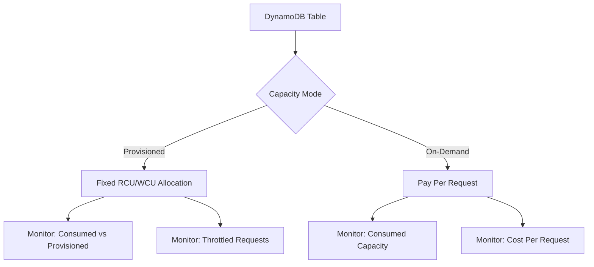
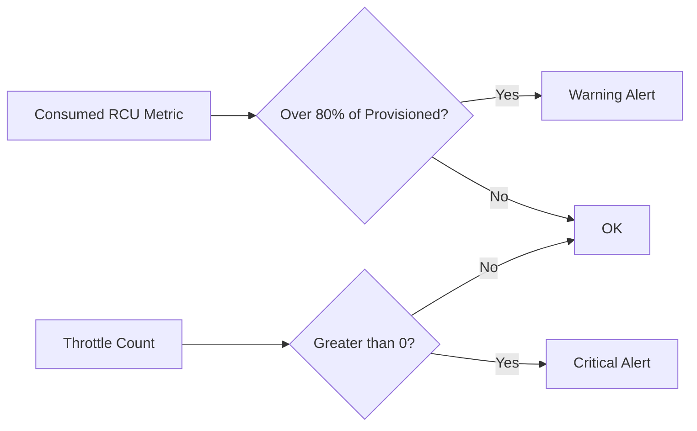

# How to Monitor DynamoDB Read/Write Capacity with OpenTelemetry

Author: [nawazdhandala](https://www.github.com/nawazdhandala)

Tags: OpenTelemetry, DynamoDB, AWS, Monitoring, Metrics, Database

Description: A practical guide to monitoring DynamoDB read and write capacity units using OpenTelemetry custom metrics and AWS SDK instrumentation.

---

DynamoDB pricing revolves around capacity units. You pay for what you provision (or consume, in on-demand mode), and if your application exceeds provisioned capacity, requests get throttled. Throttled requests mean failed reads and writes, which means unhappy users. Monitoring your consumed and provisioned capacity in real time is not optional - it is essential.

While AWS CloudWatch provides built-in DynamoDB metrics, many teams prefer to consolidate all their observability data in a single platform using OpenTelemetry. This post walks through how to capture DynamoDB read/write capacity metrics with OpenTelemetry and ship them to your observability backend.

## Understanding DynamoDB Capacity Units

Before diving into the instrumentation, let's clarify what we are measuring.

A Read Capacity Unit (RCU) represents one strongly consistent read per second for an item up to 4 KB. Eventually consistent reads cost half an RCU. A Write Capacity Unit (WCU) represents one write per second for an item up to 1 KB.



In provisioned mode, you need to track consumed capacity against your provisioned limit to avoid throttling. In on-demand mode, you want to track consumed capacity to understand costs and detect anomalies.

## Approach 1: Instrument the AWS SDK with OpenTelemetry

The most straightforward approach is to instrument your AWS SDK calls. OpenTelemetry provides an AWS SDK instrumentation package that automatically creates spans for every DynamoDB operation. You can then extract capacity information from the responses.

Install the required packages for a Node.js application.

```bash
# Install OpenTelemetry packages and the AWS SDK instrumentation
npm install @opentelemetry/sdk-node \
  @opentelemetry/instrumentation-aws-sdk \
  @opentelemetry/exporter-metrics-otlp-http \
  @opentelemetry/sdk-metrics \
  @aws-sdk/client-dynamodb
```

Set up the OpenTelemetry SDK with AWS instrumentation.

```javascript
// tracing.js - Initialize OpenTelemetry with AWS SDK instrumentation
const { NodeSDK } = require('@opentelemetry/sdk-node');
const { AwsInstrumentation } = require('@opentelemetry/instrumentation-aws-sdk');
const { OTLPMetricExporter } = require('@opentelemetry/exporter-metrics-otlp-http');
const { PeriodicExportingMetricReader } = require('@opentelemetry/sdk-metrics');
const { Resource } = require('@opentelemetry/resources');

const sdk = new NodeSDK({
  resource: new Resource({
    'service.name': 'order-service',
  }),
  // Instrument all AWS SDK calls automatically
  instrumentations: [
    new AwsInstrumentation({
      suppressInternalInstrumentation: true,
    }),
  ],
  metricReader: new PeriodicExportingMetricReader({
    exporter: new OTLPMetricExporter({
      url: 'http://localhost:4318/v1/metrics',
    }),
    // Export metrics every 30 seconds
    exportIntervalMillis: 30000,
  }),
});

sdk.start();
```

Now create a wrapper around your DynamoDB client that extracts capacity metrics from every response.

```javascript
// dynamodb-metrics.js
const { DynamoDBClient, QueryCommand, PutItemCommand } = require('@aws-sdk/client-dynamodb');
const { metrics } = require('@opentelemetry/api');

// Create a meter for DynamoDB capacity metrics
const meter = metrics.getMeter('dynamodb-capacity');

// Define gauges for consumed capacity tracking
const consumedReadCapacity = meter.createCounter('dynamodb.consumed_read_capacity_units', {
  description: 'Total consumed read capacity units',
  unit: 'units',
});

const consumedWriteCapacity = meter.createCounter('dynamodb.consumed_write_capacity_units', {
  description: 'Total consumed write capacity units',
  unit: 'units',
});

const throttledRequests = meter.createCounter('dynamodb.throttled_requests', {
  description: 'Number of throttled DynamoDB requests',
  unit: 'requests',
});

const client = new DynamoDBClient({ region: 'us-east-1' });

// Wrapper function that tracks capacity consumption after each query
async function queryWithMetrics(tableName, params) {
  try {
    const command = new QueryCommand({
      ...params,
      TableName: tableName,
      // Always request capacity information in the response
      ReturnConsumedCapacity: 'TOTAL',
    });

    const response = await client.send(command);

    // Record the consumed read capacity from the response
    if (response.ConsumedCapacity) {
      consumedReadCapacity.add(response.ConsumedCapacity.CapacityUnits, {
        'dynamodb.table': tableName,
        'dynamodb.operation': 'Query',
      });
    }

    return response;
  } catch (error) {
    // Track throttled requests separately
    if (error.name === 'ProvisionedThroughputExceededException') {
      throttledRequests.add(1, {
        'dynamodb.table': tableName,
        'dynamodb.operation': 'Query',
      });
    }
    throw error;
  }
}

// Wrapper for write operations that tracks write capacity consumption
async function putItemWithMetrics(tableName, item) {
  try {
    const command = new PutItemCommand({
      TableName: tableName,
      Item: item,
      ReturnConsumedCapacity: 'TOTAL',
    });

    const response = await client.send(command);

    if (response.ConsumedCapacity) {
      consumedWriteCapacity.add(response.ConsumedCapacity.CapacityUnits, {
        'dynamodb.table': tableName,
        'dynamodb.operation': 'PutItem',
      });
    }

    return response;
  } catch (error) {
    if (error.name === 'ProvisionedThroughputExceededException') {
      throttledRequests.add(1, {
        'dynamodb.table': tableName,
        'dynamodb.operation': 'PutItem',
      });
    }
    throw error;
  }
}

module.exports = { queryWithMetrics, putItemWithMetrics };
```

## Approach 2: Pull Metrics from CloudWatch via OTel Collector

If you want table-level metrics without modifying application code, you can use the OpenTelemetry Collector with the AWS CloudWatch receiver. This pulls DynamoDB metrics directly from CloudWatch and converts them to OpenTelemetry format.

Here is a collector configuration that pulls DynamoDB metrics.

```yaml
# otel-collector-config.yaml
receivers:
  # Pull DynamoDB metrics from AWS CloudWatch
  awscloudwatch:
    region: us-east-1
    # Poll CloudWatch every 60 seconds
    poll_interval: 60s
    metrics:
      named:
        # Track consumed read capacity vs provisioned
        dynamodb_consumed_rcus:
          namespace: AWS/DynamoDB
          metric_name: ConsumedReadCapacityUnits
          period: 60s
          statistics: [Sum]
          dimensions:
            - name: TableName
              value: ""  # Empty string means all tables

        # Track consumed write capacity vs provisioned
        dynamodb_consumed_wcus:
          namespace: AWS/DynamoDB
          metric_name: ConsumedWriteCapacityUnits
          period: 60s
          statistics: [Sum]
          dimensions:
            - name: TableName
              value: ""

        # Track read throttle events
        dynamodb_read_throttles:
          namespace: AWS/DynamoDB
          metric_name: ReadThrottleEvents
          period: 60s
          statistics: [Sum]
          dimensions:
            - name: TableName
              value: ""

        # Track write throttle events
        dynamodb_write_throttles:
          namespace: AWS/DynamoDB
          metric_name: WriteThrottleEvents
          period: 60s
          statistics: [Sum]
          dimensions:
            - name: TableName
              value: ""

        # Provisioned capacity limits for comparison
        dynamodb_provisioned_rcus:
          namespace: AWS/DynamoDB
          metric_name: ProvisionedReadCapacityUnits
          period: 300s
          statistics: [Average]
          dimensions:
            - name: TableName
              value: ""

        dynamodb_provisioned_wcus:
          namespace: AWS/DynamoDB
          metric_name: ProvisionedWriteCapacityUnits
          period: 300s
          statistics: [Average]
          dimensions:
            - name: TableName
              value: ""

processors:
  batch:
    # Batch metrics before exporting for efficiency
    timeout: 10s
    send_batch_size: 100

exporters:
  otlphttp:
    # Send metrics to your observability backend
    endpoint: "https://your-oneuptime-instance.com/otlp"

service:
  pipelines:
    metrics:
      receivers: [awscloudwatch]
      processors: [batch]
      exporters: [otlphttp]
```

## Approach 3: Python Lambda with Custom Metrics

For serverless applications, you can instrument your Lambda functions to report DynamoDB capacity.

```python
# lambda_handler.py
import boto3
from opentelemetry import metrics
from opentelemetry.sdk.metrics import MeterProvider
from opentelemetry.sdk.metrics.export import PeriodicExportingMetricReader
from opentelemetry.exporter.otlp.proto.http.metric_exporter import OTLPMetricExporter
from opentelemetry.sdk.resources import Resource

# Set up the meter provider once during cold start
resource = Resource.create({"service.name": "order-lambda"})
exporter = OTLPMetricExporter(endpoint="http://collector:4318/v1/metrics")
reader = PeriodicExportingMetricReader(exporter, export_interval_millis=10000)
provider = MeterProvider(resource=resource, metric_readers=[reader])
metrics.set_meter_provider(provider)

meter = metrics.get_meter("dynamodb-capacity")

# Create counters for tracking capacity usage
rcu_counter = meter.create_counter(
    "dynamodb.consumed_rcu",
    description="Consumed read capacity units",
    unit="units"
)
wcu_counter = meter.create_counter(
    "dynamodb.consumed_wcu",
    description="Consumed write capacity units",
    unit="units"
)

dynamodb = boto3.client("dynamodb")

def handler(event, context):
    # Query with capacity tracking enabled
    response = dynamodb.query(
        TableName="Orders",
        KeyConditionExpression="customer_id = :cid",
        ExpressionAttributeValues={":cid": {"S": event["customer_id"]}},
        # Request capacity information in the response
        ReturnConsumedCapacity="TOTAL"
    )

    # Record the consumed capacity as a metric
    consumed = response.get("ConsumedCapacity", {})
    if consumed:
        rcu_counter.add(
            consumed.get("CapacityUnits", 0),
            attributes={
                "dynamodb.table": "Orders",
                "dynamodb.operation": "Query",
                "aws.lambda.function": context.function_name,
            }
        )

    return {
        "statusCode": 200,
        "body": response["Items"]
    }
```

## Setting Up Alerts

Once you have capacity metrics flowing, set up alerts for the conditions that matter.



Key thresholds to monitor:

- **Consumed capacity above 80% of provisioned** - you are approaching your limit and should consider scaling up.
- **Any throttle events** - requests are being rejected. This needs immediate attention.
- **Sudden spikes in consumed capacity** - could indicate a hot partition or an unexpected traffic pattern.
- **Consumed capacity consistently below 30% of provisioned** - you are over-provisioned and wasting money.

## Key Takeaways

Monitoring DynamoDB capacity with OpenTelemetry gives you flexibility in where and how you visualize the data. The application-level approach (wrapping SDK calls) gives you per-operation granularity with request-level trace correlation. The CloudWatch receiver approach gives you table-level metrics without code changes. In most production setups, combining both approaches provides the most complete picture. You get the high-level table metrics from CloudWatch and the per-request detail from your instrumented application code.
