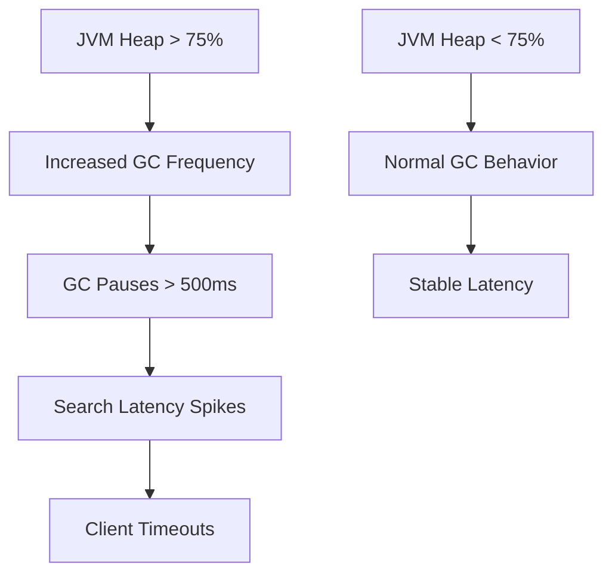
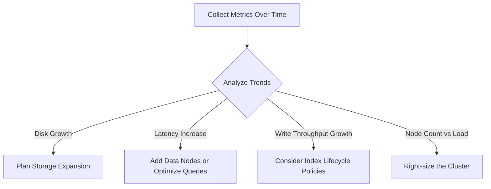

# How to Monitor Elasticsearch Cluster Health with the OpenTelemetry Collector

Author: [nawazdhandala](https://www.github.com/nawazdhandala)

Tags: OpenTelemetry, Elasticsearch, Cluster Monitoring, Observability, Collector, Metrics

Description: Step-by-step guide to monitoring Elasticsearch cluster health, node performance, and index stats using the OpenTelemetry Collector.

---

Elasticsearch clusters have a reputation for being temperamental. One minute everything is green, and the next you have unassigned shards, nodes dropping out, and search latencies climbing. The cluster health API gives you a color code (green, yellow, red), but that single data point does not tell you why things went wrong.

The OpenTelemetry Collector has an Elasticsearch receiver that pulls detailed metrics from the cluster and node stats APIs. Combined with proper alerting, this gives you early warnings before small issues become outages. This guide walks through the full setup, from collector configuration to actionable alerts.

## What the Elasticsearch Receiver Collects

The Elasticsearch receiver queries multiple stats endpoints on your cluster. It collects metrics about cluster health, individual node performance, index-level statistics, and JVM memory usage. These metrics refresh on a configurable interval and get exported through your standard metrics pipeline.


## Configuring the Elasticsearch Receiver

Here is a complete collector configuration for monitoring an Elasticsearch cluster. The receiver connects to the cluster's HTTP API and scrapes stats at regular intervals.

```yaml
# otel-collector-config.yaml
receivers:
  elasticsearch:
    # Connect to the Elasticsearch HTTP endpoint
    endpoint: "http://elasticsearch:9200"
    # Scrape metrics every 60 seconds
    collection_interval: 60s
    # Authentication (if X-Pack security is enabled)
    username: "${ES_USERNAME}"
    password: "${ES_PASSWORD}"
    # Collect node-level metrics
    nodes: ["_all"]
    # Skip TLS verification for self-signed certs (not recommended for production)
    tls:
      insecure_skip_verify: false
      ca_file: "/etc/ssl/certs/elasticsearch-ca.pem"
    # Enable all metric categories
    metrics:
      elasticsearch.cluster.health:
        enabled: true
      elasticsearch.node.operations.completed:
        enabled: true
      elasticsearch.node.operations.time:
        enabled: true
      elasticsearch.node.fs.disk.available:
        enabled: true
      elasticsearch.node.cluster.io:
        enabled: true
      elasticsearch.index.operations.completed:
        enabled: true
      elasticsearch.jvm.memory.heap.used:
        enabled: true
      elasticsearch.jvm.memory.heap.max:
        enabled: true
      elasticsearch.jvm.gc.collection.count:
        enabled: true
      elasticsearch.jvm.gc.collection.time:
        enabled: true

processors:
  # Add metadata to identify which cluster these metrics belong to
  resource:
    attributes:
      - key: elasticsearch.cluster.name
        value: "production-logs"
        action: upsert
      - key: environment
        value: "production"
        action: upsert

  # Batch metrics for efficient export
  batch:
    timeout: 15s
    send_batch_size: 1024

exporters:
  otlp:
    endpoint: "http://your-backend:4317"
    tls:
      insecure: true

service:
  pipelines:
    metrics:
      receivers: [elasticsearch]
      processors: [resource, batch]
      exporters: [otlp]
```

## Key Metrics and What They Tell You

Let's break down the most important metrics by category.

### Cluster Health Metrics

These are the highest-level indicators of cluster stability.

- `elasticsearch.cluster.health` - Reports the cluster status as a numeric value (0 = green, 1 = yellow, 2 = red)
- `elasticsearch.cluster.shards` - Count of shards by state (active, initializing, relocating, unassigned)
- `elasticsearch.cluster.data_nodes` - Number of data nodes currently in the cluster
- `elasticsearch.cluster.pending_tasks` - Number of cluster-level tasks waiting in the queue

A yellow status means at least one replica shard is unassigned. Red means at least one primary shard is unassigned, which means data loss is possible. Both warrant immediate attention.

### Node Performance Metrics

Node-level metrics help you identify which specific node is struggling.

- `elasticsearch.node.operations.completed` - Count of index, search, get, and merge operations per node
- `elasticsearch.node.operations.time` - Time spent on each operation type in milliseconds
- `elasticsearch.node.fs.disk.available` - Available disk space on each node
- `elasticsearch.node.http.connections` - Number of open HTTP connections per node

The operations time metric is especially useful. If `search` operation time climbs on one node while others remain stable, that node might have hot shards or hardware issues.

### JVM Metrics

Elasticsearch runs on the JVM, and garbage collection pauses are a common source of latency spikes.

- `elasticsearch.jvm.memory.heap.used` - Current JVM heap usage
- `elasticsearch.jvm.memory.heap.max` - Maximum configured heap size
- `elasticsearch.jvm.gc.collection.count` - Number of GC runs
- `elasticsearch.jvm.gc.collection.time` - Total time spent in GC

When heap usage consistently stays above 75%, the JVM spends more time on garbage collection, which directly impacts query latency. The standard advice is to keep heap at 50% of available RAM, up to 32 GB.



## Setting Up Alerts

Now let's create alerts that catch problems early. These rules cover the most common failure modes.

```yaml
# elasticsearch-alerts.yaml
groups:
  - name: elasticsearch_cluster_health
    rules:
      # Alert when cluster status is not green
      - alert: ElasticsearchClusterYellow
        expr: elasticsearch_cluster_health == 1
        for: 5m
        labels:
          severity: warning
        annotations:
          summary: "Elasticsearch cluster {{ $labels.elasticsearch_cluster_name }} is yellow"
          description: >
            One or more replica shards are unassigned. The cluster can still
            serve requests, but fault tolerance is reduced.

      - alert: ElasticsearchClusterRed
        expr: elasticsearch_cluster_health == 2
        for: 1m
        labels:
          severity: critical
        annotations:
          summary: "Elasticsearch cluster {{ $labels.elasticsearch_cluster_name }} is RED"
          description: >
            One or more primary shards are unassigned. Data may be unavailable.
            Immediate investigation required.

      # Alert when unassigned shards exist for too long
      - alert: ElasticsearchUnassignedShards
        expr: elasticsearch_cluster_shards{state="unassigned"} > 0
        for: 15m
        labels:
          severity: warning
        annotations:
          summary: "{{ $value }} unassigned shards in {{ $labels.elasticsearch_cluster_name }}"

  - name: elasticsearch_node_health
    rules:
      # Alert when disk space is running low on any node
      - alert: ElasticsearchDiskSpaceLow
        expr: |
          elasticsearch_node_fs_disk_available
          / elasticsearch_node_fs_disk_total
          < 0.15
        for: 10m
        labels:
          severity: critical
        annotations:
          summary: "Low disk space on ES node {{ $labels.node_name }}"
          description: >
            Node {{ $labels.node_name }} has less than 15% disk space remaining.
            Elasticsearch will start relocating shards at the low watermark (85% full)
            and stop allocating entirely at the high watermark (90% full).

      # Alert when JVM heap is consistently high
      - alert: ElasticsearchHeapPressure
        expr: |
          elasticsearch_jvm_memory_heap_used
          / elasticsearch_jvm_memory_heap_max
          > 0.85
        for: 15m
        labels:
          severity: warning
        annotations:
          summary: "High JVM heap usage on {{ $labels.node_name }}"
          description: >
            JVM heap usage has been above 85% for 15 minutes on node
            {{ $labels.node_name }}. Expect increased GC pauses and
            potential OOM conditions.

      # Alert on high GC time - indicates the JVM is spending too much time
      # collecting garbage instead of serving requests
      - alert: ElasticsearchHighGCTime
        expr: |
          rate(elasticsearch_jvm_gc_collection_time[5m]) > 500
        for: 10m
        labels:
          severity: warning
        annotations:
          summary: "Excessive GC time on {{ $labels.node_name }}"
```

## Monitoring Multiple Clusters

If you operate multiple Elasticsearch clusters (for example, separate clusters for logs, application data, and search), you can configure multiple receiver instances.

```yaml
receivers:
  # Production logging cluster
  elasticsearch/logs:
    endpoint: "http://es-logs:9200"
    collection_interval: 60s
    username: "${ES_LOGS_USER}"
    password: "${ES_LOGS_PASS}"

  # Production search cluster
  elasticsearch/search:
    endpoint: "http://es-search:9200"
    collection_interval: 30s
    username: "${ES_SEARCH_USER}"
    password: "${ES_SEARCH_PASS}"

processors:
  # Tag metrics with the cluster purpose for easier filtering
  resource/logs:
    attributes:
      - key: cluster.purpose
        value: "logging"
        action: upsert
  resource/search:
    attributes:
      - key: cluster.purpose
        value: "search"
        action: upsert

service:
  pipelines:
    metrics/logs:
      receivers: [elasticsearch/logs]
      processors: [resource/logs, batch]
      exporters: [otlp]
    metrics/search:
      receivers: [elasticsearch/search]
      processors: [resource/search, batch]
      exporters: [otlp]
```

Notice that the search cluster has a shorter collection interval (30 seconds). Search-facing clusters typically need tighter monitoring because latency directly impacts user experience.

## Capacity Planning with Historical Metrics

Beyond real-time alerting, Elasticsearch metrics are valuable for capacity planning. Track these trends over weeks and months.

**Disk usage growth rate** tells you when you will need to add nodes or increase storage. If your logging cluster grows by 50 GB per day, you can calculate exactly when you will hit the disk watermarks.

**Search latency percentiles** reveal whether performance is degrading gradually. A slow upward trend in p95 search latency often means the cluster is approaching its limits.

**Index operation throughput** shows whether your write workload is growing. Elasticsearch can handle more reads than writes, so increasing write volume is often the first bottleneck you hit.



## Troubleshooting Common Issues

A few practical notes from running this in production.

If the collector fails to connect, check that you are using the HTTP port (default 9200), not the transport port (9300). The transport port is for inter-node communication and does not serve the REST API.

If you are using X-Pack security, the monitoring user needs at least the `monitor` cluster privilege. Creating a dedicated user for the collector with minimal permissions is a good practice.

For large clusters with hundreds of indices, the index-level stats collection can produce a very high volume of metrics. Consider filtering to only the indices that matter or increasing the collection interval for index stats.

If you see gaps in your metrics, check the collector logs. A common cause is Elasticsearch returning slow responses when the cluster is under heavy load, causing the collector to time out. Increase the receiver's timeout setting if this happens regularly.

With the OpenTelemetry Collector watching your Elasticsearch cluster, you get the early warnings you need to keep things green. No more discovering a red cluster at 2 AM because nobody was watching the shard allocation.
