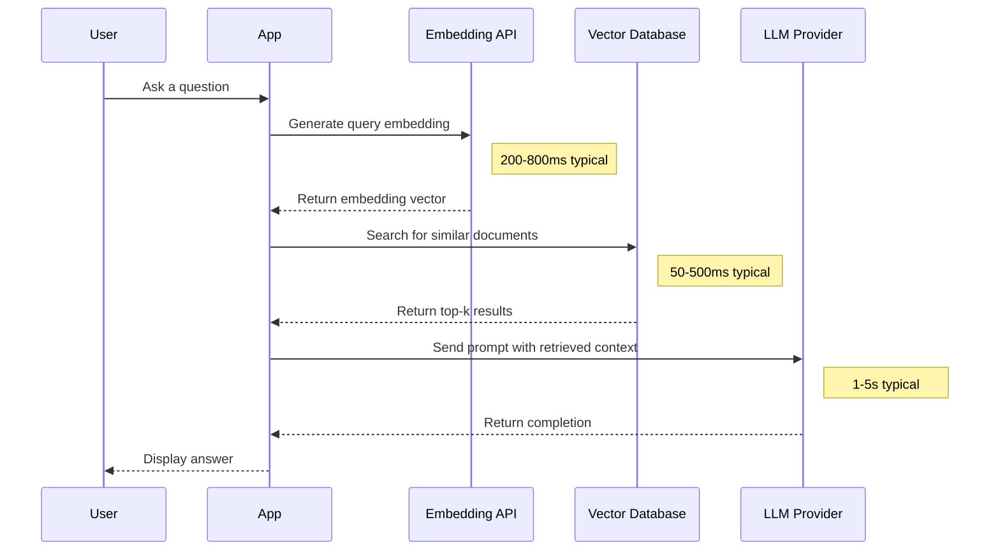
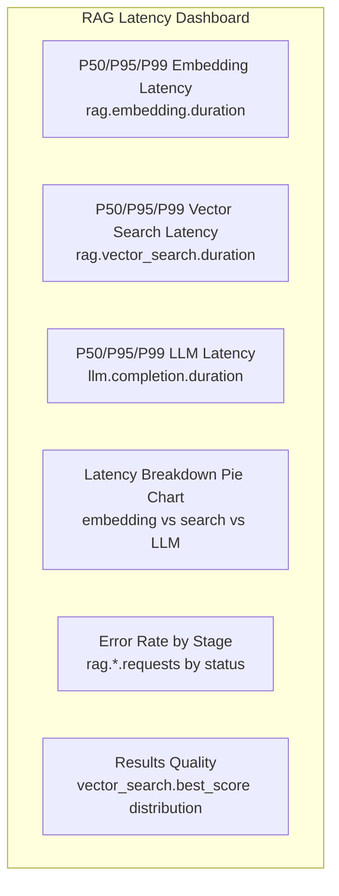

# How to Monitor Embedding Generation and Vector Search Latency with OpenTelemetry

Author: [nawazdhandala](https://www.github.com/nawazdhandala)

Tags: OpenTelemetry, Embeddings, Vector Search, RAG, Performance Monitoring, LLM

Description: A hands-on guide to instrumenting embedding generation and vector search operations with OpenTelemetry to identify latency bottlenecks in RAG pipelines.

---

Retrieval-Augmented Generation (RAG) pipelines have two performance-critical steps that happen before the LLM ever sees a prompt: generating embeddings and searching a vector database. These steps are often the hidden bottleneck. Your LLM call might take 2 seconds, but if embedding generation takes 800ms and the vector search takes another 600ms, you've nearly doubled your total latency before the model even starts thinking.

This guide shows you how to instrument both of these operations with OpenTelemetry so you can measure, track, and optimize them independently.

## The RAG Latency Problem

When users complain that your AI feature is "slow," the LLM call is usually the first suspect. But in a real RAG pipeline, the request goes through several stages, and any of them can be the real bottleneck.



Without individual instrumentation for each step, you only see the total request duration. You can't tell whether that 4-second response time is due to a slow embedding model, a poorly indexed vector database, or the LLM itself.

## Setting Up OpenTelemetry

Let's start with the tracing foundation. We'll configure an OpenTelemetry tracer provider with OTLP export and also set up a histogram metric for tracking latency distributions.

```python
# setup_otel.py - Configure OpenTelemetry with both tracing and metrics
from opentelemetry import trace, metrics
from opentelemetry.sdk.trace import TracerProvider
from opentelemetry.sdk.trace.export import BatchSpanProcessor
from opentelemetry.sdk.metrics import MeterProvider
from opentelemetry.sdk.metrics.export import PeriodicExportingMetricReader
from opentelemetry.exporter.otlp.proto.grpc.trace_exporter import OTLPSpanExporter
from opentelemetry.exporter.otlp.proto.grpc.metric_exporter import OTLPMetricExporter
from opentelemetry.sdk.resources import Resource

def setup_observability(service_name: str):
    """Initialize both tracing and metrics for the RAG pipeline."""
    resource = Resource.create({
        "service.name": service_name,
        "service.version": "1.0.0",
    })

    # Set up tracing
    tracer_provider = TracerProvider(resource=resource)
    tracer_provider.add_span_processor(
        BatchSpanProcessor(OTLPSpanExporter())
    )
    trace.set_tracer_provider(tracer_provider)

    # Set up metrics for latency histograms
    metric_reader = PeriodicExportingMetricReader(
        OTLPMetricExporter(),
        export_interval_millis=10000,  # Export metrics every 10 seconds
    )
    meter_provider = MeterProvider(resource=resource, metric_readers=[metric_reader])
    metrics.set_meter_provider(meter_provider)

    return trace.get_tracer(service_name), metrics.get_meter(service_name)
```

## Instrumenting Embedding Generation

Embedding generation is where your text gets converted into a numerical vector. This step calls an external API (like OpenAI's embeddings endpoint) or runs a local model. Either way, you want to know how long it takes, what model you're using, and how many tokens you're embedding.

```python
# embedding_instrumentation.py - Trace and measure embedding generation
import time
from opentelemetry import trace, metrics

tracer = trace.get_tracer("rag-pipeline")
meter = metrics.get_meter("rag-pipeline")

# Create a histogram to track embedding latency distribution
embedding_latency = meter.create_histogram(
    name="rag.embedding.duration",
    description="Time taken to generate embeddings",
    unit="ms",
)

# Counter for total embedding requests
embedding_requests = meter.create_counter(
    name="rag.embedding.requests",
    description="Total number of embedding requests",
)

def generate_embedding_traced(client, text: str, model: str = "text-embedding-3-small"):
    """Generate an embedding with full OpenTelemetry instrumentation."""

    with tracer.start_as_current_span("embedding.generate") as span:
        # Record the model and input metadata
        span.set_attribute("gen_ai.system", "openai")
        span.set_attribute("gen_ai.request.model", model)
        span.set_attribute("embedding.input_length", len(text))
        span.set_attribute("embedding.input_tokens", len(text.split()))  # Rough estimate

        start_time = time.perf_counter()

        try:
            # Call the embeddings API
            response = client.embeddings.create(
                model=model,
                input=text,
            )

            duration_ms = (time.perf_counter() - start_time) * 1000

            # Record the vector dimensions and actual token usage
            embedding = response.data[0].embedding
            span.set_attribute("embedding.dimensions", len(embedding))
            span.set_attribute("embedding.tokens_used", response.usage.total_tokens)
            span.set_attribute("embedding.duration_ms", duration_ms)

            # Record the metric with labels for aggregation
            embedding_latency.record(
                duration_ms,
                attributes={"model": model, "status": "success"},
            )
            embedding_requests.add(1, attributes={"model": model, "status": "success"})

            return embedding

        except Exception as e:
            duration_ms = (time.perf_counter() - start_time) * 1000
            span.set_attribute("error", True)
            span.set_attribute("error.message", str(e))

            # Still record the metric on failure
            embedding_latency.record(
                duration_ms,
                attributes={"model": model, "status": "error"},
            )
            embedding_requests.add(1, attributes={"model": model, "status": "error"})
            raise
```

## Instrumenting Batch Embeddings

In practice, you'll often embed multiple documents at once during indexing. Batch embedding has different performance characteristics than single-query embedding, so it's worth tracking separately.

```python
# batch_embedding.py - Instrument batch embedding operations for indexing
def generate_batch_embeddings_traced(client, texts: list[str], model: str = "text-embedding-3-small"):
    """Generate embeddings for multiple texts with batch-specific metrics."""

    with tracer.start_as_current_span("embedding.generate_batch") as span:
        span.set_attribute("gen_ai.system", "openai")
        span.set_attribute("gen_ai.request.model", model)
        span.set_attribute("embedding.batch_size", len(texts))
        span.set_attribute("embedding.total_input_length", sum(len(t) for t in texts))

        start_time = time.perf_counter()

        # The OpenAI API accepts a list of inputs for batch embedding
        response = client.embeddings.create(
            model=model,
            input=texts,
        )

        duration_ms = (time.perf_counter() - start_time) * 1000

        # Calculate per-item latency for comparison
        per_item_ms = duration_ms / len(texts) if texts else 0
        span.set_attribute("embedding.duration_ms", duration_ms)
        span.set_attribute("embedding.per_item_ms", per_item_ms)
        span.set_attribute("embedding.tokens_used", response.usage.total_tokens)

        embedding_latency.record(
            duration_ms,
            attributes={"model": model, "status": "success", "operation": "batch"},
        )

        return [item.embedding for item in response.data]
```

## Instrumenting Vector Search

The vector search step queries your database for the most similar documents to the query embedding. Latency here depends on the database engine, index type, number of vectors, and the search parameters you use.

```python
# vector_search_instrumentation.py - Trace vector database queries with full context
import time
from opentelemetry import trace, metrics

tracer = trace.get_tracer("rag-pipeline")
meter = metrics.get_meter("rag-pipeline")

# Histogram for vector search latency
vector_search_latency = meter.create_histogram(
    name="rag.vector_search.duration",
    description="Time taken for vector similarity search",
    unit="ms",
)

# Track the number of results returned
vector_search_results = meter.create_histogram(
    name="rag.vector_search.results_count",
    description="Number of results returned by vector search",
    unit="items",
)

def search_vectors_traced(collection, query_embedding: list[float], top_k: int = 5, filters: dict = None):
    """Search a ChromaDB collection with OpenTelemetry instrumentation."""

    with tracer.start_as_current_span("vector_search.query") as span:
        # Record search parameters
        span.set_attribute("vector_search.db_system", "chromadb")
        span.set_attribute("vector_search.collection", collection.name)
        span.set_attribute("vector_search.top_k", top_k)
        span.set_attribute("vector_search.embedding_dimensions", len(query_embedding))
        span.set_attribute("vector_search.has_filters", filters is not None)

        start_time = time.perf_counter()

        # Execute the vector search
        results = collection.query(
            query_embeddings=[query_embedding],
            n_results=top_k,
            where=filters,
        )

        duration_ms = (time.perf_counter() - start_time) * 1000

        # Record result metadata
        num_results = len(results["ids"][0]) if results["ids"] else 0
        span.set_attribute("vector_search.duration_ms", duration_ms)
        span.set_attribute("vector_search.results_returned", num_results)

        # Record similarity scores if available
        if results.get("distances"):
            distances = results["distances"][0]
            span.set_attribute("vector_search.best_score", min(distances))
            span.set_attribute("vector_search.worst_score", max(distances))

        # Record metrics for dashboarding
        vector_search_latency.record(
            duration_ms,
            attributes={
                "collection": collection.name,
                "top_k": str(top_k),
                "status": "success",
            },
        )
        vector_search_results.record(
            num_results,
            attributes={"collection": collection.name},
        )

        return results
```

## The Complete RAG Pipeline

Now let's put it all together in a complete RAG pipeline where every step is instrumented. The parent span ties everything together so you can see the full picture in a single trace.

```python
# rag_pipeline.py - Fully instrumented RAG pipeline
import openai
from setup_otel import setup_observability
from embedding_instrumentation import generate_embedding_traced
from vector_search_instrumentation import search_vectors_traced
import chromadb

tracer, meter = setup_observability("rag-service")

def rag_query(question: str, collection, openai_client):
    """Execute a full RAG query with end-to-end tracing."""

    # Parent span wraps the entire RAG pipeline
    with tracer.start_as_current_span("rag.pipeline") as pipeline_span:
        pipeline_span.set_attribute("rag.question_length", len(question))

        # Step 1: Generate the query embedding
        query_embedding = generate_embedding_traced(
            openai_client, question, model="text-embedding-3-small"
        )

        # Step 2: Search for relevant documents
        results = search_vectors_traced(collection, query_embedding, top_k=5)

        # Step 3: Build context from retrieved documents
        context_docs = results["documents"][0]
        context = "\n\n".join(context_docs)
        pipeline_span.set_attribute("rag.context_documents", len(context_docs))
        pipeline_span.set_attribute("rag.context_length", len(context))

        # Step 4: Call the LLM with retrieved context
        with tracer.start_as_current_span("llm.completion") as llm_span:
            llm_span.set_attribute("gen_ai.system", "openai")
            llm_span.set_attribute("gen_ai.request.model", "gpt-4")

            response = openai_client.chat.completions.create(
                model="gpt-4",
                messages=[
                    {"role": "system", "content": f"Answer based on this context:\n{context}"},
                    {"role": "user", "content": question},
                ],
            )

            llm_span.set_attribute("gen_ai.usage.input_tokens", response.usage.prompt_tokens)
            llm_span.set_attribute("gen_ai.usage.output_tokens", response.usage.completion_tokens)

            return response.choices[0].message.content
```

## Latency Breakdown Dashboard

With all this telemetry flowing into your backend, you can build a dashboard that shows exactly where time is spent in your RAG pipeline. Here are the key panels to include:



## Optimization Strategies Based on Telemetry

Once you have this data, common optimizations become obvious:

**High embedding latency?** Consider caching embeddings for frequently asked questions. If you see the same (or very similar) queries repeatedly, a cache can eliminate the embedding step entirely.

**High vector search latency?** Check your index configuration. The `top_k` attribute in your spans will tell you if you're retrieving more documents than you need. Reducing `top_k` from 20 to 5 can cut search time significantly.

**Low similarity scores?** If `vector_search.best_score` is consistently poor, you might need a better embedding model or a different chunking strategy for your documents.

**Batch embedding slower than expected?** Compare `embedding.per_item_ms` between batch and single operations. If batching isn't giving you a speedup, your batch sizes might be too large.

## Setting Up Alerts

With these metrics in place, you can create alerts for performance regressions.

```python
# alert_examples.py - Example alert conditions based on RAG telemetry

# Alert: Embedding latency P95 exceeds 500ms
# Query: histogram_quantile(0.95, rag_embedding_duration_bucket{status="success"}) > 500

# Alert: Vector search error rate exceeds 1%
# Query: rate(rag_vector_search_requests{status="error"}[5m]) /
#         rate(rag_vector_search_requests[5m]) > 0.01

# Alert: Average similarity score drops below threshold
# Query: avg(vector_search_best_score) > 0.5  (lower distance = better for cosine)
```

## Conclusion

Monitoring embedding generation and vector search latency separately gives you the visibility you need to optimize RAG pipelines effectively. Without this breakdown, you're stuck guessing which part of the pipeline is slow. With OpenTelemetry instrumentation on each step, you get per-stage latency histograms, error tracking, and quality metrics that tell you exactly where to focus your optimization efforts. The traces connect everything together, so when a specific user query is slow, you can drill down into the exact embedding call and vector search that caused it.
