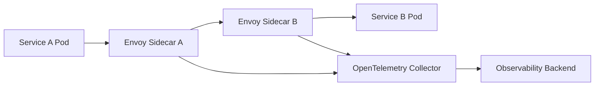
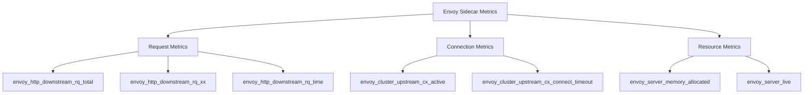
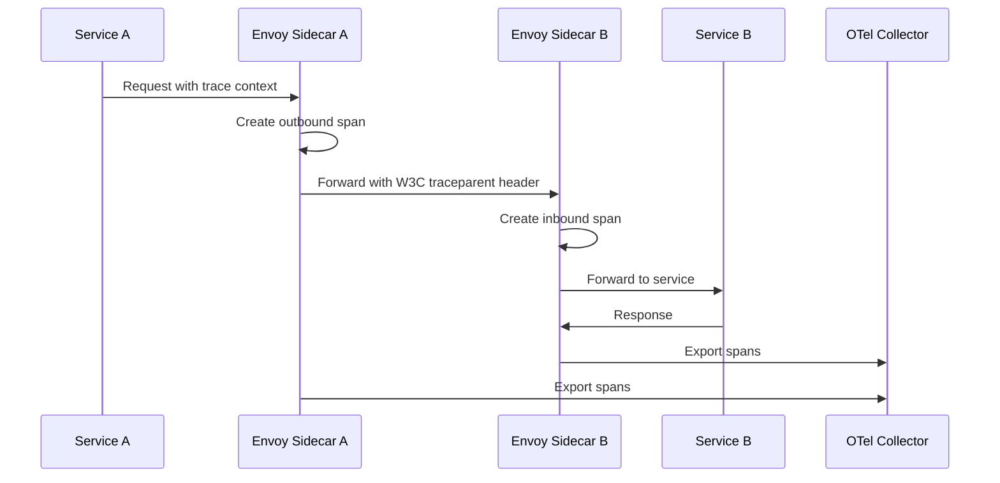

# How to Monitor Envoy Service Mesh Sidecar Performance with OpenTelemetry

Author: [nawazdhandala](https://www.github.com/nawazdhandala)

Tags: OpenTelemetry, Envoy, Service Mesh, Kubernetes, Observability, Istio

Description: Learn how to monitor Envoy service mesh sidecar proxy performance using OpenTelemetry for distributed tracing, metrics, and full observability.

---

If you're running a service mesh in production, Envoy sidecars are probably handling most of your inter-service traffic. Every request between your microservices passes through these proxies, which makes them one of the most important components to monitor. When an Envoy sidecar starts misbehaving or consuming too many resources, it can cascade into performance problems across your entire cluster.

In this guide, we'll walk through how to set up comprehensive monitoring for Envoy sidecars using OpenTelemetry. You'll learn how to collect traces, metrics, and logs from Envoy and pipe them into the OpenTelemetry Collector for processing and export.

## Understanding Envoy's Role in a Service Mesh

Before diving into configuration, it helps to understand what we're actually monitoring. In a service mesh like Istio, every pod gets an Envoy sidecar container injected alongside your application container. This sidecar intercepts all inbound and outbound network traffic.



The sidecar handles TLS termination, load balancing, retries, circuit breaking, and traffic routing. Because it sits in the critical path for every request, even small performance issues can have a big impact.

## Configuring Envoy to Emit OpenTelemetry Traces

Envoy has native support for OpenTelemetry tracing. You can configure it to send spans directly to an OpenTelemetry Collector using the OTLP gRPC exporter. If you're using Istio, you'll configure this through the Istio mesh configuration rather than editing Envoy configs directly.

Here's how to configure Istio's mesh to send traces to your OpenTelemetry Collector.

```yaml
# istio-mesh-config.yaml
# Configure Istio to send Envoy traces via OpenTelemetry protocol
apiVersion: install.istio.io/v1alpha1
kind: IstioOperator
spec:
  meshConfig:
    # Enable distributed tracing across the mesh
    enableTracing: true
    defaultConfig:
      tracing:
        # Sample 10% of requests in production (adjust based on traffic volume)
        sampling: 10.0
        openCensusAgent:
          address: "otel-collector.observability.svc.cluster.local:4317"
    extensionProviders:
      - name: otel-tracing
        opentelemetry:
          # Point to the OpenTelemetry Collector service in your cluster
          service: otel-collector.observability.svc.cluster.local
          port: 4317
```

For newer versions of Istio (1.19+), you can use the Telemetry API for more granular control over which workloads send traces and at what sampling rate.

```yaml
# telemetry-config.yaml
# Use Istio's Telemetry API for fine-grained trace control
apiVersion: telemetry.istio.io/v1alpha1
kind: Telemetry
metadata:
  name: mesh-tracing
  namespace: istio-system
spec:
  tracing:
    - providers:
        - name: otel-tracing
      # Randomized sampling at 10% keeps overhead manageable
      randomSamplingPercentage: 10.0
      customTags:
        # Add the mesh ID as a custom tag to every span
        mesh_id:
          literal:
            value: "production-mesh"
```

## Setting Up the OpenTelemetry Collector

The OpenTelemetry Collector acts as the central hub for receiving telemetry from all your Envoy sidecars. You'll want to deploy it as a service within your Kubernetes cluster so the sidecars can reach it easily.

This collector config receives OTLP data from Envoy, processes it with batching for efficiency, and exports to your backend.

```yaml
# otel-collector-config.yaml
# OpenTelemetry Collector configuration for Envoy sidecar telemetry
receivers:
  otlp:
    protocols:
      grpc:
        # Listen on port 4317 for gRPC OTLP data from Envoy sidecars
        endpoint: 0.0.0.0:4317
      http:
        # Also accept HTTP OTLP for flexibility
        endpoint: 0.0.0.0:4318

  # Scrape Envoy's Prometheus metrics endpoint for sidecar performance data
  prometheus:
    config:
      scrape_configs:
        - job_name: 'envoy-sidecars'
          # Use Kubernetes service discovery to find all Envoy sidecars
          kubernetes_sd_configs:
            - role: pod
          relabel_configs:
            # Only scrape pods that have the Istio sidecar annotation
            - source_labels: [__meta_kubernetes_pod_annotation_sidecar_istio_io_status]
              action: keep
              regex: '.*'
            # Scrape the Envoy admin stats port
            - source_labels: [__address__]
              action: replace
              target_label: __address__
              regex: (.+):(\d+)
              replacement: $1:15090

processors:
  # Batch spans and metrics to reduce export overhead
  batch:
    timeout: 5s
    send_batch_size: 1024

  # Add Kubernetes metadata to all telemetry signals
  k8s_attributes:
    extract:
      metadata:
        - k8s.pod.name
        - k8s.namespace.name
        - k8s.deployment.name
        - k8s.node.name

  # Filter out health check noise that would clutter your dashboards
  filter:
    traces:
      span:
        - 'attributes["http.url"] == "/healthz"'
        - 'attributes["http.url"] == "/readyz"'

exporters:
  otlp:
    # Send processed telemetry to your observability backend
    endpoint: "your-backend:4317"
    tls:
      insecure: false

service:
  pipelines:
    traces:
      receivers: [otlp]
      processors: [k8s_attributes, filter, batch]
      exporters: [otlp]
    metrics:
      receivers: [prometheus]
      processors: [k8s_attributes, batch]
      exporters: [otlp]
```

## Key Envoy Metrics to Monitor

Envoy exposes a rich set of metrics. Not all of them matter equally, so here are the ones you should focus on for sidecar performance monitoring.



The most critical metrics fall into three categories. Request metrics tell you about throughput and error rates. Connection metrics reveal problems with upstream connectivity. Resource metrics show whether the sidecar itself is healthy.

Pay close attention to `envoy_http_downstream_rq_time` because it captures the full request duration as seen by the sidecar. If this number starts climbing but your application latency stays flat, the problem is likely in the sidecar or the network, not your code.

## Deploying the Collector on Kubernetes

Here's a Kubernetes deployment manifest for the OpenTelemetry Collector that's tuned for receiving Envoy telemetry.

```yaml
# otel-collector-deployment.yaml
# Deploy the OpenTelemetry Collector as a centralized telemetry receiver
apiVersion: apps/v1
kind: Deployment
metadata:
  name: otel-collector
  namespace: observability
spec:
  replicas: 2
  selector:
    matchLabels:
      app: otel-collector
  template:
    metadata:
      labels:
        app: otel-collector
    spec:
      containers:
        - name: collector
          image: otel/opentelemetry-collector-contrib:0.96.0
          # Mount the collector config we defined earlier
          args: ["--config=/etc/otel/config.yaml"]
          ports:
            - containerPort: 4317  # gRPC OTLP receiver
            - containerPort: 4318  # HTTP OTLP receiver
          resources:
            requests:
              memory: "256Mi"
              cpu: "200m"
            limits:
              memory: "512Mi"
              cpu: "500m"
          volumeMounts:
            - name: config
              mountPath: /etc/otel
      volumes:
        - name: config
          configMap:
            name: otel-collector-config
---
# Expose the collector as a ClusterIP service for Envoy sidecars to reach
apiVersion: v1
kind: Service
metadata:
  name: otel-collector
  namespace: observability
spec:
  selector:
    app: otel-collector
  ports:
    - name: otlp-grpc
      port: 4317
      targetPort: 4317
    - name: otlp-http
      port: 4318
      targetPort: 4318
```

## Monitoring Sidecar Resource Usage

Beyond request-level metrics, you should track how much CPU and memory each Envoy sidecar consumes. Sidecars that are resource-starved will start dropping connections or adding latency.

You can use the OpenTelemetry Collector's host metrics receiver alongside Kubernetes metrics to build this picture. But a simpler approach is to query the Envoy admin interface directly for its internal stats.

Here's a script that queries the Envoy admin API and pushes the data to the OpenTelemetry Collector using OTLP.

```python
# envoy_sidecar_monitor.py
# Collects Envoy sidecar stats and sends them as OpenTelemetry metrics
import requests
from opentelemetry import metrics
from opentelemetry.sdk.metrics import MeterProvider
from opentelemetry.sdk.metrics.export import PeriodicExportingMetricReader
from opentelemetry.exporter.otlp.proto.grpc.metric_exporter import OTLPMetricExporter

# Set up the OTLP exporter pointing to our collector
exporter = OTLPMetricExporter(endpoint="otel-collector.observability:4317", insecure=True)
reader = PeriodicExportingMetricReader(exporter, export_interval_millis=30000)
provider = MeterProvider(metric_readers=[reader])
metrics.set_meter_provider(provider)

# Create a meter for Envoy sidecar metrics
meter = metrics.get_meter("envoy.sidecar.monitor")

# Define gauges for the key sidecar resource metrics
memory_gauge = meter.create_gauge(
    name="envoy.sidecar.memory.allocated",
    description="Memory allocated by the Envoy sidecar in bytes",
    unit="bytes"
)

active_connections = meter.create_gauge(
    name="envoy.sidecar.connections.active",
    description="Number of active connections on the sidecar",
    unit="connections"
)

def collect_envoy_stats(admin_url="http://localhost:15000"):
    """Fetch stats from the Envoy admin interface and record as OTel metrics."""
    # Query the Envoy stats endpoint in JSON format
    response = requests.get(f"{admin_url}/stats?format=json")
    stats = response.json()

    for stat in stats.get("stats", []):
        name = stat["name"]
        value = stat["value"]

        # Track memory allocation of the sidecar
        if name == "server.memory_allocated":
            memory_gauge.set(value, {"source": "envoy_admin"})

        # Track active upstream connections
        if name == "cluster.upstream_cx_active":
            active_connections.set(value, {"source": "envoy_admin"})

if __name__ == "__main__":
    import time
    # Poll Envoy stats every 30 seconds
    while True:
        collect_envoy_stats()
        time.sleep(30)
```

## Understanding Trace Context Propagation

One of the biggest benefits of monitoring Envoy with OpenTelemetry is getting end-to-end trace context propagation across your service mesh. When Service A calls Service B, the Envoy sidecars automatically propagate the W3C Trace Context headers, so you get a single trace that spans both services.



Make sure your services also propagate the `traceparent` and `tracestate` headers. If your application code doesn't forward these headers, you'll end up with broken traces that show Envoy-to-Envoy hops but not the full picture.

## Alerting on Sidecar Performance

Once you have metrics flowing, set up alerts for conditions that indicate sidecar problems. Here are the thresholds that work well in practice:

- **High error rate**: Alert when the 5xx response ratio exceeds 1% over a 5-minute window. This usually means an upstream service is failing, but it could also indicate sidecar misconfiguration.
- **Elevated latency**: Alert when the p99 request duration through the sidecar exceeds your SLO. For most services, adding more than 5ms of sidecar overhead is worth investigating.
- **Memory pressure**: Alert when `server.memory_allocated` exceeds 80% of the sidecar's memory limit. Envoy doesn't handle OOM kills gracefully.
- **Connection pool exhaustion**: Alert when `upstream_cx_active` approaches `upstream_cx_max`. This means the sidecar can't open new connections to upstream services.

## Wrapping Up

Monitoring Envoy sidecars with OpenTelemetry gives you deep visibility into the network layer of your service mesh. By combining traces for request-level debugging with metrics for aggregate performance analysis, you can quickly identify whether problems originate in your application code, the sidecar proxy, or the network.

Start with tracing to get end-to-end visibility, then layer on Prometheus metrics scraping for resource monitoring. The OpenTelemetry Collector's processing pipeline lets you enrich, filter, and route all this data efficiently before it hits your backend. With the setup described here, you'll have the telemetry you need to keep your service mesh running smoothly.
