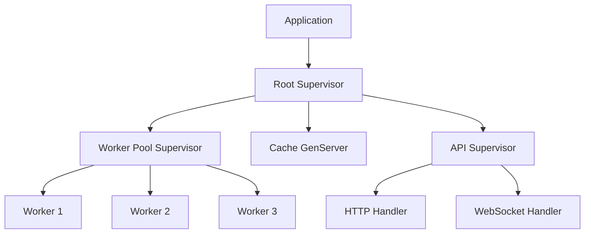

# How to Monitor Erlang/OTP Applications with OpenTelemetry

Author: [nawazdhandala](https://www.github.com/nawazdhandala)

Tags: OpenTelemetry, Erlang, OTP, BEAM, Monitoring, Tracing

Description: Implement comprehensive OpenTelemetry monitoring for Erlang/OTP applications to gain visibility into process supervision, message passing, and BEAM VM metrics.

Erlang/OTP applications built on the BEAM virtual machine offer exceptional fault tolerance and concurrency through their actor model and supervision trees. However, the very features that make OTP applications resilient also make them challenging to observe. Thousands of processes communicating through message passing create complex interaction patterns that traditional monitoring approaches struggle to capture. OpenTelemetry provides the observability infrastructure needed to understand OTP application behavior.

## Why Monitor OTP Applications

OTP applications are fundamentally different from applications built on traditional threading models. The BEAM scheduler manages process execution, supervision trees automatically restart failed processes, and message passing happens asynchronously. This architecture demands monitoring that understands OTP's unique characteristics.

When an OTP application experiences issues, you need to answer questions like: Which supervisor tree is experiencing high restart rates? Are message queues building up in specific processes? Is the BEAM scheduler balanced across cores? How long do synchronous calls to GenServers take? OpenTelemetry's metrics and tracing provide answers to these questions.

## Understanding BEAM VM Metrics

The BEAM VM exposes runtime information through several mechanisms. Understanding these metrics is essential for effective monitoring:

**Process Metrics**: Total process count, process creation/destruction rate, message queue lengths, reductions (computational work units), memory usage per process.

**Scheduler Metrics**: Scheduler utilization, run queue lengths, context switches, time spent in garbage collection.

**Memory Metrics**: Total memory usage, process memory, binary memory, atom table size, ETS table memory.

**Distribution Metrics**: Connected nodes, distribution buffer usage, network traffic between nodes.

## Setting Up OpenTelemetry in Erlang

Add OpenTelemetry dependencies to your `rebar.config`:

```erlang
{deps, [
    {opentelemetry_api, "~> 1.2"},
    {opentelemetry, "~> 1.3"},
    {opentelemetry_exporter, "~> 1.6"}
]}.
```

Configure OpenTelemetry in your `sys.config`:

```erlang
[
    {opentelemetry, [
        {resource, [
            {service, #{
                name => "my-erlang-app",
                version => "1.0.0"
            }},
            {deployment, #{
                environment => "production"
            }}
        ]},
        {traces_exporter, otlp},
        {span_processor, batch}
    ]},
    {opentelemetry_exporter, [
        {otlp_protocol, http_protobuf},
        {otlp_endpoint, "http://localhost:4318"}
    ]}
].
```

## Instrumenting GenServers

GenServers are the building blocks of OTP applications. Instrument them to understand callback execution and message handling:

```erlang
-module(user_cache).
-behaviour(gen_server).

%% API
-export([start_link/1, get_user/1, put_user/2]).

%% gen_server callbacks
-export([init/1, handle_call/3, handle_cast/2, handle_info/2, terminate/2]).

-include_lib("opentelemetry_api/include/otel_tracer.hrl").

%%% API

start_link(Opts) ->
    gen_server:start_link({local, ?MODULE}, ?MODULE, Opts, []).

get_user(UserId) ->
    %% Start a span for the client-side call
    ?with_span(<<"user_cache.get_user">>, #{
        attributes => #{
            <<"user_id">> => UserId,
            <<"call_type">> => <<"sync">>
        }
    }, fun(_SpanCtx) ->
        gen_server:call(?MODULE, {get_user, UserId})
    end).

put_user(UserId, UserData) ->
    ?with_span(<<"user_cache.put_user">>, #{
        attributes => #{
            <<"user_id">> => UserId,
            <<"call_type">> => <<"async">>
        }
    }, fun(_SpanCtx) ->
        gen_server:cast(?MODULE, {put_user, UserId, UserData})
    end).

%%% gen_server callbacks

init(Opts) ->
    ?with_span(<<"user_cache.init">>, #{}, fun(_SpanCtx) ->
        %% Initialize ETS table for caching
        Tid = ets:new(user_cache_table, [set, private]),
        Ttl = proplists:get_value(ttl, Opts, 3600),

        ?set_attributes(#{
            <<"cache_ttl">> => Ttl,
            <<"storage">> => <<"ets">>
        }),

        {ok, #{table => Tid, ttl => Ttl}}
    end).

handle_call({get_user, UserId}, _From, State) ->
    ?with_span(<<"user_cache.handle_call.get_user">>, #{
        attributes => #{
            <<"user_id">> => UserId
        }
    }, fun(_SpanCtx) ->
        #{table := Tid} = State,

        case ets:lookup(Tid, UserId) of
            [{UserId, UserData, _ExpiresAt}] ->
                ?add_event(<<"cache_hit">>, #{<<"user_id">> => UserId}),
                {reply, {ok, UserData}, State};

            [] ->
                ?add_event(<<"cache_miss">>, #{<<"user_id">> => UserId}),

                %% Fetch from database
                case fetch_user_from_db(UserId) of
                    {ok, UserData} ->
                        ExpiresAt = erlang:system_time(second) + maps:get(ttl, State),
                        ets:insert(Tid, {UserId, UserData, ExpiresAt}),
                        {reply, {ok, UserData}, State};

                    {error, not_found} ->
                        {reply, {error, not_found}, State}
                end
        end
    end).

handle_cast({put_user, UserId, UserData}, State) ->
    ?with_span(<<"user_cache.handle_cast.put_user">>, #{
        attributes => #{
            <<"user_id">> => UserId
        }
    }, fun(_SpanCtx) ->
        #{table := Tid, ttl := Ttl} = State,
        ExpiresAt = erlang:system_time(second) + Ttl,
        ets:insert(Tid, {UserId, UserData, ExpiresAt}),
        ?add_event(<<"cache_updated">>, #{<<"user_id">> => UserId}),
        {noreply, State}
    end).

handle_info({cleanup_expired}, State) ->
    ?with_span(<<"user_cache.cleanup_expired">>, #{}, fun(_SpanCtx) ->
        #{table := Tid} = State,
        Now = erlang:system_time(second),

        %% Remove expired entries
        Expired = ets:select(Tid, [{{'$1', '$2', '$3'}, [{'<', '$3', Now}], ['$1']}]),
        lists:foreach(fun(Key) -> ets:delete(Tid, Key) end, Expired),

        ?set_attributes(#{
            <<"expired_count">> => length(Expired)
        }),

        %% Schedule next cleanup
        erlang:send_after(60000, self(), {cleanup_expired}),
        {noreply, State}
    end).

terminate(Reason, State) ->
    ?with_span(<<"user_cache.terminate">>, #{
        attributes => #{
            <<"reason">> => iolist_to_binary(io_lib:format("~p", [Reason]))
        }
    }, fun(_SpanCtx) ->
        #{table := Tid} = State,
        ets:delete(Tid),
        ok
    end).

%%% Internal functions

fetch_user_from_db(UserId) ->
    ?with_span(<<"user_cache.fetch_from_db">>, #{
        attributes => #{
            <<"user_id">> => UserId
        }
    }, fun(_SpanCtx) ->
        %% Simulate database fetch
        timer:sleep(10),
        {ok, #{id => UserId, name => <<"User ", (integer_to_binary(UserId))/binary>>}}
    end).
```

## Monitoring Supervision Trees

Supervision trees are fundamental to OTP's fault tolerance. Monitor supervisor behavior to understand restart patterns:

```erlang
-module(monitored_supervisor).
-behaviour(supervisor).

-export([start_link/0, init/1]).
-include_lib("opentelemetry_api/include/otel_tracer.hrl").

start_link() ->
    supervisor:start_link({local, ?MODULE}, ?MODULE, []).

init([]) ->
    ?with_span(<<"supervisor.init">>, #{
        attributes => #{
            <<"supervisor">> => <<"monitored_supervisor">>,
            <<"strategy">> => <<"one_for_one">>
        }
    }, fun(_SpanCtx) ->
        %% Configure child specifications
        ChildSpecs = [
            #{
                id => worker_1,
                start => {worker_module, start_link, [worker_1]},
                restart => permanent,
                shutdown => 5000,
                type => worker,
                modules => [worker_module]
            },
            #{
                id => worker_2,
                start => {worker_module, start_link, [worker_2]},
                restart => permanent,
                shutdown => 5000,
                type => worker,
                modules => [worker_module]
            }
        ],

        SupFlags = #{
            strategy => one_for_one,
            intensity => 3,
            period => 60
        },

        ?set_attributes(#{
            <<"child_count">> => length(ChildSpecs),
            <<"max_restarts">> => 3,
            <<"restart_period">> => 60
        }),

        {ok, {SupFlags, ChildSpecs}}
    end).
```

Create a custom event handler to track supervisor events:

```erlang
-module(supervisor_telemetry).
-behaviour(gen_event).

-export([init/1, handle_event/2, handle_call/2, handle_info/2, terminate/2]).
-include_lib("opentelemetry_api/include/otel_tracer.hrl").

init(_Args) ->
    {ok, #{}}.

handle_event({supervisor_report, Report}, State) ->
    %% Extract supervisor report details
    Supervisor = proplists:get_value(supervisor, Report),
    Context = proplists:get_value(context, Report),
    Reason = proplists:get_value(reason, Report),
    Offender = proplists:get_value(offender, Report),

    %% Create a span for the supervisor event
    ?with_span(<<"supervisor.child_event">>, #{
        attributes => #{
            <<"supervisor">> => format_name(Supervisor),
            <<"context">> => atom_to_binary(Context, utf8),
            <<"reason">> => format_term(Reason),
            <<"child_id">> => get_child_id(Offender)
        }
    }, fun(_SpanCtx) ->
        case Context of
            child_terminated ->
                ?add_event(<<"child_terminated">>, #{
                    <<"exit_reason">> => format_term(Reason)
                });
            start_error ->
                ?set_status('ERROR', <<"Child start failed">>);
            _ ->
                ok
        end
    end),

    {ok, State};

handle_event(_Event, State) ->
    {ok, State}.

handle_call(_Request, State) ->
    {ok, ok, State}.

handle_info(_Info, State) ->
    {ok, State}.

terminate(_Reason, _State) ->
    ok.

%%% Helper functions

format_name(Name) when is_atom(Name) ->
    atom_to_binary(Name, utf8);
format_name(Name) when is_pid(Name) ->
    list_to_binary(pid_to_list(Name));
format_name(Name) ->
    iolist_to_binary(io_lib:format("~p", [Name])).

format_term(Term) ->
    iolist_to_binary(io_lib:format("~p", [Term])).

get_child_id(Offender) ->
    case proplists:get_value(id, Offender) of
        undefined -> <<"unknown">>;
        Id when is_atom(Id) -> atom_to_binary(Id, utf8);
        Id -> format_term(Id)
    end.
```

Install the event handler in your application:

```erlang
-module(my_app).
-behaviour(application).

-export([start/2, stop/1]).

start(_Type, _Args) ->
    %% Attach supervisor event handler
    error_logger:add_report_handler(supervisor_telemetry),

    %% Start application supervisor
    my_app_sup:start_link().

stop(_State) ->
    error_logger:delete_report_handler(supervisor_telemetry),
    ok.
```

## Collecting BEAM VM Metrics

Create a metrics collector that periodically gathers BEAM runtime information:

```erlang
-module(beam_metrics_collector).
-behaviour(gen_server).

-export([start_link/0]).
-export([init/1, handle_call/3, handle_cast/2, handle_info/2]).

-include_lib("opentelemetry_api/include/otel_tracer.hrl").

-define(COLLECTION_INTERVAL, 10000). %% 10 seconds

start_link() ->
    gen_server:start_link({local, ?MODULE}, ?MODULE, [], []).

init([]) ->
    %% Schedule first metrics collection
    erlang:send_after(?COLLECTION_INTERVAL, self(), collect_metrics),
    {ok, #{}}.

handle_call(_Request, _From, State) ->
    {reply, ok, State}.

handle_cast(_Msg, State) ->
    {noreply, State}.

handle_info(collect_metrics, State) ->
    %% Collect and report metrics
    collect_process_metrics(),
    collect_memory_metrics(),
    collect_scheduler_metrics(),
    collect_distribution_metrics(),

    %% Schedule next collection
    erlang:send_after(?COLLECTION_INTERVAL, self(), collect_metrics),
    {noreply, State}.

%%% Metrics collection functions

collect_process_metrics() ->
    ProcessCount = erlang:system_info(process_count),
    ProcessLimit = erlang:system_info(process_limit),

    %% Get processes with large message queues
    LargeQueues = lists:filter(fun(Pid) ->
        case process_info(Pid, message_queue_len) of
            {message_queue_len, Len} when Len > 1000 -> true;
            _ -> false
        end
    end, processes()),

    %% Record metrics
    record_gauge(<<"beam.process.count">>, ProcessCount, #{
        <<"limit">> => ProcessLimit
    }),

    record_gauge(<<"beam.process.large_queues">>, length(LargeQueues), #{}).

collect_memory_metrics() ->
    MemoryInfo = erlang:memory(),

    lists:foreach(fun({Type, Bytes}) ->
        TypeBin = atom_to_binary(Type, utf8),
        record_gauge(<<"beam.memory.", TypeBin/binary>>, Bytes, #{
            <<"unit">> => <<"bytes">>
        })
    end, MemoryInfo).

collect_scheduler_metrics() ->
    SchedulerCount = erlang:system_info(schedulers_online),
    SchedulerUtilization = lists:sum([U || {_, U, _} <- statistics(scheduler_wall_time)]) / SchedulerCount,

    record_gauge(<<"beam.scheduler.count">>, SchedulerCount, #{}),
    record_gauge(<<"beam.scheduler.utilization">>, SchedulerUtilization, #{}).

collect_distribution_metrics() ->
    Nodes = erlang:nodes(),
    NodeCount = length(Nodes),

    record_gauge(<<"beam.distribution.nodes">>, NodeCount, #{}),

    %% Collect metrics per connected node
    lists:foreach(fun(Node) ->
        NodeBin = atom_to_binary(Node, utf8),

        %% Get distribution buffer sizes
        case erlang:dist_ctrl_get_data_notification(Node) of
            {ok, BufferSize} ->
                record_gauge(<<"beam.distribution.buffer_size">>, BufferSize, #{
                    <<"node">> => NodeBin
                });
            _ ->
                ok
        end
    end, Nodes).

%%% Helper functions for recording metrics

record_gauge(Name, Value, Attributes) ->
    %% Record metric using OpenTelemetry metrics API
    ?with_span(<<"metrics.record">>, #{
        attributes => maps:merge(#{
            <<"metric_name">> => Name,
            <<"metric_value">> => Value
        }, Attributes)
    }, fun(_SpanCtx) ->
        %% In a real implementation, use proper metrics API
        ok
    end).
```

## Tracing Distributed OTP Applications

For distributed Erlang applications running across multiple nodes, propagate trace context:

```erlang
-module(distributed_worker).
-behaviour(gen_server).

-export([start_link/1, process_remote/2]).
-export([init/1, handle_call/3, handle_cast/2]).

-include_lib("opentelemetry_api/include/otel_tracer.hrl").

start_link(Node) ->
    gen_server:start_link({local, ?MODULE}, ?MODULE, [Node], []).

%% Process work on a remote node
process_remote(Node, WorkData) ->
    ?with_span(<<"distributed.process_remote">>, #{
        attributes => #{
            <<"target_node">> => atom_to_binary(Node, utf8),
            <<"local_node">> => atom_to_binary(node(), utf8)
        }
    }, fun(SpanCtx) ->
        %% Serialize trace context for remote call
        TraceContext = serialize_span_context(SpanCtx),

        %% Make remote call with trace context
        case rpc:call(Node, ?MODULE, process_work, [WorkData, TraceContext]) of
            {ok, Result} ->
                ?set_status('OK'),
                {ok, Result};

            {error, Reason} ->
                ?set_status('ERROR', format_term(Reason)),
                {error, Reason};

            {badrpc, Reason} ->
                ?set_status('ERROR', <<"RPC failed">>),
                ?add_event(<<"rpc_failure">>, #{
                    <<"reason">> => format_term(Reason)
                }),
                {error, {badrpc, Reason}}
        end
    end).

%% Remote function that processes work
process_work(WorkData, TraceContext) ->
    %% Restore trace context on remote node
    SpanCtx = deserialize_span_context(TraceContext),
    otel_tracer:set_current_span(SpanCtx),

    ?with_span(<<"distributed.process_work">>, #{
        attributes => #{
            <<"node">> => atom_to_binary(node(), utf8),
            <<"work_size">> => byte_size(term_to_binary(WorkData))
        }
    }, fun(_) ->
        %% Perform actual work
        Result = perform_computation(WorkData),

        ?add_event(<<"work_completed">>, #{
            <<"result_size">> => byte_size(term_to_binary(Result))
        }),

        {ok, Result}
    end).

init([Node]) ->
    {ok, #{node => Node}}.

handle_call(_Request, _From, State) ->
    {reply, ok, State}.

handle_cast(_Msg, State) ->
    {noreply, State}.

%%% Helper functions

serialize_span_context(SpanCtx) ->
    %% Convert span context to a format that can be sent over the wire
    #{
        trace_id => otel_span:trace_id(SpanCtx),
        span_id => otel_span:span_id(SpanCtx),
        trace_flags => otel_span:trace_flags(SpanCtx)
    }.

deserialize_span_context(TraceContext) ->
    %% Reconstruct span context from serialized form
    #{
        trace_id := TraceId,
        span_id := SpanId,
        trace_flags := TraceFlags
    } = TraceContext,

    otel_span:set_span(TraceId, SpanId, TraceFlags).

perform_computation(Data) ->
    %% Simulate computation
    timer:sleep(100),
    {computed, Data}.

format_term(Term) ->
    iolist_to_binary(io_lib:format("~p", [Term])).
```

## Monitoring ETS Tables

ETS tables are commonly used for caching and state management. Monitor their growth and access patterns:

```erlang
-module(ets_monitor).

-export([monitor_tables/0, get_table_stats/1]).
-include_lib("opentelemetry_api/include/otel_tracer.hrl").

monitor_tables() ->
    ?with_span(<<"ets.monitor_all_tables">>, #{}, fun(_SpanCtx) ->
        Tables = ets:all(),

        ?set_attributes(#{
            <<"table_count">> => length(Tables)
        }),

        lists:foreach(fun(Table) ->
            Stats = get_table_stats(Table),
            record_table_metrics(Table, Stats)
        end, Tables)
    end).

get_table_stats(Table) ->
    Info = try
        ets:info(Table)
    catch
        _:_ -> undefined
    end,

    case Info of
        undefined ->
            #{};
        _ ->
            #{
                name => proplists:get_value(name, Info),
                size => proplists:get_value(size, Info),
                memory => proplists:get_value(memory, Info),
                type => proplists:get_value(type, Info),
                owner => proplists:get_value(owner, Info)
            }
    end.

record_table_metrics(Table, Stats) ->
    case maps:get(name, Stats, undefined) of
        undefined ->
            ok;
        Name ->
            NameBin = format_table_name(Name),

            ?with_span(<<"ets.table_metrics">>, #{
                attributes => #{
                    <<"table_name">> => NameBin,
                    <<"table_size">> => maps:get(size, Stats, 0),
                    <<"table_memory_words">> => maps:get(memory, Stats, 0),
                    <<"table_type">> => atom_to_binary(maps:get(type, Stats, set), utf8)
                }
            }, fun(_) -> ok end)
    end.

format_table_name(Name) when is_atom(Name) ->
    atom_to_binary(Name, utf8);
format_table_name(Name) ->
    iolist_to_binary(io_lib:format("~p", [Name])).
```

## Visualizing OTP Application Architecture

OpenTelemetry traces reveal the structure of your OTP application:



Traces show which processes communicate with each other, how supervision trees respond to failures, and where performance bottlenecks exist.

## Best Practices for OTP Monitoring

**Process Naming**: Use registered names for important processes to make traces more readable. Anonymous PIDs are harder to correlate across trace spans.

**Supervision Hierarchy**: Tag spans with supervisor names and levels in the hierarchy. This helps identify which part of your application is experiencing issues.

**Message Queue Monitoring**: Alert on processes with consistently high message queue lengths. This indicates either insufficient processing capacity or a failing process.

**Scheduler Balance**: Monitor per-scheduler run queue lengths. Imbalanced schedulers can indicate scheduling problems or processes bound to specific cores.

**Distribution Health**: For distributed applications, monitor inter-node latency and buffer sizes. Network issues often manifest as increased distribution buffer usage.

**Memory Pressure**: Track memory growth over time, especially binary memory. Memory leaks in Erlang often appear as steadily growing binary memory.

Monitoring Erlang/OTP applications with OpenTelemetry provides deep insight into the BEAM VM and process behavior. You can understand how your supervision trees handle failures, track message passing between processes, and identify performance bottlenecks in your concurrent architecture. This observability is essential for operating reliable, high-performance OTP applications in production.
