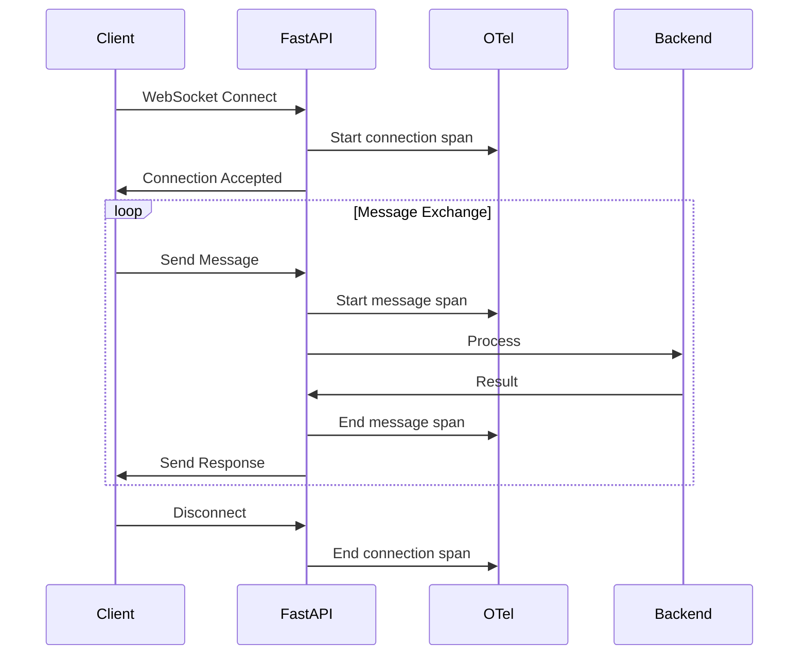
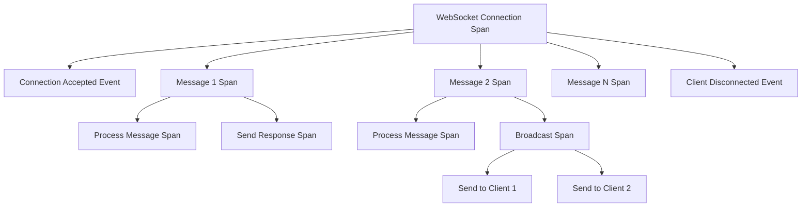

# How to Monitor FastAPI WebSocket Connections with OpenTelemetry

Author: [nawazdhandala](https://www.github.com/nawazdhandala)

Tags: OpenTelemetry, FastAPI, WebSocket, Python, Real-Time, Monitoring

Description: Discover how to instrument FastAPI WebSocket connections with OpenTelemetry for comprehensive monitoring of real-time bidirectional communication.

WebSocket connections present unique monitoring challenges compared to traditional HTTP requests. They're long-lived, bidirectional, and can handle thousands of messages over a single connection. Standard HTTP instrumentation doesn't capture the full picture of WebSocket behavior, so you need specialized tracing strategies to understand connection lifecycle, message flow, and performance characteristics.

The FastAPI instrumentation from OpenTelemetry handles HTTP requests automatically, but WebSocket endpoints require manual instrumentation. You need to track connection establishment, individual message handling, errors, and graceful or abrupt disconnections.

## The WebSocket Monitoring Challenge

Traditional request-response monitoring creates one span per request. WebSocket monitoring needs to track connection duration (potentially hours or days), individual messages (potentially thousands), and connection state changes.



## Basic WebSocket Setup with OpenTelemetry

Start with the standard OpenTelemetry setup for FastAPI, then add WebSocket-specific instrumentation.

```bash
pip install opentelemetry-api \
    opentelemetry-sdk \
    opentelemetry-instrumentation-fastapi \
    opentelemetry-exporter-otlp \
    fastapi \
    uvicorn \
    websockets
```

Initialize OpenTelemetry with a tracer that you'll use for manual WebSocket instrumentation.

```python
from opentelemetry import trace
from opentelemetry.sdk.trace import TracerProvider
from opentelemetry.sdk.trace.export import BatchSpanProcessor
from opentelemetry.exporter.otlp.proto.grpc.trace_exporter import OTLPSpanExporter
from opentelemetry.instrumentation.fastapi import FastAPIInstrumentor
from opentelemetry.trace import SpanKind, Status, StatusCode
from fastapi import FastAPI, WebSocket, WebSocketDisconnect
from typing import Dict, Optional
import json
import time

# Configure OpenTelemetry
provider = TracerProvider()
processor = BatchSpanProcessor(OTLPSpanExporter(
    endpoint="http://localhost:4317",
    insecure=True
))
provider.add_span_processor(processor)
trace.set_tracer_provider(provider)

# Create app and instrument it
app = FastAPI()
FastAPIInstrumentor.instrument_app(app)

# Get tracer for manual instrumentation
tracer = trace.get_tracer(__name__)
```

## Instrumenting WebSocket Connection Lifecycle

The connection span should encompass the entire WebSocket lifecycle from connection to disconnection. This provides high-level metrics like total connection duration and message count.

```python
@app.websocket("/ws/{client_id}")
async def websocket_endpoint(websocket: WebSocket, client_id: str):
    """
    WebSocket endpoint with full OpenTelemetry instrumentation.
    Tracks connection lifecycle and individual messages.
    """
    # Start a span for the entire WebSocket connection
    with tracer.start_as_current_span(
        "websocket_connection",
        kind=SpanKind.SERVER
    ) as connection_span:
        # Set attributes that describe the connection
        connection_span.set_attribute("client.id", client_id)
        connection_span.set_attribute("ws.protocol", "websocket")
        connection_span.set_attribute("net.transport", "ip_tcp")

        # Track connection start time for custom metrics
        connection_start = time.time()

        try:
            # Accept the WebSocket connection
            await websocket.accept()
            connection_span.add_event("connection_accepted")
            connection_span.set_attribute("connection.state", "active")

            # Track message count
            message_count = 0

            # Message handling loop
            while True:
                # Receive message from client
                data = await websocket.receive_text()
                message_count += 1

                # Create a child span for each message
                with tracer.start_as_current_span(
                    "websocket_message",
                    kind=SpanKind.SERVER
                ) as message_span:
                    message_span.set_attribute("message.number", message_count)
                    message_span.set_attribute("message.direction", "inbound")
                    message_span.set_attribute("message.size", len(data))

                    try:
                        # Parse and process the message
                        message_data = json.loads(data)
                        message_span.set_attribute("message.type", message_data.get("type", "unknown"))

                        # Process the message (your business logic here)
                        response = await process_message(client_id, message_data)

                        # Send response back to client
                        await websocket.send_json(response)

                        message_span.set_attribute("message.response_sent", True)
                        message_span.set_status(Status(StatusCode.OK))

                    except json.JSONDecodeError as e:
                        message_span.set_attribute("error.type", "json_decode_error")
                        message_span.record_exception(e)
                        message_span.set_status(Status(StatusCode.ERROR, "Invalid JSON"))

                        await websocket.send_json({
                            "error": "Invalid JSON format"
                        })

                    except Exception as e:
                        message_span.record_exception(e)
                        message_span.set_status(Status(StatusCode.ERROR, str(e)))
                        raise

        except WebSocketDisconnect:
            # Client disconnected normally
            connection_span.add_event("client_disconnected")
            connection_span.set_attribute("disconnect.reason", "client_initiated")
            connection_span.set_status(Status(StatusCode.OK))

        except Exception as e:
            # Connection error
            connection_span.add_event("connection_error")
            connection_span.record_exception(e)
            connection_span.set_status(Status(StatusCode.ERROR, str(e)))
            raise

        finally:
            # Record final connection metrics
            connection_duration = time.time() - connection_start
            connection_span.set_attribute("connection.duration_seconds", connection_duration)
            connection_span.set_attribute("connection.message_count", message_count)
            connection_span.set_attribute("connection.messages_per_second",
                                         message_count / connection_duration if connection_duration > 0 else 0)


async def process_message(client_id: str, message_data: dict) -> dict:
    """
    Process an incoming WebSocket message.
    Creates child spans for different processing steps.
    """
    with tracer.start_as_current_span("process_websocket_message") as span:
        span.set_attribute("client.id", client_id)
        span.set_attribute("message.type", message_data.get("type"))

        message_type = message_data.get("type")

        if message_type == "ping":
            return {"type": "pong", "timestamp": time.time()}

        elif message_type == "data_request":
            # Simulate data fetching
            with tracer.start_as_current_span("fetch_data") as fetch_span:
                fetch_span.set_attribute("data.type", message_data.get("data_type"))
                # Simulate database query
                time.sleep(0.1)
                data = {"result": "sample_data"}

            return {"type": "data_response", "data": data}

        elif message_type == "subscribe":
            # Handle subscription
            with tracer.start_as_current_span("handle_subscription") as sub_span:
                topic = message_data.get("topic")
                sub_span.set_attribute("subscription.topic", topic)
                # Your subscription logic here

            return {"type": "subscribed", "topic": topic}

        else:
            span.set_attribute("message.unknown", True)
            return {"type": "error", "message": "Unknown message type"}
```

## Managing Multiple Concurrent Connections

Real applications handle multiple WebSocket connections simultaneously. You need to track connections and potentially aggregate metrics across all active connections.

```python
from typing import Set
import asyncio

class ConnectionManager:
    """
    Manages multiple WebSocket connections with OpenTelemetry instrumentation.
    Tracks active connections and broadcasts messages.
    """

    def __init__(self):
        # Store active connections
        self.active_connections: Dict[str, WebSocket] = {}
        # Track connection metadata
        self.connection_metadata: Dict[str, dict] = {}

    async def connect(self, client_id: str, websocket: WebSocket):
        """Accept and register a new WebSocket connection."""
        with tracer.start_as_current_span("connection_manager.connect") as span:
            span.set_attribute("client.id", client_id)
            span.set_attribute("active_connections.before", len(self.active_connections))

            await websocket.accept()
            self.active_connections[client_id] = websocket
            self.connection_metadata[client_id] = {
                "connected_at": time.time(),
                "message_count": 0
            }

            span.set_attribute("active_connections.after", len(self.active_connections))
            span.add_event("connection_registered")

    def disconnect(self, client_id: str):
        """Remove a WebSocket connection."""
        with tracer.start_as_current_span("connection_manager.disconnect") as span:
            span.set_attribute("client.id", client_id)

            if client_id in self.active_connections:
                del self.active_connections[client_id]

                # Record final metrics for this connection
                if client_id in self.connection_metadata:
                    metadata = self.connection_metadata[client_id]
                    duration = time.time() - metadata["connected_at"]
                    span.set_attribute("connection.duration_seconds", duration)
                    span.set_attribute("connection.total_messages", metadata["message_count"])
                    del self.connection_metadata[client_id]

            span.set_attribute("active_connections.remaining", len(self.active_connections))

    async def send_personal_message(self, message: dict, client_id: str):
        """Send a message to a specific client."""
        with tracer.start_as_current_span("send_personal_message") as span:
            span.set_attribute("client.id", client_id)
            span.set_attribute("message.type", message.get("type", "unknown"))

            if client_id in self.active_connections:
                websocket = self.active_connections[client_id]
                await websocket.send_json(message)
                span.set_attribute("message.sent", True)
            else:
                span.set_attribute("message.sent", False)
                span.set_attribute("error", "client_not_connected")

    async def broadcast(self, message: dict, exclude: Optional[Set[str]] = None):
        """
        Broadcast a message to all connected clients.
        Optionally exclude specific client IDs.
        """
        with tracer.start_as_current_span("broadcast_message") as span:
            exclude = exclude or set()
            recipients = [cid for cid in self.active_connections.keys() if cid not in exclude]

            span.set_attribute("broadcast.total_connections", len(self.active_connections))
            span.set_attribute("broadcast.recipients", len(recipients))
            span.set_attribute("message.type", message.get("type", "unknown"))

            # Send to all recipients
            send_tasks = []
            for client_id in recipients:
                websocket = self.active_connections[client_id]
                send_tasks.append(websocket.send_json(message))

            # Wait for all sends to complete
            await asyncio.gather(*send_tasks, return_exceptions=True)
            span.add_event("broadcast_completed")


# Create a global connection manager
manager = ConnectionManager()


@app.websocket("/ws/chat/{client_id}")
async def chat_websocket(websocket: WebSocket, client_id: str):
    """
    Chat WebSocket endpoint using the connection manager.
    Demonstrates multi-client communication with tracing.
    """
    with tracer.start_as_current_span(
        "chat_websocket_connection",
        kind=SpanKind.SERVER
    ) as connection_span:
        connection_span.set_attribute("client.id", client_id)

        try:
            # Register the connection
            await manager.connect(client_id, websocket)
            connection_span.add_event("connection_established")

            # Notify others that user joined
            await manager.broadcast({
                "type": "user_joined",
                "client_id": client_id,
                "timestamp": time.time()
            }, exclude={client_id})

            # Message loop
            while True:
                data = await websocket.receive_text()

                with tracer.start_as_current_span("handle_chat_message") as msg_span:
                    msg_span.set_attribute("sender.id", client_id)

                    try:
                        message = json.loads(data)
                        msg_span.set_attribute("message.type", message.get("type"))

                        # Update message count
                        if client_id in manager.connection_metadata:
                            manager.connection_metadata[client_id]["message_count"] += 1

                        # Handle different message types
                        if message.get("type") == "chat":
                            # Broadcast chat message to all clients
                            await manager.broadcast({
                                "type": "chat",
                                "sender": client_id,
                                "content": message.get("content"),
                                "timestamp": time.time()
                            })
                            msg_span.set_attribute("message.broadcasted", True)

                        elif message.get("type") == "private":
                            # Send private message
                            recipient = message.get("recipient")
                            await manager.send_personal_message({
                                "type": "private",
                                "sender": client_id,
                                "content": message.get("content"),
                                "timestamp": time.time()
                            }, recipient)
                            msg_span.set_attribute("message.recipient", recipient)

                    except json.JSONDecodeError as e:
                        msg_span.record_exception(e)
                        await websocket.send_json({"error": "Invalid JSON"})

        except WebSocketDisconnect:
            connection_span.add_event("client_disconnected")

        finally:
            # Cleanup
            manager.disconnect(client_id)

            # Notify others that user left
            await manager.broadcast({
                "type": "user_left",
                "client_id": client_id,
                "timestamp": time.time()
            })
```

## Monitoring WebSocket Performance Metrics

Beyond basic tracing, you'll want to track specific WebSocket performance metrics.

```python
from opentelemetry import metrics
from opentelemetry.sdk.metrics import MeterProvider
from opentelemetry.sdk.metrics.export import PeriodicExportingMetricReader
from opentelemetry.exporter.otlp.proto.grpc.metric_exporter import OTLPMetricExporter

# Set up metrics
metric_reader = PeriodicExportingMetricReader(
    OTLPMetricExporter(endpoint="http://localhost:4317", insecure=True),
    export_interval_millis=5000
)
meter_provider = MeterProvider(metric_readers=[metric_reader])
metrics.set_meter_provider(meter_provider)

# Get a meter
meter = metrics.get_meter(__name__)

# Create metrics for WebSocket monitoring
active_connections_gauge = meter.create_up_down_counter(
    "websocket.active_connections",
    description="Number of active WebSocket connections",
    unit="connections"
)

messages_received_counter = meter.create_counter(
    "websocket.messages_received",
    description="Total messages received via WebSocket",
    unit="messages"
)

messages_sent_counter = meter.create_counter(
    "websocket.messages_sent",
    description="Total messages sent via WebSocket",
    unit="messages"
)

message_processing_histogram = meter.create_histogram(
    "websocket.message_processing_duration",
    description="Time to process WebSocket messages",
    unit="ms"
)


class InstrumentedConnectionManager(ConnectionManager):
    """Connection manager with metrics instrumentation."""

    async def connect(self, client_id: str, websocket: WebSocket):
        await super().connect(client_id, websocket)
        # Increment active connections
        active_connections_gauge.add(1, {"connection_type": "websocket"})

    def disconnect(self, client_id: str):
        super().disconnect(client_id)
        # Decrement active connections
        active_connections_gauge.add(-1, {"connection_type": "websocket"})

    async def send_personal_message(self, message: dict, client_id: str):
        await super().send_personal_message(message, client_id)
        # Track sent messages
        messages_sent_counter.add(1, {
            "message_type": message.get("type", "unknown"),
            "delivery_mode": "personal"
        })

    async def broadcast(self, message: dict, exclude: Optional[Set[str]] = None):
        await super().broadcast(message, exclude)
        # Track broadcast messages
        recipient_count = len(self.active_connections) - len(exclude or set())
        messages_sent_counter.add(recipient_count, {
            "message_type": message.get("type", "unknown"),
            "delivery_mode": "broadcast"
        })
```

## Handling Connection State and Errors

WebSocket connections can fail in various ways. Proper instrumentation helps identify patterns in connection failures.

```python
@app.websocket("/ws/monitored/{client_id}")
async def monitored_websocket(websocket: WebSocket, client_id: str):
    """
    WebSocket with comprehensive error tracking and state monitoring.
    """
    with tracer.start_as_current_span(
        "monitored_websocket",
        kind=SpanKind.SERVER
    ) as span:
        span.set_attribute("client.id", client_id)
        connection_state = "initializing"

        try:
            # Connection phase
            span.set_attribute("connection.state", "accepting")
            await websocket.accept()
            connection_state = "active"
            span.set_attribute("connection.state", connection_state)
            span.add_event("connection_active")

            # Heartbeat tracking
            last_heartbeat = time.time()
            heartbeat_timeout = 30  # seconds

            while True:
                try:
                    # Set a timeout for receiving messages
                    data = await asyncio.wait_for(
                        websocket.receive_text(),
                        timeout=heartbeat_timeout
                    )

                    # Update heartbeat
                    last_heartbeat = time.time()

                    # Process message with timing
                    start_time = time.time()

                    with tracer.start_as_current_span("process_message") as msg_span:
                        message = json.loads(data)
                        messages_received_counter.add(1, {
                            "message_type": message.get("type", "unknown")
                        })

                        # Your message handling logic
                        response = {"status": "received"}
                        await websocket.send_json(response)

                    # Record processing time
                    processing_time = (time.time() - start_time) * 1000
                    message_processing_histogram.record(processing_time, {
                        "message_type": message.get("type", "unknown")
                    })

                except asyncio.TimeoutError:
                    # No message received within timeout
                    span.add_event("heartbeat_timeout")
                    connection_state = "timeout"
                    span.set_attribute("connection.state", connection_state)

                    # Send ping to check if connection is alive
                    try:
                        await websocket.send_json({"type": "ping"})
                    except Exception:
                        # Connection is dead
                        break

                except json.JSONDecodeError as e:
                    with tracer.start_as_current_span("json_decode_error") as error_span:
                        error_span.record_exception(e)
                        await websocket.send_json({"error": "Invalid JSON format"})

        except WebSocketDisconnect as e:
            connection_state = "disconnected"
            span.add_event("websocket_disconnect", {
                "disconnect.code": e.code if hasattr(e, 'code') else 'unknown'
            })

        except Exception as e:
            connection_state = "error"
            span.record_exception(e)
            span.set_status(Status(StatusCode.ERROR, str(e)))

        finally:
            span.set_attribute("connection.final_state", connection_state)
            span.add_event("connection_closed")
```

## Visualizing WebSocket Traces

Your instrumented WebSocket connections will produce rich trace data showing the full lifecycle.



## Best Practices

Create one connection span per WebSocket lifecycle. This span should start when the connection is accepted and end when it closes, capturing the entire duration.

Use child spans for individual messages. Each message received and processed should have its own span, making it easy to identify slow messages or errors.

Track connection state changes as events. Events like connection accepted, heartbeat timeout, and disconnection provide valuable context without creating new spans.

Implement heartbeat monitoring. Long-lived connections can fail silently, so use timeouts and ping/pong to detect dead connections.

Use metrics for aggregate monitoring. While traces show individual connections, metrics provide system-wide visibility into connection counts, message rates, and processing times.

## Conclusion

Monitoring FastAPI WebSocket connections with OpenTelemetry requires manual instrumentation but delivers comprehensive visibility into real-time communication. By tracking connection lifecycle, individual messages, and connection state, you can debug issues, optimize performance, and understand how clients interact with your WebSocket endpoints. The combination of spans, events, and metrics provides both detailed traces and aggregate statistics for effective monitoring.
