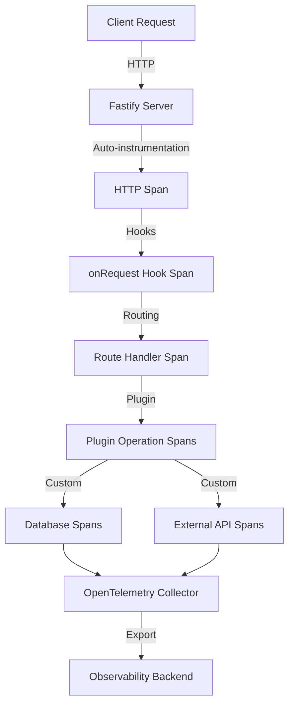

# How to Monitor Fastify Applications with OpenTelemetry

Author: [nawazdhandala](https://www.github.com/nawazdhandala)

Tags: OpenTelemetry, Fastify, Node.js, Monitoring, Performance, Tracing

Description: Complete guide to implementing OpenTelemetry monitoring and distributed tracing in Fastify applications for production observability and performance optimization.

Fastify has earned its reputation as one of the fastest web frameworks for Node.js, delivering exceptional performance through its plugin architecture and efficient request handling. As Fastify applications scale to handle production traffic, comprehensive monitoring becomes essential for maintaining that performance edge and quickly diagnosing issues.

OpenTelemetry provides standardized instrumentation for Fastify applications, enabling distributed tracing, metrics collection, and correlation across microservices. This guide demonstrates how to implement complete observability in Fastify applications, from basic setup through advanced patterns for monitoring plugins, routes, and external dependencies.

## Why Monitor Fastify Applications

Fastify's speed makes it ideal for high-throughput services and microservices architectures. However, this same speed means performance issues can multiply quickly across distributed systems. Without proper monitoring, identifying the root cause of slowdowns or errors becomes nearly impossible.

OpenTelemetry monitoring provides:

- End-to-end request tracing across microservices
- Plugin execution time tracking and performance analysis
- Route-level latency metrics and error rates
- Database query performance monitoring
- External API dependency tracking
- Automatic correlation of related operations

## Architecture Overview

OpenTelemetry integrates with Fastify at multiple levels to provide comprehensive visibility:



## Installing Dependencies

Install OpenTelemetry packages for Node.js along with Fastify-specific instrumentation support.

```bash
npm install fastify @fastify/cors @fastify/helmet

npm install @opentelemetry/api \
  @opentelemetry/sdk-node \
  @opentelemetry/auto-instrumentations-node \
  @opentelemetry/instrumentation-http \
  @opentelemetry/instrumentation-fastify \
  @opentelemetry/exporter-trace-otlp-http \
  @opentelemetry/resources \
  @opentelemetry/semantic-conventions
```

The `@opentelemetry/instrumentation-fastify` package provides automatic route and hook instrumentation specific to Fastify's architecture.

## Configuring OpenTelemetry

Create an instrumentation module that initializes OpenTelemetry before your Fastify application loads. This ensures all HTTP requests and framework operations are captured.

```javascript
// instrumentation.js
// OpenTelemetry initialization for Fastify application
// Must be imported before Fastify is loaded

const { NodeSDK } = require('@opentelemetry/sdk-node');
const { getNodeAutoInstrumentations } = require('@opentelemetry/auto-instrumentations-node');
const { FastifyInstrumentation } = require('@opentelemetry/instrumentation-fastify');
const { HttpInstrumentation } = require('@opentelemetry/instrumentation-http');
const { OTLPTraceExporter } = require('@opentelemetry/exporter-trace-otlp-http');
const { Resource } = require('@opentelemetry/resources');
const { SemanticResourceAttributes } = require('@opentelemetry/semantic-conventions');

// Configure OTLP exporter for sending traces to collector
const traceExporter = new OTLPTraceExporter({
  url: process.env.OTEL_EXPORTER_OTLP_ENDPOINT || 'http://localhost:4318/v1/traces',
  headers: {
    // Add authentication if required
  },
});

// Define service resource attributes
const resource = Resource.default().merge(
  new Resource({
    [SemanticResourceAttributes.SERVICE_NAME]: process.env.SERVICE_NAME || 'fastify-api',
    [SemanticResourceAttributes.SERVICE_VERSION]: process.env.SERVICE_VERSION || '1.0.0',
    [SemanticResourceAttributes.DEPLOYMENT_ENVIRONMENT]: process.env.NODE_ENV || 'development',
    'service.framework': 'fastify',
  })
);

// Initialize OpenTelemetry SDK with Fastify-specific instrumentation
const sdk = new NodeSDK({
  resource,
  traceExporter,
  instrumentations: [
    // HTTP instrumentation for incoming and outgoing requests
    new HttpInstrumentation({
      ignoreIncomingRequestHook: (req) => {
        // Ignore health checks and metrics endpoints
        return req.url === '/health' || req.url === '/metrics';
      },
      requestHook: (span, request) => {
        // Add custom attributes to HTTP spans
        span.setAttribute('http.user_agent', request.headers['user-agent'] || 'unknown');
      },
      responseHook: (span, response) => {
        // Add response-specific attributes
        span.setAttribute('http.response.content_length', response.headers['content-length'] || 0);
      },
    }),
    // Fastify-specific instrumentation for routes and hooks
    new FastifyInstrumentation({
      requestHook: (span, info) => {
        // Enrich spans with Fastify-specific context
        span.setAttribute('fastify.type', info.type);
        if (info.route) {
          span.setAttribute('fastify.route', info.route);
        }
      },
    }),
    // Other auto-instrumentations (database, etc.)
    getNodeAutoInstrumentations({
      '@opentelemetry/instrumentation-fs': {
        enabled: false, // Reduce noise from filesystem operations
      },
    }),
  ],
});

// Start the SDK
sdk.start();
console.log('OpenTelemetry instrumentation initialized');

// Graceful shutdown
process.on('SIGTERM', () => {
  sdk.shutdown()
    .then(() => console.log('OpenTelemetry SDK shut down successfully'))
    .catch((error) => console.error('Error shutting down OpenTelemetry SDK', error))
    .finally(() => process.exit(0));
});

module.exports = sdk;
```

## Building an Instrumented Fastify Server

Create your Fastify server with OpenTelemetry initialization loaded first, then add routes and plugins.

```javascript
// server.js
// Fastify server with OpenTelemetry tracing
// Import instrumentation FIRST before any other code

require('./instrumentation');

const fastify = require('fastify');
const { trace, context } = require('@opentelemetry/api');

// Create tracer for custom spans
const tracer = trace.getTracer('fastify-server');

// Initialize Fastify with logging
const app = fastify({
  logger: {
    level: process.env.LOG_LEVEL || 'info',
    serializers: {
      req(request) {
        // Add trace context to logs
        const span = trace.getActiveSpan();
        const traceId = span?.spanContext().traceId;
        const spanId = span?.spanContext().spanId;

        return {
          method: request.method,
          url: request.url,
          headers: request.headers,
          traceId,
          spanId,
        };
      },
    },
  },
});

// Register plugins
app.register(require('@fastify/cors'), {
  origin: true,
});

app.register(require('@fastify/helmet'));

// Add onRequest hook to enrich traces
app.addHook('onRequest', async (request, reply) => {
  const span = trace.getActiveSpan();
  if (span) {
    // Add custom attributes from request context
    span.setAttribute('request.id', request.id);

    // Extract user information if available
    const userId = request.headers['x-user-id'];
    if (userId) {
      span.setAttribute('user.id', userId);
    }
  }
});

// Add onResponse hook to track response timing
app.addHook('onResponse', async (request, reply) => {
  const span = trace.getActiveSpan();
  if (span) {
    span.setAttribute('http.status_code', reply.statusCode);
    span.setAttribute('response.time_ms', reply.getResponseTime());
  }
});

// Health check endpoint (excluded from tracing)
app.get('/health', async (request, reply) => {
  return { status: 'ok', timestamp: new Date().toISOString() };
});

// Start the server
const start = async () => {
  try {
    const port = process.env.PORT || 3000;
    const host = process.env.HOST || '0.0.0.0';

    await app.listen({ port, host });
    console.log(`Fastify server listening on ${host}:${port}`);
  } catch (err) {
    app.log.error(err);
    process.exit(1);
  }
};

start();

module.exports = app;
```

## Tracing Route Handlers

Implement custom tracing within route handlers to monitor specific operations like database queries and external API calls.

```javascript
// routes/users.js
// User routes with detailed OpenTelemetry tracing

const { trace } = require('@opentelemetry/api');

const tracer = trace.getTracer('fastify-routes');

async function userRoutes(fastify, options) {
  // GET /api/users - List users with tracing
  fastify.get('/api/users', {
    schema: {
      querystring: {
        type: 'object',
        properties: {
          page: { type: 'integer', minimum: 1, default: 1 },
          limit: { type: 'integer', minimum: 1, maximum: 100, default: 10 },
        },
      },
    },
  }, async (request, reply) => {
    return await tracer.startActiveSpan('route.users.list', async (span) => {
      try {
        const { page, limit } = request.query;

        span.setAttribute('route', '/api/users');
        span.setAttribute('query.page', page);
        span.setAttribute('query.limit', limit);

        // Fetch users from database with tracing
        const users = await tracer.startActiveSpan('db.query.users', async (dbSpan) => {
          dbSpan.setAttribute('db.operation', 'SELECT');
          dbSpan.setAttribute('db.table', 'users');
          dbSpan.setAttribute('db.limit', limit);
          dbSpan.setAttribute('db.offset', (page - 1) * limit);

          try {
            const result = await fetchUsersFromDatabase(page, limit);
            dbSpan.setAttribute('db.result.count', result.length);
            dbSpan.setStatus({ code: 1 }); // OK
            return result;
          } catch (error) {
            dbSpan.recordException(error);
            dbSpan.setStatus({ code: 2, message: error.message }); // ERROR
            throw error;
          } finally {
            dbSpan.end();
          }
        });

        // Get total count for pagination
        const total = await tracer.startActiveSpan('db.count.users', async (countSpan) => {
          countSpan.setAttribute('db.operation', 'COUNT');
          countSpan.setAttribute('db.table', 'users');

          try {
            const count = await getUserCount();
            countSpan.setAttribute('db.result.count', count);
            countSpan.setStatus({ code: 1 });
            return count;
          } catch (error) {
            countSpan.recordException(error);
            countSpan.setStatus({ code: 2, message: error.message });
            throw error;
          } finally {
            countSpan.end();
          }
        });

        span.setAttribute('response.user_count', users.length);
        span.setAttribute('response.total_users', total);
        span.setStatus({ code: 1 });

        return {
          users,
          pagination: {
            page,
            limit,
            total,
            pages: Math.ceil(total / limit),
          },
        };
      } catch (error) {
        span.recordException(error);
        span.setStatus({ code: 2, message: error.message });
        reply.code(500).send({ error: 'Failed to fetch users' });
      } finally {
        span.end();
      }
    });
  });

  // GET /api/users/:id - Get user by ID with tracing
  fastify.get('/api/users/:id', {
    schema: {
      params: {
        type: 'object',
        properties: {
          id: { type: 'string' },
        },
        required: ['id'],
      },
    },
  }, async (request, reply) => {
    return await tracer.startActiveSpan('route.users.get', async (span) => {
      try {
        const { id } = request.params;

        span.setAttribute('route', '/api/users/:id');
        span.setAttribute('user.id', id);

        // Fetch user details
        const user = await tracer.startActiveSpan('db.query.user', async (dbSpan) => {
          dbSpan.setAttribute('db.operation', 'SELECT');
          dbSpan.setAttribute('db.table', 'users');
          dbSpan.setAttribute('user.id', id);

          try {
            const result = await fetchUserById(id);
            if (!result) {
              throw new Error('User not found');
            }
            dbSpan.setStatus({ code: 1 });
            return result;
          } catch (error) {
            dbSpan.recordException(error);
            dbSpan.setStatus({ code: 2, message: error.message });
            throw error;
          } finally {
            dbSpan.end();
          }
        });

        span.setStatus({ code: 1 });
        return user;
      } catch (error) {
        span.recordException(error);
        span.setStatus({ code: 2, message: error.message });

        if (error.message === 'User not found') {
          reply.code(404).send({ error: 'User not found' });
        } else {
          reply.code(500).send({ error: 'Failed to fetch user' });
        }
      } finally {
        span.end();
      }
    });
  });

  // POST /api/users - Create user with tracing
  fastify.post('/api/users', {
    schema: {
      body: {
        type: 'object',
        required: ['name', 'email'],
        properties: {
          name: { type: 'string', minLength: 2 },
          email: { type: 'string', format: 'email' },
        },
      },
    },
  }, async (request, reply) => {
    return await tracer.startActiveSpan('route.users.create', async (span) => {
      try {
        const { name, email } = request.body;

        span.setAttribute('route', '/api/users');
        span.setAttribute('user.name', name);
        span.setAttribute('user.email', email);

        // Check if email already exists
        const exists = await tracer.startActiveSpan('db.query.check_email', async (checkSpan) => {
          checkSpan.setAttribute('db.operation', 'SELECT');
          checkSpan.setAttribute('db.table', 'users');
          checkSpan.setAttribute('check.email', email);

          try {
            const result = await checkEmailExists(email);
            checkSpan.setAttribute('email.exists', result);
            checkSpan.setStatus({ code: 1 });
            return result;
          } catch (error) {
            checkSpan.recordException(error);
            checkSpan.setStatus({ code: 2, message: error.message });
            throw error;
          } finally {
            checkSpan.end();
          }
        });

        if (exists) {
          span.setAttribute('validation.failed', true);
          span.setStatus({ code: 2, message: 'Email already exists' });
          return reply.code(409).send({ error: 'Email already exists' });
        }

        // Create user in database
        const userId = await tracer.startActiveSpan('db.insert.user', async (insertSpan) => {
          insertSpan.setAttribute('db.operation', 'INSERT');
          insertSpan.setAttribute('db.table', 'users');

          try {
            const id = await insertUser({ name, email });
            insertSpan.setAttribute('user.id', id);
            insertSpan.setStatus({ code: 1 });
            return id;
          } catch (error) {
            insertSpan.recordException(error);
            insertSpan.setStatus({ code: 2, message: error.message });
            throw error;
          } finally {
            insertSpan.end();
          }
        });

        span.setAttribute('user.id', userId);
        span.setStatus({ code: 1 });

        return reply.code(201).send({ id: userId, name, email });
      } catch (error) {
        span.recordException(error);
        span.setStatus({ code: 2, message: error.message });
        reply.code(500).send({ error: 'Failed to create user' });
      } finally {
        span.end();
      }
    });
  });
}

// Simulated database operations
async function fetchUsersFromDatabase(page, limit) {
  await new Promise(resolve => setTimeout(resolve, 50));
  return Array.from({ length: limit }, (_, i) => ({
    id: `${page}-${i}`,
    name: `User ${i}`,
    email: `user${i}@example.com`,
  }));
}

async function getUserCount() {
  await new Promise(resolve => setTimeout(resolve, 20));
  return 100;
}

async function fetchUserById(id) {
  await new Promise(resolve => setTimeout(resolve, 30));
  if (id === 'invalid') return null;
  return { id, name: 'John Doe', email: 'john@example.com' };
}

async function checkEmailExists(email) {
  await new Promise(resolve => setTimeout(resolve, 25));
  return email === 'existing@example.com';
}

async function insertUser(data) {
  await new Promise(resolve => setTimeout(resolve, 60));
  return `user-${Date.now()}`;
}

module.exports = userRoutes;
```

## Creating Traced Fastify Plugins

Fastify's plugin system allows you to encapsulate functionality. Add tracing to plugins to monitor their performance and integration with your application.

```javascript
// plugins/database.js
// Database plugin with OpenTelemetry tracing

const fp = require('fastify-plugin');
const { trace } = require('@opentelemetry/api');

const tracer = trace.getTracer('fastify-plugins');

async function databasePlugin(fastify, options) {
  // Simulate database connection with tracing
  await tracer.startActiveSpan('plugin.database.connect', async (span) => {
    try {
      span.setAttribute('db.system', 'postgresql');
      span.setAttribute('db.connection_string', options.connectionString || 'postgresql://localhost');

      // Simulate connection delay
      await new Promise(resolve => setTimeout(resolve, 100));

      span.setStatus({ code: 1 });
      fastify.log.info('Database connected');
    } catch (error) {
      span.recordException(error);
      span.setStatus({ code: 2, message: error.message });
      throw error;
    } finally {
      span.end();
    }
  });

  // Create database query function with tracing
  const db = {
    query: async (sql, params) => {
      return await tracer.startActiveSpan('db.query', async (span) => {
        try {
          span.setAttribute('db.system', 'postgresql');
          span.setAttribute('db.statement', sql);
          span.setAttribute('db.params.count', params?.length || 0);

          // Simulate query execution
          await new Promise(resolve => setTimeout(resolve, 30));

          const result = { rows: [], rowCount: 0 };
          span.setAttribute('db.result.count', result.rowCount);
          span.setStatus({ code: 1 });

          return result;
        } catch (error) {
          span.recordException(error);
          span.setStatus({ code: 2, message: error.message });
          throw error;
        } finally {
          span.end();
        }
      });
    },
  };

  // Decorate Fastify instance with database client
  fastify.decorate('db', db);

  // Add onClose hook to disconnect database
  fastify.addHook('onClose', async (instance, done) => {
    await tracer.startActiveSpan('plugin.database.disconnect', async (span) => {
      try {
        await new Promise(resolve => setTimeout(resolve, 50));
        span.setStatus({ code: 1 });
        instance.log.info('Database disconnected');
      } catch (error) {
        span.recordException(error);
        span.setStatus({ code: 2, message: error.message });
      } finally {
        span.end();
      }
      done();
    });
  });
}

module.exports = fp(databasePlugin, {
  name: 'database-plugin',
  fastify: '4.x',
});
```

## Tracing External API Calls

When your Fastify application calls external APIs, tracing these operations helps you understand downstream dependencies and their impact on performance.

```javascript
// services/external-api.js
// External API service with OpenTelemetry tracing

const { trace, propagation, context } = require('@opentelemetry/api');
const fetch = require('node-fetch');

const tracer = trace.getTracer('fastify-services');

class ExternalAPIService {
  constructor(baseURL) {
    this.baseURL = baseURL;
  }

  async fetchData(endpoint, options = {}) {
    return await tracer.startActiveSpan('external.api.fetch', async (span) => {
      try {
        const url = `${this.baseURL}${endpoint}`;

        span.setAttribute('http.method', options.method || 'GET');
        span.setAttribute('http.url', url);
        span.setAttribute('service.name', 'external-api');

        // Inject trace context into outgoing request headers
        const headers = options.headers || {};
        propagation.inject(context.active(), headers);

        const startTime = Date.now();

        // Make the external request
        const response = await fetch(url, {
          ...options,
          headers,
        });

        const duration = Date.now() - startTime;

        span.setAttribute('http.status_code', response.status);
        span.setAttribute('http.response.duration_ms', duration);
        span.setAttribute('http.response.content_length', response.headers.get('content-length') || 0);

        if (!response.ok) {
          throw new Error(`API request failed with status ${response.status}`);
        }

        const data = await response.json();
        span.setStatus({ code: 1 });

        return data;
      } catch (error) {
        span.recordException(error);
        span.setStatus({ code: 2, message: error.message });
        throw error;
      } finally {
        span.end();
      }
    });
  }

  async postData(endpoint, body, options = {}) {
    return await this.fetchData(endpoint, {
      ...options,
      method: 'POST',
      headers: {
        'Content-Type': 'application/json',
        ...options.headers,
      },
      body: JSON.stringify(body),
    });
  }
}

module.exports = ExternalAPIService;
```

## Environment Configuration

Configure OpenTelemetry through environment variables for different deployment scenarios.

```bash
# .env.production
# OpenTelemetry configuration for Fastify production deployment

# OTLP exporter settings
OTEL_EXPORTER_OTLP_ENDPOINT=https://otel-collector.example.com:4318/v1/traces

# Service identification
SERVICE_NAME=fastify-api
SERVICE_VERSION=1.0.0
OTEL_SERVICE_NAME=fastify-api

# Sampling configuration
OTEL_TRACES_SAMPLER=parentbased_traceidratio
OTEL_TRACES_SAMPLER_ARG=0.1

# Resource attributes
OTEL_RESOURCE_ATTRIBUTES=deployment.environment=production,region=us-west-2

# Application settings
NODE_ENV=production
PORT=3000
HOST=0.0.0.0
LOG_LEVEL=info
```

## Monitoring Key Metrics

Track these critical metrics for Fastify applications:

**Request Latency**: Monitor P50, P95, and P99 latencies per route. Fastify's speed advantage should be evident in these metrics.

**Throughput**: Track requests per second per route. Correlate with resource utilization to identify scaling needs.

**Error Rates**: Calculate error rates per route and status code. Track 5xx errors separately as they indicate server-side issues.

**Plugin Performance**: Monitor initialization and operation times for plugins. Slow plugins can impact application startup and request processing.

**Database Query Duration**: Track query execution times. Slow queries are often the biggest performance bottleneck.

**External Dependency Latency**: Monitor response times from external APIs. Set alerts for dependencies exceeding SLA thresholds.

## Best Practices

**Early Initialization**: Load OpenTelemetry instrumentation before requiring Fastify to ensure complete auto-instrumentation coverage.

**Span Naming**: Use consistent, hierarchical naming like `operation.component.action` (e.g., `route.users.create`, `db.query.users`).

**Attribute Enrichment**: Add relevant attributes to spans including route paths, user IDs, and operation-specific metadata for effective filtering.

**Error Recording**: Always use `span.recordException()` for errors and set appropriate status codes for accurate error tracking.

**Context Propagation**: When calling external services, inject trace context using `propagation.inject()` to maintain distributed traces.

**Sampling Strategy**: Use probabilistic sampling in production to control volume. Start with 10% and adjust based on traffic patterns.

## Troubleshooting

**Missing Traces**: Verify instrumentation loads before Fastify initialization. Check OTLP endpoint connectivity and authentication.

**Broken Trace Context**: Ensure async operations use `tracer.startActiveSpan()` for automatic context propagation instead of manual span management.

**Performance Overhead**: If tracing impacts performance, reduce sampling rate, disable filesystem instrumentation, or exclude health check endpoints.

**Plugin Instrumentation**: Some plugins may require manual instrumentation. Add custom spans around plugin operations for complete visibility.

## Conclusion

OpenTelemetry provides comprehensive monitoring capabilities for Fastify applications, enabling you to maintain the framework's performance advantage while gaining deep insights into application behavior. By implementing distributed tracing across routes, plugins, and external dependencies, you can quickly identify bottlenecks and optimize critical paths.

Start with automatic instrumentation for HTTP requests and Fastify operations, then add custom spans for business-critical operations like database queries and external API calls. Monitor key metrics like request latency and error rates, and use distributed traces to diagnose complex issues spanning multiple services.

With proper instrumentation in place, you'll have the observability needed to scale your Fastify application confidently while maintaining its reputation for exceptional performance.
