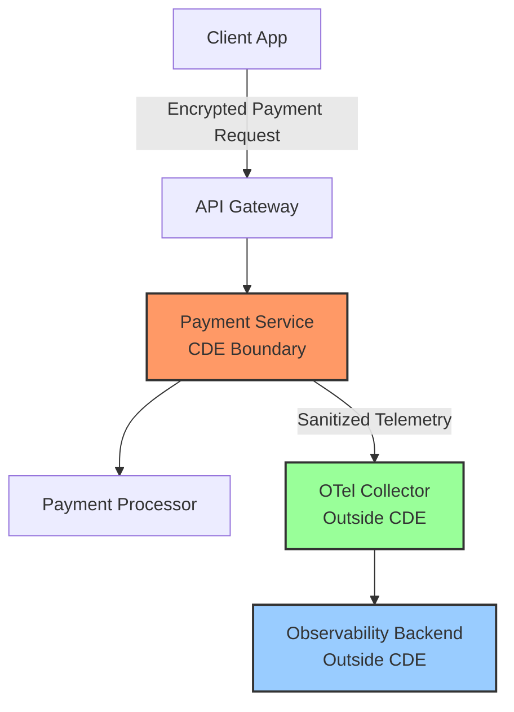

# How to Monitor Fintech Payment APIs for PCI DSS Compliance

Author: [nawazdhandala](https://www.github.com/nawazdhandala)

Tags: OpenTelemetry, PCI DSS, Fintech, Payment APIs, Compliance, Security, Monitoring

Description: Learn how to instrument and monitor fintech payment APIs using OpenTelemetry while maintaining PCI DSS compliance and protecting cardholder data.

---

Payment APIs sit at the intersection of reliability engineering and regulatory compliance. When a payment fails, your customers lose money and trust. When cardholder data leaks into your logs, you face PCI DSS violations that can cost millions in fines and remediation. Building an observability pipeline that gives you deep visibility into payment processing without ever touching sensitive card data requires careful planning at every layer of the stack.

This guide walks through how to use OpenTelemetry to instrument, monitor, and trace payment APIs while meeting PCI DSS requirements for protecting cardholder data.

## The PCI DSS Observability Problem

PCI DSS (Payment Card Industry Data Security Standard) defines strict rules around how cardholder data is handled. The primary account number (PAN), cardholder name, expiration date, and CVV must never appear in logs, traces, or any monitoring system outside the Cardholder Data Environment (CDE).

The challenge for observability is that payment APIs naturally handle this data on every request. A naive instrumentation setup could easily capture credit card numbers in HTTP request bodies, log full API payloads for debugging, or include PANs in error messages when transactions fail.

Here is the architecture we need:



The key insight is that the OpenTelemetry Collector must sit outside the CDE, and telemetry must be sanitized before it crosses that boundary. No cardholder data should ever leave the CDE through the observability pipeline.

## Instrumenting Payment Endpoints

Start with the payment service itself. The instrumentation must capture enough detail for debugging while keeping all cardholder data out of span attributes:

```python
# payment_service.py
# Instrument payment processing with PCI DSS-safe telemetry

from opentelemetry import trace
from opentelemetry.trace import StatusCode
import hashlib
import time

tracer = trace.get_tracer("payment-service", "2.1.0")

def process_payment(request):
    """Process a payment while keeping cardholder data out of telemetry."""

    with tracer.start_as_current_span("process_payment") as span:
        # Safe: record operational metadata only
        span.set_attribute("payment.method", request.payment_method)
        span.set_attribute("payment.currency", request.currency)
        span.set_attribute("payment.amount_cents", request.amount_cents)

        # Safe: use a truncated hash of the PAN for correlation
        # PCI DSS allows storing first 6 and last 4 digits, but even
        # that is more than we need for observability
        pan_token = tokenize_pan(request.card_number)
        span.set_attribute("payment.pan_token", pan_token)

        # Safe: record the BIN (first 6 digits) for fraud analysis
        # PCI DSS explicitly permits storing the BIN
        span.set_attribute("payment.bin", request.card_number[:6])

        # Safe: merchant and transaction metadata
        span.set_attribute("payment.merchant_id", request.merchant_id)
        span.set_attribute("payment.idempotency_key", request.idempotency_key)

        start = time.monotonic()

        try:
            result = gateway.charge(request)

            # Record the outcome without any card details
            elapsed_ms = (time.monotonic() - start) * 1000
            span.set_attribute("payment.gateway_latency_ms", elapsed_ms)
            span.set_attribute("payment.status", result.status)
            span.set_attribute("payment.transaction_id", result.transaction_id)
            span.set_attribute("payment.decline_code", result.decline_code or "")

            if result.status == "declined":
                span.set_status(StatusCode.OK)
                span.set_attribute("payment.declined", True)
            else:
                span.set_status(StatusCode.OK)
                span.set_attribute("payment.declined", False)

            return result

        except GatewayTimeoutError as e:
            span.set_attribute("error.type", "gateway_timeout")
            span.set_attribute("payment.gateway", request.gateway_name)
            span.set_status(StatusCode.ERROR, "Payment gateway timeout")
            raise

        except Exception as e:
            # Never include the raw exception message, as it may contain card data
            span.set_attribute("error.type", type(e).__name__)
            span.set_status(StatusCode.ERROR, "Payment processing failed")
            raise


def tokenize_pan(card_number: str) -> str:
    """Create a non-reversible token from a PAN for telemetry correlation.

    This allows tracing multiple transactions for the same card
    without storing or transmitting the actual card number.
    """
    return hashlib.sha256(card_number.encode()).hexdigest()[:12]
```

Notice that we never set an attribute containing the full card number, expiration date, or CVV. The `tokenize_pan` function produces a consistent hash so you can search for all transactions involving the same card, but you cannot reverse it to get the actual PAN.

## Tracking Payment Latency and Success Rates

Payment APIs have strict latency requirements. A slow charge endpoint means customers waiting at checkout. Use OpenTelemetry metrics to track payment performance across dimensions that matter:

```python
# payment_metrics.py
# Define PCI DSS-safe payment metrics

from opentelemetry import metrics

meter = metrics.get_meter("payment-service", "2.1.0")

# Histogram for gateway response times, bucketed for SLA monitoring
gateway_latency = meter.create_histogram(
    name="payment.gateway.latency",
    description="Time spent waiting for the payment gateway to respond",
    unit="ms",
)

# Counter for payment outcomes by status and gateway
payment_outcomes = meter.create_counter(
    name="payment.outcomes.total",
    description="Total payment attempts by outcome",
)

# Gauge for in-flight payment requests
inflight_payments = meter.create_up_down_counter(
    name="payment.inflight",
    description="Number of payment requests currently being processed",
)

def record_payment_attempt(gateway: str, currency: str, status: str, latency_ms: float):
    """Record metrics for a payment attempt using only safe dimensions.

    Dimensions include gateway, currency, and status but never
    any cardholder data like PAN, name, or card type.
    """
    # Safe labels: operational metadata only
    labels = {
        "gateway": gateway,
        "currency": currency,
        "status": status,
    }

    gateway_latency.record(latency_ms, labels)
    payment_outcomes.add(1, labels)
```

These metrics let you build dashboards showing payment success rates by gateway, p99 latency trends, and currency-level breakdowns, all without any cardholder data in the metric dimensions.

## Collector Configuration for PCI DSS

The collector configuration enforces data sanitization as a second layer of defense. Even if application code accidentally includes cardholder data, the collector strips it before export:

```yaml
# otel-collector-pci.yaml
# PCI DSS-compliant collector configuration

receivers:
  otlp:
    protocols:
      grpc:
        endpoint: 0.0.0.0:4317
        tls:
          cert_file: /etc/otel/tls/server.crt
          key_file: /etc/otel/tls/server.key
          client_ca_file: /etc/otel/tls/ca.crt

processors:
  # Strip cardholder data patterns from all telemetry
  transform/pci_redact:
    trace_statements:
      - context: span
        statements:
          # Redact credit card numbers (13-19 digit sequences)
          - replace_pattern(attributes["http.request.body"], "\\b\\d{13,19}\\b", "[PAN-REDACTED]")
          # Redact CVV patterns (3-4 digits following common CVV field names)
          - replace_pattern(attributes["http.request.body"], "(?i)(cvv|cvc|cvv2|csc)[\"':=\\s]+\\d{3,4}", "$1=[CVV-REDACTED]")
          # Redact expiration dates in common formats
          - replace_pattern(attributes["http.request.body"], "\\b(0[1-9]|1[0-2])[/\\-](2[0-9]{3}|[0-9]{2})\\b", "[EXP-REDACTED]")

    log_statements:
      - context: log
        statements:
          - replace_pattern(body, "\\b\\d{13,19}\\b", "[PAN-REDACTED]")
          - replace_pattern(body, "(?i)(cvv|cvc|cvv2|csc)[\"':=\\s]+\\d{3,4}", "$1=[CVV-REDACTED]")

  # Delete high-risk attributes entirely
  attributes/pci_strip:
    actions:
      - key: http.request.body
        action: delete
      - key: http.response.body
        action: delete
      - key: db.statement
        action: delete
      - key: payment.card_number
        action: delete
      - key: payment.cvv
        action: delete
      - key: payment.expiry
        action: delete
      - key: payment.cardholder_name
        action: delete

  memory_limiter:
    check_interval: 1s
    limit_mib: 1536
    spike_limit_mib: 512

  batch:
    timeout: 5s
    send_batch_size: 256

exporters:
  otlp:
    endpoint: observability-backend.internal:4317
    tls:
      cert_file: /etc/otel/tls/client.crt
      key_file: /etc/otel/tls/client.key
      ca_file: /etc/otel/tls/ca.crt

service:
  pipelines:
    traces:
      receivers: [otlp]
      processors: [memory_limiter, transform/pci_redact, attributes/pci_strip, batch]
      exporters: [otlp]

    metrics:
      receivers: [otlp]
      processors: [memory_limiter, batch]
      exporters: [otlp]

    logs:
      receivers: [otlp]
      processors: [memory_limiter, transform/pci_redact, attributes/pci_strip, batch]
      exporters: [otlp]
```

The processor pipeline runs in order: first the transform processor applies regex-based redaction to catch card numbers embedded in text fields, then the attributes processor deletes entire attribute keys that should never exist outside the CDE.

## Monitoring Payment Gateway Health

Payment gateways are external dependencies that your team cannot control. Build a dedicated monitoring layer that tracks gateway reliability:

```python
# gateway_monitor.py
# Track payment gateway health with circuit breaker awareness

from opentelemetry import trace, metrics

tracer = trace.get_tracer("gateway-monitor", "1.0.0")
meter = metrics.get_meter("gateway-monitor", "1.0.0")

# Track consecutive failures per gateway for circuit breaker logic
gateway_errors = meter.create_counter(
    name="payment.gateway.errors",
    description="Consecutive gateway errors for circuit breaker monitoring",
)

gateway_health = meter.create_gauge(
    name="payment.gateway.health_score",
    description="Gateway health score from 0 (down) to 100 (healthy)",
)

def check_gateway_health(gateway_name: str):
    """Probe gateway health and record telemetry.

    This runs on a schedule to detect gateway issues before
    they affect real payment traffic.
    """
    with tracer.start_as_current_span("gateway_health_check") as span:
        span.set_attribute("gateway.name", gateway_name)
        span.set_attribute("check.type", "synthetic")

        try:
            # Use the gateway's health endpoint, not a real transaction
            response = gateway_client.health_check(gateway_name)
            latency_ms = response.elapsed_ms

            span.set_attribute("gateway.status", "healthy")
            span.set_attribute("gateway.latency_ms", latency_ms)

            # Score based on latency thresholds
            if latency_ms < 200:
                score = 100
            elif latency_ms < 500:
                score = 75
            elif latency_ms < 1000:
                score = 50
            else:
                score = 25

            gateway_health.set(score, {"gateway": gateway_name})

        except Exception as e:
            span.set_attribute("gateway.status", "unhealthy")
            span.set_attribute("error.type", type(e).__name__)
            gateway_errors.add(1, {"gateway": gateway_name})
            gateway_health.set(0, {"gateway": gateway_name})
```

This health check runs on a schedule (every 30 seconds, for example) and produces both traces and metrics. The health score metric feeds into alerting rules that can trigger failover to a backup gateway before customers are affected.

## Alerting on PCI-Relevant Events

Set up alerts that catch both reliability issues and potential compliance events:

```yaml
# alerting-rules.yaml
# Alerting rules for payment API monitoring

groups:
  - name: payment_reliability
    rules:
      # Alert when payment success rate drops
      - alert: PaymentSuccessRateLow
        expr: |
          sum(rate(payment_outcomes_total{status="success"}[5m]))
          /
          sum(rate(payment_outcomes_total[5m]))
          < 0.95
        for: 5m
        labels:
          severity: critical
          compliance: pci-dss
        annotations:
          summary: "Payment success rate below 95%"

      # Alert when gateway latency exceeds SLA
      - alert: GatewayLatencyHigh
        expr: |
          histogram_quantile(0.99,
            rate(payment_gateway_latency_bucket[5m])
          ) > 2000
        for: 3m
        labels:
          severity: warning
        annotations:
          summary: "Payment gateway p99 latency above 2 seconds"

  - name: pci_compliance
    rules:
      # Alert if cardholder data patterns appear in telemetry
      # This should never fire if the pipeline is working correctly
      - alert: PotentialCardDataInTelemetry
        expr: |
          sum(rate(otelcol_processor_transform_match_count{
            pattern="PAN-REDACTED"
          }[5m])) > 0
        for: 1m
        labels:
          severity: critical
          compliance: pci-dss
        annotations:
          summary: "Cardholder data detected and redacted in telemetry pipeline"
```

The last alert is especially important. If the collector's redaction processor is actively catching and replacing card number patterns, it means application code is leaking cardholder data. This should trigger an immediate investigation and code fix, even though the collector prevented the data from reaching the backend.

## Tracing a Payment Through the Full Lifecycle

A single payment request touches many services. OpenTelemetry's distributed tracing lets you follow the entire lifecycle:


Each service in this chain adds its own spans to the trace, creating a complete picture of payment processing latency, error sources, and routing decisions. The distributed context propagation happens automatically through HTTP headers, so you get end-to-end traces without any manual correlation.

## Validating PCI Compliance Continuously

Treat your PCI observability pipeline like any other security control: test it continuously. Add integration tests that send telemetry containing known cardholder data patterns and verify that the exported data is clean:

```python
# test_pci_compliance.py
# Validate that the observability pipeline strips cardholder data

TEST_CARD_NUMBERS = [
    "4111111111111111",    # Visa test number
    "5500000000000004",    # Mastercard test number
    "340000000000009",     # Amex test number
]

def test_pan_stripped_from_traces():
    """Send spans containing test card numbers and verify they are removed."""
    for pan in TEST_CARD_NUMBERS:
        # Send a span with cardholder data in attributes
        send_test_span(attributes={
            "http.request.body": f'{{"card": "{pan}", "amount": 1000}}',
            "payment.card_number": pan,
        })

    # Wait for the collector to process
    time.sleep(5)

    # Fetch exported spans and verify no card numbers present
    exported_spans = fetch_exported_spans()
    for span in exported_spans:
        for attr_value in span.attribute_values():
            for pan in TEST_CARD_NUMBERS:
                assert pan not in str(attr_value), (
                    f"Card number {pan[:4]}...{pan[-4:]} found in exported telemetry"
                )
```

Run these tests after every collector configuration change and as part of your regular PCI compliance validation cycles.

## Conclusion

Monitoring fintech payment APIs with OpenTelemetry requires a disciplined approach to data handling at every layer. Instrument your payment services to capture rich operational metadata while keeping cardholder data out of span attributes. Configure the OpenTelemetry Collector as an enforcement boundary that strips any cardholder data that slips through application-level controls. Track payment gateway health proactively so you can detect and respond to issues before they affect customers. And validate your entire pipeline continuously with automated tests that confirm cardholder data never reaches your observability backend.

This layered approach gives your engineering team the visibility they need to keep payment systems running reliably while maintaining the strict data protection controls that PCI DSS demands.
