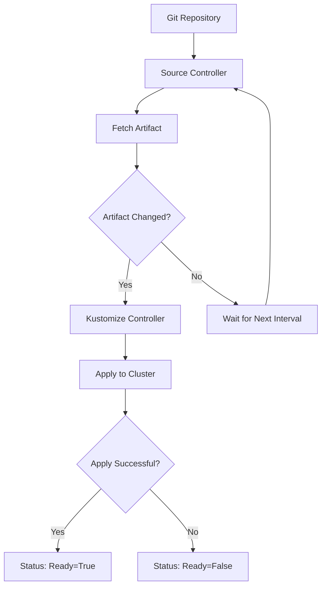

# How to Monitor Flux CD Reconciliation with OpenTelemetry

Author: [nawazdhandala](https://www.github.com/nawazdhandala)

Tags: OpenTelemetry, Flux CD, GitOps, Kubernetes, Reconciliation, Observability

Description: Learn how to monitor Flux CD reconciliation loops with OpenTelemetry to track sync status, detect drift, and gain observability into your GitOps deployment pipeline.

---

Flux CD is one of the most popular GitOps tools for Kubernetes. It continuously reconciles the desired state defined in Git with the actual state of your cluster. When everything works, deployments happen automatically and silently. But when reconciliation fails or stalls, you need to know about it fast, and you need enough detail to diagnose why.

Flux exposes reconciliation status through Kubernetes conditions and events, but these are ephemeral and hard to query historically. By feeding Flux telemetry into OpenTelemetry, you get persistent, queryable data about every reconciliation cycle. You can track how long reconciliations take, how often they fail, and whether specific resources are consistently problematic.

This guide covers how to set up OpenTelemetry-based monitoring for Flux CD reconciliation, from metrics collection to alerting.

## How Flux Reconciliation Works

Before diving into instrumentation, it helps to understand what Flux is doing under the hood.

Flux operates through a set of controllers, each responsible for a specific resource type:

- **Source Controller**: Fetches artifacts from Git repositories, Helm repositories, and OCI registries
- **Kustomize Controller**: Applies Kustomize overlays to the cluster
- **Helm Controller**: Manages Helm releases
- **Notification Controller**: Handles alerts and event forwarding
- **Image Automation Controllers**: Update image tags in Git based on registry scanning

Each controller runs a reconciliation loop. It checks the desired state, compares it to the actual state, and applies any needed changes. Each reconciliation produces a status condition that indicates success, failure, or in-progress.



## Collecting Flux Metrics with the OpenTelemetry Collector

Flux controllers expose Prometheus metrics by default on port 8080. The OpenTelemetry Collector can scrape these metrics and forward them to your backend.

First, deploy a Collector in your cluster configured to scrape Flux controller metrics:

```yaml
# otel-collector-config.yaml
# Collector config for scraping Flux CD controller metrics

receivers:
  prometheus:
    config:
      scrape_configs:
        # Scrape the source-controller metrics
        - job_name: "flux-source-controller"
          scrape_interval: 30s
          kubernetes_sd_configs:
            - role: pod
              namespaces:
                names: ["flux-system"]
          relabel_configs:
            # Only scrape pods with the flux source-controller label
            - source_labels: [__meta_kubernetes_pod_label_app]
              regex: source-controller
              action: keep
            - source_labels: [__meta_kubernetes_pod_ip]
              target_label: __address__
              replacement: "$1:8080"

        # Scrape the kustomize-controller metrics
        - job_name: "flux-kustomize-controller"
          scrape_interval: 30s
          kubernetes_sd_configs:
            - role: pod
              namespaces:
                names: ["flux-system"]
          relabel_configs:
            - source_labels: [__meta_kubernetes_pod_label_app]
              regex: kustomize-controller
              action: keep
            - source_labels: [__meta_kubernetes_pod_ip]
              target_label: __address__
              replacement: "$1:8080"

        # Scrape the helm-controller metrics
        - job_name: "flux-helm-controller"
          scrape_interval: 30s
          kubernetes_sd_configs:
            - role: pod
              namespaces:
                names: ["flux-system"]
          relabel_configs:
            - source_labels: [__meta_kubernetes_pod_label_app]
              regex: helm-controller
              action: keep
            - source_labels: [__meta_kubernetes_pod_ip]
              target_label: __address__
              replacement: "$1:8080"

processors:
  batch:
    timeout: 10s

  resource:
    attributes:
      - key: service.name
        value: "flux-cd"
        action: upsert

exporters:
  otlp:
    endpoint: your-backend:4317

service:
  pipelines:
    metrics:
      receivers: [prometheus]
      processors: [resource, batch]
      exporters: [otlp]
```

This configuration uses Kubernetes service discovery to find Flux controller pods in the `flux-system` namespace and scrapes their Prometheus endpoints. The metrics are then converted to OTLP format and exported to your backend.

## Key Flux Metrics to Monitor

Flux controllers expose several metrics that are critical for reconciliation monitoring. Here are the most important ones:

```yaml
# Reference: Key Flux CD metrics and their meanings

# gotk_reconcile_duration_seconds (histogram)
# How long each reconciliation takes. Rising durations often indicate
# cluster issues or complex resource graphs.

# gotk_reconcile_condition (gauge)
# The current condition of each reconciled resource.
# Labels include: type (Ready, Healthy), status (True, False, Unknown),
# kind (Kustomization, HelmRelease, GitRepository), name, namespace.

# gotk_suspend_status (gauge)
# Whether a resource is suspended (1) or active (0).
# Suspended resources do not reconcile.

# controller_runtime_reconcile_total (counter)
# Total number of reconciliations, labeled by result (success, error, requeue).

# controller_runtime_reconcile_errors_total (counter)
# Total number of reconciliation errors per controller.

# source_controller_artifact_in_storage (gauge)
# Whether the source artifact is currently stored and available.
```

## Building a Custom Flux Event Watcher

For richer telemetry beyond what Prometheus metrics provide, you can build a Kubernetes event watcher that converts Flux events into OpenTelemetry spans. This gives you trace-level detail about each reconciliation cycle:

```python
# flux_watcher.py
# Watches Flux CD Kubernetes events and emits OpenTelemetry spans

import time
from kubernetes import client, config, watch
from opentelemetry import trace
from opentelemetry.sdk.trace import TracerProvider
from opentelemetry.sdk.trace.export import BatchSpanProcessor
from opentelemetry.exporter.otlp.proto.grpc.trace_exporter import OTLPSpanExporter
from opentelemetry.sdk.resources import Resource
from opentelemetry.trace.status import Status, StatusCode


def setup_tracing():
    """Initialize OpenTelemetry tracing."""
    resource = Resource.create({
        "service.name": "flux-reconciliation-watcher",
    })
    provider = TracerProvider(resource=resource)
    provider.add_span_processor(BatchSpanProcessor(OTLPSpanExporter()))
    trace.set_tracer_provider(provider)
    return trace.get_tracer("flux.reconciliation")


def watch_flux_events(tracer):
    """Watch Kubernetes events from Flux controllers and create spans."""
    # Load in-cluster config (when running as a pod) or local kubeconfig
    try:
        config.load_incluster_config()
    except config.ConfigException:
        config.load_kube_config()

    v1 = client.CoreV1Api()
    w = watch.Watch()

    # Track active reconciliation spans by resource key
    active_spans = {}

    print("Starting Flux event watcher...")

    for event in w.stream(
        v1.list_namespaced_event,
        namespace="flux-system",
        timeout_seconds=0,
    ):
        evt = event["object"]
        event_type = event["type"]

        # Filter for Flux-related events
        if not evt.source or not evt.source.component:
            continue
        component = evt.source.component
        if component not in [
            "source-controller",
            "kustomize-controller",
            "helm-controller",
        ]:
            continue

        resource_key = f"{evt.involved_object.kind}/{evt.involved_object.namespace}/{evt.involved_object.name}"
        reason = evt.reason or "Unknown"
        message = evt.message or ""

        # Create or update spans based on the event reason
        if reason in ["ReconciliationStarted", "ArtifactUpToDate", "info"]:
            # Start a new reconciliation span
            span = tracer.start_span(
                name=f"reconcile: {resource_key}",
                attributes={
                    "flux.controller": component,
                    "flux.resource.kind": evt.involved_object.kind,
                    "flux.resource.name": evt.involved_object.name,
                    "flux.resource.namespace": evt.involved_object.namespace or "",
                    "flux.event.reason": reason,
                    "flux.event.message": message[:500],
                },
            )
            active_spans[resource_key] = span

        elif reason in ["ReconciliationSucceeded", "ArtifactInStorage"]:
            # End the span successfully
            span = active_spans.pop(resource_key, None)
            if span:
                span.set_attribute("flux.reconciliation.result", "success")
                span.set_status(Status(StatusCode.OK))
                span.end()
            else:
                # No active span; create a point-in-time span
                with tracer.start_as_current_span(
                    f"reconcile-success: {resource_key}"
                ) as s:
                    s.set_attribute("flux.controller", component)
                    s.set_attribute("flux.reconciliation.result", "success")
                    s.set_status(Status(StatusCode.OK))

        elif reason in [
            "ReconciliationFailed",
            "ValidationFailed",
            "ArtifactFailed",
            "DependencyNotReady",
        ]:
            # End the span with an error
            span = active_spans.pop(resource_key, None)
            if span:
                span.set_attribute("flux.reconciliation.result", "failure")
                span.set_attribute("flux.error.reason", reason)
                span.set_attribute("flux.error.message", message[:1000])
                span.set_status(Status(StatusCode.ERROR, message[:200]))
                span.end()
            else:
                with tracer.start_as_current_span(
                    f"reconcile-failed: {resource_key}"
                ) as s:
                    s.set_attribute("flux.controller", component)
                    s.set_attribute("flux.reconciliation.result", "failure")
                    s.set_attribute("flux.error.reason", reason)
                    s.set_status(Status(StatusCode.ERROR, message[:200]))


if __name__ == "__main__":
    tracer = setup_tracing()
    watch_flux_events(tracer)
```

This watcher runs as a sidecar or standalone pod in your cluster. It listens for Kubernetes events from Flux controllers and creates OpenTelemetry spans that represent reconciliation cycles. Successful reconciliations get OK status, and failures include the error reason and message as span attributes.

## Deploying the Event Watcher

Deploy the watcher as a Kubernetes Deployment:

```yaml
# flux-otel-watcher-deployment.yaml
# Deploys the Flux event watcher that emits OpenTelemetry spans

apiVersion: apps/v1
kind: Deployment
metadata:
  name: flux-otel-watcher
  namespace: flux-system
spec:
  replicas: 1
  selector:
    matchLabels:
      app: flux-otel-watcher
  template:
    metadata:
      labels:
        app: flux-otel-watcher
    spec:
      serviceAccountName: flux-otel-watcher
      containers:
        - name: watcher
          image: your-registry/flux-otel-watcher:latest
          env:
            # Point to your collector running in the cluster
            - name: OTEL_EXPORTER_OTLP_ENDPOINT
              value: "http://otel-collector.observability.svc:4317"
          resources:
            requests:
              cpu: 50m
              memory: 64Mi
            limits:
              cpu: 100m
              memory: 128Mi
---
# RBAC to allow the watcher to read events in the flux-system namespace
apiVersion: rbac.authorization.k8s.io/v1
kind: Role
metadata:
  name: flux-otel-watcher
  namespace: flux-system
rules:
  - apiGroups: [""]
    resources: ["events"]
    verbs: ["get", "list", "watch"]
---
apiVersion: rbac.authorization.k8s.io/v1
kind: RoleBinding
metadata:
  name: flux-otel-watcher
  namespace: flux-system
subjects:
  - kind: ServiceAccount
    name: flux-otel-watcher
roleRef:
  kind: Role
  name: flux-otel-watcher
  apiGroup: rbac.authorization.k8s.io
---
apiVersion: v1
kind: ServiceAccount
metadata:
  name: flux-otel-watcher
  namespace: flux-system
```

The RBAC rules give the watcher read-only access to events in the `flux-system` namespace. It does not need any write permissions.

## Setting Up Alerts

With Flux metrics and reconciliation spans flowing into your backend, configure alerts for the failure modes that matter:

**Reconciliation failure alert**: Trigger when `gotk_reconcile_condition` shows `Ready=False` for any resource for more than 5 minutes. This catches stuck reconciliations that need human attention.

**Reconciliation duration alert**: Trigger when the p95 of `gotk_reconcile_duration_seconds` exceeds your baseline by 2x. This catches performance degradation before it becomes critical.

**Suspended resource alert**: Trigger when `gotk_suspend_status` is 1 for more than 24 hours. Suspended resources are often forgotten after emergency debugging sessions.

**Source fetch failure alert**: Trigger when the source controller fails to fetch artifacts for more than 2 consecutive cycles. This usually indicates a Git authentication issue or network problem.

## Dashboard Design

Build a dashboard with these panels:

- **Reconciliation status overview**: A table showing each Flux resource, its current condition, and time since last successful reconciliation. Color-code by status.
- **Reconciliation duration over time**: A line chart of p50 and p95 reconciliation duration per controller. Look for upward trends.
- **Error rate by controller**: A stacked bar chart showing reconciliation errors per controller per hour.
- **Source artifact freshness**: A gauge showing how recently each source artifact was updated. Stale artifacts might indicate fetch failures.

## Wrapping Up

Flux CD is designed to be quiet and reliable, but when it fails or degrades, you need immediate visibility into what went wrong. OpenTelemetry gives you that visibility by converting Flux's Prometheus metrics and Kubernetes events into structured telemetry that you can query, visualize, and alert on. The combination of scraped metrics for aggregate health monitoring and event-driven spans for per-reconciliation detail gives you a complete picture of your GitOps pipeline. Once you have this in place, you will catch reconciliation failures in minutes instead of discovering them hours later when someone notices a deployment did not go out.
