# How to Monitor Frontend Resource Loading (CSS, JS, Images) with OpenTelemetry

Author: [nawazdhandala](https://www.github.com/nawazdhandala)

Tags: OpenTelemetry, Frontend Performance, Resource Loading, Browser SDK, Web Vitals, Performance Monitoring

Description: Learn how to monitor CSS, JavaScript, and image loading performance using OpenTelemetry browser instrumentation and the Resource Timing API.

---

When a page loads slowly, the culprit is often a specific resource that took too long to download, a JavaScript bundle that blocked rendering, or an image that was far too large for what it needed to be. Browser DevTools show you this information for a single page load on your machine, but they do not help you understand resource loading patterns across thousands of users in production. OpenTelemetry can bridge that gap by collecting resource timing data from real users and exporting it as spans and metrics to your observability backend.

This post covers how to instrument frontend resource loading using the browser's Performance API and OpenTelemetry, giving you visibility into every CSS file, JavaScript bundle, image, and font that your application loads.

## How the Browser Performance API Works

Browsers expose detailed timing data for every resource loaded on a page through the `PerformanceResourceTiming` interface. Each entry contains timestamps for DNS lookup, TCP connection, TLS negotiation, request/response, and the total transfer size.

```mermaid
gantt
    title Resource Loading Timeline
    dateFormat X
    axisFormat %L ms

    section DNS
    DNS Lookup           :0, 15

    section Connection
    TCP Connect          :15, 35
    TLS Handshake        :35, 55

    section Request
    Request Sent         :55, 60
    Waiting (TTFB)       :60, 120

    section Response
    Content Download     :120, 180
```



OpenTelemetry does not have built-in instrumentation for resource loading out of the box, but the Performance API makes it straightforward to build your own. The `PerformanceObserver` interface lets you listen for new resource entries as they appear, so you can create spans in real time rather than polling.

## Setting Up the Base Tracer

Start with a standard OpenTelemetry browser setup. We will add the resource monitoring on top of this.

```javascript
// src/tracing/provider.js
import { WebTracerProvider } from '@opentelemetry/sdk-trace-web';
import { BatchSpanProcessor } from '@opentelemetry/sdk-trace-base';
import { OTLPTraceExporter } from '@opentelemetry/exporter-trace-otlp-http';
import { Resource } from '@opentelemetry/resources';
import { ZoneContextManager } from '@opentelemetry/context-zone';

const provider = new WebTracerProvider({
  resource: new Resource({
    'service.name': 'frontend-app',
    'service.version': '1.4.0',
  }),
});

provider.addSpanProcessor(
  new BatchSpanProcessor(
    new OTLPTraceExporter({
      url: '/api/v1/traces',
    })
  )
);

provider.register({
  contextManager: new ZoneContextManager(),
});

export const tracer = provider.getTracer('resource-monitor', '1.0.0');
```

## Creating Spans for Resource Loading

The core of the instrumentation is a `PerformanceObserver` that watches for resource entries and converts each one into an OpenTelemetry span with detailed timing attributes.

```javascript
// src/instrumentation/resource-monitor.js
import { tracer } from '../tracing/provider';
import { SpanStatusCode } from '@opentelemetry/api';

// Map resource types to human-readable categories
const RESOURCE_CATEGORIES = {
  script: 'javascript',
  link: 'css',
  img: 'image',
  css: 'css',
  font: 'font',
  fetch: 'api',
  xmlhttprequest: 'api',
  other: 'other',
};

// Convert a PerformanceResourceTiming entry into an OpenTelemetry span
// with timing breakdowns for each phase of the resource load
function createResourceSpan(entry) {
  const category = RESOURCE_CATEGORIES[entry.initiatorType] || 'other';
  const url = new URL(entry.name, window.location.origin);

  // Skip tracking API calls since those are handled by
  // the fetch/XHR instrumentation already
  if (category === 'api') {
    return;
  }

  const span = tracer.startSpan(`resource.load.${category}`, {
    startTime: toHrTime(entry.startTime),
    attributes: {
      // Resource identification
      'http.url': entry.name,
      'resource.type': category,
      'resource.initiator': entry.initiatorType,
      'resource.filename': url.pathname.split('/').pop(),

      // Size metrics in bytes
      'resource.transfer_size': entry.transferSize,
      'resource.encoded_size': entry.encodedBodySize,
      'resource.decoded_size': entry.decodedBodySize,

      // Timing breakdown in milliseconds
      'resource.timing.dns_ms': entry.domainLookupEnd - entry.domainLookupStart,
      'resource.timing.connect_ms': entry.connectEnd - entry.connectStart,
      'resource.timing.tls_ms':
        entry.secureConnectionStart > 0
          ? entry.connectEnd - entry.secureConnectionStart
          : 0,
      'resource.timing.ttfb_ms': entry.responseStart - entry.requestStart,
      'resource.timing.download_ms': entry.responseEnd - entry.responseStart,
      'resource.timing.total_ms': entry.responseEnd - entry.startTime,

      // Cache status: transferSize of 0 means it was served from cache
      'resource.cached': entry.transferSize === 0,

      // Cross-origin flag
      'resource.cross_origin': url.origin !== window.location.origin,
    },
  });

  // Mark resources that took longer than 1 second as slow
  if (entry.responseEnd - entry.startTime > 1000) {
    span.setAttribute('resource.slow', true);
    span.setStatus({
      code: SpanStatusCode.ERROR,
      message: `Slow resource: ${entry.responseEnd - entry.startTime}ms`,
    });
  } else {
    span.setStatus({ code: SpanStatusCode.OK });
  }

  span.end(toHrTime(entry.responseEnd));
}

// Convert a DOMHighResTimeStamp to the hrtime format
// that OpenTelemetry expects: [seconds, nanoseconds]
function toHrTime(performanceTime) {
  const absoluteTime = performance.timeOrigin + performanceTime;
  const seconds = Math.floor(absoluteTime / 1000);
  const nanoseconds = Math.round((absoluteTime % 1000) * 1e6);
  return [seconds, nanoseconds];
}
```

The `toHrTime` function is necessary because `PerformanceResourceTiming` entries use `DOMHighResTimeStamp` values relative to `performance.timeOrigin`, while OpenTelemetry spans expect absolute timestamps in high-resolution time format. Converting between them ensures your resource spans align correctly with other spans in a trace.

## Starting the Observer

Use a `PerformanceObserver` to capture resources as they load rather than polling at intervals. The `buffered: true` option picks up resources that loaded before the observer was created.

```javascript
// src/instrumentation/resource-monitor.js (continued)

// Start observing resource loading events.
// The buffered flag captures resources that loaded before
// this code ran, which is important for tracking the initial
// page load resources like CSS and early JS bundles.
export function startResourceMonitoring() {
  if (!window.PerformanceObserver) {
    console.warn('PerformanceObserver not supported in this browser');
    return;
  }

  const observer = new PerformanceObserver((list) => {
    for (const entry of list.getEntries()) {
      createResourceSpan(entry);
    }
  });

  observer.observe({
    type: 'resource',
    buffered: true,
  });

  return observer;
}
```

## Tracking Render-Blocking Resources

Some resources are more impactful than others. CSS files and synchronous JavaScript block rendering, meaning the user sees nothing until those resources finish loading. Identifying these is critical for performance optimization.

```javascript
// src/instrumentation/render-blocking.js
import { tracer } from '../tracing/provider';

// Detect render-blocking resources by checking if they loaded
// before the First Contentful Paint (FCP) timestamp
export function detectRenderBlockingResources() {
  // Wait for FCP to be available
  const fcpObserver = new PerformanceObserver((list) => {
    const fcpEntry = list.getEntries().find(
      (e) => e.name === 'first-contentful-paint'
    );
    if (!fcpEntry) return;

    const fcpTime = fcpEntry.startTime;
    const resources = performance.getEntriesByType('resource');

    // Resources that finished loading before FCP and are
    // CSS or synchronous JS are likely render-blocking
    const blocking = resources.filter((r) => {
      const isCSS = r.initiatorType === 'link' || r.initiatorType === 'css';
      const isScript = r.initiatorType === 'script';
      const loadedBeforeFCP = r.responseEnd <= fcpTime;
      return (isCSS || isScript) && loadedBeforeFCP;
    });

    // Create a summary span documenting all render-blocking resources
    const span = tracer.startSpan('resource.render_blocking.summary', {
      attributes: {
        'render_blocking.count': blocking.length,
        'render_blocking.total_size': blocking.reduce(
          (sum, r) => sum + r.transferSize, 0
        ),
        'render_blocking.resources': blocking.map((r) => r.name).join(', '),
        'paint.fcp_ms': fcpTime,
      },
    });

    span.end();
    fcpObserver.disconnect();
  });

  fcpObserver.observe({ type: 'paint', buffered: true });
}
```

This function waits for the First Contentful Paint metric and then retrospectively identifies which resources were render-blocking. The summary span gives you a single data point per page load that shows how many resources blocked rendering and their total size.

## Monitoring Image Loading Performance

Images are often the largest resources on a page and the most common cause of layout shifts. Track them with extra detail to identify optimization opportunities.

```javascript
// src/instrumentation/image-monitor.js
import { tracer } from '../tracing/provider';

// Monitor image loading with additional checks for
// oversized images and missing dimensions
export function monitorImages() {
  // Wait for all images to load before analyzing
  window.addEventListener('load', () => {
    const images = document.querySelectorAll('img');

    images.forEach((img) => {
      // Compare the natural size to the displayed size
      // to detect images that are much larger than needed
      const naturalPixels = img.naturalWidth * img.naturalHeight;
      const displayPixels = img.width * img.height;
      const oversized = naturalPixels > displayPixels * 2;

      // Check for missing width/height attributes which cause layout shifts
      const hasDimensions = img.hasAttribute('width') && img.hasAttribute('height');

      // Find the matching performance entry for timing data
      const perfEntry = performance
        .getEntriesByType('resource')
        .find((r) => r.name === img.currentSrc || r.name === img.src);

      if (perfEntry) {
        const span = tracer.startSpan('resource.image.analysis', {
          attributes: {
            'image.src': img.src,
            'image.natural_width': img.naturalWidth,
            'image.natural_height': img.naturalHeight,
            'image.display_width': img.width,
            'image.display_height': img.height,
            'image.oversized': oversized,
            'image.has_dimensions': hasDimensions,
            'image.loading_attr': img.loading || 'eager',
            'image.transfer_size': perfEntry.transferSize,
            'image.load_time_ms': perfEntry.responseEnd - perfEntry.startTime,
          },
        });

        span.end();
      }
    });
  });
}
```

The `oversized` check compares the image's natural resolution to its display size. An image that is 2000x2000 pixels but displayed at 200x200 is wasting bandwidth and slowing down the page. Tracking this in production across all your users reveals which images need to be served at smaller sizes or use responsive `srcset` attributes.

## Aggregating Resource Metrics

Individual resource spans are useful for debugging, but aggregate metrics help you track trends over time. Create a summary span for each page load that captures overall resource statistics.

```javascript
// src/instrumentation/resource-summary.js
import { tracer } from '../tracing/provider';

// Generate a summary of all resources loaded during the page load.
// This runs after the window load event to capture everything.
export function createResourceSummary() {
  window.addEventListener('load', () => {
    // Small delay to let any late resources finish
    setTimeout(() => {
      const resources = performance.getEntriesByType('resource');

      // Group resources by type and calculate totals
      const summary = {};
      let totalSize = 0;
      let totalDuration = 0;

      resources.forEach((r) => {
        const type = RESOURCE_CATEGORIES[r.initiatorType] || 'other';
        if (!summary[type]) {
          summary[type] = { count: 0, size: 0, duration: 0 };
        }
        summary[type].count++;
        summary[type].size += r.transferSize;
        summary[type].duration += r.responseEnd - r.startTime;
        totalSize += r.transferSize;
        totalDuration += r.responseEnd - r.startTime;
      });

      const span = tracer.startSpan('resource.page_load_summary', {
        attributes: {
          'resource.total_count': resources.length,
          'resource.total_size_bytes': totalSize,
          'resource.total_duration_ms': totalDuration,
          'resource.js_count': (summary.javascript || {}).count || 0,
          'resource.js_size': (summary.javascript || {}).size || 0,
          'resource.css_count': (summary.css || {}).count || 0,
          'resource.css_size': (summary.css || {}).size || 0,
          'resource.image_count': (summary.image || {}).count || 0,
          'resource.image_size': (summary.image || {}).size || 0,
          'resource.font_count': (summary.font || {}).count || 0,
          'resource.font_size': (summary.font || {}).size || 0,
          'page.url': window.location.href,
        },
      });

      span.end();
    }, 1000);
  });
}
```

This summary span lets you query your observability backend for questions like "what is the average total JavaScript size loaded per page" or "which pages load the most images." These are the kinds of questions that help you prioritize performance work.

## Initializing Everything

Wire up all the monitoring modules at application startup.

```javascript
// src/main.js
import './tracing/provider';
import { startResourceMonitoring } from './instrumentation/resource-monitor';
import { detectRenderBlockingResources } from './instrumentation/render-blocking';
import { monitorImages } from './instrumentation/image-monitor';
import { createResourceSummary } from './instrumentation/resource-summary';

// Start all resource monitoring
startResourceMonitoring();
detectRenderBlockingResources();
monitorImages();
createResourceSummary();
```

## Summary

Monitoring frontend resource loading with OpenTelemetry gives you production visibility into the performance data that is usually only available in browser DevTools. By using the Performance API's `PerformanceObserver`, you can create spans for every CSS file, JavaScript bundle, image, and font that loads on your pages. Adding analysis for render-blocking resources, oversized images, and per-page-load summaries turns raw timing data into actionable insights.

The spans created by this instrumentation integrate naturally with the rest of your OpenTelemetry data. You can correlate slow resource loads with slow traces, identify which pages have the heaviest resource footprints, and track whether your optimization efforts are actually improving things for real users in production.
