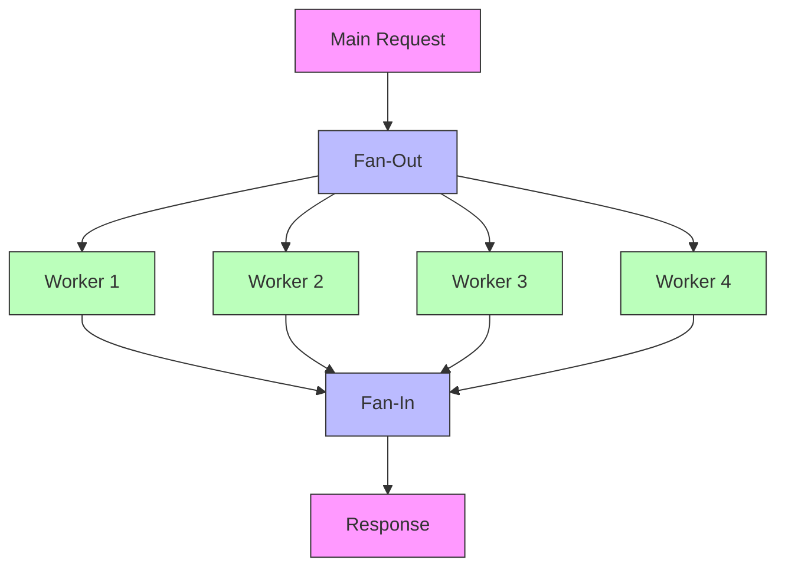

# How to Monitor Go Channels and Concurrency Patterns with OpenTelemetry

Author: [nawazdhandala](https://www.github.com/nawazdhandala)

Tags: OpenTelemetry, Go, Channels, Concurrency, Monitoring, Goroutines

Description: Learn advanced techniques for monitoring Go channels, goroutines, and concurrency patterns using OpenTelemetry to debug performance issues in concurrent systems.

Go's concurrency model with goroutines and channels makes it powerful for building concurrent systems, but this same power creates observability challenges. When dozens or hundreds of goroutines communicate through channels, tracking data flow and identifying bottlenecks becomes difficult. OpenTelemetry provides tools to instrument these patterns and make concurrent operations visible.

## Challenges in Monitoring Go Concurrency

Traditional observability focuses on request-response patterns, but Go's concurrency introduces unique challenges:

- Goroutines operate independently with no inherent parent-child relationship
- Channel operations are invisible without instrumentation
- Context switching between goroutines loses trace continuity
- Deadlocks and channel blocking are hard to detect
- Worker pool utilization isn't directly observable

## Setting Up OpenTelemetry for Concurrency Monitoring

Start with a solid OpenTelemetry foundation that includes both tracing and metrics.

```go
package main

import (
    "context"
    "log"

    "go.opentelemetry.io/otel"
    "go.opentelemetry.io/otel/exporters/otlp/otlpmetric/otlpmetricgrpc"
    "go.opentelemetry.io/otel/exporters/otlp/otlptrace/otlptracegrpc"
    "go.opentelemetry.io/otel/sdk/metric"
    "go.opentelemetry.io/otel/sdk/resource"
    sdktrace "go.opentelemetry.io/otel/sdk/trace"
    semconv "go.opentelemetry.io/otel/semconv/v1.21.0"
)

// Initialize OpenTelemetry with both tracing and metrics
func initObservability(serviceName string) (*sdktrace.TracerProvider, *metric.MeterProvider, error) {
    ctx := context.Background()

    // Create resource with service information
    res, err := resource.New(ctx,
        resource.WithAttributes(
            semconv.ServiceNameKey.String(serviceName),
            semconv.ServiceVersionKey.String("1.0.0"),
        ),
    )
    if err != nil {
        return nil, nil, err
    }

    // Initialize trace provider
    traceExporter, err := otlptracegrpc.New(ctx,
        otlptracegrpc.WithEndpoint("localhost:4317"),
        otlptracegrpc.WithInsecure(),
    )
    if err != nil {
        return nil, nil, err
    }

    tp := sdktrace.NewTracerProvider(
        sdktrace.WithBatcher(traceExporter),
        sdktrace.WithResource(res),
    )
    otel.SetTracerProvider(tp)

    // Initialize metric provider
    metricExporter, err := otlpmetricgrpc.New(ctx,
        otlpmetricgrpc.WithEndpoint("localhost:4317"),
        otlpmetricgrpc.WithInsecure(),
    )
    if err != nil {
        return nil, nil, err
    }

    mp := metric.NewMeterProvider(
        metric.WithReader(metric.NewPeriodicReader(metricExporter)),
        metric.WithResource(res),
    )
    otel.SetMeterProvider(mp)

    return tp, mp, nil
}
```

## Instrumenting Channel Operations

Channels are the primary communication mechanism between goroutines. Wrapping channel operations with spans makes data flow visible.

```go
package main

import (
    "context"
    "fmt"

    "go.opentelemetry.io/otel"
    "go.opentelemetry.io/otel/attribute"
    "go.opentelemetry.io/otel/metric"
    "go.opentelemetry.io/otel/trace"
)

// InstrumentedChannel wraps a channel with observability
type InstrumentedChannel[T any] struct {
    ch              chan T
    name            string
    tracer          trace.Tracer
    sendCounter     metric.Int64Counter
    receiveCounter  metric.Int64Counter
    bufferGauge     metric.Int64Gauge
}

// NewInstrumentedChannel creates a channel with observability
func NewInstrumentedChannel[T any](name string, size int) (*InstrumentedChannel[T], error) {
    meter := otel.Meter("concurrency")
    tracer := otel.Tracer("concurrency")

    sendCounter, err := meter.Int64Counter(
        "channel.send",
        metric.WithDescription("Number of items sent to channel"),
    )
    if err != nil {
        return nil, err
    }

    receiveCounter, err := meter.Int64Counter(
        "channel.receive",
        metric.WithDescription("Number of items received from channel"),
    )
    if err != nil {
        return nil, err
    }

    bufferGauge, err := meter.Int64Gauge(
        "channel.buffer.size",
        metric.WithDescription("Current buffer size of channel"),
    )
    if err != nil {
        return nil, err
    }

    return &InstrumentedChannel[T]{
        ch:             make(chan T, size),
        name:           name,
        tracer:         tracer,
        sendCounter:    sendCounter,
        receiveCounter: receiveCounter,
        bufferGauge:    bufferGauge,
    }, nil
}

// Send sends a value with tracing
func (ic *InstrumentedChannel[T]) Send(ctx context.Context, value T) error {
    // Create span for send operation
    ctx, span := ic.tracer.Start(ctx, fmt.Sprintf("channel.%s.send", ic.name),
        trace.WithAttributes(
            attribute.String("channel.name", ic.name),
            attribute.String("operation", "send"),
        ),
    )
    defer span.End()

    // Record send metric
    ic.sendCounter.Add(ctx, 1,
        metric.WithAttributes(attribute.String("channel", ic.name)),
    )

    // Attempt to send (this will block if channel is full)
    select {
    case ic.ch <- value:
        span.SetAttributes(attribute.Bool("blocked", false))

        // Update buffer size
        ic.bufferGauge.Record(ctx, int64(len(ic.ch)),
            metric.WithAttributes(attribute.String("channel", ic.name)),
        )

        return nil
    case <-ctx.Done():
        span.SetAttributes(attribute.Bool("cancelled", true))
        return ctx.Err()
    }
}

// Receive receives a value with tracing
func (ic *InstrumentedChannel[T]) Receive(ctx context.Context) (T, error) {
    ctx, span := ic.tracer.Start(ctx, fmt.Sprintf("channel.%s.receive", ic.name),
        trace.WithAttributes(
            attribute.String("channel.name", ic.name),
            attribute.String("operation", "receive"),
        ),
    )
    defer span.End()

    // Attempt to receive (this will block if channel is empty)
    select {
    case value := <-ic.ch:
        span.SetAttributes(attribute.Bool("blocked", false))

        // Record receive metric
        ic.receiveCounter.Add(ctx, 1,
            metric.WithAttributes(attribute.String("channel", ic.name)),
        )

        // Update buffer size
        ic.bufferGauge.Record(ctx, int64(len(ic.ch)),
            metric.WithAttributes(attribute.String("channel", ic.name)),
        )

        return value, nil
    case <-ctx.Done():
        var zero T
        span.SetAttributes(attribute.Bool("cancelled", true))
        return zero, ctx.Err()
    }
}

// Close closes the channel
func (ic *InstrumentedChannel[T]) Close() {
    close(ic.ch)
}

// GetChannel returns the underlying channel for select operations
func (ic *InstrumentedChannel[T]) GetChannel() <-chan T {
    return ic.ch
}
```

## Monitoring Worker Pool Patterns

Worker pools are common in Go applications. Instrumenting them reveals utilization and performance characteristics.

```go
package main

import (
    "context"
    "fmt"
    "sync"
    "time"

    "go.opentelemetry.io/otel"
    "go.opentelemetry.io/otel/attribute"
    "go.opentelemetry.io/otel/metric"
    "go.opentelemetry.io/otel/trace"
)

// Task represents work to be processed
type Task struct {
    ID      string
    Payload interface{}
}

// WorkerPool manages a pool of goroutines with observability
type WorkerPool struct {
    name          string
    numWorkers    int
    tasks         chan Task
    tracer        trace.Tracer
    wg            sync.WaitGroup
    activeWorkers metric.Int64UpDownCounter
    queueSize     metric.Int64Gauge
    taskDuration  metric.Float64Histogram
    ctx           context.Context
    cancel        context.CancelFunc
}

// NewWorkerPool creates an instrumented worker pool
func NewWorkerPool(name string, numWorkers, queueSize int) (*WorkerPool, error) {
    meter := otel.Meter("concurrency")
    tracer := otel.Tracer("concurrency")

    activeWorkers, err := meter.Int64UpDownCounter(
        "worker_pool.active_workers",
        metric.WithDescription("Number of active workers processing tasks"),
    )
    if err != nil {
        return nil, err
    }

    queueGauge, err := meter.Int64Gauge(
        "worker_pool.queue_size",
        metric.WithDescription("Current number of tasks in queue"),
    )
    if err != nil {
        return nil, err
    }

    taskDuration, err := meter.Float64Histogram(
        "worker_pool.task_duration",
        metric.WithDescription("Task processing duration in seconds"),
        metric.WithUnit("s"),
    )
    if err != nil {
        return nil, err
    }

    ctx, cancel := context.WithCancel(context.Background())

    return &WorkerPool{
        name:          name,
        numWorkers:    numWorkers,
        tasks:         make(chan Task, queueSize),
        tracer:        tracer,
        activeWorkers: activeWorkers,
        queueSize:     queueGauge,
        taskDuration:  taskDuration,
        ctx:           ctx,
        cancel:        cancel,
    }, nil
}

// Start launches the worker goroutines
func (wp *WorkerPool) Start(handler func(context.Context, Task) error) {
    for i := 0; i < wp.numWorkers; i++ {
        workerID := fmt.Sprintf("worker-%d", i)
        wp.wg.Add(1)

        go wp.worker(workerID, handler)
    }

    // Start background goroutine to monitor queue size
    go wp.monitorQueue()
}

// worker processes tasks from the queue
func (wp *WorkerPool) worker(workerID string, handler func(context.Context, Task) error) {
    defer wp.wg.Done()

    attrs := metric.WithAttributes(
        attribute.String("pool", wp.name),
        attribute.String("worker", workerID),
    )

    for {
        select {
        case task, ok := <-wp.tasks:
            if !ok {
                return
            }

            // Mark worker as active
            wp.activeWorkers.Add(wp.ctx, 1, attrs)

            // Process task with tracing
            wp.processTask(workerID, task, handler)

            // Mark worker as idle
            wp.activeWorkers.Add(wp.ctx, -1, attrs)

        case <-wp.ctx.Done():
            return
        }
    }
}

// processTask handles a single task with full instrumentation
func (wp *WorkerPool) processTask(workerID string, task Task, handler func(context.Context, Task) error) {
    start := time.Now()

    ctx, span := wp.tracer.Start(wp.ctx, fmt.Sprintf("pool.%s.task", wp.name),
        trace.WithAttributes(
            attribute.String("pool.name", wp.name),
            attribute.String("worker.id", workerID),
            attribute.String("task.id", task.ID),
        ),
    )
    defer span.End()

    // Execute task handler
    err := handler(ctx, task)

    duration := time.Since(start).Seconds()

    // Record metrics
    wp.taskDuration.Record(ctx, duration,
        metric.WithAttributes(
            attribute.String("pool", wp.name),
            attribute.String("task_id", task.ID),
            attribute.Bool("success", err == nil),
        ),
    )

    if err != nil {
        span.RecordError(err)
        span.SetAttributes(attribute.Bool("error", true))
    }
}

// Submit adds a task to the pool
func (wp *WorkerPool) Submit(ctx context.Context, task Task) error {
    ctx, span := wp.tracer.Start(ctx, fmt.Sprintf("pool.%s.submit", wp.name),
        trace.WithAttributes(
            attribute.String("pool.name", wp.name),
            attribute.String("task.id", task.ID),
        ),
    )
    defer span.End()

    select {
    case wp.tasks <- task:
        span.SetAttributes(attribute.Bool("queued", true))
        return nil
    case <-ctx.Done():
        span.SetAttributes(attribute.Bool("cancelled", true))
        return ctx.Err()
    case <-wp.ctx.Done():
        span.SetAttributes(attribute.Bool("shutdown", true))
        return fmt.Errorf("worker pool is shutting down")
    }
}

// monitorQueue periodically records queue size
func (wp *WorkerPool) monitorQueue() {
    ticker := time.NewTicker(1 * time.Second)
    defer ticker.Stop()

    attrs := metric.WithAttributes(attribute.String("pool", wp.name))

    for {
        select {
        case <-ticker.C:
            wp.queueSize.Record(wp.ctx, int64(len(wp.tasks)), attrs)
        case <-wp.ctx.Done():
            return
        }
    }
}

// Shutdown gracefully stops the worker pool
func (wp *WorkerPool) Shutdown(ctx context.Context) error {
    close(wp.tasks)

    done := make(chan struct{})
    go func() {
        wp.wg.Wait()
        close(done)
    }()

    select {
    case <-done:
        wp.cancel()
        return nil
    case <-ctx.Done():
        wp.cancel()
        return ctx.Err()
    }
}
```

## Tracing Fan-Out/Fan-In Patterns

Fan-out/fan-in is a common pattern where work is distributed across multiple goroutines and results are collected. Proper instrumentation shows parallel execution and aggregation.

```go
package main

import (
    "context"
    "fmt"
    "sync"

    "go.opentelemetry.io/otel"
    "go.opentelemetry.io/otel/attribute"
    "go.opentelemetry.io/otel/trace"
)

// FanOutResult represents a result from a fan-out operation
type FanOutResult struct {
    WorkerID int
    Result   interface{}
    Error    error
}

// FanOut distributes work across multiple goroutines with tracing
func FanOut[T any, R any](
    ctx context.Context,
    workItems []T,
    numWorkers int,
    processor func(context.Context, T) (R, error),
) ([]R, error) {
    tracer := otel.Tracer("concurrency")

    ctx, span := tracer.Start(ctx, "fan_out",
        trace.WithAttributes(
            attribute.Int("work_items", len(workItems)),
            attribute.Int("num_workers", numWorkers),
        ),
    )
    defer span.End()

    // Create channels for work distribution and result collection
    workChan := make(chan T, len(workItems))
    resultChan := make(chan FanOutResult, len(workItems))

    // Fan-out: Start workers
    var wg sync.WaitGroup
    for i := 0; i < numWorkers; i++ {
        wg.Add(1)
        workerID := i

        go func() {
            defer wg.Done()

            // Each worker creates its own span
            workerCtx, workerSpan := tracer.Start(ctx, fmt.Sprintf("worker.%d", workerID),
                trace.WithAttributes(
                    attribute.Int("worker.id", workerID),
                ),
            )
            defer workerSpan.End()

            itemsProcessed := 0

            for work := range workChan {
                // Process each item with a child span
                itemCtx, itemSpan := tracer.Start(workerCtx, "process_item",
                    trace.WithAttributes(
                        attribute.Int("worker.id", workerID),
                    ),
                )

                result, err := processor(itemCtx, work)
                itemSpan.End()

                resultChan <- FanOutResult{
                    WorkerID: workerID,
                    Result:   result,
                    Error:    err,
                }

                itemsProcessed++
            }

            workerSpan.SetAttributes(attribute.Int("items_processed", itemsProcessed))
        }()
    }

    // Distribute work
    for _, item := range workItems {
        workChan <- item
    }
    close(workChan)

    // Wait for workers to complete
    go func() {
        wg.Wait()
        close(resultChan)
    }()

    // Fan-in: Collect results
    _, collectSpan := tracer.Start(ctx, "collect_results")

    results := make([]R, 0, len(workItems))
    var firstError error

    for result := range resultChan {
        if result.Error != nil && firstError == nil {
            firstError = result.Error
            collectSpan.RecordError(result.Error)
        }

        if result.Error == nil {
            results = append(results, result.Result.(R))
        }
    }

    collectSpan.SetAttributes(attribute.Int("results_collected", len(results)))
    collectSpan.End()

    if firstError != nil {
        span.RecordError(firstError)
        return nil, firstError
    }

    return results, nil
}
```

## Monitoring Pipeline Patterns

Pipelines chain multiple processing stages together. Each stage should be observable to identify bottlenecks.

```go
package main

import (
    "context"
    "fmt"

    "go.opentelemetry.io/otel"
    "go.opentelemetry.io/otel/attribute"
    "go.opentelemetry.io/otel/trace"
)

// Stage represents a processing stage in the pipeline
type Stage[In any, Out any] struct {
    name      string
    processor func(context.Context, In) (Out, error)
    tracer    trace.Tracer
}

// NewStage creates a new pipeline stage
func NewStage[In any, Out any](name string, processor func(context.Context, In) (Out, error)) *Stage[In, Out] {
    return &Stage[In, Out]{
        name:      name,
        processor: processor,
        tracer:    otel.Tracer("pipeline"),
    }
}

// Process executes the stage with tracing
func (s *Stage[In, Out]) Process(ctx context.Context, input In) (Out, error) {
    ctx, span := s.tracer.Start(ctx, fmt.Sprintf("stage.%s", s.name),
        trace.WithAttributes(
            attribute.String("stage.name", s.name),
        ),
    )
    defer span.End()

    result, err := s.processor(ctx, input)

    if err != nil {
        span.RecordError(err)
        span.SetAttributes(attribute.Bool("error", true))
    }

    return result, err
}

// Pipeline chains multiple stages together
type Pipeline struct {
    name   string
    tracer trace.Tracer
}

// NewPipeline creates a new pipeline
func NewPipeline(name string) *Pipeline {
    return &Pipeline{
        name:   name,
        tracer: otel.Tracer("pipeline"),
    }
}

// Example: Three-stage pipeline for data processing
func (p *Pipeline) ProcessData(ctx context.Context, rawData string) (string, error) {
    ctx, span := p.tracer.Start(ctx, fmt.Sprintf("pipeline.%s", p.name),
        trace.WithAttributes(
            attribute.String("pipeline.name", p.name),
        ),
    )
    defer span.End()

    // Stage 1: Parse
    parseStage := NewStage("parse", func(ctx context.Context, data string) (map[string]interface{}, error) {
        // Parse logic
        return map[string]interface{}{"parsed": data}, nil
    })

    parsed, err := parseStage.Process(ctx, rawData)
    if err != nil {
        return "", err
    }

    // Stage 2: Transform
    transformStage := NewStage("transform", func(ctx context.Context, data map[string]interface{}) (map[string]interface{}, error) {
        // Transform logic
        data["transformed"] = true
        return data, nil
    })

    transformed, err := transformStage.Process(ctx, parsed)
    if err != nil {
        return "", err
    }

    // Stage 3: Serialize
    serializeStage := NewStage("serialize", func(ctx context.Context, data map[string]interface{}) (string, error) {
        // Serialize logic
        return fmt.Sprintf("%v", data), nil
    })

    result, err := serializeStage.Process(ctx, transformed)
    if err != nil {
        return "", err
    }

    span.SetAttributes(attribute.Bool("success", true))
    return result, nil
}
```

## Detecting Goroutine Leaks

Goroutine leaks are a common issue in concurrent Go programs. Tracking goroutine counts helps detect leaks early.

```go
package main

import (
    "context"
    "runtime"
    "time"

    "go.opentelemetry.io/otel"
    "go.opentelemetry.io/otel/attribute"
    "go.opentelemetry.io/otel/metric"
)

// GoroutineMonitor tracks goroutine metrics
type GoroutineMonitor struct {
    goroutineGauge metric.Int64Gauge
    ticker         *time.Ticker
    done           chan struct{}
}

// NewGoroutineMonitor creates a goroutine monitor
func NewGoroutineMonitor() (*GoroutineMonitor, error) {
    meter := otel.Meter("runtime")

    goroutineGauge, err := meter.Int64Gauge(
        "runtime.goroutines",
        metric.WithDescription("Number of goroutines currently running"),
    )
    if err != nil {
        return nil, err
    }

    return &GoroutineMonitor{
        goroutineGauge: goroutineGauge,
        done:           make(chan struct{}),
    }, nil
}

// Start begins monitoring goroutines
func (gm *GoroutineMonitor) Start(interval time.Duration) {
    gm.ticker = time.NewTicker(interval)

    go func() {
        for {
            select {
            case <-gm.ticker.C:
                count := runtime.NumGoroutine()
                gm.goroutineGauge.Record(context.Background(), int64(count),
                    metric.WithAttributes(
                        attribute.String("runtime", "go"),
                    ),
                )
            case <-gm.done:
                return
            }
        }
    }()
}

// Stop stops the monitor
func (gm *GoroutineMonitor) Stop() {
    if gm.ticker != nil {
        gm.ticker.Stop()
    }
    close(gm.done)
}
```

## Complete Example: Concurrent Data Processor

Here's a complete example combining all patterns.

```go
package main

import (
    "context"
    "fmt"
    "log"
    "time"
)

func main() {
    // Initialize observability
    tp, mp, err := initObservability("data-processor")
    if err != nil {
        log.Fatal(err)
    }
    defer tp.Shutdown(context.Background())
    defer mp.Shutdown(context.Background())

    // Start goroutine monitoring
    monitor, _ := NewGoroutineMonitor()
    monitor.Start(5 * time.Second)
    defer monitor.Stop()

    // Create worker pool
    pool, err := NewWorkerPool("data-processing", 10, 100)
    if err != nil {
        log.Fatal(err)
    }

    // Start workers
    pool.Start(func(ctx context.Context, task Task) error {
        // Simulate work
        time.Sleep(100 * time.Millisecond)
        fmt.Printf("Processed task: %s\n", task.ID)
        return nil
    })

    // Submit tasks
    ctx := context.Background()
    for i := 0; i < 50; i++ {
        task := Task{
            ID:      fmt.Sprintf("task-%d", i),
            Payload: fmt.Sprintf("data-%d", i),
        }

        if err := pool.Submit(ctx, task); err != nil {
            log.Printf("Failed to submit task: %v", err)
        }
    }

    // Wait before shutdown
    time.Sleep(10 * time.Second)

    // Graceful shutdown
    shutdownCtx, cancel := context.WithTimeout(context.Background(), 30*time.Second)
    defer cancel()

    if err := pool.Shutdown(shutdownCtx); err != nil {
        log.Printf("Error during shutdown: %v", err)
    }

    log.Println("All tasks completed")
}
```

## Visualization of Concurrent Traces

Properly instrumented concurrent Go code produces traces that show parallel execution:



Monitoring Go's concurrency primitives with OpenTelemetry transforms invisible goroutine and channel operations into observable, debuggable traces. By instrumenting channels, worker pools, and concurrency patterns, you gain the visibility needed to optimize performance, detect leaks, and debug complex concurrent systems.
