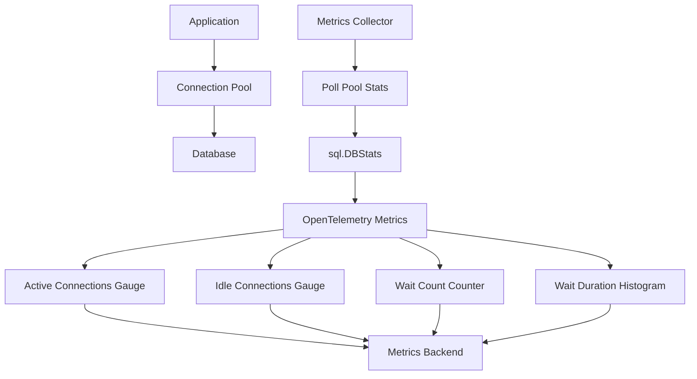

# How to Monitor Go Connection Pools with OpenTelemetry Metrics

Author: [nawazdhandala](https://www.github.com/nawazdhandala)

Tags: OpenTelemetry, Go, Connection Pool, Metrics, Database, Monitoring

Description: Implement comprehensive monitoring of database connection pools using OpenTelemetry metrics to track utilization, wait times, and connection lifecycle events for optimal resource management.

Database connection pools are critical resources in any application. Pool exhaustion leads to request timeouts and service degradation, while oversized pools waste memory and database connections. Yet most applications run blind, with no visibility into how their connection pools behave under real production load.

OpenTelemetry metrics provide the instrumentation you need to monitor pool health in real-time. By tracking connection acquisition times, pool utilization, connection lifetimes, and error rates, you can right-size your pools, detect resource leaks, and respond to capacity issues before they impact users.

## Connection Pool Metrics Architecture

Modern database drivers expose pool statistics through their stats interfaces. OpenTelemetry can collect these statistics periodically and export them as metrics, giving you time-series data about pool behavior.



The metrics collector polls `sql.DBStats` at regular intervals, transforms the statistics into OpenTelemetry metrics, and exports them to your observability backend where you can create dashboards and alerts.

## Setting Up OpenTelemetry Metrics

Initialize the OpenTelemetry metrics SDK with an OTLP exporter configured for metric data.

```go
package main

import (
    "context"
    "database/sql"
    "fmt"
    "log"
    "time"

    _ "github.com/lib/pq"
    "go.opentelemetry.io/otel"
    "go.opentelemetry.io/otel/attribute"
    "go.opentelemetry.io/otel/exporters/otlp/otlpmetric/otlpmetricgrpc"
    "go.opentelemetry.io/otel/metric"
    sdkmetric "go.opentelemetry.io/otel/sdk/metric"
    "go.opentelemetry.io/otel/sdk/resource"
    semconv "go.opentelemetry.io/otel/semconv/v1.21.0"
)

// Initialize OpenTelemetry metrics with OTLP exporter
func initMeter() (*sdkmetric.MeterProvider, error) {
    ctx := context.Background()

    exporter, err := otlpmetricgrpc.New(ctx,
        otlpmetricgrpc.WithEndpoint("localhost:4317"),
        otlpmetricgrpc.WithInsecure(),
    )
    if err != nil {
        return nil, fmt.Errorf("creating OTLP metric exporter: %w", err)
    }

    res, err := resource.New(ctx,
        resource.WithAttributes(
            semconv.ServiceName("database-service"),
            semconv.ServiceVersion("1.0.0"),
            attribute.String("environment", "production"),
        ),
    )
    if err != nil {
        return nil, fmt.Errorf("creating resource: %w", err)
    }

    // Create meter provider with periodic reader
    mp := sdkmetric.NewMeterProvider(
        sdkmetric.WithResource(res),
        sdkmetric.WithReader(
            sdkmetric.NewPeriodicReader(
                exporter,
                sdkmetric.WithInterval(10*time.Second), // Export every 10 seconds
            ),
        ),
    )

    otel.SetMeterProvider(mp)

    return mp, nil
}
```

The meter provider is configured with a periodic reader that collects and exports metrics every 10 seconds, providing near-real-time visibility into pool behavior.

## Creating Connection Pool Metrics

Build a metrics collector that tracks all relevant connection pool statistics.

```go
// PoolMetrics holds OpenTelemetry metric instruments for connection pool monitoring
type PoolMetrics struct {
    // Gauge metrics for current state
    openConnections  metric.Int64Gauge
    inUseConnections metric.Int64Gauge
    idleConnections  metric.Int64Gauge

    // Counter metrics for cumulative events
    totalWaitCount    metric.Int64Counter
    totalWaitDuration metric.Float64Counter
    closedMaxIdle     metric.Int64Counter
    closedMaxIdleTime metric.Int64Counter
    closedMaxLifetime metric.Int64Counter

    // Histogram for connection acquisition time
    acquireDuration metric.Float64Histogram

    // Meter for creating instruments
    meter metric.Meter

    // Database name for labeling
    dbName string
}

// NewPoolMetrics creates metric instruments for a connection pool
func NewPoolMetrics(dbName string) (*PoolMetrics, error) {
    meter := otel.Meter("database.connection.pool")

    pm := &PoolMetrics{
        meter:  meter,
        dbName: dbName,
    }

    var err error

    // Create gauge for open connections
    pm.openConnections, err = meter.Int64Gauge(
        "db.pool.connections.open",
        metric.WithDescription("Number of established connections in the pool"),
        metric.WithUnit("{connection}"),
    )
    if err != nil {
        return nil, fmt.Errorf("creating open connections gauge: %w", err)
    }

    // Create gauge for in-use connections
    pm.inUseConnections, err = meter.Int64Gauge(
        "db.pool.connections.in_use",
        metric.WithDescription("Number of connections currently in use"),
        metric.WithUnit("{connection}"),
    )
    if err != nil {
        return nil, fmt.Errorf("creating in-use connections gauge: %w", err)
    }

    // Create gauge for idle connections
    pm.idleConnections, err = meter.Int64Gauge(
        "db.pool.connections.idle",
        metric.WithDescription("Number of idle connections in the pool"),
        metric.WithUnit("{connection}"),
    )
    if err != nil {
        return nil, fmt.Errorf("creating idle connections gauge: %w", err)
    }

    // Create counter for wait count
    pm.totalWaitCount, err = meter.Int64Counter(
        "db.pool.wait.count",
        metric.WithDescription("Total number of times waited for a connection"),
        metric.WithUnit("{wait}"),
    )
    if err != nil {
        return nil, fmt.Errorf("creating wait count counter: %w", err)
    }

    // Create counter for wait duration
    pm.totalWaitDuration, err = meter.Float64Counter(
        "db.pool.wait.duration",
        metric.WithDescription("Total time spent waiting for connections"),
        metric.WithUnit("ms"),
    )
    if err != nil {
        return nil, fmt.Errorf("creating wait duration counter: %w", err)
    }

    // Create counters for connection closures
    pm.closedMaxIdle, err = meter.Int64Counter(
        "db.pool.connections.closed.max_idle",
        metric.WithDescription("Connections closed due to max idle limit"),
        metric.WithUnit("{connection}"),
    )
    if err != nil {
        return nil, fmt.Errorf("creating closed max idle counter: %w", err)
    }

    pm.closedMaxIdleTime, err = meter.Int64Counter(
        "db.pool.connections.closed.max_idle_time",
        metric.WithDescription("Connections closed due to max idle time"),
        metric.WithUnit("{connection}"),
    )
    if err != nil {
        return nil, fmt.Errorf("creating closed max idle time counter: %w", err)
    }

    pm.closedMaxLifetime, err = meter.Int64Counter(
        "db.pool.connections.closed.max_lifetime",
        metric.WithDescription("Connections closed due to max lifetime"),
        metric.WithUnit("{connection}"),
    )
    if err != nil {
        return nil, fmt.Errorf("creating closed max lifetime counter: %w", err)
    }

    // Create histogram for connection acquisition duration
    pm.acquireDuration, err = meter.Float64Histogram(
        "db.pool.connection.acquire.duration",
        metric.WithDescription("Time taken to acquire a connection from the pool"),
        metric.WithUnit("ms"),
    )
    if err != nil {
        return nil, fmt.Errorf("creating acquire duration histogram: %w", err)
    }

    return pm, nil
}
```

Each metric instrument is carefully configured with descriptions and units that follow OpenTelemetry semantic conventions, ensuring consistency across different observability platforms.

## Recording Pool Statistics

Implement a collector that periodically reads pool statistics and records them as metrics.

```go
// PoolMonitor continuously monitors connection pool statistics
type PoolMonitor struct {
    db            *sql.DB
    metrics       *PoolMetrics
    interval      time.Duration
    lastStats     sql.DBStats
    stopCh        chan struct{}
    dbName        string
    maxOpenConns  int
    maxIdleConns  int
}

// NewPoolMonitor creates a new connection pool monitor
func NewPoolMonitor(db *sql.DB, dbName string, maxOpenConns, maxIdleConns int) (*PoolMonitor, error) {
    metrics, err := NewPoolMetrics(dbName)
    if err != nil {
        return nil, err
    }

    return &PoolMonitor{
        db:           db,
        metrics:      metrics,
        interval:     10 * time.Second,
        stopCh:       make(chan struct{}),
        dbName:       dbName,
        maxOpenConns: maxOpenConns,
        maxIdleConns: maxIdleConns,
    }, nil
}

// Start begins collecting pool metrics
func (pm *PoolMonitor) Start(ctx context.Context) {
    ticker := time.NewTicker(pm.interval)
    defer ticker.Stop()

    // Record initial stats
    pm.lastStats = pm.db.Stats()

    for {
        select {
        case <-ctx.Done():
            return
        case <-pm.stopCh:
            return
        case <-ticker.C:
            pm.recordMetrics(ctx)
        }
    }
}

// Stop halts metric collection
func (pm *PoolMonitor) Stop() {
    close(pm.stopCh)
}

// recordMetrics reads current pool stats and records them as metrics
func (pm *PoolMonitor) recordMetrics(ctx context.Context) {
    stats := pm.db.Stats()

    // Common attributes for all metrics
    attrs := metric.WithAttributes(
        attribute.String("db.name", pm.dbName),
        attribute.String("db.system", "postgresql"),
    )

    // Record gauge metrics (current state)
    pm.metrics.openConnections.Record(ctx, int64(stats.OpenConnections), attrs)
    pm.metrics.inUseConnections.Record(ctx, int64(stats.InUse), attrs)
    pm.metrics.idleConnections.Record(ctx, int64(stats.Idle), attrs)

    // Record counter deltas (changes since last collection)
    waitCountDelta := stats.WaitCount - pm.lastStats.WaitCount
    if waitCountDelta > 0 {
        pm.metrics.totalWaitCount.Add(ctx, waitCountDelta, attrs)
    }

    waitDurationDelta := stats.WaitDuration - pm.lastStats.WaitDuration
    if waitDurationDelta > 0 {
        pm.metrics.totalWaitDuration.Add(ctx,
            float64(waitDurationDelta.Milliseconds()), attrs)
    }

    closedMaxIdleDelta := stats.MaxIdleClosed - pm.lastStats.MaxIdleClosed
    if closedMaxIdleDelta > 0 {
        pm.metrics.closedMaxIdle.Add(ctx, closedMaxIdleDelta, attrs)
    }

    closedMaxIdleTimeDelta := stats.MaxIdleTimeClosed - pm.lastStats.MaxIdleTimeClosed
    if closedMaxIdleTimeDelta > 0 {
        pm.metrics.closedMaxIdleTime.Add(ctx, closedMaxIdleTimeDelta, attrs)
    }

    closedMaxLifetimeDelta := stats.MaxLifetimeClosed - pm.lastStats.MaxLifetimeClosed
    if closedMaxLifetimeDelta > 0 {
        pm.metrics.closedMaxLifetime.Add(ctx, closedMaxLifetimeDelta, attrs)
    }

    // Calculate and log utilization metrics
    utilizationPercent := float64(stats.InUse) / float64(pm.maxOpenConns) * 100
    idlePercent := float64(stats.Idle) / float64(pm.maxIdleConns) * 100

    log.Printf("Pool stats - Open: %d, InUse: %d (%.1f%%), Idle: %d (%.1f%%), Wait: %d",
        stats.OpenConnections, stats.InUse, utilizationPercent,
        stats.Idle, idlePercent, stats.WaitCount)

    // Store current stats for next delta calculation
    pm.lastStats = stats
}
```

The monitor calculates deltas between collection intervals for counter metrics, ensuring accurate cumulative counts rather than reporting absolute values that would cause double-counting.

## Instrumenting Connection Acquisition

Create a wrapper that measures connection acquisition time and records it as a histogram.

```go
// InstrumentedDB wraps sql.DB with OpenTelemetry instrumentation
type InstrumentedDB struct {
    *sql.DB
    metrics *PoolMetrics
    dbName  string
}

// NewInstrumentedDB creates a database connection with metrics
func NewInstrumentedDB(driver, dsn, dbName string, maxOpen, maxIdle int) (*InstrumentedDB, error) {
    db, err := sql.Open(driver, dsn)
    if err != nil {
        return nil, fmt.Errorf("opening database: %w", err)
    }

    // Configure connection pool
    db.SetMaxOpenConns(maxOpen)
    db.SetMaxIdleConns(maxIdle)
    db.SetConnMaxLifetime(time.Hour)
    db.SetConnMaxIdleTime(10 * time.Minute)

    // Verify connection
    if err := db.Ping(); err != nil {
        return nil, fmt.Errorf("pinging database: %w", err)
    }

    metrics, err := NewPoolMetrics(dbName)
    if err != nil {
        return nil, err
    }

    return &InstrumentedDB{
        DB:      db,
        metrics: metrics,
        dbName:  dbName,
    }, nil
}

// QueryContext executes a query with connection acquisition timing
func (idb *InstrumentedDB) QueryContext(ctx context.Context, query string, args ...interface{}) (*sql.Rows, error) {
    start := time.Now()

    rows, err := idb.DB.QueryContext(ctx, query, args...)

    duration := time.Since(start)
    attrs := metric.WithAttributes(
        attribute.String("db.name", idb.dbName),
        attribute.String("db.operation", "query"),
    )

    idb.metrics.acquireDuration.Record(ctx, float64(duration.Milliseconds()), attrs)

    return rows, err
}

// ExecContext executes a statement with connection acquisition timing
func (idb *InstrumentedDB) ExecContext(ctx context.Context, query string, args ...interface{}) (sql.Result, error) {
    start := time.Now()

    result, err := idb.DB.ExecContext(ctx, query, args...)

    duration := time.Since(start)
    attrs := metric.WithAttributes(
        attribute.String("db.name", idb.dbName),
        attribute.String("db.operation", "exec"),
    )

    idb.metrics.acquireDuration.Record(ctx, float64(duration.Milliseconds()), attrs)

    return result, err
}

// BeginTxContext starts a transaction with metrics
func (idb *InstrumentedDB) BeginTxContext(ctx context.Context, opts *sql.TxOptions) (*sql.Tx, error) {
    start := time.Now()

    tx, err := idb.DB.BeginTxContext(ctx, opts)

    duration := time.Since(start)
    attrs := metric.WithAttributes(
        attribute.String("db.name", idb.dbName),
        attribute.String("db.operation", "begin_tx"),
    )

    idb.metrics.acquireDuration.Record(ctx, float64(duration.Milliseconds()), attrs)

    return tx, err
}
```

The instrumented database wrapper measures how long it takes to acquire a connection from the pool, which includes both the time spent waiting for an available connection and the time to establish a new connection if the pool needs to grow.

## Complete Application Setup

Wire everything together in a working application that monitors multiple database pools.

```go
func main() {
    // Initialize OpenTelemetry metrics
    mp, err := initMeter()
    if err != nil {
        log.Fatalf("Failed to initialize meter: %v", err)
    }
    defer func() {
        if err := mp.Shutdown(context.Background()); err != nil {
            log.Printf("Error shutting down meter provider: %v", err)
        }
    }()

    // Create primary database connection
    primaryDB, err := NewInstrumentedDB(
        "postgres",
        "postgresql://localhost/primary_db?sslmode=disable",
        "primary",
        25,  // max open connections
        10,  // max idle connections
    )
    if err != nil {
        log.Fatalf("Failed to create primary database: %v", err)
    }
    defer primaryDB.Close()

    // Create replica database connection
    replicaDB, err := NewInstrumentedDB(
        "postgres",
        "postgresql://localhost/replica_db?sslmode=disable",
        "replica",
        50,  // higher limit for read replicas
        20,
    )
    if err != nil {
        log.Fatalf("Failed to create replica database: %v", err)
    }
    defer replicaDB.Close()

    // Start monitoring both pools
    ctx := context.Background()

    primaryMonitor, err := NewPoolMonitor(primaryDB.DB, "primary", 25, 10)
    if err != nil {
        log.Fatalf("Failed to create primary monitor: %v", err)
    }
    go primaryMonitor.Start(ctx)
    defer primaryMonitor.Stop()

    replicaMonitor, err := NewPoolMonitor(replicaDB.DB, "replica", 50, 20)
    if err != nil {
        log.Fatalf("Failed to create replica monitor: %v", err)
    }
    go replicaMonitor.Start(ctx)
    defer replicaMonitor.Stop()

    // Example: Run some database operations
    runDatabaseOperations(ctx, primaryDB, replicaDB)

    // Keep running
    select {}
}

func runDatabaseOperations(ctx context.Context, primary, replica *InstrumentedDB) {
    // Simulate write operations on primary
    go func() {
        ticker := time.NewTicker(100 * time.Millisecond)
        defer ticker.Stop()

        for range ticker.C {
            _, err := primary.ExecContext(ctx,
                "INSERT INTO events (data) VALUES ($1)",
                time.Now().String())
            if err != nil {
                log.Printf("Write error: %v", err)
            }
        }
    }()

    // Simulate read operations on replica
    go func() {
        ticker := time.NewTicker(50 * time.Millisecond)
        defer ticker.Stop()

        for range ticker.C {
            rows, err := replica.QueryContext(ctx,
                "SELECT id, data FROM events ORDER BY created_at DESC LIMIT 10")
            if err != nil {
                log.Printf("Read error: %v", err)
                continue
            }
            rows.Close()
        }
    }()
}
```

This setup monitors both primary and replica database pools, allowing you to compare their utilization patterns and adjust pool sizes independently.

## Analyzing Pool Metrics

The collected metrics enable several important analyses:

**Pool Utilization**: Track the ratio of in-use connections to max open connections. High utilization (>80%) indicates you may need to increase pool size. Consistently low utilization (<20%) means you can reduce pool size.

**Wait Time**: Non-zero wait counts indicate pool exhaustion. If wait duration is high, either increase pool size or investigate why connections are held for so long.

**Connection Churn**: High values for closed connections (especially max idle or max lifetime) indicate excessive connection cycling. Consider adjusting timeout parameters.

**Acquisition Time**: The p95 and p99 percentiles of acquisition duration show how long applications wait for connections under load. Values over 100ms indicate contention issues.

## Advanced Monitoring Patterns

For production systems, add custom metrics that track business-specific patterns.

```go
// PoolHealthChecker adds health check metrics
type PoolHealthChecker struct {
    db              *sql.DB
    metrics         *PoolMetrics
    healthCheckOk   metric.Int64Counter
    healthCheckFail metric.Int64Counter
}

func (phc *PoolHealthChecker) RunHealthCheck(ctx context.Context) {
    attrs := metric.WithAttributes(
        attribute.String("db.name", "primary"),
    )

    start := time.Now()
    err := phc.db.PingContext(ctx)
    duration := time.Since(start)

    if err != nil {
        phc.healthCheckFail.Add(ctx, 1, attrs)
        log.Printf("Health check failed in %v: %v", duration, err)
    } else {
        phc.healthCheckOk.Add(ctx, 1, attrs)
        if duration > 100*time.Millisecond {
            log.Printf("Health check slow: %v", duration)
        }
    }
}
```

Health check metrics complement pool statistics by showing whether the database itself is responsive, helping distinguish pool exhaustion from database performance problems.

Connection pool monitoring with OpenTelemetry transforms capacity planning from guesswork into data-driven decision making. Instead of setting arbitrary pool sizes and hoping they work, you can measure actual utilization under production load and adjust accordingly. The metrics also provide early warning of connection leaks, where applications acquire connections but fail to return them to the pool, eventually exhausting available capacity.