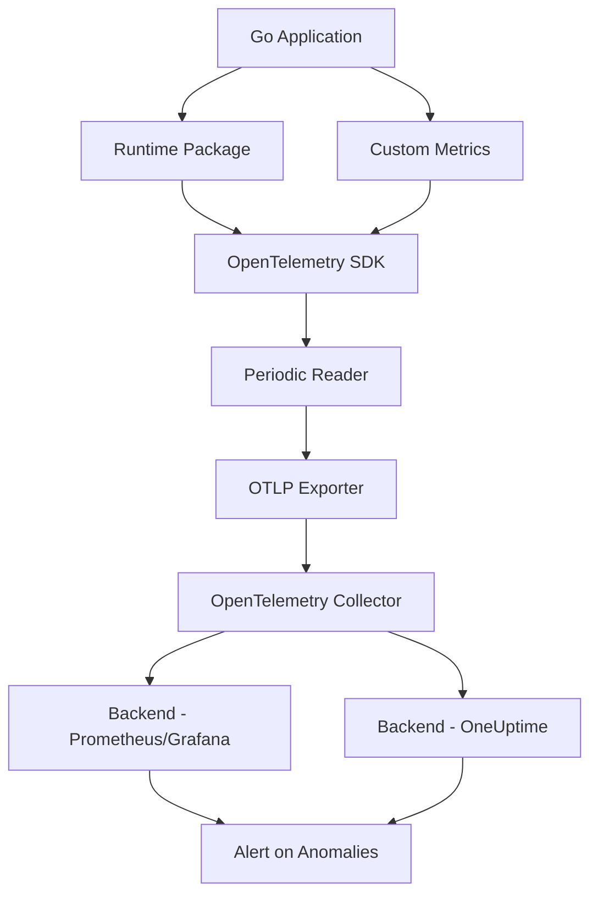

# How to Monitor Go Runtime Metrics (GC, Goroutines, Memory) with OpenTelemetry

Author: [nawazdhandala](https://www.github.com/nawazdhandala)

Tags: OpenTelemetry, Go, Runtime Metrics, GC, Goroutines, Memory

Description: Learn how to capture and monitor Go runtime metrics including garbage collection, goroutine counts, and memory usage using OpenTelemetry for better application observability.

Go applications have unique runtime characteristics that require careful monitoring. The Go runtime provides rich metrics about garbage collection cycles, goroutine lifecycle, memory allocation patterns, and scheduler behavior. Understanding these metrics helps you identify performance bottlenecks, memory leaks, and concurrency issues before they impact production systems.

OpenTelemetry provides a standardized way to collect and export these runtime metrics. The Go SDK includes built-in instrumentation for runtime metrics that automatically captures critical data points without manual intervention. This guide walks through setting up runtime metrics collection, understanding what each metric means, and using this data to optimize your applications.

## Understanding Go Runtime Metrics

The Go runtime exposes several categories of metrics that reveal internal behavior:

**Memory Metrics** track heap allocations, garbage collection overhead, and memory pressure. These metrics help identify memory leaks and inefficient allocation patterns.

**Goroutine Metrics** show the number of active goroutines and their states. Unexpected growth in goroutine count often indicates goroutine leaks or synchronization problems.

**GC Metrics** provide visibility into garbage collection frequency, pause times, and efficiency. High GC overhead can significantly impact application latency.

**Scheduler Metrics** reveal how effectively the Go scheduler distributes work across available processors.

## Setting Up Runtime Metrics Collection

First, install the necessary OpenTelemetry packages:

```bash
go get go.opentelemetry.io/otel
go get go.opentelemetry.io/otel/sdk/metric
go get go.opentelemetry.io/otel/exporters/otlp/otlpmetric/otlpmetricgrpc
go get go.opentelemetry.io/contrib/instrumentation/runtime
```

Create a metrics configuration that initializes the OpenTelemetry SDK with runtime instrumentation:

```go
package monitoring

import (
    "context"
    "time"

    "go.opentelemetry.io/contrib/instrumentation/runtime"
    "go.opentelemetry.io/otel"
    "go.opentelemetry.io/otel/exporters/otlp/otlpmetric/otlpmetricgrpc"
    "go.opentelemetry.io/otel/sdk/metric"
    "go.opentelemetry.io/otel/sdk/resource"
    semconv "go.opentelemetry.io/otel/semconv/v1.24.0"
)

// InitializeRuntimeMetrics sets up OpenTelemetry metrics collection
// with automatic runtime instrumentation enabled
func InitializeRuntimeMetrics(ctx context.Context, serviceName string) (*metric.MeterProvider, error) {
    // Create OTLP exporter that sends metrics to your collector
    exporter, err := otlpmetricgrpc.New(ctx,
        otlpmetricgrpc.WithEndpoint("localhost:4317"),
        otlpmetricgrpc.WithInsecure(),
    )
    if err != nil {
        return nil, err
    }

    // Define resource attributes that identify your service
    res, err := resource.New(ctx,
        resource.WithAttributes(
            semconv.ServiceNameKey.String(serviceName),
            semconv.ServiceVersionKey.String("1.0.0"),
        ),
    )
    if err != nil {
        return nil, err
    }

    // Create meter provider with periodic reader
    // Metrics are collected and exported every 15 seconds
    meterProvider := metric.NewMeterProvider(
        metric.WithResource(res),
        metric.WithReader(
            metric.NewPeriodicReader(exporter,
                metric.WithInterval(15*time.Second),
            ),
        ),
    )

    // Set as global meter provider
    otel.SetMeterProvider(meterProvider)

    // Start runtime metrics collection
    // This automatically captures GC, memory, and goroutine metrics
    err = runtime.Start(runtime.WithMinimumReadMemStatsInterval(time.Second))
    if err != nil {
        return nil, err
    }

    return meterProvider, nil
}
```

Integrate this into your application's main function:

```go
package main

import (
    "context"
    "log"
    "time"

    "your-app/monitoring"
)

func main() {
    ctx := context.Background()

    // Initialize runtime metrics collection
    meterProvider, err := monitoring.InitializeRuntimeMetrics(ctx, "my-go-service")
    if err != nil {
        log.Fatalf("Failed to initialize metrics: %v", err)
    }

    // Ensure metrics are flushed on shutdown
    defer func() {
        ctx, cancel := context.WithTimeout(context.Background(), 5*time.Second)
        defer cancel()
        if err := meterProvider.Shutdown(ctx); err != nil {
            log.Printf("Error shutting down meter provider: %v", err)
        }
    }()

    // Your application logic here
    runApplication()
}
```

## Key Runtime Metrics Explained

The runtime instrumentation automatically collects these critical metrics:

**process.runtime.go.mem.heap_alloc** measures the current heap allocation in bytes. Steadily increasing values without corresponding decreases suggest a memory leak.

**process.runtime.go.mem.heap_sys** shows total heap memory obtained from the OS. This represents the virtual address space reserved for the heap.

**process.runtime.go.mem.heap_idle** tracks heap memory waiting to be returned to the OS. High idle memory indicates the application had high memory usage that has since decreased.

**process.runtime.go.goroutines** counts active goroutines. Unexpected growth indicates goroutine leaks where goroutines are created but never terminate.

**process.runtime.go.gc.count** increments with each garbage collection cycle. Frequent GC cycles impact performance and suggest high allocation rates.

**process.runtime.go.gc.pause_ns** records GC stop-the-world pause durations. High pause times directly impact application latency.

## Creating Custom Runtime Metrics

Beyond automatic instrumentation, you can create custom metrics for application-specific runtime behavior:

```go
package monitoring

import (
    "context"
    "runtime"
    "time"

    "go.opentelemetry.io/otel"
    "go.opentelemetry.io/otel/metric"
)

type CustomRuntimeMetrics struct {
    goroutineCount metric.Int64ObservableGauge
    heapInUse      metric.Int64ObservableGauge
    stackInUse     metric.Int64ObservableGauge
    numGC          metric.Int64ObservableCounter
}

// NewCustomRuntimeMetrics creates additional runtime metrics
// that complement the automatic instrumentation
func NewCustomRuntimeMetrics() (*CustomRuntimeMetrics, error) {
    meter := otel.Meter("custom-runtime-metrics")

    crm := &CustomRuntimeMetrics{}
    var err error

    // Track current goroutine count
    crm.goroutineCount, err = meter.Int64ObservableGauge(
        "app.runtime.goroutines.current",
        metric.WithDescription("Current number of goroutines"),
    )
    if err != nil {
        return nil, err
    }

    // Track heap memory currently in use
    crm.heapInUse, err = meter.Int64ObservableGauge(
        "app.runtime.memory.heap_in_use",
        metric.WithDescription("Heap memory in use (bytes)"),
        metric.WithUnit("By"),
    )
    if err != nil {
        return nil, err
    }

    // Track stack memory in use
    crm.stackInUse, err = meter.Int64ObservableGauge(
        "app.runtime.memory.stack_in_use",
        metric.WithDescription("Stack memory in use (bytes)"),
        metric.WithUnit("By"),
    )
    if err != nil {
        return nil, err
    }

    // Track number of completed GC cycles
    crm.numGC, err = meter.Int64ObservableCounter(
        "app.runtime.gc.cycles",
        metric.WithDescription("Number of completed GC cycles"),
    )
    if err != nil {
        return nil, err
    }

    // Register callbacks that read runtime stats
    _, err = meter.RegisterCallback(
        func(_ context.Context, o metric.Observer) error {
            var m runtime.MemStats
            runtime.ReadMemStats(&m)

            o.ObserveInt64(crm.goroutineCount, int64(runtime.NumGoroutine()))
            o.ObserveInt64(crm.heapInUse, int64(m.HeapInuse))
            o.ObserveInt64(crm.stackInUse, int64(m.StackInuse))
            o.ObserveInt64(crm.numGC, int64(m.NumGC))

            return nil
        },
        crm.goroutineCount,
        crm.heapInUse,
        crm.stackInUse,
        crm.numGC,
    )

    return crm, err
}
```

## Monitoring GC Performance

Garbage collection behavior significantly impacts application performance. Create dedicated metrics to track GC efficiency:

```go
package monitoring

import (
    "context"
    "runtime"
    "sync"
    "time"

    "go.opentelemetry.io/otel"
    "go.opentelemetry.io/otel/metric"
)

type GCMonitor struct {
    lastNumGC      uint32
    gcPauseTotal   metric.Int64Counter
    gcPauseMax     metric.Int64Histogram
    gcFrequency    metric.Float64Histogram
    lastGCTime     time.Time
    mu             sync.Mutex
}

// NewGCMonitor creates a dedicated garbage collection monitor
// that tracks GC frequency and pause time characteristics
func NewGCMonitor() (*GCMonitor, error) {
    meter := otel.Meter("gc-monitor")

    gcm := &GCMonitor{
        lastGCTime: time.Now(),
    }
    var err error

    // Track total GC pause time
    gcm.gcPauseTotal, err = meter.Int64Counter(
        "app.gc.pause.total",
        metric.WithDescription("Total GC pause time"),
        metric.WithUnit("ns"),
    )
    if err != nil {
        return nil, err
    }

    // Track distribution of max GC pause times
    gcm.gcPauseMax, err = meter.Int64Histogram(
        "app.gc.pause.max",
        metric.WithDescription("Maximum GC pause time per cycle"),
        metric.WithUnit("ns"),
    )
    if err != nil {
        return nil, err
    }

    // Track time between GC cycles
    gcm.gcFrequency, err = meter.Float64Histogram(
        "app.gc.frequency",
        metric.WithDescription("Time between GC cycles"),
        metric.WithUnit("s"),
    )
    if err != nil {
        return nil, err
    }

    return gcm, nil
}

// CollectGCMetrics reads GC stats and records metrics
// Call this periodically to capture GC behavior
func (g *GCMonitor) CollectGCMetrics(ctx context.Context) {
    g.mu.Lock()
    defer g.mu.Unlock()

    var m runtime.MemStats
    runtime.ReadMemStats(&m)

    // Check if new GC cycles occurred
    if m.NumGC > g.lastNumGC {
        // Calculate time since last GC
        timeSinceLastGC := time.Since(g.lastGCTime).Seconds()
        g.gcFrequency.Record(ctx, timeSinceLastGC)
        g.lastGCTime = time.Now()

        // Record pause times for recent GC cycles
        numNew := m.NumGC - g.lastNumGC
        if numNew > 256 {
            numNew = 256 // PauseNs ring buffer size
        }

        for i := uint32(0); i < numNew; i++ {
            idx := (m.NumGC - i - 1) % 256
            pauseNs := int64(m.PauseNs[idx])
            g.gcPauseMax.Record(ctx, pauseNs)
            g.gcPauseTotal.Add(ctx, pauseNs)
        }

        g.lastNumGC = m.NumGC
    }
}
```

## Detecting Memory Leaks

Use runtime metrics to identify memory leak patterns:

```go
package monitoring

import (
    "context"
    "runtime"
    "time"

    "go.opentelemetry.io/otel"
    "go.opentelemetry.io/otel/attribute"
    "go.opentelemetry.io/otel/metric"
)

type MemoryLeakDetector struct {
    meter              metric.Meter
    heapGrowthRate     metric.Float64Histogram
    allocationRate     metric.Int64Counter
    previousHeapAlloc  uint64
    previousMeasure    time.Time
}

// NewMemoryLeakDetector creates a detector that monitors
// memory growth patterns indicative of leaks
func NewMemoryLeakDetector() *MemoryLeakDetector {
    meter := otel.Meter("memory-leak-detector")

    heapGrowth, _ := meter.Float64Histogram(
        "app.memory.heap_growth_rate",
        metric.WithDescription("Rate of heap growth (bytes/second)"),
    )

    allocRate, _ := meter.Int64Counter(
        "app.memory.allocation_rate",
        metric.WithDescription("Memory allocation rate"),
        metric.WithUnit("By"),
    )

    var m runtime.MemStats
    runtime.ReadMemStats(&m)

    return &MemoryLeakDetector{
        meter:             meter,
        heapGrowthRate:    heapGrowth,
        allocationRate:    allocRate,
        previousHeapAlloc: m.HeapAlloc,
        previousMeasure:   time.Now(),
    }
}

// CheckMemoryGrowth analyzes memory growth patterns
// and records metrics that help identify leaks
func (d *MemoryLeakDetector) CheckMemoryGrowth(ctx context.Context) {
    var m runtime.MemStats
    runtime.ReadMemStats(&m)

    now := time.Now()
    duration := now.Sub(d.previousMeasure).Seconds()

    if duration > 0 {
        // Calculate heap growth rate
        heapDelta := int64(m.HeapAlloc) - int64(d.previousHeapAlloc)
        growthRate := float64(heapDelta) / duration

        attrs := []attribute.KeyValue{
            attribute.String("direction", "positive"),
        }
        if heapDelta < 0 {
            attrs[0] = attribute.String("direction", "negative")
            growthRate = -growthRate
        }

        d.heapGrowthRate.Record(ctx, growthRate, metric.WithAttributes(attrs...))

        // Track allocation rate
        d.allocationRate.Add(ctx, heapDelta)
    }

    d.previousHeapAlloc = m.HeapAlloc
    d.previousMeasure = now
}
```

## Visualizing Runtime Metrics

Here's how the metrics flow through your monitoring system:



## Best Practices

**Collection Interval**: Set metric collection intervals based on your needs. High-frequency collection (every 1-5 seconds) provides detailed visibility but increases overhead. For most applications, 15-30 second intervals balance detail with efficiency.

**Memory Stats Overhead**: Reading memory stats with `runtime.ReadMemStats()` triggers a stop-the-world pause. The runtime instrumentation package includes rate limiting to prevent excessive calls. Set `MinimumReadMemStatsInterval` appropriately.

**Metric Cardinality**: Avoid adding high-cardinality attributes to runtime metrics. These metrics already have standard attributes. Adding dynamic labels like request IDs or user IDs creates excessive metric series.

**Baseline Establishment**: Collect metrics during normal operation to establish baselines. This helps identify anomalies when metrics deviate from expected patterns.

**Alert Thresholds**: Set alerts for critical thresholds:
- Goroutine count growing beyond expected maximum
- Heap allocation steadily increasing without corresponding GC
- GC pause times exceeding latency SLAs
- Memory growth rate indicating potential leaks

Runtime metrics provide deep visibility into Go application behavior. OpenTelemetry's automatic instrumentation makes collecting these metrics straightforward, while custom metrics let you track application-specific patterns. Combined with proper alerting and visualization, runtime metrics help you maintain healthy, performant Go services in production.
